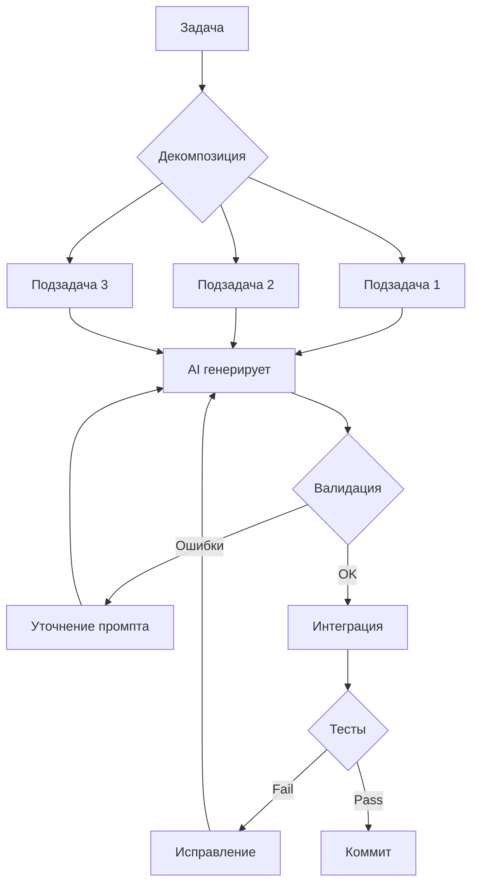

# L1: Правильный процесс планирования и документации

## 🎯 Цель уровня

Научиться правильно планировать и документировать проект ПЕРЕД началом разработки. Этот уровень критически важен для vibecoding — AI нужен четкий контекст и структура для эффективной работы.

**Ключевой принцип**: Час планирования экономит неделю разработки.

**Философия уровня**: Документация — это не бюрократия, это инструкция для AI и будущего себя.

---

## 🧠 Ключевые концепции

### 1. Discovery Phase
Фаза исследования и валидации идеи через интервью с пользователями.

### 2. Product Requirements Document (PRD)
Главный документ проекта, описывающий ЧТО нужно построить и ЗАЧЕМ.

### 3. Technical Architecture
Документ, описывающий КАК будет построен проект технически.

### 4. Project Memory
Система файлов (.claude/*, handoff.md), которая сохраняет контекст для AI между сессиями.

### 5. Definition of Done
Четкие критерии готовности каждой задачи.

---

## 📚 Теоретическая база

### Раздел 1: Этапы от идеи до старта разработки

**10 обязательных шагов**:

1. **Discovery & Customer Interviews**
   - Проблемные интервью (The Mom Test)
   - Выявление болей и потребностей
   - Jobs To Be Done анализ

2. **Market Analysis**
   - Анализ конкурентов
   - Поиск ниши (SIGMA SCAN)
   - Определение уникального преимущества

3. **Vision Document**
   - Описание проблемы
   - Целевая аудитория (ICP)
   - Уникальное ценностное предложение (UVP)
   - Долгосрочное видение

4. **PRD Creation**
   - User Stories
   - Acceptance Criteria
   - Приоритизация фич (MoSCoW)
   - Нефункциональные требования

5. **Technical Architecture**
   - Выбор технологического стека
   - Схема базы данных
   - API контракты
   - Deployment стратегия

6. **Wireframes & Design System**
   - Прототипы ключевых экранов
   - Design tokens (цвета, шрифты, отступы)
   - Компонентная библиотека

6.5. **Книги для AI — Контекстная библиотека**
   - Загрузка ключевых книг в Project Knowledge
   - Создание справочной базы для AI
   - Индексация best practices и паттернов
   - Доступ к экспертным знаниям без поиска

7. **Project Setup**
   - Инициализация репозитория
   - Создание обязательных файлов
   - Настройка окружения

8. **Development Roadmap**
   - Разбивка на спринты/этапы
   - Определение MVP scope
   - Планирование релизов

9. **Quality Gates Setup**
   - Настройка линтеров
   - Pre-commit hooks
   - CI/CD pipeline

10. **Kickoff**
    - Финальная проверка документации
    - Старт разработки

---

### Раздел 2: Обязательные файлы проекта

#### Корневые файлы

**Обязательные файлы проекта**:

1. **README.md** — описание, установка, команды запуска
2. **CLAUDE.md** — контекст для AI (команды, архитектура, правила, стек)
3. **handoff.md** — что сделано, проблемы, следующие шаги
4. **. env.example** — шаблон переменных окружения
5. **.gitignore** — что не коммитить

📖 **Шаблоны**: Используй готовые шаблоны из репозитория проекта

#### Папка .claude/

**Папка .claude/** — память AI между сессиями:

1. **SNAPSHOT.md** — текущее состояние (готовые модули, в разработке, проблемы)
2. **BACKLOG.md** — задачи по приоритетам (High/Medium/Low/Done)
3. **ARCHITECTURE.md** — технический стек, схема БД, API endpoints, структура

📖 **Инструмент**: Используй Mermaid для диаграмм БД и архитектуры

---

### Раздел 3: Процесс планирования с AI

**Используй AI команды из репозитория**:
- `skill_prd_generator.md` — создание PRD
- `skill_solo_project_docs.md` — документация проекта
- `skill_discovery_interview.md` — customer interviews
- `skill_visual_diagrams.md` — Mermaid диаграммы

---

### Раздел 4: Документация и Knowledge Management

**Принципы**: Актуальность, Краткость, Структурированность, Визуализация, Примеры

**Инструменты**:
- Mermaid для диаграмм
- Markdown для документов
- Git для версионирования

📖 **Ресурс**: [Mermaid Documentation](https://mermaid.js.org/)

---

## 🛠 Практические навыки

После освоения L1 ты умеешь:

1. Проводить Discovery фазу с customer interviews
2. Создавать Vision Document
3. Писать детальный PRD с User Stories
4. Проектировать Technical Architecture
5. Создавать Wireframes и Design System
6. Настраивать структуру проекта с обязательными файлами
7. Документировать решения для AI и команды
8. Использовать Mermaid для визуализации
9. Управлять контекстом через handoff.md
10. Планировать Development Roadmap

---

## ✅ Чек-лист освоения

- [ ] Создал полный PRD для своего проекта
- [ ] Спроектировал Technical Architecture с диаграммами
- [ ] Настроил все обязательные файлы (.claude/*, handoff.md, etc.)
- [ ] Создал Design System с компонентами
- [ ] Провел Discovery интервью с 5+ пользователями
- [ ] Написал Vision Document
- [ ] Приоритизировал фичи методом MoSCoW
- [ ] Создал схему базы данных в Mermaid
- [ ] Определил API контракты
- [ ] Составил Development Roadmap на 3 месяца

---

## 📖 Ресурсы для изучения

### AI команды
- `ai_commands/01_product_team/03_product_manager/` — Product Manager инструкции
- `ai_commands/02_website_creation_to_production/01_tech_lead/` — Tech Lead инструкции

### Skills
- `skill_prd_generator.md` — создание PRD
- `skill_solo_project_docs.md` — документация проекта
- `skill_discovery_interview.md` — customer interviews
- `skill_visual_diagrams.md` — Mermaid диаграммы
- `skill_context_management.md` — управление контекстом

### Шаблоны
- PRD Template
- Architecture Document Template
- User Story Template

---

## 🎓 Практические задания

### Задание 1: Создай PRD для своего проекта
1. Опиши проблему
2. Определи целевую аудиторию
3. Напиши 10 User Stories
4. Приоритизируй фичи (Must/Should/Could/Won't)
5. Определи метрики успеха

### Задание 2: Спроектируй архитектуру
1. Выбери технологический стек
2. Создай схему БД в Mermaid
3. Определи API endpoints
4. Опиши deployment стратегию

### Задание 3: Настрой проект
1. Создай все обязательные файлы
2. Настрой .gitignore
3. Создай .env.example
4. Напиши CLAUDE.md с контекстом

---

## ⚠️ Частые ошибки

### 1. Пропуск Discovery фазы
**Проблема**: Начинаешь кодить без валидации идеи  
**Решение**: Проведи минимум 5 customer interviews

### 2. Слишком детальный PRD
**Проблема**: Тратишь недели на документацию  
**Решение**: PRD для MVP должен занимать 2-3 страницы

### 3. Отсутствие handoff.md
**Проблема**: Теряешь контекст между сессиями  
**Решение**: Обновляй handoff.md каждые 10 действий

### 4. Нет визуализации
**Проблема**: Сложно понять архитектуру из текста  
**Решение**: Используй Mermaid для схем БД и User Flow

### 5. Игнорирование .env.example
**Проблема**: Другие разработчики не знают, какие переменные нужны  
**Решение**: Всегда создавай .env.example с пустыми значениями

---

## 💡 Pro Tips

### 1. Используй шаблоны
Создай шаблоны для PRD, Architecture, User Stories — экономь время на каждом проекте.

### 2. Автоматизируй обновление документации
Настрой AI на автоматическое обновление CLAUDE.md и handoff.md.

### 3. Визуализируй всё
Схема БД, User Flow, архитектура — всё в Mermaid. Картинка = 1000 слов для AI.

### 4. Версионируй документацию
Документы в Git вместе с кодом. Изменения в архитектуре = коммит в ARCHITECTURE.md.

### 5. Пиши для будущего себя
Через 3 месяца ты забудешь, почему выбрал этот стек. Документируй решения.

---

## 📋 Чек-листы для каждого этапа

### ✅ Чек-лист: Перед началом проекта

**Технический стек**:
- [ ] Выбран frontend фреймворк (React/Next.js рекомендуется)
- [ ] Выбран backend фреймворк (NestJS/Express)
- [ ] Выбрана база данных (PostgreSQL + Prisma рекомендуется)
- [ ] Выбран хостинг (Vercel для frontend, Railway для backend)
- [ ] Определены внешние сервисы (Auth, Payments, Analytics)

**Архитектура**:
- [ ] Создана схема базы данных (Mermaid диаграмма)
- [ ] Определена структура проекта (feature-based модульная)
- [ ] Спроектированы API endpoints
- [ ] Определена стратегия аутентификации
- [ ] Спланирована deployment стратегия

**Дизайн-система**:
- [ ] Определены Design Tokens (цвета, шрифты, spacing)
- [ ] Созданы базовые компоненты (Button, Input, Card)
- [ ] Создан showcase.html со всеми компонентами
- [ ] Настроен Tailwind CSS конфиг
- [ ] Определены responsive breakpoints

**MCP и Skills**:
- [ ] Установлен Cline MCP (семантический поиск)
- [ ] Установлен Context7 MCP (актуальные доки)
- [ ] Установлен Sentry MCP (мониторинг ошибок)
- [ ] Настроены Skills (Superpowers, Code Review)
- [ ] Проверены триггеры агентов

**Документация**:
- [ ] Создан README.md с инструкциями
- [ ] Создан CLAUDE.md с контекстом проекта
- [ ] Создан handoff.md для передачи контекста
- [ ] Создана папка .claude/ с SNAPSHOT.md, BACKLOG.md, ARCHITECTURE.md
- [ ] Создан .env.example с переменными окружения

### ✅ Чек-лист: Перед коммитом

**Качество кода**:
- [ ] Код проревьюен (самостоятельно или AI агентом)
- [ ] Нет очевидных костылей или технического долга
- [ ] Нет hardcoded значений (используются env переменные)
- [ ] Нет закомментированного кода
- [ ] Код следует стилю проекта

**Тестирование**:
- [ ] Все существующие тесты проходят
- [ ] Добавлены тесты для новой функциональности
- [ ] Проверена работа в браузере (если frontend)
- [ ] Проверены edge cases
- [ ] Нет console.log в production коде

**Документация**:
- [ ] Обновлен CLAUDE.md (если изменилась архитектура)
- [ ] Обновлен handoff.md (текущее состояние)
- [ ] Обновлен SNAPSHOT.md (что готово)
- [ ] Добавлены комментарии к сложной логике
- [ ] Обновлен README.md (если изменились команды)

**Безопасность**:
- [ ] Нет секретов в коде (API keys, passwords)
- [ ] Проверена валидация входных данных
- [ ] Проверена защита от SQL injection
- [ ] Проверена защита от XSS
- [ ] Используются безопасные зависимости

**Git**:
- [ ] Коммит message описывает изменения
- [ ] Изменения атомарны (один коммит = одна задача)
- [ ] Нет лишних файлов (проверен .gitignore)
- [ ] Ветка актуальна (merged с main)

### ✅ Чек-лист: Перед деплоем

**Тестирование**:
- [ ] Все unit тесты проходят (100% coverage критичных путей)
- [ ] Все integration тесты проходят
- [ ] E2E тесты проходят (ключевые user flows)
- [ ] Проведено ручное тестирование
- [ ] Проверена работа на разных устройствах (mobile, tablet, desktop)

**База данных**:
- [ ] Создан бэкап БД (автоматический или ручной)
- [ ] Проверены миграции (на staging окружении)
- [ ] Проверена rollback стратегия
- [ ] Проверены индексы БД (производительность)
- [ ] Проверен размер БД (достаточно места)

**Производительность**:
- [ ] Проверены Core Web Vitals (LCP < 2.5s, FID < 100ms, CLS < 0.1)
- [ ] Оптимизированы изображения (WebP/AVIF, lazy loading)
- [ ] Проверен bundle size (code splitting)
- [ ] Настроен кэширование
- [ ] Проверена скорость API (< 200ms для критичных endpoints)

**Безопасность**:
- [ ] Проверены все environment variables
- [ ] Настроен HTTPS
- [ ] Настроены CORS правила
- [ ] Проверены rate limits
- [ ] Настроен мониторинг безопасности (Sentry)

**Мониторинг**:
- [ ] Настроен Sentry для отслеживания ошибок
- [ ] Настроены алерты (email/Slack)
- [ ] Проверены логи (нет критичных ошибок)
- [ ] Настроен uptime мониторинг
- [ ] Настроена аналитика (Vercel Analytics/PostHog)

**Rollback план**:
- [ ] Документирован процесс отката
- [ ] Проверена возможность быстрого отката
- [ ] Определены критерии для отката
- [ ] Команда знает, как откатить изменения
- [ ] Есть бэкап предыдущей версии

**Коммуникация**:
- [ ] Команда уведомлена о деплое
- [ ] Пользователи уведомлены (если breaking changes)
- [ ] Обновлен changelog
- [ ] Обновлена документация
- [ ] Запланирован мониторинг после деплоя

---

---

## 🎯 Итоги уровня

После освоения L1 ты имеешь:
- ✅ Четкий процесс планирования проекта
- ✅ Набор обязательных документов
- ✅ Чек-листы для каждого этапа
- ✅ Навыки работы с AI в планировании
- ✅ Понимание важности документации

**Следующий шаг**: Переходи к [L2: Ключевые принципы vibecoding](L2_vibecoding_principles.md) для изучения практик разработки с AI.

---

## 🚀 Раздел 11: 60-Second Quick Start — Мгновенный старт проекта

### Концепция быстрого старта
Вместо часов настройки окружения, начни кодить за 60 секунд. Используй готовые шаблоны и автоматизацию.

**Команда быстрого старта**:
```bash
# Next.js + TypeScript + Tailwind + Prisma за 60 секунд
npx create-next-app@latest my-app --typescript --tailwind --app
cd my-app
npm install prisma @prisma/client
npx prisma init
code .
```

**Что получаешь**:
- ✅ Next.js 15 с App Router
- ✅ TypeScript настроен
- ✅ Tailwind CSS готов
- ✅ Prisma инициализирован
- ✅ Git репозиторий создан
- ✅ ESLint настроен

**Следующие 60 секунд**:
```bash
# Добавь аутентификацию
npm install next-auth
# Добавь UI компоненты
npx shadcn-ui@latest init
# Запусти dev сервер
npm run dev
```

**Итого: 2 минуты от нуля до работающего приложения**

📖 **Ресурсы**:
- [Next.js Quick Start](https://nextjs.org/docs/getting-started)
- [Shadcn UI](https://ui.shadcn.com/)

---

## 🧠 Раздел 12: Mental Model — Ментальная модель vibecoding

### Как думать при разработке с AI

**Традиционная разработка**:
```
Идея → Код → Тестирование → Деплой
```

**Vibecoding**:
```
Идея → Спецификация → AI генерирует код → Валидация → Деплой
```

**Ключевое отличие**: Фокус смещается с написания кода на:
1. **Правильную спецификацию** (что нужно сделать)
2. **Валидацию результата** (проверка что AI сделал правильно)
3. **Архитектурные решения** (как всё должно работать вместе)

**Ментальная модель работы с AI**:



**Принципы мышления**:

1. **Думай модулями, не файлами**
   - Не "создай файл auth.ts"
   - А "создай модуль аутентификации с login, register, logout"

2. **Думай контрактами, не реализацией**
   - Не "напиши функцию для проверки email"
   - А "создай валидатор с интерфейсом: input string, output boolean"

3. **Думай тестами, не багами**
   - Не "исправь баг в login"
   - А "добавь тест для случая неверного пароля, затем исправь"

4. **Думай документацией, не комментариями**
   - Не "добавь комментарии в код"
   - А "обнови ARCHITECTURE.md с объяснением решения"

**Смена роли разработчика**:

| Традиционно | Vibecoding |
|-------------|------------|
| Пишу код | Пишу спецификации |
| Отлаживаю баги | Валидирую результат AI |
| Рефакторю | Направляю AI на рефакторинг |
| Пишу тесты | Проверяю что AI написал правильные тесты |
| Документирую | Поддерживаю контекст для AI |

**Практический пример мышления**:

**❌ Неправильно** (мышление кодом):
```
"Создай компонент Button с пропсами variant и size"
```

**✅ Правильно** (мышление системой):
```
"Создай Button компонент в Design System:
- Варианты: primary, secondary, outline, ghost
- Размеры: sm, md, lg
- Состояния: default, hover, active, disabled
- Accessibility: ARIA labels, keyboard navigation
- Тесты: unit тесты для всех вариантов
- Документация: Storybook stories
- Интеграция: экспорт из shared/components"
```

**Результат**: AI создаст полноценный production-ready компонент, а не просто кнопку.

📖 **Ресурсы**:
- [Mental Models for Developers](https://fs.blog/mental-models/)
- [Systems Thinking](https://www.systemsinnovation.io/)

---

**Последнее обновление**: 17.05.2026  
**Статус**: ✅ Обновлено (доработки 81, 96-97)  
**Предыдущий уровень**: [L0: Фундаментальные правила](L0_fundamentals.md)  
**Следующий уровень**: [L2: Ключевые принципы vibecoding](L2_vibecoding_principles.md)
