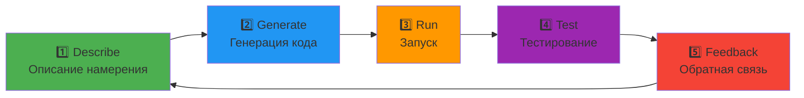
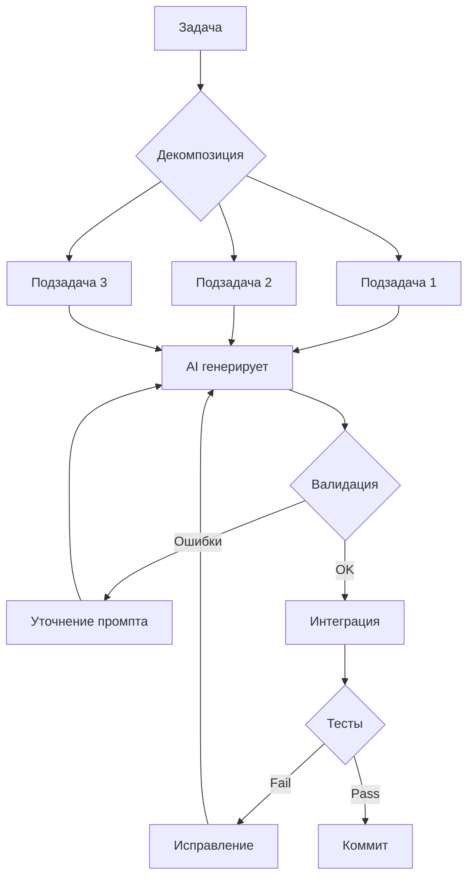

# L1: Правильный процесс планирования и документации

## 🎯 Цель уровня

Научиться правильно планировать и документировать проект ПЕРЕД началом разработки. Этот уровень критически важен для vibecoding — AI нужен четкий контекст и структура для эффективной работы.

**Ключевой принцип**: Час планирования экономит неделю разработки.

**Философия уровня**: Документация — это не бюрократия, это инструкция для AI и будущего себя.

---

## 🧠 Ключевые концепции

### 1. Discovery Phase
Фаза исследования и валидации идеи через интервью с пользователями и быстрые рыночные сканы.

### 2. Vibe-PM-ing (README-Driven Planning)
Процесс совместного проектирования спецификации с ИИ. Сначала создается структурированный README.md с описанием требований, архитектуры и жестко ограниченным планом из 5 этапов разработки, прежде чем будет написана первая строка кода.

### 3. Product Requirements Document (PRD)
Главный документ проекта, описывающий бизнес-требования, логику поведения пользователей, краевые случаи и критерии приемки.

### 4. Technical Architecture & Backend-First Strategy
Определение структуры данных, контрактов API и системной логики. **Принцип Backend-First**: вся бизнес-логика проектируется и тестируется в изоляции через CLI-терминалы или интеграционные тесты до начала верстки интерфейса (UI).

### 5. Project Memory (Второй мозг)
Система папок и файлов (`.claude/*`, `handoff.md`), которая сохраняет контекст для AI между сессиями и предотвращает забывание архитектурных решений.

### 6. Definition of Done & Checkpoint Rollbacks
Четкие критерии готовности каждой задачи и фиксация стабильных состояний в системе контроля версий для безопасных откатов при сбоях ИИ.

---

## 📚 Теоретическая база

### Раздел 1: Этапы от идеи до старта разработки

**10 обязательных шагов**:

1. **Discovery & Customer Interviews**
   - Проблемные интервью (The Mom Test)
   - Выявление болей и потребностей
   - Jobs To Be Done анализ

2. **Market Analysis**
   - Анализ конкурентов
   - Поиск ниши (SIGMA SCAN)
   - Определение уникального преимущества

3. **Vision Document**
   - Описание проблемы
   - Целевая аудитория (ICP)
   - Уникальное ценностное предложение (UVP)
   - Долгосрочное видение

4. **PRD Creation**
   - User Stories
   - Acceptance Criteria
   - Приоритизация фич (MoSCoW)
   - Нефункциональные требования

5. **Technical Architecture**
   - Выбор технологического стека
   - Схема базы данных
   - API контракты
   - Deployment стратегия

6. **Wireframes & Design System**
   - Прототипы ключевых экранов
   - Design tokens (цвета, шрифты, отступы)
   - Компонентная библиотека

6.5. **Книги для AI — Контекстная библиотека**
   - Загрузка ключевых книг в Project Knowledge
   - Создание справочной базы для AI
   - Индексация best practices и паттернов
   - Доступ к экспертным знаниям без поиска

7. **Project Setup**
   - Инициализация репозитория
   - Создание обязательных файлов
   - Настройка окружения

8. **Development Roadmap**
   - Разбивка на спринты/этапы
   - Определение MVP scope
   - Планирование релизов

9. **Quality Gates Setup**
   - Настройка линтеров
   - Pre-commit hooks
   - CI/CD pipeline

10. **Kickoff**
    - Финальная проверка документации
    - Старт разработки

---

### Раздел 2: Цикл разработки с AI (Vibecoding Workflow)

#### 2.1. Базовый цикл: 5 шагов

Профессиональная разработка с AI строится на итеративном цикле из 5 этапов:



**Детальное описание каждого этапа**:

1. **Describe (Описание намерения)**
   - Формулировка цели на естественном языке
   - Четкие Acceptance Criteria
   - Ссылки на релевантные файлы
   - Пример: *"Создай API endpoint для регистрации пользователя с валидацией email и хешированием пароля"*

2. **Generate (Генерация кода)**
   - AI создает начальную реализацию
   - Следует архитектурным паттернам проекта
   - Использует контекст из .cursorrules и CLAUDE.md

3. **Run (Запуск)**
   - Выполнение кода в dev-окружении
   - Проверка компиляции/сборки
   - Первичная валидация работоспособности

4. **Test (Тестирование)**
   - Проверка результата на соответствие критериям
   - Запуск автоматических тестов
   - Ручное тестирование UI/UX

5. **Feedback (Обратная связь)**
   - Анализ результата
   - Корректировка промпта при необходимости
   - Возврат к шагу 1 или завершение задачи

#### 2.1.5. Prompt Engineering для разработчиков

> **Источник**: [От инженера до оператора промптов: 5 главных ошибок вайбкодинга](https://habr.com/ru/articles/1033648/)

**Ключевой инсайт**: Качество промпта напрямую влияет на качество кода. "Ленивые" промпты приводят к дженерик-решениям, несоответствию стеку проекта и часам рефакторинга.

##### 🎯 Формула эффективного промпта

**Контекст + Роль + Задача + Ограничения**

**Примеры**:

```markdown
❌ ПЛОХО: "Создай форму логина"

Проблемы:
- Нет контекста стека
- Нет требований к стилям
- Нет ограничений по зависимостям
→ Результат: классовые компоненты React 2018, Redux для двух инпутов

✅ ХОРОШО: 
"Ты — Senior Frontend Developer (Роль). 
Мы пишем приложение на Next.js 14 App Router (Контекст). 
Создай клиентский компонент формы авторизации с полями email и пароль (Задача). 
Используй Tailwind для стилей, не тяни сторонние библиотеки вроде React Hook Form, 
вся валидация на уровне нативных HTML5-атрибутов (Ограничения)."

→ Результат: современный код, соответствующий проекту
```

**Правило**: Потратьте 30 секунд на детальный промпт — сэкономите часы на рефакторинге.

##### 🛡️ Defensive Prompting (Защитные промпты)

**Проблема**: AI склонен писать код для "идеального мира" (Happy Path Syndrome) — игнорирует краевые случаи, не добавляет обработку ошибок.

**Решение**: Добавляйте "защитные хвосты" к промптам:

```markdown
[Основная задача]

Дополнительные требования:
- Учти краевые случаи (edge cases): пустые значения, null, undefined
- Добавь строгую валидацию входящих данных
- Добавь адекватную обработку ошибок (try/catch для async)
- Проверь работу с невалидными данными (эмодзи в телефоне, SQL в имени)
```

**Техника "Тесты как спецификация"**:

```markdown
"Напиши юнит-тесты для этой функции. 
Обязательно покрой негативные сценарии и невалидный ввод."
```

**Инсайт**: AI находит логические дыры в собственном коде на этапе написания тестов.

##### 📋 Чек-лист качественного промпта

Перед отправкой промпта проверь:

- [ ] **Контекст**: Указан технологический стек?
- [ ] **Роль**: Определен уровень экспертизы AI? (Junior/Senior/Architect)
- [ ] **Задача**: Четко сформулирована цель?
- [ ] **Ограничения**: Указаны запреты и требования?
- [ ] **Edge cases**: Упомянуты краевые случаи?
- [ ] **Обработка ошибок**: Требуется try/catch?
- [ ] **Архитектура**: Указаны паттерны проекта?

##### ⚠️ Антипаттерны промптинга

| Антипаттерн | Проблема | Решение |
|-------------|----------|---------|
| **"Сделай красиво"** | Субъективно, нет критериев | Конкретные требования к UI |
| **"Исправь ошибку"** | Нет контекста | Приложить трейсбек + описание ожидаемого поведения |
| **"Добавь функцию X"** | Нет связи с архитектурой | Указать, куда интегрировать и какие паттерны использовать |
| **Копипаст всего файла** | Перегрузка контекста | Указать конкретные строки/функции |

#### 2.2. Профессиональный подход 2026

**Разделение по типу проекта**:

| Тип проекта | Подход | Ускорение | Когда использовать |
|-------------|--------|-----------|-------------------|
| **MVP/Прототипы** | Чистый вайбкодинг | 3-5x | Валидация идеи, демо |
| **Промышленный софт** | Агентная инженерия<br/>(Plan Mode → Act Mode) | 2-3x | Production-ready приложения |

**Практическая команда L1 (Старт)**:
- **Инструмент**: Gemini CLI
- **Команда**: `npx @google/gemini-cli`
- **Промпт**: *"Explain the architecture of this codebase"*

**Plan Mode → Act Mode workflow**:
1. **Plan Mode**: Обсуждение архитектуры, декомпозиция задач
2. **Act Mode**: Реализация с автоматическими проверками
3. **Review**: Валидация результата и возврат в Plan Mode при необходимости

---

### Раздел 3: Second Brain — Методология управления знаниями

#### 3.1. Архитектура "Второго мозга" (по Андрею Карпати)

**Концепция**: Создание структурированной базы знаний, которую AI-агенты могут использовать для самообучения и принятия решений.

**Структура папок**:

```
project/
├── /raw/                    # Необработанные материалы
│   ├── transcripts/         # Транскрипты видео/встреч
│   ├── articles/            # Сохраненные статьи
│   ├── research/            # Исследовательские материалы
│   └── notes/               # Быстрые заметки
│
├── /wiki/                   # Структурированные страницы
│   ├── architecture/        # Архитектурные решения
│   ├── patterns/            # Паттерны и best practices
│   ├── decisions/           # ADR (Architecture Decision Records)
│   └── guides/              # Руководства и инструкции
│
├── index.md                 # Центральный индекс (карта знаний)
├── agents.md                # Инструкции для AI-агентов
└── log.md                   # Consciousness Stream (поток решений)
```

#### 3.2. Процесс работы с Second Brain

**Шаг 1: Добавление материала**
```bash
# Добавить транскрипт видео
cp transcript.txt raw/transcripts/

# Добавить статью
curl https://example.com/article > raw/articles/article-name.md
```

**Шаг 2: Обработка AI-агентами**
```markdown
Промпт для AI:
"Проанализируй файлы в /raw/transcripts/ и извлеки ключевые концепции.
Создай структурированные страницы в /wiki/ и обнови index.md"
```

**Шаг 3: Создание wiki-страниц**
- AI извлекает концепции из raw-материалов
- Создает страницы в /wiki/ с четкой структурой
- Обновляет index.md с ссылками

**Шаг 4: Обновление индекса**
```markdown
# index.md

## Архитектура
- [Feature-based структура](wiki/architecture/feature-based.md)
- [Database schema](wiki/architecture/database.md)

## Паттерны
- [Error handling](wiki/patterns/error-handling.md)
- [API design](wiki/patterns/api-design.md)
```

#### 3.3. Consciousness Stream (Поток сознания)

**Файл log.md** — непрерывная запись решений и размышлений:

```markdown
# Development Log

## 2026-05-18 11:30
**Решение**: Переход с REST на tRPC
**Причина**: Типобезопасность end-to-end
**Влияние**: Рефакторинг всех API endpoints
**Статус**: В процессе

## 2026-05-18 10:15
**Проблема**: Медленные запросы к БД
**Решение**: Добавлены индексы на user_id и created_at
**Результат**: Скорость запросов ↑ 10x
```

#### 3.4. Файл agents.md — Инструкции для AI

```markdown
# Инструкции для AI-агентов

## Роль
Ты — архитектор проекта, работающий с Second Brain системой.

## Задачи
1. Обрабатывать новые материалы из /raw/
2. Создавать структурированные wiki-страницы
3. Обновлять index.md
4. Фиксировать решения в log.md

## Правила
- Всегда проверяй index.md перед созданием новой страницы
- Используй единый формат для всех wiki-страниц
- Добавляй ссылки между связанными концепциями
- Обновляй log.md при принятии архитектурных решений
```

#### 3.5. Преимущества Second Brain

✅ **Накопление знаний**: Проект становится умнее со временем  
✅ **Быстрый онбординг**: Новые разработчики читают wiki  
✅ **Контекст для AI**: Агенты имеют доступ к истории решений  
✅ **Документация в процессе**: Не нужно писать документацию отдельно  
✅ **Поиск решений**: Быстрый поиск по прошлым проблемам  

---

### Раздел 4: Обязательные файлы проекта

#### Корневые файлы

**Обязательные файлы проекта**:

1. **README.md** — описание, установка, команды запуска
2. **CLAUDE.md** — контекст для AI (команды, архитектура, правила, стек)
3. **handoff.md** — что сделано, проблемы, следующие шаги
4. **. env.example** — шаблон переменных окружения
5. **.gitignore** — что не коммитить

📖 **Шаблоны**: Используй готовые шаблоны из репозитория проекта

#### Папка .claude/

**Папка .claude/** — память AI между сессиями:

1. **SNAPSHOT.md** — текущее состояние (готовые модули, в разработке, проблемы)
2. **BACKLOG.md** — задачи по приоритетам (High/Medium/Low/Done)
3. **ARCHITECTURE.md** — технический стек, схема БД, API endpoints, структура

📖 **Инструмент**: Используй Mermaid для диаграмм БД и архитектуры

---

### Раздел 3: Процесс планирования с AI

**Используй AI команды из репозитория**:
- `skill_prd_generator.md` — создание PRD
- `skill_solo_project_docs.md` — документация проекта
- `skill_discovery_interview.md` — customer interviews
- `skill_visual_diagrams.md` — Mermaid диаграммы

---

### Раздел 4: Документация и Knowledge Management

**Принципы**: Актуальность, Краткость, Структурированность, Визуализация, Примеры

**Инструменты**:
- Mermaid для диаграмм
- Markdown для документов
- Git для версионирования

📖 **Ресурс**: [Mermaid Documentation](https://mermaid.js.org/)

---

### Раздел 5: 12 Правил Vibe Coding (Peter Yang)

> **Источник**: [12 Rules to Vibe Code Without Frustration](https://habr.com/ru/articles/900492/) by Peter Yang  
> **Опыт автора**: 50+ часов создания приложений с AI, 200+ советов, 3 проекта (симулятор самолета, Star Wars run, зомби-шутер)

**Ключевой инсайт**: Важно не контролировать каждую строчку кода, а правильно управлять контекстом и коммуникацией с AI. Эти правила позволяют продуктовым менеджерам и нетехническим специалистам создавать функциональные прототипы без традиционного программирования.

---

#### 5.1. ПЛАНИРОВАНИЕ

##### Правило 1: Начните с Vibe-PM-инга и Backend-First архитектуры

**Концепция**: Успешный проект начинается не с генерации кнопок, а с написания README-спецификации. Попросите ИИ сформировать верхнеуровневый документ, фиксирующий:
1. **Бизнес-требования и User Stories** (что и зачем делает пользователь).
2. **Технологический стек** (без лишних усложнений).
3. **План декомпозиции разработки строго до 5 этапов** (с критериями готовности каждого шага).

**Промпт для старта (README-driven Vibe-PM-ing)**:
```markdown
"Создай README для проекта [название проекта].

Включи:
1. Описание проекта, целевой аудитории и MVP-функционала.
2. Простой, надежный технологический стек (без избыточных фреймворков).
3. Разбивку разработки ровно на 5 изолированных этапов.
4. Четкие критерии готовности (Acceptance Criteria) для каждого этапа.

Важно: Первый этап должен быть максимально простым, чтобы получить минимально работающий прототип (например, рендеринг одного элемента) в течение 30 минут."
```

**Пример 5-этапного планирования для 3D-игры**:
* **Этап 1**: Отображение 3D-модели (самолета/персонажа) на холсте WebGL (ThreeJS).
* **Этап 2**: Добавление физики движения и управления с клавиатуры/сенсора.
* **Этап 3**: Реализация игровой механики (столкновения, генерация препятствий/врагов).
* **Этап 4**: Подключение игрового интерфейса (счетчик очков, экраны Game Over / Start).
* **Этап 5**: Звуковые эффекты, сохранение рекордов в LocalStorage и полировка FPS.

---

##### 🤖 Workflows: Эффективное разделение ролей ИИ (Grok vs. Claude)

При планировании и проектировании архитектуры используйте связку сильных сторон различных моделей:
- **Grok / Claude Opus (Brainstorming & Specs Planning)**: Превосходно генерируют идеи, пишут README, продумывают схемы баз данных и выявляют неочевидные логические ловушки (edge cases). Они выступают в роли "Сеньора-Архитектора" или "Продукт-Менеджера".
- **Claude Sonnet (Execution & Coding)**: Лидер в написании чистого кода, следовании паттернам и интеграции через MCP-серверы. Передавайте готовый README-план, написанный Grok, в Cursor для реализации с помощью Claude.

---

##### ⚙️ Стратегия Backend-First & Изоляция логики (Logic Isolation)

Критическая ошибка начинающих вайбкодеров — смешивать дизайн интерфейса и логику обработки данных в одном файле или начинать проект с верстки UI.

**Золотое правило Backend-First**:
1. **Сначала логика, затем кнопки**: Спроектируйте и реализуйте основные алгоритмы, коннекторы к БД и интеграции с внешними сервисами в виде независимых модулей, запускаемых из CLI/терминала или покрытых интеграционными тестами.
2. **Изоляция UI**: Логика не должна зависеть от интерфейса. Это позволяет:
   - Быстро отлаживать основные функции без перезапуска браузера.
   - Использовать легкие Node.js скрипты для автоматической проверки работоспособности (например, `test_backend.js`).
   - Безболезненно менять или редизайнить UI-компоненты, не боясь сломать бизнес-логику.
   - Минимизировать объем контекста для ИИ при рефакторинге интерфейса.

---

##### Правило 2: Сохраняйте технологический стек простым

**Принцип**: Чем проще стек, тем меньше вероятность, что AI сломает приложение.

**Почему все создают игры с AI**:
- **ThreeJS** — простая JavaScript-библиотека
- В большинстве случаев достаточно клиента и локального хранилища
- Часто НЕ нужны:
  - Серверы, базы данных, сложные инструменты
  - Даже развертывание в продакшн (URL)

**Рекомендуемые стеки для начинающих**:

| Тип проекта | Стек | Почему |
|-------------|------|--------|
| **3D игры** | HTML + ThreeJS + Vanilla JS | Минимум зависимостей |
| **Веб-приложения** | Next.js + Tailwind | Современный, но простой |
| **Прототипы** | HTML + CSS + JS | Работает везде |
| **Дашборды** | React + Chart.js | Визуализация из коробки |

**Вывод**: Нет ничего плохого в создании личных приложений, доступных только через localhost.

---

##### Правило 3: Дайте AI правильные правила и документацию

**Три мини-совета**:

###### a) Спросите AI о дате отсечения знаний

**Проблема**: Модели AI имеют даты отсечения знаний, ограничивающие знание библиотек.

**Пример**: Tailwind CSS обновился до v4 в январе 2025, но большинство моделей знают только v3 и испортят код.

**Решение**:
```markdown
"С какой версией [библиотека] вы знакомы? 
Давай начнем с этой версии, чтобы избежать проблем."
```

###### б) Вставьте документацию в контекст

Если настаиваете на использовании новой версии, вставьте документацию в контекст AI.

**Пример для Tailwind v4**:
```markdown
"Вот документация Tailwind CSS v4:
[вставить ключевые разделы из https://tailwindcss.com/docs/installation/using-vite]

Используй именно эту версию и синтаксис."
```

###### в) Настройте глобальные и проектные правила

**Глобальные правила (для всех проектов)**:
```markdown
1. Объясни, что ты сделаешь сначала, и попроси моего подтверждения перед кодированием
2. Сначала делай простые вещи. Используй модули вместо одного файла
3. Вноси только запрошенные изменения
4. Не пиши дублирующийся код — ищи существующие решения в кодовой базе
```

**Проектные правила** (в `.cursorrules`):
```markdown
# Технологический стек
- Next.js 14 App Router
- TypeScript strict mode
- Tailwind CSS v3
- Prisma ORM

# Архитектурные правила
- Feature-based структура папок
- Все компоненты в /components/[feature]/
- API routes в /app/api/[feature]/
```

**Ресурсы**:
- [Библиотека правил от PatrickJS](https://github.com/PatrickJS/awesome-cursorrules)
- [Правила для TailwindCSS](https://github.com/PatrickJS/awesome-cursorrules/blob/main/rules/html-tailwind-css-javascript-cursorrules-prompt-fi/.cursorrules)

**💡 Профессиональный совет**: Можно заставить AI индексировать документацию прямо в Cursor:  
`Settings → Features → Docs → Add links`

---

#### 5.2. КОДИРОВАНИЕ

##### Правило 4: Попросите AI НЕ кодировать

**Самый распространенный промпт**:
```markdown
"Расскажи сначала о своем плане; не пиши код."
```

**Почему это работает**:
- В 9 случаях из 10 AI предложит сложный подход
- Вы должны попросить упростить
- Даже если не умеете читать код, стоит спросить о плане

**Пример диалога**:
```markdown
Вы: "Добавь систему авторизации"

AI: "Я создам JWT-токены, refresh tokens, Redis для сессий, 
middleware для проверки прав, роли и permissions..."

Вы: "Стоп. Расскажи о плане, не пиши код. Есть ли более простой вариант?"

AI: "Да, можем использовать NextAuth.js — это готовое решение..."

Вы: "Отлично, давай так."
```

> "Иронично, но это, вероятно, мой самый распространенный промпт для ИИ-кодирования."

---

##### Правило 5: Попросите AI предложить варианты и выберите простой

**Промпт**:
```markdown
"Дай мне несколько вариантов реализации [задача], 
начиная с самого простого. Не пиши код."
```

**Пример ответа AI**:
```markdown
Варианты реализации поиска:

1. **Самый простой**: Фильтрация массива на клиенте (Array.filter)
   - Плюсы: 0 зависимостей, работает мгновенно
   - Минусы: Не масштабируется на 10K+ элементов

2. **Средний**: Поиск через API endpoint с SQL LIKE
   - Плюсы: Работает с большими данными
   - Минусы: Нужен бэкенд

3. **Продвинутый**: Elasticsearch с полнотекстовым поиском
   - Плюсы: Мощный поиск, тайпхеды, фасеты
   - Минусы: Сложная настройка, дополнительный сервис
```

**Выбор**: Для MVP почти всегда выбирайте вариант 1 или 2.

**Дополнительный мощный промпт**:
```markdown
"Думай столько, сколько тебе нужно, и задавай мне вопросы, 
если тебе нужна дополнительная информация."
```

**Эффект**: AI может задать вопросы для прояснения неопределенностей перед кодированием.

---

##### Правило 6: Разбивайте задачи на маленькие шаги

**Принцип**: Простота — ваш лучший друг для вайбкодинга.

**Проблема**: Claude 3.7 и подобные модели действуют как чрезмерно уверенные стажеры, делающие больше, чем просят.

**Подходы**:

1. **"Сделай это просто"**
```markdown
"Реализуй самую простую версию [функция]. 
Без оптимизаций, без edge cases, без красоты — просто чтобы работало."
```

2. **"Следующий шаг"**
```markdown
"Реализуй самый простой следующий шаг, который я могу протестировать."
```

3. **"Один файл"**
```markdown
"Измени только файл [название]. Не трогай другие файлы."
```

**Рекомендация**: Начинайте новый чат для каждой функции, чтобы избежать перегрузки контекстного окна.

> "Вы должны давать своему новоиспеченному стажеру-ИИ конкретные шаги, как хороший руководитель."

---

##### Правило 7: Включайте изображения, чтобы дать AI контекст

**Принцип**: Изображение стоит тысячи слов для AI.

**Когда использовать**:

1. **Создание дизайна**
```markdown
"Создай компонент карточки продукта, как на этом скриншоте:
[прикрепить изображение]

Используй Tailwind CSS."
```

2. **Исправление ошибки**
```markdown
"Вот скриншот ошибки в консоли:
[прикрепить скриншот]

Что не так и как исправить?"
```

3. **Копирование UI**
```markdown
"Воссоздай этот интерфейс:
[прикрепить скриншот сайта]

Не нужна пиксель-перфект копия, просто похожая структура."
```

**Пример из практики**: При создании модели самолета включение скриншота позволило AI с первого раза создать похожую модель.

---

#### 5.3. ОТЛАДКА

##### Правило 8: Беспощадно тестируйте после каждого изменения

**Алгоритм**:

1. **Тестируйте приложение** в localhost после каждого обновления
2. **Откройте консоль браузера** (cmd-option-J на Mac, F12 на Windows)
3. **Проверьте наличие ошибок** (красные сообщения)

**Чек-лист тестирования**:
- [ ] Приложение запускается без ошибок
- [ ] Новая функция работает как ожидалось
- [ ] Старые функции не сломались
- [ ] Нет ошибок в консоли браузера
- [ ] Нет предупреждений (warnings)

**Опционально**: Попросите AI написать тесты:
```markdown
"Напиши unit-тесты для функции [название]. 
Покрой позитивные и негативные сценарии."
```

**Вывод**: Мелкое, пошаговое тестирование предотвращает кошмарные сессии отладки в дальнейшем.

---

##### Правило 9: Не стесняйтесь возвращаться к предыдущим версиям

**Инструмент**: Cursor и Windsurf имеют кнопку **"Вернуться к контрольной точке"**.

**Когда использовать**:

1. ❌ AI вносит изменения, которые ломают приложение
2. ❌ AI застревает в бесконечном цикле исправлений
3. ❌ AI начинает изменять все файлы без причины

**Алгоритм действий**:
```markdown
1. Заметили, что AI делает странные изменения
2. Нажмите "Revert to checkpoint" (или Cmd+Z несколько раз)
3. Начните новый чат с более четким промптом
4. Попросите AI изменить только конкретный файл
```

**Критически важно**: Случайные изменения AI могут сделать будущую отладку в 10 раз сложнее.

**Периодический промпт для чистоты кода**:
```markdown
"Поищи дублирующийся код или избыточности и перечисли их."
```

Затем попросите внести простые исправления для чистоты кодовой базы.

---

##### Правило 10: Используйте GitHub для контроля версий

**Почему это важно**: GitHub — удаленный репозиторий, позволяющий вернуться к рабочим версиям.

**Как использовать**:

1. **Создайте аккаунт GitHub**: https://github.com/
2. **Настройте новый репозиторий** для проекта
3. **Попросите Cursor закоммитить**:
```markdown
"Закоммить изменения в GitHub с сообщением 'Добавлена функция X'"
```

**Альтернатива** (для продвинутых):
```bash
git add .
git commit -m "Добавлена функция X"
git push origin main
```

**Рекомендация**: Коммитьте в Git всякий раз, когда завершаете этап из спецификации README.

**Стратегия коммитов**:
- ✅ После завершения каждого этапа из README
- ✅ Перед началом рискованного рефакторинга
- ✅ Когда приложение работает стабильно
- ❌ Не коммитьте сломанный код

> "В эпоху ИИ продакт-менеджеры без публичных коммитов на GitHub не выживут."

---

#### 5.4. ВАЙБИНГ

##### Правило 11: Используйте свой голос, чтобы ощутить вайбы

**Инструмент**: [Superwhisper](https://superwhisper.com/) для голосового ввода.

**Преимущества голосового ввода**:
- 🎤 Быстрее, чем печатать (особенно длинные промпты)
- 🧠 Думаешь более естественно
- 😌 Меньше усталости рук
- 🎵 Можно кодить под музыку в расслабленной обстановке

**Опыт автора**:
> "Представьте, как вы сидите ночью в темноте, музыка играет тихо, пока вы диктуете инструкции по коду через голос. Это, пожалуй, увлекательнее, чем смотреть Netflix."

**Пример голосового промпта**:
```
"Окей, давай добавим кнопку в правый верхний угол. 
Она должна быть синей, с белым текстом 'Сохранить'. 
При клике показывай алерт 'Сохранено'. 
Используй Tailwind для стилей."
```

**Альтернативы Superwhisper**:
- **macOS**: Встроенная диктовка (Fn дважды)
- **Windows**: Windows Speech Recognition
- **Браузер**: Web Speech API в некоторых приложениях

---

##### Правило 12: Попросите AI объяснить код

**Цель**: Использовать вайбкодинг, чтобы стать более техничным.

**Для отдельных файлов**:
```markdown
"Объясни, как работает этот файл простыми словами. 
Представь, что объясняешь 10-летнему ребенку."
```

```markdown
"Добавь комментарии к коду, объясняющие каждую важную строку."
```

**Для всей кодовой базы**:

1. **Используйте [Repomix](https://repomix.com/)** для создания одного файла со всей кодовой базой:
```bash
npx repomix
```

2. **Вставьте в модель с большим контекстным окном** (например, Gemini 1.5 Pro — 2M токенов)

3. **Промпт**:
```markdown
"Можешь объяснить, как работает это приложение? 
Дай мне обзор технической архитектуры:
- Какие основные компоненты?
- Как они взаимодействуют?
- Какие паттерны используются?
- Где находится бизнес-логика?"
```

**Ключевой принцип**:
> "Сосредоточьтесь на понимании того, как работает код, вместо того, чтобы учиться кодировать вручную."

**Вывод**: Понимание технической архитектуры важнее обучения ручному кодированию на данном этапе.

---

#### 5.5. Итоговая таблица: 12 правил

| # | Правило | Категория | Ключевой промпт |
|---|---------|-----------|-----------------|
| 1 | Vibe-PM-инг | Планирование | "Создай README с 5 этапами" |
| 2 | Простой стек | Планирование | ThreeJS, Next.js, Vanilla JS |
| 3 | Правила и документация | Планирование | "С какой версией [библиотека] знаком?" |
| 4 | AI НЕ кодировать | Кодирование | "Расскажи план; не пиши код" |
| 5 | Варианты от простого | Кодирование | "Дай варианты, начиная с простого" |
| 6 | Маленькие шаги | Кодирование | "Самый простой следующий шаг" |
| 7 | Изображения как контекст | Кодирование | [Прикрепить скриншот] |
| 8 | Беспощадное тестирование | Отладка | Тестируй после каждого изменения |
| 9 | Откат к контрольной точке | Отладка | "Revert to checkpoint" |
| 10 | GitHub для версий | Отладка | "Закоммить в GitHub" |
| 11 | Голосовой ввод | Вайбинг | Superwhisper |
| 12 | AI объясняет код | Вайбинг | "Объясни, как работает код" |

---

#### 5.6. Практические кейсы Peter Yang

**Проект 1: Симулятор самолета**
- **Стек**: HTML + ThreeJS + Vanilla JS
- **Время**: ~15 часов
- **Этапы**: 5 (от отображения модели до полной физики полета)
- **Ключевой урок**: Начал с простого — просто показать самолет на экране

**Проект 2: Star Wars Run**
- **Стек**: HTML + ThreeJS + Vanilla JS
- **Время**: ~10 часов
- **Особенность**: Использовал скриншоты из фильма для дизайна
- **Ключевой урок**: Изображения помогли AI понять стилистику

**Проект 3: Зомби-шутер**
- **Стек**: HTML + ThreeJS + Vanilla JS
- **Время**: ~25 часов
- **Сложность**: AI для вражеских НЛО
- **Ключевой урок**: Попросил несколько вариантов AI, выбрал второй самый простой

**Общие метрики**:
- **50+ часов** создания приложений с AI
- **200+ советов** собрано
- **0 знаний** программирования на старте
- **3 функциональных игры** созданы

---

#### 5.7. Для кого эти правила?

**✅ Продуктовые менеджеры**:
- Создание функциональных прототипов для валидации идей
- Демонстрация концепций команде и стейкхолдерам
- Понимание технической сложности задач

**✅ Дизайнеры**:
- Превращение макетов в интерактивные прототипы
- Тестирование UX-гипотез на реальных пользователях
- Создание анимаций и микроинтеракций

**✅ Предприниматели**:
- Создание MVP без найма разработчиков
- Быстрая валидация бизнес-идей
- Экономия $50K-$100K на разработке

**✅ Начинающие разработчики**:
- Обучение через практику
- Понимание архитектуры приложений
- Ускорение разработки в 3-5x

---

## 🛠 Практические навыки

После освоения L1 ты умеешь:

1. Проводить Discovery фазу с customer interviews
2. Создавать Vision Document
3. Писать детальный PRD с User Stories
4. Проектировать Technical Architecture
5. Создавать Wireframes и Design System
6. Настраивать структуру проекта с обязательными файлами
7. Документировать решения для AI и команды
8. Использовать Mermaid для визуализации
9. Управлять контекстом через handoff.md
10. Планировать Development Roadmap

---

## ✅ Чек-лист освоения

- [ ] Создал полный PRD для своего проекта
- [ ] Спроектировал Technical Architecture с диаграммами
- [ ] Настроил все обязательные файлы (.claude/*, handoff.md, etc.)
- [ ] Создал Design System с компонентами
- [ ] Провел Discovery интервью с 5+ пользователями
- [ ] Написал Vision Document
- [ ] Приоритизировал фичи методом MoSCoW
- [ ] Создал схему базы данных в Mermaid
- [ ] Определил API контракты
- [ ] Составил Development Roadmap на 3 месяца

---

## 📖 Ресурсы для изучения

### AI команды
- `ai_commands/01_product_team/03_product_manager/` — Product Manager инструкции
- `ai_commands/02_website_creation_to_production/01_tech_lead/` — Tech Lead инструкции

### Skills
- `skill_prd_generator.md` — создание PRD
- `skill_solo_project_docs.md` — документация проекта
- `skill_discovery_interview.md` — customer interviews
- `skill_visual_diagrams.md` — Mermaid диаграммы
- `skill_context_management.md` — управление контекстом

### Шаблоны
- PRD Template
- Architecture Document Template
- User Story Template

---

## 🎓 Практические задания

### Задание 1: Создай PRD для своего проекта
1. Опиши проблему
2. Определи целевую аудиторию
3. Напиши 10 User Stories
4. Приоритизируй фичи (Must/Should/Could/Won't)
5. Определи метрики успеха

### Задание 2: Спроектируй архитектуру
1. Выбери технологический стек
2. Создай схему БД в Mermaid
3. Определи API endpoints
4. Опиши deployment стратегию

### Задание 3: Настрой проект
1. Создай все обязательные файлы
2. Настрой .gitignore
3. Создай .env.example
4. Напиши CLAUDE.md с контекстом

---

## ⚠️ Частые ошибки

### 1. Пропуск Discovery фазы
**Проблема**: Начинаешь кодить без валидации идеи  
**Решение**: Проведи минимум 5 customer interviews

### 2. Слишком детальный PRD
**Проблема**: Тратишь недели на документацию  
**Решение**: PRD для MVP должен занимать 2-3 страницы

### 3. Отсутствие handoff.md
**Проблема**: Теряешь контекст между сессиями  
**Решение**: Обновляй handoff.md каждые 10 действий

### 4. Нет визуализации
**Проблема**: Сложно понять архитектуру из текста  
**Решение**: Используй Mermaid для схем БД и User Flow

### 5. Игнорирование .env.example
**Проблема**: Другие разработчики не знают, какие переменные нужны  
**Решение**: Всегда создавай .env.example с пустыми значениями

---

## 💡 Pro Tips

### 1. Используй шаблоны
Создай шаблоны для PRD, Architecture, User Stories — экономь время на каждом проекте.

### 2. Автоматизируй обновление документации
Настрой AI на автоматическое обновление CLAUDE.md и handoff.md.

### 3. Визуализируй всё
Схема БД, User Flow, архитектура — всё в Mermaid. Картинка = 1000 слов для AI.

### 4. Версионируй документацию
Документы в Git вместе с кодом. Изменения в архитектуре = коммит в ARCHITECTURE.md.

### 5. Пиши для будущего себя
Через 3 месяца ты забудешь, почему выбрал этот стек. Документируй решения.

---

## 📋 Чек-листы для каждого этапа

### ✅ Чек-лист: Перед началом проекта (L1_5)

**1. Выбор и фиксация технологического стека**:
- [ ] Определены и зафиксированы фреймворки (Next.js/React рекомендуется)
- [ ] Выбрана база данных (PostgreSQL + Prisma/Drizzle ORM)
- [ ] Выбран хостинг (Vercel для frontend, Railway/Render для backend)
- [ ] Все технологические решения записаны в [CLAUDE.md](file:///Users/rickalvarez/Documents/3%20AI%20command/vibecoding-roadmap/CLAUDE.md) во избежание галлюцинаций ИИ.

**2. Определение и настройка базовой архитектуры**:
- [ ] Инициализирована Feature-Based модульная структура проекта.
- [ ] Изолированы слои приложения (роуты, бизнес-логика, доступ к БД) для четкого разделения контекста ИИ.
- [ ] Ограничен размер файлов (файлы свыше 500 строк декомпозируются на модули).

**3. Создание и интеграция дизайн-системы**:
- [ ] Определена цветовая палитра, типографика (шрифты Google Fonts), отступы и скругления.
- [ ] Сгенерированы CSS дизайн-токены в корневом файле стилей `index.css`.
- [ ] Настроен Tailwind CSS конфиг (при использовании Tailwind).

**4. Настройка Model Context Protocol (MCP) и Skills**:
- [ ] Подключены MCP серверы для ИИ (Tavily/Exa для веб-поиска, Browser-use для тестирования интерфейсов).
- [ ] Создана папка `.claude/` с инструкциями, шаблонами промптов и специализированными навыками (Skills).
- [ ] Настроены правила запуска тестов через Playwright/Vitest.

**5. Базовая документация**:
- [ ] Создан README.md с понятными инструкциями по установке и запуску.
- [ ] Созданы файлы-ориентиры: [CLAUDE.md](file:///Users/rickalvarez/Documents/3%20AI%20command/vibecoding-roadmap/CLAUDE.md) и [handoff.md](file:///Users/rickalvarez/Documents/3%20AI%20command/vibecoding-roadmap/docs/L1_planning.md) для непрерывной фиксации состояния.
- [ ] Описан стартовый [ARCHITECTURE.md](file:///Users/rickalvarez/Documents/3%20AI%20command/vibecoding-roadmap/docs/L1_planning.md).

### ✅ Чек-лист: Перед коммитом

**Качество кода**:
- [ ] Код проревьюен (самостоятельно или AI агентом)
- [ ] Нет очевидных костылей или технического долга
- [ ] Нет hardcoded значений (используются env переменные)
- [ ] Нет закомментированного кода
- [ ] Код следует стилю проекта

**Тестирование**:
- [ ] Все существующие тесты проходят
- [ ] Добавлены тесты для новой функциональности
- [ ] Проверена работа в браузере (если frontend)
- [ ] Проверены edge cases
- [ ] Нет console.log в production коде

**Документация**:
- [ ] Обновлен CLAUDE.md (если изменилась архитектура)
- [ ] Обновлен handoff.md (текущее состояние)
- [ ] Обновлен SNAPSHOT.md (что готово)
- [ ] Добавлены комментарии к сложной логике
- [ ] Обновлен README.md (если изменились команды)

**Безопасность**:
- [ ] Нет секретов в коде (API keys, passwords)
- [ ] Проверена валидация входных данных
- [ ] Проверена защита от SQL injection
- [ ] Проверена защита от XSS
- [ ] Используются безопасные зависимости

**Git**:
- [ ] Коммит message описывает изменения
- [ ] Изменения атомарны (один коммит = одна задача)
- [ ] Нет лишних файлов (проверен .gitignore)
- [ ] Ветка актуальна (merged с main)

### ✅ Чек-лист: Перед деплоем

**Тестирование**:
- [ ] Все unit тесты проходят (100% coverage критичных путей)
- [ ] Все integration тесты проходят
- [ ] E2E тесты проходят (ключевые user flows)
- [ ] Проведено ручное тестирование
- [ ] Проверена работа на разных устройствах (mobile, tablet, desktop)

**База данных**:
- [ ] Создан бэкап БД (автоматический или ручной)
- [ ] Проверены миграции (на staging окружении)
- [ ] Проверена rollback стратегия
- [ ] Проверены индексы БД (производительность)
- [ ] Проверен размер БД (достаточно места)

**Производительность**:
- [ ] Проверены Core Web Vitals (LCP < 2.5s, FID < 100ms, CLS < 0.1)
- [ ] Оптимизированы изображения (WebP/AVIF, lazy loading)
- [ ] Проверен bundle size (code splitting)
- [ ] Настроен кэширование
- [ ] Проверена скорость API (< 200ms для критичных endpoints)

**Безопасность**:
- [ ] Проверены все environment variables
- [ ] Настроен HTTPS
- [ ] Настроены CORS правила
- [ ] Проверены rate limits
- [ ] Настроен мониторинг безопасности (Sentry)

**Мониторинг**:
- [ ] Настроен Sentry для отслеживания ошибок
- [ ] Настроены алерты (email/Slack)
- [ ] Проверены логи (нет критичных ошибок)
- [ ] Настроен uptime мониторинг
- [ ] Настроена аналитика (Vercel Analytics/PostHog)

**Rollback план**:
- [ ] Документирован процесс отката
- [ ] Проверена возможность быстрого отката
- [ ] Определены критерии для отката
- [ ] Команда знает, как откатить изменения
- [ ] Есть бэкап предыдущей версии

**Коммуникация**:
- [ ] Команда уведомлена о деплое
- [ ] Пользователи уведомлены (если breaking changes)
- [ ] Обновлен changelog
- [ ] Обновлена документация
- [ ] Запланирован мониторинг после деплоя

---

---

## 🎯 Итоги уровня

После освоения L1 ты имеешь:
- ✅ Четкий процесс планирования проекта
- ✅ Набор обязательных документов
- ✅ Чек-листы для каждого этапа
- ✅ Навыки работы с AI в планировании
- ✅ Понимание важности документации

**Следующий шаг**: Переходи к [L2: Ключевые принципы vibecoding](L2_vibecoding_principles.md) для изучения практик разработки с AI.

---

## 🚀 Раздел 11: 60-Second Quick Start — Мгновенный старт проекта

### Концепция быстрого старта
Вместо часов настройки окружения, начни кодить за 60 секунд. Используй готовые шаблоны и автоматизацию.

**Команда быстрого старта**:
```bash
# Next.js + TypeScript + Tailwind + Prisma за 60 секунд
npx create-next-app@latest my-app --typescript --tailwind --app
cd my-app
npm install prisma @prisma/client
npx prisma init
code .
```

**Что получаешь**:
- ✅ Next.js 15 с App Router
- ✅ TypeScript настроен
- ✅ Tailwind CSS готов
- ✅ Prisma инициализирован
- ✅ Git репозиторий создан
- ✅ ESLint настроен

**Следующие 60 секунд**:
```bash
# Добавь аутентификацию
npm install next-auth
# Добавь UI компоненты
npx shadcn-ui@latest init
# Запусти dev сервер
npm run dev
```

**Итого: 2 минуты от нуля до работающего приложения**

📖 **Ресурсы**:
- [Next.js Quick Start](https://nextjs.org/docs/getting-started)
- [Shadcn UI](https://ui.shadcn.com/)

---

## 🧠 Раздел 12: Mental Model — Ментальная модель vibecoding

### Как думать при разработке с AI

**Традиционная разработка**:
```
Идея → Код → Тестирование → Деплой
```

**Vibecoding**:
```
Идея → Спецификация → AI генерирует код → Валидация → Деплой
```

**Ключевое отличие**: Фокус смещается с написания кода на:
1. **Правильную спецификацию** (что нужно сделать)
2. **Валидацию результата** (проверка что AI сделал правильно)
3. **Архитектурные решения** (как всё должно работать вместе)

**Ментальная модель работы с AI**:



**Принципы мышления**:

1. **Думай модулями, не файлами**
   - Не "создай файл auth.ts"
   - А "создай модуль аутентификации с login, register, logout"

2. **Думай контрактами, не реализацией**
   - Не "напиши функцию для проверки email"
   - А "создай валидатор с интерфейсом: input string, output boolean"

3. **Думай тестами, не багами**
   - Не "исправь баг в login"
   - А "добавь тест для случая неверного пароля, затем исправь"

4. **Думай документацией, не комментариями**
   - Не "добавь комментарии в код"
   - А "обнови ARCHITECTURE.md с объяснением решения"

**Смена роли разработчика**:

| Традиционно | Vibecoding |
|-------------|------------|
| Пишу код | Пишу спецификации |
| Отлаживаю баги | Валидирую результат AI |
| Рефакторю | Направляю AI на рефакторинг |
| Пишу тесты | Проверяю что AI написал правильные тесты |
| Документирую | Поддерживаю контекст для AI |

**Практический пример мышления**:

**❌ Неправильно** (мышление кодом):
```
"Создай компонент Button с пропсами variant и size"
```

**✅ Правильно** (мышление системой):
```
"Создай Button компонент в Design System:
- Варианты: primary, secondary, outline, ghost
- Размеры: sm, md, lg
- Состояния: default, hover, active, disabled
- Accessibility: ARIA labels, keyboard navigation
- Тесты: unit тесты для всех вариантов
- Документация: Storybook stories
- Интеграция: экспорт из shared/components"
```

**Результат**: AI создаст полноценный production-ready компонент, а не просто кнопку.

📖 **Ресурсы**:
- [Mental Models for Developers](https://fs.blog/mental-models/)
- [Systems Thinking](https://www.systemsinnovation.io/)

### Раздел 6: Инструменты, Качество и Стандарты Handoff (Tasks 10-15)

#### 6.1. Книги для AI — Методология глубокого анализа (Task 10)
Использование ИИ для сканирования и усвоения фундаментальной профессиональной литературы (*Clean Architecture* Роберта Мартина, *Effective TypeScript* Дэна Вандеркама, *Programming TypeScript* Бориса Черного) и перенос этих архитектурных инсайтов в файлы правил проекта `.cursorrules` / `CLAUDE.md`.

**Методология AI Book-Scan:**
1. **Подготовка контекста**: Загрузка ключевых глав или подробных саммари книг в ИИ-ассистента.
2. **Экстракция паттернов**: Извлечение лучших практик, антипаттернов и правил типизации, специфичных для текущего технологического стека.
3. **Формализация правил**: Перевод инсайтов в строгие инструкции для ИИ-агентов. Например, извлечение правила «Use discriminated unions over broad interfaces» из *Effective TypeScript* и автоматическое добавление этого правила в секцию TypeScript в `.cursorrules`.

---

#### 6.2. Figma для прототипирования в Vibecoding (Task 11)
Интеграция Figma в рабочий процесс вибкодинга. Как использовать Figma в качестве «единого источника правды» (Single Source of Truth) для дизайна и передавать визуальный контекст ИИ-моделям.

**Интеграционный процесс Figma-to-Code:**
1. **Дизайн-токены (Design Tokens)**: Экспорт цветов, скруглений, теней и типографики из Figma в формате JSON для создания `style.css` или Tailwind-конфигурации.
2. **Экспорт фреймов**: Передача скриншотов конкретных экранов с аннотациями размеров и отступов в мультимодальные ИИ (GPT-4o, Gemini 1.5 Pro).
3. **Плагины Figma-to-Code**: Использование плагинов (например, *Figma to Code* или *Builder.io*) для получения чернового HTML/CSS, который затем скармливается ИИ для преобразования в чистый, адаптивный, семантический код.

---

#### 6.3. v0.dev — AI-генерация UI-компонентов (Task 12)
Использование сервиса Vercel v0.dev для быстрой генерации современного фронтенда (на базе Shadcn/ui, Tailwind CSS и Lucide-react) и последующего внедрения в локальную кодовую базу.

**Рабочий процесс v0.dev:**
1. **Базовый промпт**: Описание интерфейса на естественном языке с указанием функциональных зон и интерактивности.
2. **Итеративное уточнение**: Точечные доработки с использованием интерактивного выделения элементов в интерфейсе v0.dev.
3. **Адаптация и экспорт**: Копирование сгенерированного React-кода, очистка от лишних зависимостей, перенос стилей в локальный `style.css` или интеграция через shadcn CLI.

---

#### 6.7. Storybook — Изолированная документация компонентов (Task 13)
Методология разработки UI-компонентов в изоляции с помощью Storybook. Позволяет тестировать визуал, состояния и доступность элементов интерфейса отдельно от бизнес-логики приложения.

**Преимущества Storybook в Vibecoding:**
- **Каталогизация**: Все компоненты собраны в единую интерактивную галерею.
- **Тестирование состояний**: Описание всех вариантов отображения компонента (Default, Hover, Active, Disabled, Loading, Error) через `.stories` файлы.
- **Регрессионное тестирование**: Легкое обнаружение сдвигов верстки при обновлении стилей или кодовой базы.

---

#### 6.8. Тройные врата качества — Vibecoding Quality Gates (Task 14)
Контроль качества на стыке работы человека и ИИ. Внедрение трех последовательных барьеров верификации для предотвращения деградации кода и накопления технического долга.

| Врата | Название | Кто выполняет | Что проверяется |
|---|---|---|---|
| **Gate 1** | Plan Approval | Разработчик (Человек) | Проверка и утверждение плана `plan.md` до написания ИИ единой строчки кода. |
| **Gate 2** | Self-Verification | ИИ-Агент (Автономно) | Запуск линтеров, тестов и сборки проекта после каждого изменения кода. |
| **Gate 3** | Human Review | Разработчик (Человек) | Визуальный аудит `git diff`, проверка соблюдения a11y, WCAG и архитектурных гайдов. |

---

#### 6.9. Стандартизация Handoff-артефактов (Task 15)
Устранение эффекта «испорченного телефона» между сессиями ИИ. Обязательное создание стандартизованных файлов передачи контекста (`hand_off.md` и `project_handoff.md`) для сохранения непрерывности работы.

**Обязательный состав Handoff-пакета:**
1. **Context Payload**: Текущая архитектурная карта проекта, критические файлы и переменные окружения.
2. **Completed Tasks**: Список успешно внедренных изменений с ссылками на коммиты и файлы.
3. **Next Steps (Definition of Done)**: Детальный список следующих шагов с четкими критериями их завершенности.

---

**Последнее обновление**: 19.05.2026  
**Статус**: ✅ Обновлено (доработки 10-15)  
**Предыдущий уровень**: [L0: Фундаментальные правила](L0_fundamentals.md)  
**Следующий уровень**: [L2: Ключевые принципы vibecoding](L2_vibecoding_principles.md)

