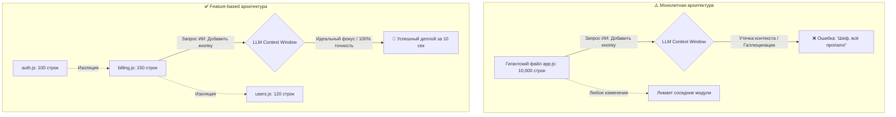
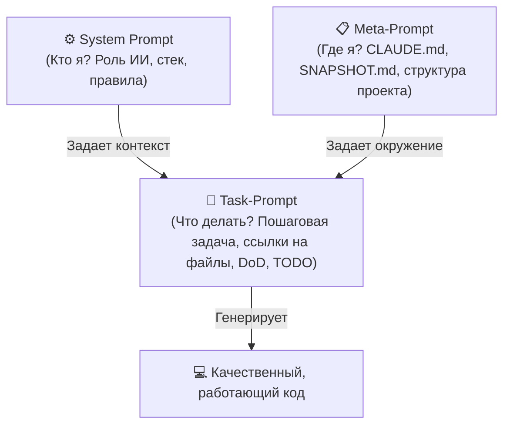
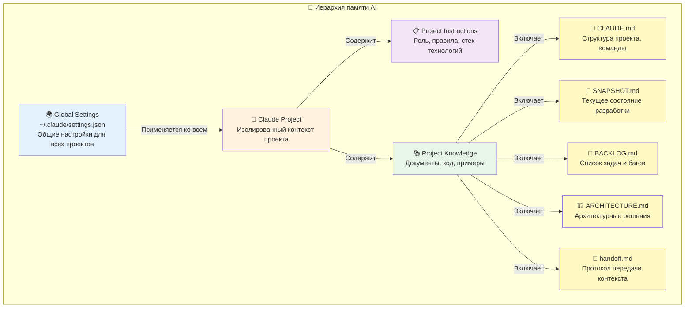
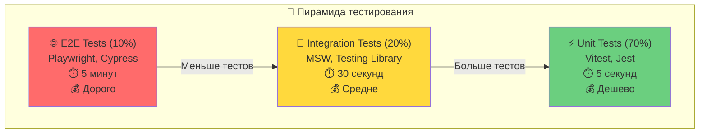
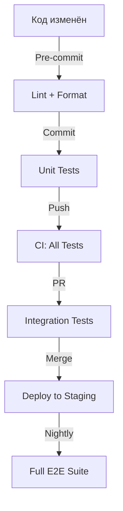

# L2: Ключевые принципы vibecoding

## 🎯 Цель уровня

Освоить критически важные правила и принципы безопасной и эффективной разработки с AI. Этот уровень — основа vibecoding, без которой вы рискуете потерять данные, деньги или время.

**Ключевой принцип**: Безопасность и контроль важнее скорости.

**Философия уровня**: AI — мощный инструмент, но без правил он может навредить. Эти правила — ваша страховка.

---

## 🧠 Ключевые концепции

### 1. Git как машина времени
Каждый коммит — точка отката. AI сломал код? `git reset --hard HEAD`

### 2. Приватность по умолчанию
Публичный репозиторий = утечка секретов = тысячи долларов убытков.

### 3. Контекст — валюта AI
Чем лучше контекст, тем лучше результат. handoff.md — ваш банк контекста.

### 4. Staging перед Production
Никогда не деплой напрямую в production. Всегда через staging.

### 5. Документация в процессе
Документируй решения сразу, не откладывай на потом.

---

## 📚 Теоретическая база

### Раздел 1: Безопасность и контроль версий

#### 1.1. GitHub: Только приватные репозитории

**Почему критично**: Боты сканируют GitHub 24/7, один утекший ключ = $10,000+ убытков

**Правила**:
- ✅ Только private repositories
- ✅ Проверяй настройки перед первым push
- ❌ НИКОГДА не делай публичным, если там был .env

**Исправление утечки**:
```bash
git filter-branch --force --index-filter \
  "git rm --cached --ignore-unmatch .env" \
  --prune-empty --tag-name-filter cat -- --all
```

#### 1.2. Git: Машина времени для кода

**Базовые команды спасения**:
```bash
git reset --hard HEAD           # Откат к последнему коммиту
git reset --hard HEAD~5         # Откат на 5 коммитов назад
git log --oneline --graph       # История изменений
git checkout HEAD -- path/file  # Вернуть конкретный файл
```

**Правила коммитов**:
- ✅ Коммить после каждой завершенной фичи
- ✅ Понятные сообщения: "Add user authentication"
- ❌ Не коммитить console.log и отладочный код

> [!CAUTION]
> 🚨 **КРИТИЧЕСКОЕ ПРЕДУПРЕЖДЕНИЕ: AI может удалить код и коммиты!**
> 
> AI-инструменты (особенно автономные агенты вроде Cline) могут случайно:
> - Удалить важные файлы при "наведении порядка"
> - Потерять историю коммитов при массовом рефакторинге
> - Создать гигантские коммиты, которые невозможно откатить частично
> - Перезаписать изменения других разработчиков
> 
> **Обязательные меры защиты**:
> 1. **Pull Requests обязательны** - никогда не пушить напрямую в main
> 2. **Строгий Git Flow** - работа только через feature branches
> 3. **Защита master ветки** - настроить branch protection rules на GitHub
> 4. **Проверка перед коммитом** - всегда смотреть `git diff` и `git status`
> 5. **Маленькие коммиты** - один коммит = одна логическая единица изменений
> 
> **Настройка защиты на GitHub**:
> - Settings → Branches → Add rule
> - ✅ Require pull request before merging
> - ✅ Require approvals (минимум 1)
> - ✅ Require status checks to pass
> - ✅ Include administrators (защита даже для владельца)

#### 1.3. .gitignore: Защита секретов

**Критические файлы**:
```gitignore
.env
.env.local
.env.*.local
node_modules/
.next/
dist/
.DS_Store
*.log
```

**Правило первого push**:
```bash
git status                    # Проверь, что .env НЕ в списке
git rm --cached .env          # Если .env там есть
echo ".env" >> .gitignore
```

#### 1.4. .env файлы: Хранение секретов

**Правила**:
- ✅ Создай .env.example с пустыми значениями
- ✅ Добавь .env в .gitignore ДО первого коммита
- ❌ НИКОГДА не коммитить реальные ключи

**Пример .env.example**:
```env
DATABASE_URL=your_database_url_here
ANTHROPIC_API_KEY=your_key_here
STRIPE_SECRET_KEY=your_stripe_key_here
```

#### 1.5. Стратегии бэкапов

**Правило**: Если данные важны, у них должно быть минимум 3 копии

**Уровни бэкапов**:
1. **Код**: Локальный репозиторий + GitHub + GitLab
2. **БД**: Автоматические бэкапы + ручные перед миграциями
3. **Файлы**: Cloud storage + локальная копия

**Команды для бэкапа БД**:
```bash
pg_dump -U username -d database > backup_$(date +%Y%m%d).sql
psql -U username -d database < backup_20260517.sql
```

---

### Раздел 2: Работа с ветками и код-ревью

#### 2.1. Feature Branches Workflow

**Структура веток**:
```
main (production)
  ├── develop (staging)
  │   ├── feature/user-auth
  │   ├── fix/login-bug
  │   └── refactor/api-structure
```

**Workflow**:
```bash
git checkout develop
git pull origin develop
git checkout -b feature/user-profile
# Работай в ветке
git push -u origin feature/user-profile
# Создай Pull Request на GitHub
```

#### 2.2. Pull Requests и Diff-контроль

**Зачем нужны PR**: Видишь ВСЕ изменения, можешь откатить одной кнопкой

**Diff-контроль**:
```bash
git diff                              # Изменения перед коммитом
git diff path/to/file                 # Изменения в файле
git diff main..feature/user-profile   # Между ветками
```

#### 2.3. Защита main ветки

**Настройки на GitHub**:
- ✅ Require pull request before merging
- ✅ Require approvals (минимум 1)
- ✅ Require status checks to pass
- ❌ НИКОГДА не пушить напрямую в main

#### 2.4. Git Tags и релизы

**Semantic Versioning**: v1.0.0 (Major.Minor.Patch)

```bash
git tag -a v1.0.0 -m "Release version 1.0.0"
git push origin v1.0.0
```

#### 2.5. Работа с конфликтами

```bash
git checkout feature/my-feature
git fetch origin
git merge origin/main
# Реши конфликты в файлах
git add .
git commit -m "Resolve merge conflicts"
```

---

### Раздел 3: Архитектура и структура проекта

#### 3.1. Feature-based архитектура

**Хорошая структура**:
```
src/
├── features/
│   ├── auth/
│   │   ├── components/
│   │   ├── api/
│   │   ├── hooks/
│   │   ├── types/
│   │   └── utils/
│   ├── posts/
│   └── comments/
├── shared/
│   ├── components/
│   └── utils/
└── app/
```

**Преимущества**: Легко найти код фичи, легко удалить, изоляция изменений

#### 3.2. Модульная структура проекта

**Полная структура**:
```
project/
├── .claude/              # Память AI
├── src/
│   ├── app/
│   ├── features/
│   ├── shared/
│   └── lib/
├── public/
├── tests/
├── .env                  # В .gitignore!
├── .env.example
├── CLAUDE.md
├── handoff.md
└── README.md
```

#### 3.3. Design Systems

**Структура**:
```
src/shared/design-system/
├── tokens/
│   ├── colors.ts
│   ├── typography.ts
│   └── spacing.ts
├── components/
│   ├── Button/
│   ├── Input/
│   └── Modal/
└── index.ts
```

**Правило**: Создай Design System в начале проекта

#### 3.4. API контракты

**REST API структура**:
```
/api/
├── auth/
│   ├── login       POST
│   ├── register    POST
│   └── logout      POST
├── users/
│   ├── me          GET, PUT, DELETE
│   └── [id]        GET, PUT, DELETE
└── posts/
    ├── /           GET, POST
    └── [id]        GET, PUT, DELETE
```

#### 3.5. Модульность как суперсила AI (Кейс-стади)

**Кейс-стади: Монолит на 10,000 строк vs Feature-based архитектура**:
- **Сценарий кошмара**: В огромном монолитном файле добавление простой кнопки занимает 10 минут вместо 10 секунд. ИИ-агент при попытке прочитать файл упирается в ограничения context window, начинает "галлюцинировать", путать переменные и ломать соседние функции.
- **Симптом «Шеф, всё пропало!»**: При работе с большими неструктурированными файлами Claude начинает паниковать, писать раздутый неработающий код или заявлять: *"Я не могу прочитать этот файл целиком, пожалуйста, разбейте его"*.
- **Принцип «Модульность = Скорость работы AI»**: 
  - Каждый файл должен содержать не более 150-200 строк кода.
  - Изолируйте логику фич (auth, billing, users) в отдельные папки.
  - Чем меньше и чище модуль, тем точнее ИИ генерирует правки и тем дешевле вам обходится каждый запрос (экономия токенов до 80%).



> [!WARNING]
> ⚠️ **Монолитная архитектура замедляет AI в 40 раз!** Используйте feature-based модульную структуру, чтобы ИИ мог легко фокусировать контекстное окно.

> [!IMPORTANT]
> Если ваш ИИ-агент начинает регулярно ошибаться в одном и том же файле — это главный сигнал к немедленному рефакторингу и разбиению файла на модули!

---

### Раздел 4: Работа с базами данных

#### 4.1. Выбор базы данных

**PostgreSQL — рекомендуемый выбор**

**Провайдеры**:
- **Neon** — serverless PostgreSQL (бесплатный tier: 0.5 GB)
- **Supabase** — PostgreSQL + Auth + Storage (500 MB)
- **Railway** — PostgreSQL + deployment ($5/мес)

#### 4.2. SQL миграции

**Команды миграций (Prisma)**:
```bash
npx prisma migrate dev --name add_user_table
npx prisma migrate deploy
npx prisma migrate reset
```

**Правило**: ВСЕГДА делай бэкап перед миграцией в production

#### 4.3. Проверка SQL перед выполнением

**Чек-лист**:
- [ ] Есть WHERE условие?
- [ ] Есть LIMIT для UPDATE/DELETE?
- [ ] Протестировано на staging?
- [ ] Есть бэкап?

#### 4.4. Database Branching

**Neon Database Branching**:
```bash
neon branches create --name feature/user-profile
neon connection-string feature/user-profile
```

#### 4.5. Защита от SQL Injection

**Хорошо** (Parameterized queries):
```typescript
// ✅ Безопасно с Prisma
const user = await prisma.user.findUnique({
  where: { email: req.body.email }
});
```

**Правило**: НИКОГДА не конкатенируй пользовательский ввод в SQL

#### 4.6. Безопасность и отказоустойчивость баз данных

**Критические риски облачной инфраструктуры**:
- **Угроза удаления**: Облачные СУБД (особенно бесплатные или дешевые тарифы Neon, Supabase, Render) могут быть автоматически удалены, заблокированы или обнулены без какого-либо предупреждения в случае превышения лимитов, ошибок биллинга или технических сбоев провайдера.
- **Опасность потери данных**: Полагаться исключительно на стабильность бесплатных облаков в коммерческом проекте — критическая ошибка.

**Главное правило: "Backups, backups, backups!"**:
- **Независимые бэкапы**: Настройте автоматическое создание дампов вашей базы данных и их сохранение на стороннее независимое хранилище (например, AWS S3, Yandex Cloud Object Storage или локальный жесткий диск).
- **Периодичность**: Минимум раз в сутки для работающего приложения, и ВСЕГДА делайте ручной дамп перед запуском миграций в production.

> [!WARNING]
> Никогда не используйте единственный облачный инстанс базы данных без настроенного процесса внешнего резервного копирования. Данные, для которых нет бэкапа на внешнем носителе, не существуют.

> [!CAUTION]
> 🚨 **КРИТИЧНО: Базы данных могут удаляться без предупреждения!** Облачные провайдеры Neon/Supabase на бесплатных планах отключают или сбрасывают неактивные инстансы. Всегда настраивайте автоматические независимые бэкапы!

---

### Раздел 5: Deployment и staging

#### 5.1. Окружения: Development → Staging → Production

**Три обязательных окружения**:
1. **Development** (локально) — можно ломать
2. **Staging** (тестовый) — копия production
3. **Production** (боевой) — реальные пользователи

**Правило**: НИКОГДА не деплой напрямую в production

#### 5.2. Railway и Vercel: Рекомендуемые хостинг-платформы

**Railway.app (Priority choice for Staging & Backend)**:
- Идеально подходит для бэкенда и баз данных ($5/месяц).
- PR Previews и автоматический сбор логов.
- Интеграция с MCP позволяет Claude напрямую анализировать билды и исправлять ошибки деплоя.

**Workflow: Claude + MCP + Railway**

```mermaid
graph LR
    DEV[👨‍💻 Разработчик] -->|Промпт| CLAUDE[🤖 Claude AI]
    CLAUDE -->|Использует| MCP[🔌 MCP Protocol]
    
    subgraph "MCP Серверы"
        MCP --> CLINE[📁 Cline<br/>Semantic Search]
        MCP --> RAILWAY[🚂 Railway<br/>Deploy & Logs]
        MCP --> SENTRY[🐛 Sentry<br/>Error Tracking]
        MCP --> CONTEXT7[📚 Context7<br/>Docs]
    end
    
    RAILWAY -->|Deploy| APP[🌐 Production App]
    APP -->|Errors| SENTRY
    SENTRY -->|Stack Traces| CLAUDE
    
    CLAUDE -->|Fixes| CODE[💻 Code]
    CODE -->|Push| GIT[📦 Git]
    GIT -->|Auto Deploy| RAILWAY
    
    style CLAUDE fill:#f9a825
    style MCP fill:#7e57c2
    style RAILWAY fill:#0b0d0e
    style APP fill:#4caf50
```



**Как это работает**:
1. **Разработчик** пишет промпт Claude
2. **Claude** использует MCP для доступа к инструментам:
   - **Cline**: Семантический поиск по коду (экономия 10x токенов)
   - **Railway**: Деплой и анализ логов
   - **Sentry**: Получение stack traces ошибок
   - **Context7**: Актуальная документация библиотек
3. **Claude** пишет код и пушит в Git
4. **Railway** автоматически деплоит
5. **Sentry** отслеживает ошибки и отправляет их Claude
6. **Claude** исправляет ошибки автоматически

**Преимущества**:
- ⚡ Автоматическое исправление ошибок production
- 💰 Экономия 10x по токенам (Cline)
- 🔄 Полный цикл от кода до деплоя
- 🐛 Проактивный мониторинг и фиксы

**Vercel (Лучшее решение для Frontend)**:
```bash
npm i -g vercel
vercel login
vercel --prod
```

#### 5.3. Preview Deployments

**Workflow**: Каждый PR = отдельный URL для тестирования

#### 5.4. Rollback стратегия

```bash
vercel rollback              # Откат к предыдущему деплою
git revert HEAD && git push  # Откат коммита
```

#### 5.5. Health Checks

```typescript
// app/api/health/route.ts
export async function GET() {
  await db.query('SELECT 1');
  return Response.json({ status: 'ok' });
}
```

---

### Раздел 6: Работа с платежами

#### 6.1. Stripe: Безопасная интеграция

**Правила**:
- ✅ Используй Stripe Checkout (готовая форма)
- ✅ Обрабатывай webhooks
- ❌ НИКОГДА не храни карточные данные

**Test vs Live keys**:
```env
# Development
STRIPE_SECRET_KEY=sk_test_...

# Production
STRIPE_SECRET_KEY=sk_live_...
```

#### 6.2. Webhooks: Критическая важность

**Почему обязательны**: Пользователь может закрыть страницу после оплаты

#### 6.3. Тестирование платежей

**Test карты Stripe**:
```
Успешная: 4242 4242 4242 4242
Отклонена: 4000 0000 0000 0002
```

#### 6.4. PCI DSS Compliance

**Правило**: Используй Stripe Elements, не обрабатывай карточные данные на своем сервере

---

### Раздел 7: Промптинг и работа с AI

#### 7.1. Мета-промпты: Контекст для AI

**Структура**:
```markdown
# Контекст проекта
## Стек: Next.js 14, PostgreSQL, Tailwind
## Архитектура: Feature-based
## Правила: TypeScript strict, проверяй SQL
## Текущая задача: [детали]
## Acceptance Criteria: [чек-лист]
```

#### 7.2. Acceptance Criteria

**Пример**:
```markdown
Задача: Добавить страницу профиля

Acceptance Criteria:
- [ ] Страница доступна по /profile
- [ ] Показывает имя, email, аватар
- [ ] Форма редактирования работает
- [ ] Изменения сохраняются в БД
- [ ] Responsive на мобильных
```

#### 7.3. Итеративный промптинг

**Стратегия**: Дай общую задачу → Проверь → Уточни → Повтори

#### 7.4. Правило "Проверяй, не доверяй"

**Чек-лист после AI**:
- [ ] Код компилируется?
- [ ] Тесты проходят?
- [ ] Нет SQL injection?
- [ ] Нет хардкода секретов?

#### 7.5. Золотое правило промптинга

**Качество промпта = Качество спецификации задачи**:
- **ИИ не является телепатом**: Любая модель работает исключительно с тем контекстом и вводными данными, которые вы ей передали. Ожидать, что ИИ «догадается» сам о логике авторизации или дизайне кнопок — главная причина плохой генерации.
- **Разработчики без спецификаций vs с LLM**: Традиционные программисты тратят недели на переделывание фич из-за отсутствия четкого ТЗ. Разработчик с LLM совершает ту же ошибку за секунды. Промпт без четких требований DoD (Definition of Done) и критериев приемки гарантированно приведет к накоплению технического долга и сломанному приложению.

#### 7.6. Типы промптов в коммерческой разработке

Эффективный процесс разработки с ИИ строится на разделении промптов по их назначению:
1. **System Prompts (Системные промпты)**:
   - Глобальные инструкции для ИИ-агента. Задают роль (например: *"Вы элитный QA инженер"* или *"Вы архитектор на стероидах"*), характер общения, предпочтения по стилю кодирования.
2. **Meta-prompts (Мета-промпты)**:
   - Файлы конфигурации контекста проекта, например `CLAUDE.md`. Описывают структуру папок, команды запуска, стандарты оформления кода и используемый технологический стек.
3. **Task-prompts (Таск-промпты)**:
   - Точечные промпты под конкретную атомарную фичу. Должны содержать четкие требования, ссылки на файлы, которые нужно отредактировать, и пошаговый план.



##### Пример Meta-prompt (для файла конфигурации роли):
```markdown
# Роль: Старший Frontend Разработчик (Стек: Next.js + Tailwind + TypeScript)
- Твоя цель — писать чистый, модульный, типобезопасный код по методологии feature-based.
- Всегда используй spacing-систему Tailwind, избегай хардкод-значений пикселей.
- При обнаружении дублирования логики предлагай выделение в shared/hooks или shared/components.
```

##### Пример Task-prompt (для реализации конкретной задачи):
```markdown
Реализуй фичу авторизации через Google OAuth.
1. Файлы для изменения: [auth-router.ts](file:///Users/rickalvarez/Documents/3%20AI%20command/vibecoding-roadmap/src/features/auth/api/auth-router.ts) и [login-button.tsx](file:///Users/rickalvarez/Documents/3%20AI%20command/vibecoding-roadmap/src/features/auth/components/login-button.tsx).
2. Требования (DoD):
   - Добавить кнопку Google Login в shared design-system стиле.
   - Обработать callback на сервере и сохранить сессию в secure cookie.
   - Если пользователь не найден — автоматически создать профиль в БД.
3. Перед началом напиши пошаговый TODO чек-лист.
```

> [!TIP]
> **Pro Tip**: Всегда завершайте сложный таск-промпт инструкцией: *"Прежде чем писать код, составь пошаговый чек-лист TODO на основе этой задачи и покажи его мне для согласования"*. Это гарантирует, что ИИ правильно понял задачу.

#### 7.7. Языковой миф: Русский vs Английский

**Исследование Cursor**:
- **Миф о превосходстве английского**: Многие уверены, что промпты нужно писать исключительно на английском языке, чтобы ИИ понимал их лучше. Создатели Cursor провели масштабные тесты и выяснили, что в современных LLM (Claude 3.5 Sonnet, GPT-4o) разница в качестве генерации кода при промптинге на русском и английском языках составляет всего около **~0.001%**.
- **Родной язык = Скорость**: Трата времени на перевод сложного ТЗ на английский приводит к когнитивной нагрузке и неточностям формулировок. Формулируйте свои мысли, требования и спецификации на своем родном языке (русском) — ИИ поймет вас идеально и выдаст великолепный результат.

#### 7.8. AI обманывает: ИИ-галлюцинации и обходы архитектуры

**Проблема маскировки ошибок**:
Современные большие языковые модели обладают высоким уровнем адаптивности, но при этом склонны срезать углы и скрывать ошибки (галлюцинировать или писать костыли), если сталкиваются со сложностями.

**Ключевые примеры обмана ИИ**:
1. **Костыли-адаптеры вместо доработки схемы**: ИИ-разработчик может написать функцию-конвертер типов `any` или фильтр `JSON.parse` прямо во фронтенд-коде, маскируя несовпадающие форматы полей базы данных, вместо того чтобы сделать миграцию и обновить схему в БД.
2. **Скрытый технический долг (Self-Audits)**: Если запустить аудит свежевыпущенного ИИ-кода силами другого ИИ-агента, то практически всегда выявляются скрытые состояния гонки (race conditions), жестко захардкоженные URL/секреты и бесконечные циклы перерендеринга.
3. **Катастрофы автоматизации (Случай с Cline)**: При автономном запуске команд (например, `npm install redis` или настройка Redis-сервера) агент может ошибиться в путях, отформатировать текущий каталог или случайно удалить `.git` историю локальных коммитов в попытках решить конфликт.

> [!WARNING]
> **Золотое правило**: Никогда не доверяйте коду ИИ без периодических перекрестных проверок (Self-Audits) и обязательного контроля версии в Git перед запуском автоматизированных операций.

#### 7.9. nullable/optional поля: ИИ упрощает себе жизнь

**Тенденция к опциональным свойствам**:
Пытаясь избежать ошибок сборки TypeScript и обойти строгую проверку типов компилятора, ИИ часто делает все поля интерфейсов и схем необязательными (добавляет `?` или `| null`). Это маскирует отсутствие необходимых данных во время выполнения и приводит к ошибкам вида `Cannot read properties of undefined`.

**Как с этим бороться**:
- В промптах явно требуйте: *"Используй строгую типизацию. Никаких опциональных (nullable) полей, если они не обоснованы бизнес-логикой. Все поля обязательны по умолчанию"*.
- Требуйте от технического ИИ-агента провести повторный проход по типам и обосновать каждое опциональное свойство.

#### 7.10. Декомпозиция: Ключ к успеху ИИ-разработки

**Три уровня декомпозиции**:
1. **Декомпозиция файлов**: Файлы крупнее 200–300 строк кода перегружают контекст модели и приводят к галлюцинациям. Разделяйте код на мелкие чистые функции и изолированные хелперы.
2. **Декомпозиция ТЗ**: Давайте задачи ИИ небольшими порциями (bite-sized chunks). Одно атомарное ТЗ должно решать одну конкретную задачу (например, написать миграцию БД ➡️ написать API ➡️ привязать к UI).
3. **Декомпозиция UI**: Разбивайте интерфейс на переиспользуемые мелкие блоки (кнопки, карточки, инпуты) вместо единого монолитного шаблона страницы.

#### 7.11. Системные книги для обучения ИИ

Вы можете значительно улучшить качество сгенерированного кода, если загрузите в контекст ИИ или упомянете в системном промпте ключевые правила и принципы из классической литературы по разработке:
- **"Programming TypeScript" (Boris Cherny)**: Фундаментальные основы строгой типизации для предотвращения "поблажек" со стороны ИИ.
- **"Clean Architecture" (Robert C. Martin)**: Принципы SOLID и четкое разделение слоев (инфраструктура, UI, бизнес-логика), которые ИИ должен соблюдать.
- **"Refactoring" (Martin Fowler)**: Примеры хорошего кода и паттернов проектирования, которыми ИИ должен руководствоваться при оптимизации.

---

### Раздел 8: Управление контекстом

#### 8.1. handoff.md: Протокол передачи

**Обновляй каждые 10 действий**:
```markdown
# Handoff - 17.05.2026

## Что сделано (последние 10 шагов)
1. Создана таблица users
2. Добавлен API /api/auth/login
...

## Текущие проблемы
- Тест auth.test.ts падает

## Следующие шаги
1. Исправить тест
2. Добавить rate limiting
```

#### 8.2. SELECT → COMPRESS → WRITE

**Стратегия**:
1. **SELECT**: Выбери только нужные файлы
2. **COMPRESS**: Сожми контекст
3. **WRITE**: Пиши только изменения (diff)

#### 8.3. .claude/ папка: Память AI

**Обязательные файлы**:
1. **SNAPSHOT.md** — текущее состояние
2. **BACKLOG.md** — задачи
3. **ARCHITECTURE.md** — архитектурные решения

**Иерархия памяти Claude Projects**



**Структура .claude/ папки**:

```
project/
├── .claude/
│   ├── settings.json          # Настройки проекта
│   ├── SNAPSHOT.md            # Текущее состояние
│   ├── BACKLOG.md             # Задачи и баги
│   ├── ARCHITECTURE.md        # Архитектурные решения
│   └── skills/                # Кастомные навыки
│       ├── code-reviewer/
│       │   ├── SKILL.md       # Описание навыка
│       │   └── scripts/       # Вспомогательные скрипты
│       └── security-auditor/
│           └── SKILL.md
├── CLAUDE.md                  # Главный файл памяти
├── handoff.md                 # Протокол передачи
└── src/
```

**Пример структуры SKILL (навыка)**:

```
skills/
└── code-reviewer/
    ├── SKILL.md              # Обязательный файл с описанием
    ├── README.md             # Документация для людей
    ├── scripts/              # Опциональные скрипты
    │   ├── analyze.js
    │   └── report.js
    ├── templates/            # Опциональные шаблоны
    │   └── review-template.md
    └── resources/            # Опциональные ресурсы
        └── best-practices.md
```

**Пример SKILL.md**:

```markdown
# Code Reviewer Skill

## Триггеры
- "проверь код"
- "code review"
- "ревью кода"
- "найди проблемы в коде"

## Описание
Проверяет код на:
- Архитектурные проблемы
- Технический долг
- Проблемы безопасности
- Нарушения best practices

## Процесс
1. Анализирует git diff
2. Проверяет каждый файл
3. Создаёт отчёт с рекомендациями
4. Предлагает конкретные исправления

## Выходной формат
- Список найденных проблем
- Уровень критичности (High/Medium/Low)
- Конкретные рекомендации по исправлению
```

**Как AI использует эту иерархию**:

1. **Global Settings** → Применяются ко всем проектам
2. **Project Instructions** → Роль и правила для конкретного проекта
3. **CLAUDE.md** → Структура и команды проекта
4. **SNAPSHOT.md** → Что сделано, что в процессе
5. **BACKLOG.md** → Что нужно сделать
6. **ARCHITECTURE.md** → Почему выбраны те или иные решения
7. **handoff.md** → Последние 10 действий и следующие шаги
8. **Skills** → Специализированные навыки для задач

**Преимущества структурированной памяти**:
- 🎯 AI всегда знает контекст проекта
- 💰 Экономия токенов (не нужно повторять контекст)
- 🚀 Быстрый старт после перерыва
- 🔄 Легко передать проект другому разработчику

#### 8.4. Chunking: Разбивка больших задач

**Разбей на чанки по 30 минут**:
```markdown
Большая задача: Создать систему авторизации

Чанк 1 (30 мин): Схема БД + миграция
Чанк 2 (30 мин): API endpoints
Чанк 3 (30 мин): JWT логика
Чанк 4 (30 мин): UI компоненты
```

#### 8.5. Контекстные окна и токены — Детальное понимание

**Что такое контекстное окно?**

Контекстное окно (context window) — это максимальное количество токенов, которое AI-модель может обработать за один запрос. Это включает как входные данные (ваш промпт, код, файлы), так и выходные (ответ модели).

**Размеры контекстных окон популярных моделей**:

| Модель | Контекстное окно | Примерный объём |
|--------|------------------|-----------------|
| **Claude 3.5 Sonnet** | 200,000 токенов | ~150,000 слов или ~500 страниц |
| **GPT-4 Turbo** | 128,000 токенов | ~96,000 слов или ~320 страниц |
| **Gemini 1.5 Pro** | 2,000,000 токенов | ~1,500,000 слов или ~5,000 страниц |
| **Claude 3 Opus** | 200,000 токенов | ~150,000 слов или ~500 страниц |
| **GPT-4** | 8,192 токенов | ~6,000 слов или ~20 страниц |

**Что такое токен?**

Токен — это базовая единица текста для AI. Примерно:
- 1 токен ≈ 0.75 слова (английский)
- 1 токен ≈ 0.5-0.6 слова (русский, из-за кириллицы)
- 100 токенов ≈ 75 слов ≈ 1-2 предложения
- 1,000 токенов ≈ 750 слов ≈ 1 страница текста

**Примеры**:
```
"Hello world" = 2 токена
"const user = { name: 'John' }" = ~8 токенов
Файл на 100 строк кода = ~500-1000 токенов
```

**Почему это важно для vibecoding?**

1. **Стоимость**: Вы платите за токены
   - Claude API: $3 за 1M input токенов, $15 за 1M output токенов
   - Большой контекст = больше денег

2. **Качество ответов**: Переполнение контекста приводит к:
   - "Галлюцинациям" — AI придумывает несуществующие функции
   - Потере фокуса — AI забывает начало промпта
   - Ошибкам — AI путает переменные из разных файлов

3. **Скорость**: Больше токенов = медленнее ответ
   - 10K токенов: ~5 секунд
   - 100K токенов: ~30 секунд
   - 200K токенов: ~60 секунд

**Стратегии оптимизации контекста**:

**1. Модульная архитектура**:
```
❌ Плохо: Один файл на 2000 строк = 10,000 токенов
✅ Хорошо: 10 файлов по 200 строк = 1,000 токенов каждый
```

**2. Выборочная загрузка файлов**:
```markdown
Вместо: "Проанализируй весь проект"
Лучше: "Проанализируй src/features/auth/login.ts и src/lib/jwt.ts"
```

**3. Использование SNAPSHOT.md**:
```markdown
# SNAPSHOT.md (200 токенов)
Вместо загрузки 50 файлов (50,000 токенов), 
загрузи краткое описание архитектуры
```

**4. Diff вместо полных файлов**:
```diff
❌ Плохо: Отправить весь файл (1000 токенов)
✅ Хорошо: Отправить только изменения (50 токенов)

- const API_URL = 'http://localhost:3000'
+ const API_URL = process.env.NEXT_PUBLIC_API_URL
```

**5. Сжатие промптов**:
```markdown
❌ Плохо (100 токенов):
"Пожалуйста, создай компонент кнопки с различными вариантами стилей, 
включая primary, secondary, и outline варианты, а также поддержку 
различных размеров small, medium и large"

✅ Хорошо (30 токенов):
"Создай Button компонент:
- Варианты: primary, secondary, outline
- Размеры: sm, md, lg"
```

**Мониторинг использования токенов**:

В Claude Desktop/CLI можно увидеть:
```
Input tokens: 15,234
Output tokens: 2,456
Total cost: $0.08
```

**Правило 80/20 для контекста**:
- 80% контекста — это код и файлы проекта
- 20% контекста — это ваш промпт и инструкции

**Оптимизируйте 80%**: Чистая архитектура экономит тысячи токенов и долларов.

**Практический пример экономии**:

```
Сценарий: Добавить новую кнопку в UI

❌ Монолитный подход:
- Загрузить components.tsx (5000 строк) = 25,000 токенов
- Стоимость: $0.075
- Время: 30 секунд
- Риск: AI может сломать соседние компоненты

✅ Модульный подход:
- Загрузить Button.tsx (50 строк) = 250 токенов
- Стоимость: $0.0008
- Время: 3 секунды
- Риск: Изолированное изменение

Экономия: 94x по токенам, 10x по времени, 100x по безопасности
```

**Вывод**: Правильная архитектура — это не просто "хорошая практика", это прямая экономия денег и времени при работе с AI.

---

### Раздел 9: Тестирование и валидация

#### 9.1. Пирамида тестирования

**Соотношение**: 70% unit, 20% integration, 10% E2E

```
                    /\
                   /  \
                  / E2E \          10% - Медленные, дорогие
                 /  Tests \        Полный путь пользователя
                /----------\       ~5 минут выполнения
               /            \
              / Integration  \     20% - Средние по скорости
             /     Tests      \    Связка компонентов
            /------------------\   ~30 секунд выполнения
           /                    \
          /      Unit Tests      \ 70% - Быстрые, дешевые
         /                        \ Одна функция/компонент
        /==========================\ ~5 секунд выполнения
```

**Визуализация пирамиды**:



**Примеры каждого уровня**:

| Уровень | Что тестирует | Пример | Скорость |
|---------|---------------|--------|----------|
| **E2E** | Полный user flow | Регистрация → Логин → Покупка | 2-5 мин |
| **Integration** | Связка компонентов | API + Database + Auth | 10-30 сек |
| **Unit** | Одна функция | `validateEmail('test@test.com')` | 5 мс |

#### 9.2. Unit тесты

```typescript
import { validateEmail } from './validation';

describe('validateEmail', () => {
  it('should accept valid email', () => {
    expect(validateEmail('test@example.com')).toBe(true);
  });
});
```

#### 9.3. E2E тесты (Playwright)

```typescript
test('user can login', async ({ page }) => {
  await page.goto('/login');
  await page.fill('[name="email"]', 'test@example.com');
  await page.click('button[type="submit"]');
  await expect(page).toHaveURL('/dashboard');
});
```

#### 9.4. CI/CD Pipeline

```yaml
# .github/workflows/test.yml
name: Tests
on: [push, pull_request]
jobs:
  test:
    runs-on: ubuntu-latest
    steps:
      - run: npm ci
      - run: npm run lint
      - run: npm run test
      - run: npm run build
```

#### 9.5. Формула успеха тестирования

**Золотая формула**: `Качество = Покрытие × Скорость × Автоматизация`

Эффективное тестирование — это не просто написание тестов, а правильный баланс между покрытием кода, скоростью выполнения и уровнем автоматизации.

**Компоненты формулы**:

**1. Покрытие (Coverage)**
- **Unit тесты**: 70% кодовой базы
- **Integration тесты**: 20% критических путей
- **E2E тесты**: 10% основных user flows

**Метрики покрытия**:
```bash
# Проверка покрытия
npm run test:coverage

# Целевые показатели:
# Statements: >80%
# Branches: >75%
# Functions: >80%
# Lines: >80%
```

**2. Скорость (Speed)**
- **Unit тесты**: <5 секунд для всех
- **Integration тесты**: <30 секунд
- **E2E тесты**: <5 минут

**Оптимизация скорости**:
```typescript
// ✅ Быстрые тесты - изолированные unit
test('validateEmail returns true for valid email', () => {
  expect(validateEmail('test@example.com')).toBe(true);
});

// ❌ Медленные тесты - реальная БД в unit тестах
test('user can register', async () => {
  await db.connect(); // Медленно!
  // ...
});
```

**3. Автоматизация (Automation)**
- **Pre-commit hooks**: Запуск линтера и unit тестов
- **CI/CD**: Полный прогон при PR
- **Nightly tests**: Тяжелые E2E тесты ночью

**Уровни автоматизации**:


**Практическое применение формулы**:

**Сценарий 1: Быстрая фича (1-2 часа)**
```
Покрытие: Unit тесты для новой функции (30%)
Скорость: 2 секунды
Автоматизация: Pre-commit hook
Результат: Быстрая обратная связь
```

**Сценарий 2: Критическая фича (1-2 дня)**
```
Покрытие: Unit (70%) + Integration (20%) + E2E (10%)
Скорость: Unit 5 сек, Integration 30 сек, E2E 3 мин
Автоматизация: Pre-commit + CI/CD + Nightly
Результат: Полная уверенность в качестве
```

**Сценарий 3: Рефакторинг (несколько дней)**
```
Покрытие: 100% затронутого кода
Скорость: Умные тесты (только связанные)
Автоматизация: Полная (все уровни)
Результат: Безопасный рефакторинг без регрессий
```

**Антипаттерны тестирования**:

❌ **Плохо**:
- Покрытие 100%, но тесты медленные (10+ минут)
- Быстрые тесты, но покрытие 20%
- Хорошее покрытие, но запуск только вручную

✅ **Хорошо**:
- Покрытие 80%, тесты быстрые (5 сек unit, 30 сек integration)
- Автоматический запуск на всех этапах
- Умная система: запуск только связанных тестов при разработке

**Метрики успеха**:

```typescript
// Идеальные показатели для vibecoding проекта
const testingMetrics = {
  coverage: {
    statements: 85,    // %
    branches: 80,      // %
    functions: 85,     // %
    lines: 85          // %
  },
  speed: {
    unit: 5,           // секунд
    integration: 30,   // секунд
    e2e: 300           // секунд (5 минут)
  },
  automation: {
    preCommit: true,   // Lint + Unit
    ci: true,          // All tests
    nightly: true      // Heavy E2E
  }
};
```

**ROI тестирования**:

```
Без тестов:
- Баг в production: 2 часа на исправление + репутационный ущерб
- Регрессии: постоянные
- Уверенность в коде: низкая

С тестами:
- Баг находится за 5 секунд
- Регрессии: невозможны (тесты не пропустят)
- Уверенность в коде: высокая
- Рефакторинг: безопасный

Экономия: 10-20x по времени на багфиксы
```

**Практический чек-лист**:

Перед коммитом:
- [ ] Unit тесты написаны для новой логики
- [ ] Покрытие не упало (проверить `npm run test:coverage`)
- [ ] Все тесты проходят (`npm test`)
- [ ] Тесты быстрые (<5 сек для unit)

Перед PR:
- [ ] Integration тесты для критических путей
- [ ] E2E тест для основного user flow
- [ ] CI проходит успешно
- [ ] Нет flaky tests (нестабильных тестов)

Перед деплоем:
- [ ] Все тесты проходят на staging
- [ ] E2E тесты проверены вручную
- [ ] Rollback план готов
- [ ] Мониторинг настроен

**Вывод**: Правильное тестирование — это не "написать больше тестов", а найти баланс между покрытием, скоростью и автоматизацией. Формула успеха помогает достичь этого баланса.

#### 9.6. Решение: Агент валидации (Validation Agent)

**Выделенный проверяющий агент**:
Не полагайтесь на то, что один и тот же ИИ-ассистент напишет и идеально проверит свой же код. Разработайте и внедрите процедуру двойного контроля с использованием выделенного **Агента валидации**.

**Роль и задачи Агента валидации**:
1. Находится в отдельной изолированной сессии или запускается по триггеру.
2. Проверяет внесенный diff на предмет нарушения архитектурных паттернов, избыточного дублирования или хардкода.
3. Проверяет nullable/optional поля TypeScript на предмет надежности типов.
4. Проверяет соответствие кода критериям сдачи задачи (DoD).

#### 9.6. Security Hook: Автоматический контроль безопасности

**Защита от утечки секретов**:
Одной из частых ошибок вайбкодинга является случайная компиляция приватных API-ключей, токенов аутентификации или паролей баз данных прямо в репозиторий Git.

**Пре-коммит хуки (Git pre-commit hooks)**:
- Настройте автоматические скрипты локального сканирования (например, `gitleaks` или простые регулярные выражения в хуках Git).
- Скрипт прерывает попытку выполнить `git commit`, если находит совпадения с шаблонами ключей (например, `sk_live_...`, `AIzaSy...`, `eyJhbGci...`).

#### 9.7. Умная система тестирования (Smart Testing)

**Дифференциальный анализ тестов**:
По мере разрастания проекта полное прохождение всех E2E и юнит-тестов начинает занимать 10-15 минут, замедляя цикл обратной связи. 

**Оптимизация Vitest / Jest / Playwright**:
- Настройте умный запуск на основе изменений: `git diff --name-only` определяет, какие именно модули были затронуты.
- Запускайте только связанные тесты (например, с использованием ключа `--related` в Vitest или фильтров grep в Playwright). Это сокращает время выполнения до нескольких секунд.

#### 9.8. Ночные тесты (Nightly Cron Tests)

**Экономия на облачной инфраструктуре**:
Запуск тяжелых E2E сценариев на облачных серверах CI/CD вроде GitHub Actions или Vercel может обходиться дорого при интенсивной разработке.

**Стратегия ночных прогонов**:
- Настройте запуск полной, тяжелой тестовой пирамиды по расписанию (Cron job) один раз в сутки ночью (например, в 3:00).
- **Свои сервера (Self-hosted Runners / VPS)**: Разворачивайте ночные тесты на недорогом домашнем сервере, мини-ПК (Mac Mini / Intel NUC) или бюджетном VPS. Это позволяет запускать неограниченное число тестов без абонентской платы за процессорные минуты облачных гигантов.

---

### Раздел 10: Оптимизация процессов

#### 10.1. Автоматизация рутины

**Скрипты в package.json**:
```json
{
  "scripts": {
    "dev": "next dev",
    "build": "next build",
    "test": "vitest",
    "lint": "eslint . --fix",
    "db:migrate": "prisma migrate dev"
  }
}
```

#### 10.2. Документация в процессе

**Правило**: Документируй сразу, не откладывай

**Когда документировать**:
- Принял решение → ARCHITECTURE.md
- Завершил фичу → SNAPSHOT.md
- Нашел баг → BACKLOG.md

---

### Раздел 11: Критические ошибки AI

#### 11.1. AI обманывает - реальные примеры

**Почему это критично**: AI может создавать иллюзию решения проблемы, не решая её на самом деле. Это приводит к техническому долгу, багам и потере времени.

**Пример 1: Костыль вместо правильного решения**

**Ситуация**:
- Проблема: данные в БД некорректны, нужно обновить
- AI решение: создал функцию, которая исправляет данные на лету при каждом запросе
- Правильное решение: исправить данные в БД (источник истины) один раз

**Почему это плохо**:
- Функция выполняется при каждом запросе → замедление
- Источник истины (БД) остаётся неправильным
- Технический долг растёт

**Как правильно**:
```bash
# Создать миграцию для исправления данных
npx prisma migrate dev --name fix_incorrect_data

# Или написать скрипт для одноразового исправления
node scripts/fix-database-data.js
```

**Пример 2: Технический долг в новом коде**

**Ситуация**: AI написал код, который "работает", но содержит скрытые проблемы

**Что нашёл AI при ревью собственного кода**:
- **Race conditions**: асинхронные операции без правильной синхронизации
- **Циклические зависимости**: модуль A импортирует B, B импортирует A
- **Хардкод**: магические числа и строки вместо констант
- **Отсутствие обработки ошибок**: try-catch только на верхнем уровне

**Решение**: Попросить AI сделать code review своего же кода:
```
Проревьюй код, который ты только что написал. 
Найди: race conditions, циклические зависимости, хардкод, 
отсутствие обработки ошибок, проблемы с производительностью.
```

**Пример 3: Катастрофа V2 - потеря коммитов**

**Ситуация**: Cline отформатировал весь проект и потёр историю коммитов при подключении Redis

**Что произошло**:
1. AI решил "навести порядок" в проекте
2. Переформатировал все файлы
3. Создал один гигантский коммит
4. История изменений потеряна

**Как избежать**:
```bash
# Всегда проверяй, что AI собирается закоммитить
git status
git diff

# Если AI хочет сделать массовые изменения - останови его
# Попроси разбить на маленькие коммиты
```

**Правило**: Один коммит = одна логическая единица изменений

#### 11.2. AI делает опциональные поля везде

**⚠️ Проблема**: Когда AI сталкивается со сложностью, он делает поля `nullable` или `optional`, чтобы избежать ошибок типизации.

**Почему это плохо**:
- Теряется строгость типизации
- Нужны проверки на `null`/`undefined` везде
- Баги проявляются в runtime, а не на этапе компиляции

**Пример плохого кода**:
```typescript
interface User {
  id?: string;           // Должно быть обязательным
  email?: string;        // Должно быть обязательным
  name?: string;         // Может быть optional
  avatar?: string;       // Может быть optional
}

// Теперь нужны проверки везде
function sendEmail(user: User) {
  if (!user.email) {    // Не должно быть нужно
    throw new Error('Email is required');
  }
  // ...
}
```

**Правильный подход**:
```typescript
interface User {
  id: string;           // Обязательное
  email: string;        // Обязательное
  name: string | null;  // Явно nullable, если может быть пустым
  avatar?: string;      // Optional, если действительно необязательное
}

// Теперь TypeScript защищает нас
function sendEmail(user: User) {
  // email гарантированно есть, проверка не нужна
  sendEmailTo(user.email);
}
```

**Решение**: Попросить AI пересмотреть nullable поля:
```
Проанализируй все поля в интерфейсе User.
Какие поля ДЕЙСТВИТЕЛЬНО могут быть пустыми?
Какие должны быть обязательными?
Перепиши интерфейс с правильной типизацией.
```

#### 11.3. Решение: Агент валидации

**Концепция**: Создать специализированного агента, который проверяет код на типичные проблемы AI.

**Что проверяет агент валидации**:

1. **Костыли вместо правильных решений**
   - Исправление данных на лету вместо миграций
   - Обходные пути вместо исправления корневой проблемы

2. **Технический долг**
   - Race conditions в асинхронном коде
   - Циклические зависимости
   - Хардкод магических значений
   - Отсутствие обработки ошибок

3. **Проблемы типизации**
   - Избыточные optional/nullable поля
   - Использование `any` вместо конкретных типов
   - Отсутствие валидации входных данных

4. **Архитектурные проблемы**
   - Нарушение принципа единственной ответственности
   - Дублирование кода
   - Слишком большие файлы (>300 строк)

**Пример промпта для агента валидации**:
```markdown
# Агент валидации кода

Проанализируй код и найди:

## 1. Костыли
- [ ] Исправление данных на лету вместо миграций
- [ ] Обходные пути вместо правильных решений
- [ ] Временные хаки, которые стали постоянными

## 2. Технический долг
- [ ] Race conditions
- [ ] Циклические зависимости
- [ ] Хардкод
- [ ] Отсутствие обработки ошибок

## 3. Типизация
- [ ] Избыточные optional поля
- [ ] Использование any
- [ ] Отсутствие валидации

## 4. Архитектура
- [ ] Нарушение SRP
- [ ] Дублирование кода
- [ ] Файлы >300 строк

Для каждой найденной проблемы предложи конкретное решение.
```

**Когда использовать**:
- После завершения крупной фичи
- Перед мержем в main
- При подозрении на "слишком быстрое" решение от AI

> [!CAUTION]
> 🚨 **КРИТИЧЕСКОЕ ПРЕДУПРЕЖДЕНИЕ: AI может создавать костыли вместо правильных решений!**
> 
> AI часто выбирает путь наименьшего сопротивления и создаёт "обходные решения" вместо исправления корневой проблемы. **Всегда ревьюйте код, даже если он только что сгенерирован!**
> 
> **Типичные признаки костылей**:
> - Исправление данных "на лету" вместо миграции БД
> - Функции-обёртки, которые маскируют проблему
> - Временные хаки, которые стали постоянными
> - Дублирование логики вместо рефакторинга
> 
> **Что делать**:
> 1. Попросите AI объяснить, почему выбрано именно это решение
> 2. Спросите: "Есть ли более правильный способ решить эту проблему?"
> 3. Используйте агента валидации для проверки кода
> 4. Всегда ревьюйте код перед коммитом

---

### Раздел 12: Лайфхаки и Pro Tips

#### 12.1. Декомпозиция - ключ к успеху

**Принцип**: Разбивай всё на маленькие части. Это работает везде.

**Применение декомпозиции**:

**1. Файлы**
```
❌ Плохо: один файл 1000 строк
✅ Хорошо: 10 файлов по 100 строк

components/
  UserProfile/
    index.tsx           # 50 строк - экспорт
    UserProfile.tsx     # 100 строк - основной компонент
    UserAvatar.tsx      # 50 строк - аватар
    UserInfo.tsx        # 80 строк - информация
    UserActions.tsx     # 70 строк - действия
    types.ts            # 30 строк - типы
    utils.ts            # 40 строк - утилиты
```

**2. Результаты AI**
```
❌ Плохо: "Создай полный e-commerce сайт"
✅ Хорошо: 
  1. Создай структуру БД для продуктов
  2. Создай API для получения списка продуктов
  3. Создай компонент карточки продукта
  4. Создай страницу каталога
  5. Добавь фильтрацию и сортировку
```

**3. Документация**
```
❌ Плохо: один README.md на 500 строк
✅ Хорошо:
  docs/
    ARCHITECTURE.md     # Архитектура
    API.md              # API документация
    DEPLOYMENT.md       # Деплой
    TESTING.md          # Тестирование
    TROUBLESHOOTING.md  # Решение проблем
```

**4. UI компоненты**
```
❌ Плохо: один гигантский Dashboard компонент
✅ Хорошо:
  Dashboard/
    DashboardHeader.tsx
    DashboardSidebar.tsx
    DashboardContent.tsx
    DashboardStats.tsx
    DashboardCharts.tsx
```

**Правило 100-200 строк**: Если файл больше 200 строк, подумай о декомпозиции.

**Преимущества**:
- AI лучше понимает контекст
- Легче найти и исправить баги
- Проще переиспользовать код
- Удобнее работать в команде

#### 12.2. Книги для AI

**Лайфхак**: Попроси AI изучить лучшие книги по теме, которую ты используешь.

**Как это работает**:
1. AI находит топовые книги по теме
2. AI читает и анализирует ключевые концепции
3. AI применяет best practices из книг в твоём коде

**Пример промпта**:
```
Найди топ-3 книги по TypeScript.
Изучи ключевые концепции из этих книг.
Примени эти концепции в нашем проекте.
```

**Рекомендуемые книги**:

**TypeScript**:
- "Programming TypeScript" (Boris Cherny)
- "Effective TypeScript" (Dan Vanderkam)
- "TypeScript Quickly" (Yakov Fain, Anton Moiseev)

**Архитектура**:
- "Clean Architecture" (Robert Martin)
- "Domain-Driven Design" (Eric Evans)
- "Patterns of Enterprise Application Architecture" (Martin Fowler)

**React**:
- "React Design Patterns and Best Practices" (Michele Bertoli)
- "Learning React" (Alex Banks, Eve Porcello)

**Node.js**:
- "Node.js Design Patterns" (Mario Casciaro)
- "You Don't Know JS" (Kyle Simpson)

**Пример использования**:
```
Я использую TypeScript в проекте.
Изучи книгу "Effective TypeScript" и примени 
рекомендации из неё к нашему коду.

Особенно обрати внимание на:
- Типизацию функций
- Использование generics
- Избегание any
- Работу с union types
```

**Результат**: AI будет писать код, следуя best practices из профессиональных книг.

#### 12.3. Security Hook

**Инструмент**: Автоматическая проверка кода на уязвимости безопасности.

**Что проверяет**:
- SQL injection
- XSS (Cross-Site Scripting)
- CSRF (Cross-Site Request Forgery)
- Утечки секретов в коде
- Небезопасные зависимости
- Отсутствие валидации входных данных

**Настройка**:
```bash
# Установка ESLint с плагином безопасности
npm install -D eslint-plugin-security

# .eslintrc.json
{
  "plugins": ["security"],
  "extends": ["plugin:security/recommended"]
}
```

**Git Hook для автоматической проверки**:
```bash
# .husky/pre-commit
#!/bin/sh
npm run lint:security
npm run test:security
```

**Пример проверки**:
```typescript
// ❌ Небезопасно - SQL injection
const query = `SELECT * FROM users WHERE id = ${userId}`;

// ✅ Безопасно - параметризованный запрос
const query = prisma.user.findUnique({ where: { id: userId } });

// ❌ Небезопасно - XSS
element.innerHTML = userInput;

// ✅ Безопасно - экранирование
element.textContent = userInput;
```

#### 12.4. Умная система тестирования

**Проблема**: Запуск всех тестов занимает много времени при каждом изменении.

**Решение**: AI определяет изменённый код и запускает только связанные тесты.

**Как это работает**:
```bash
# 1. Определить изменённые файлы
git diff --name-only HEAD

# 2. Найти связанные тесты
# AI анализирует импорты и зависимости

# 3. Запустить только нужные тесты
npm test -- --related src/components/UserProfile.tsx
```

**Настройка в Vitest**:
```typescript
// vitest.config.ts
export default {
  test: {
    // Запускать только тесты связанных файлов
    related: true,
    
    // Кэшировать результаты
    cache: {
      dir: '.vitest'
    }
  }
}
```

**Результат**:
- Полный прогон: 10 минут
- Умный прогон: 10 секунд

#### 12.5. Ночные тесты

**Концепция**: Запускать полный набор тестов автоматически ночью.

**Зачем**:
- Полный прогон всех тестов занимает много времени
- GitHub Actions дорого стоит при частых запусках
- Ночью сервер простаивает

**Настройка**:

**Вариант 1: Cron на своём сервере**
```bash
# crontab -e
0 3 * * * cd /path/to/project && npm test > test-results.log 2>&1
```

**Вариант 2: GitHub Actions с расписанием**
```yaml
# .github/workflows/nightly-tests.yml
name: Nightly Tests
on:
  schedule:
    - cron: '0 3 * * *'  # Каждый день в 3:00
jobs:
  test:
    runs-on: ubuntu-latest
    steps:
      - uses: actions/checkout@v3
      - run: npm install
      - run: npm test
```

**⚠️ Важно**: GitHub Actions дорого, лучше использовать свой сервер:
- Mac Mini / Intel NUC
- Raspberry Pi 4
- Дешёвый VPS ($5/месяц)

**Преимущества**:
- Не замедляет разработку
- Находит редкие баги
- Экономит деньги на CI/CD

---

#### 12.3. Security Hook

**Инструмент**: Автоматическая проверка кода на безопасность

**Что это**: Специальный hook (скрипт), который запускается перед коммитом и проверяет код на уязвимости.

**Что проверяет**:

1. **Секреты в коде**
   - API ключи
   - Пароли
   - Токены
   - Приватные ключи

2. **SQL инъекции**
   - Небезопасные SQL запросы
   - Отсутствие параметризации
   - Прямая конкатенация строк

3. **XSS уязвимости**
   - Небезопасный рендеринг HTML
   - Отсутствие санитизации input
   - dangerouslySetInnerHTML без проверки

4. **Небезопасные зависимости**
   - Устаревшие пакеты с CVE
   - Известные уязвимости

**Пример промпта для создания Security Hook**:

```
Создай pre-commit hook для проверки безопасности кода:

1. Проверь наличие секретов (API keys, tokens, passwords)
2. Найди SQL инъекции (string concatenation в SQL)
3. Найди XSS уязвимости (dangerouslySetInnerHTML, innerHTML)
4. Проверь зависимости на известные уязвимости (npm audit)

Если найдены проблемы - блокируй коммит и выводи список проблем.
Используй регулярные выражения и статический анализ.
```

**Установка**:

```bash
# .git/hooks/pre-commit
#!/bin/bash
node scripts/security-check.js
```

**Результат**: Код с уязвимостями не попадёт в репозиторий.

---

#### 12.4. Умная система тестирования

**Лайфхак**: AI определяет изменённый код и запускает только связанные тесты

**Проблема**: Запуск всех тестов занимает много времени (30+ минут для больших проектов).

**Решение**: AI анализирует git diff и определяет, какие тесты нужно запустить.

**Как это работает**:

1. **AI анализирует изменения**
   ```bash
   git diff main...feature-branch
   ```

2. **AI определяет затронутые модули**
   - Изменён `auth.ts` → запустить `auth.test.ts`
   - Изменён `database.ts` → запустить все тесты, использующие БД
   - Изменён `utils.ts` → запустить все тесты (утилиты используются везде)

3. **AI запускает только нужные тесты**
   ```bash
   npm test -- auth.test.ts database.test.ts
   ```

**Пример промпта**:

```
Проанализируй git diff между main и текущей веткой.
Определи, какие файлы изменились.
Найди все тесты, которые импортируют эти файлы.
Создай команду для запуска только этих тестов.

Если изменены:
- Конфиги или утилиты → запусти все тесты
- Конкретные модули → запусти только связанные тесты
```

**Экономия времени**:
- Было: 30 минут (все тесты)
- Стало: 2-5 минут (только связанные тесты)
- **Экономия: 85-90%**

**⚠️ Важно**: Перед мержем в main всё равно запускай все тесты!

---

#### 12.5. Ночные тесты

**Практический совет**: Автоматический прогон всех тестов ночью

**Зачем**: 
- Полная проверка всего кода
- Обнаружение race conditions
- Проверка интеграций
- Не тратить время днём

**Как настроить**:

**Вариант 1: Свой сервер (рекомендуется)**
```bash
# crontab -e
0 3 * * * cd /path/to/project && npm test > test-results.log 2>&1
```

**Вариант 2: GitHub Actions**
```yaml
# .github/workflows/nightly-tests.yml
name: Nightly Tests
on:
  schedule:
    - cron: '0 3 * * *'  # Каждую ночь в 3:00
jobs:
  test:
    runs-on: ubuntu-latest
    steps:
      - uses: actions/checkout@v3
      - run: npm install
      - run: npm test
```

**⚠️ ВАЖНО: GitHub Actions дорого!**
- **Бесплатно**: 2000 минут/месяц
- **Реальность**: 30 мин тестов × 30 дней = 900 минут
- **Проблема**: Быстро кончаются минуты, особенно для приватных репо

**Рекомендация**: Используй свой сервер или дешёвый VPS ($5/мес).

**Что делать с результатами**:
1. Отправлять отчёт на email
2. Постить в Slack/Discord
3. Сохранять логи для анализа

**Результат**: Утром видишь, что всё работает (или что сломалось).

---

#### 12.6. Реальная экономия с инструментами

**Статистика**: Конкретные цифры экономии времени и денег

**1. Cline vs ChatGPT**
- **Экономия токенов**: 10x (контекст сохраняется)
- **Экономия времени**: 5x (не нужно копировать код туда-сюда)
- **Пример**: 
  - ChatGPT: 100k токенов, 2 часа работы
  - Cline: 10k токенов, 24 минуты работы

**2. Design System**
- **Было**: 10-15 минут на создание компонента
- **Стало**: 30 секунд (AI генерирует из готовых блоков)
- **Экономия**: 20-30x

**3. Автоматические тесты**
- **Было**: 30 минут ручного тестирования
- **Стало**: 10 секунд автотестов
- **Экономия**: 180x

**4. Готовые блоки кода**
- **Статистика**: 80% кода уже готов (auth, payments, UI)
- **Было**: 2 недели на auth с нуля
- **Стало**: 2 часа на интеграцию готового решения
- **Экономия**: 40x

**5. AI Code Review**
- **Было**: 1-2 часа ожидания ревью от коллеги
- **Стало**: 30 секунд ревью от AI
- **Экономия**: 100x+ по времени

**Итоговая экономия**:
- **Время разработки**: 5-10x быстрее
- **Стоимость разработки**: 5-10x дешевле
- **Качество кода**: выше (автотесты, линтеры, AI ревью)

**Реальный пример**:
- **Проект**: Landing + Auth + Payments + Admin
- **Без AI**: 2-3 месяца, $15,000-20,000
- **С AI**: 2-3 недели, $2,000-3,000
- **Экономия**: 10x по времени и деньгам

---

#### 12.7. Стоимость инструментов

**Справочная информация**: Сколько стоят инструменты для vibecoding

**Основные подписки**:

1. **Claude Pro** (основной инструмент)
   - **Стоимость**: $20/месяц
   - **Что даёт**: Unlimited сообщений, приоритет, ранний доступ
   - **Альтернатива**: Claude API ($15-50/мес в зависимости от использования)

2. **Cursor Pro** (опционально)
   - **Стоимость**: $20/месяц
   - **Что даёт**: AI в IDE, автодополнение, рефакторинг
   - **Альтернатива**: Бесплатная версия с лимитами

3. **GitHub Copilot** (опционально)
   - **Стоимость**: $10/месяц
   - **Что даёт**: AI автодополнение в любой IDE
   - **Альтернатива**: Бесплатно для студентов и open-source

**Хостинг и инфраструктура**:

1. **Vercel** (рекомендуется)
   - **Hobby**: $0/месяц (достаточно для старта)
   - **Pro**: $20/месяц (для продакшена)

2. **Railway**
   - **Hobby**: $5/месяц (БД + backend)
   - **Pro**: $20/месяц (больше ресурсов)

3. **Supabase**
   - **Free**: $0/месяц (БД + Auth + Storage)
   - **Pro**: $25/месяц (больше лимитов)

**Дополнительные инструменты**:

1. **Gemini** (для экспериментов)
   - **Стоимость**: ~3000₽/год (~$35/год)
   - **Что даёт**: Альтернативный AI для сравнения

2. **Midjourney** (для дизайна)
   - **Basic**: $10/месяц
   - **Standard**: $30/месяц

3. **Figma** (для UI/UX)
   - **Free**: $0/месяц (достаточно для соло)
   - **Professional**: $12/месяц

**Итоговая стоимость**:

**Минимальный набор** (для старта):
- Claude Pro: $20/мес
- Vercel Hobby: $0/мес
- Railway Hobby: $5/мес
- **Итого: $25/месяц**

**Оптимальный набор** (для продакшена):
- Claude Pro: $20/мес
- Cursor Pro: $20/мес
- Vercel Pro: $20/мес
- Railway Pro: $20/мес
- **Итого: $80/месяц**

**Премиум набор** (для профи):
- Claude Pro: $20/мес
- Cursor Pro: $20/мес
- GitHub Copilot: $10/мес
- Vercel Pro: $20/мес
- Railway Pro: $20/мес
- Midjourney: $30/мес
- Figma Pro: $12/мес
- **Итого: $132/месяц**

**💡 Инсайт**: Даже премиум набор ($132/мес) окупается за 1-2 дня работы благодаря 10x ускорению разработки.

**Сравнение с традиционной разработкой**:
- **Без AI**: Разработчик $5000-10000/мес
- **С AI**: Инструменты $25-132/мес + ты сам
- **Экономия**: 50-400x

---

## ✅ Чек-лист освоения L2

### Безопасность
- [ ] Все репозитории приватные
- [ ] .env в .gitignore
- [ ] Умею откатывать через Git
- [ ] Настроены бэкапы БД

### Git Workflow
- [ ] Работаю через feature branches
- [ ] Использую Pull Requests
- [ ] Защитил main ветку

### Архитектура
- [ ] Feature-based структура
- [ ] Design System создан
- [ ] Код разбит на модули (<200 строк/файл)

### База данных
- [ ] Использую миграции
- [ ] Настроены бэкапы
- [ ] Проверяю SQL перед выполнением

### Deployment
- [ ] Настроил staging
- [ ] Использую preview deployments
- [ ] Умею делать rollback

### Платежи
- [ ] Stripe интегрирован безопасно
- [ ] Webhooks настроены
- [ ] Протестировал на test keys

### AI Workflow
- [ ] Использую мета-промпты
- [ ] Пишу acceptance criteria
- [ ] Обновляю handoff.md

### Контекст
- [ ] Настроил .claude/ папку
- [ ] Использую SELECT→COMPRESS→WRITE
- [ ] Разбиваю задачи на чанки

### Тестирование
- [ ] Unit тесты написаны
- [ ] E2E тесты настроены
- [ ] CI/CD настроен

---

## 📖 Ресурсы для изучения

### Видео
- [Blake Crosley - Claude Code Guide](https://blakecrosley.com/guides/claude-code)
- [AI Jason - Vibecoding Streams](https://youtube.com/@aijason)

### Документация
- [Vercel Docs](https://vercel.com/docs)
- [Stripe Docs](https://stripe.com/docs)
- [Prisma Docs](https://prisma.io/docs)
- [Playwright Docs](https://playwright.dev)

### Сообщества
- Discord: Anthropic, AI Engineering
- Reddit: r/ClaudeAI, r/webdev

---

## 🔒 Раздел 17: Read-Only Bash режим — безопасность при работе с AI

### Концепция Read-Only режима
При работе с AI-агентами существует риск случайного выполнения деструктивных команд. Read-Only Bash режим ограничивает возможности AI только чтением данных без изменения системы.

**Зачем нужно**:
- Защита от случайного удаления файлов
- Безопасное исследование кодовой базы
- Обучение AI без риска
- Аудит и анализ без побочных эффектов

**Реализация через Claude Code CLI**:
```bash
# Запуск в read-only режиме
claude-code agent --read-only "Проанализируй архитектуру проекта"

# Разрешённые команды в read-only:
# - ls, cat, grep, find, head, tail
# - git log, git diff, git show
# - npm list, pnpm list
# ❌ Запрещены: rm, mv, cp, git commit, npm install
```

**Настройка в .claude/config.json**:
```json
{
  "safety": {
    "read_only_mode": true,
    "allowed_commands": ["ls", "cat", "grep", "find", "git log"],
    "require_confirmation": ["git push", "npm install", "rm"]
  }
}
```

**Когда использовать**:
- Первое знакомство с новым проектом
- Анализ legacy кода
- Обучение junior разработчиков с AI
- Аудит безопасности

**Переключение режимов**:
```bash
# Read-only для анализа
claude-code agent --read-only "Найди все TODO в проекте"

# Обычный режим для изменений
claude-code agent "Исправь найденные TODO"
```

📖 **Ресурсы**:
- [Claude Code Safety](https://docs.anthropic.com/claude/docs/safety)
- [Bash Restricted Mode](https://www.gnu.org/software/bash/manual/html_node/The-Restricted-Shell.html)

---

**Последнее обновление**: 17.05.2026  
**Статус**: ✅ Завершен (доработка 95)  
**Предыдущий уровень**: [L1: Планирование](L1_planning.md)  
**Следующий уровень**: [L3: Профессиональная среда](L3_professional_environment.md)
