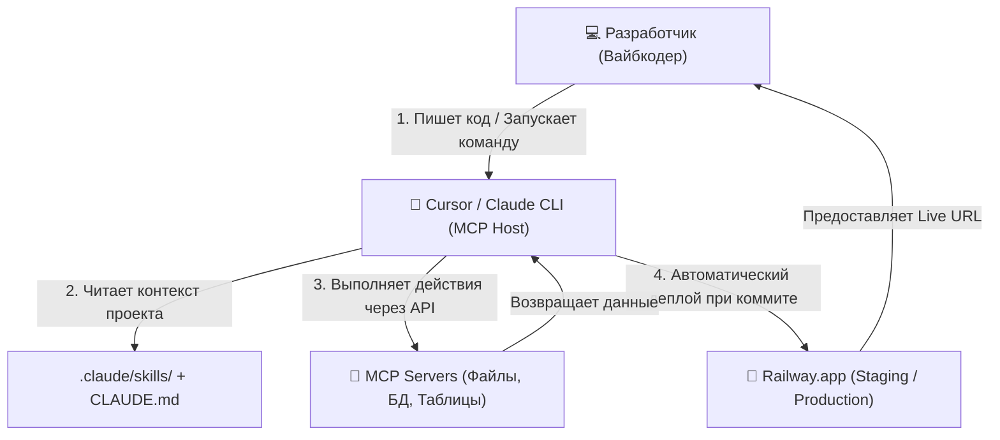
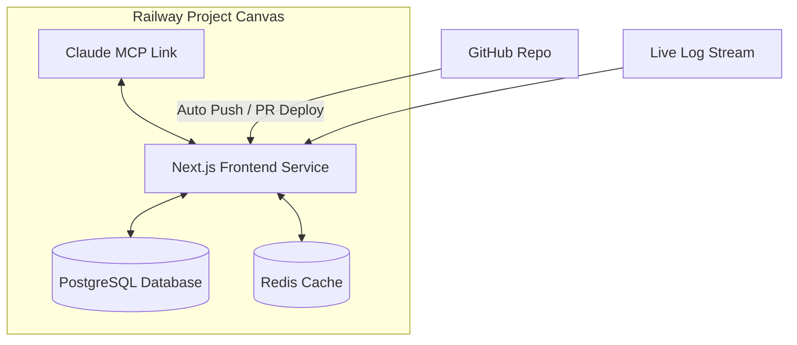

# L3: Профессиональная рабочая среда

## 🎯 Цель уровня

Настроить профессиональную рабочую среду для эффективной разработки с AI. Правильные инструменты увеличивают продуктивность в 10x.

**Ключевой принцип**: Инструменты должны помогать, а не мешать.

**Философия уровня**: Один раз настроил правильно — работаешь быстро всегда.

---

## 🧠 Ключевые концепции

### 1. IDE как центр управления
Все инструменты интегрированы в одном месте. Современная IDE — это не просто текстовый редактор, а полноценная операционная система для разработки. Вместо переключения между десятками приложений, всё доступно из одного окна: редактор кода, терминал, Git, отладчик, база данных, API тестирование.

**Принцип**: Минимизация контекстных переключений = максимальная продуктивность.

### 2. AI-first подход
Расширения и инструменты для работы с AI. В 2026 году разработка без AI — как вождение без GPS. AI помогает на каждом этапе: генерация кода, рефакторинг, поиск багов, написание тестов, документация. Важно выбрать правильные AI инструменты и научиться эффективно с ними работать.

**Принцип**: AI — это не замена разработчика, а усилитель его возможностей.

### 3. Автоматизация рутины
Форматирование, линтинг, тесты — автоматически. Всё, что можно автоматизировать, должно быть автоматизировано. Форматирование кода при сохранении, проверка ошибок в реальном времени, автоматический запуск тестов перед коммитом — это освобождает мозг для решения реальных задач.

**Принцип**: Если делаешь что-то больше 3 раз — автоматизируй.

### 4. Быстрая навигация
Hotkeys и shortcuts для всего. Профессиональный разработчик использует клавиатуру в 10 раз чаще мыши. Знание горячих клавиш — это не просто удобство, это разница между 2 часами и 20 минутами на задачу.

**Принцип**: Каждое действие мышью — это потерянная секунда.

### 5. Визуальная обратная связь
Видишь ошибки и предупреждения сразу. Не нужно запускать компилятор или тесты, чтобы увидеть проблему. Ошибки подсвечиваются прямо в коде, типы проверяются на лету, неиспользуемые импорты выделяются серым.

**Принцип**: Чем раньше увидел ошибку, тем дешевле её исправить.

### 6. Workspace как единица работы
Не файлы, не папки, а workspace. Workspace содержит настройки, расширения, задачи, конфигурации для конкретного проекта. Переключился на другой проект — автоматически загрузились нужные настройки.

**Принцип**: Каждый проект — это отдельная вселенная со своими правилами.

### 7. Контекстная осведомлённость
IDE знает о твоём проекте всё. Она понимает структуру кода, зависимости между модулями, типы данных, используемые библиотеки. Это позволяет давать умные подсказки, автодополнение, рефакторинг.

**Принцип**: Чем больше IDE знает о проекте, тем лучше она помогает.

### 8. Расширяемость через плагины
Базовая IDE — это фундамент. Расширения — это надстройка под твои нужды. React разработчику нужны одни инструменты, backend разработчику — другие. Важно не перегружать IDE ненужными расширениями.

**Принцип**: Устанавливай только то, что реально используешь.

### 9. Синхронизация между устройствами
Настройки, расширения, сниппеты — всё синхронизируется. Работаешь на MacBook, потом переключаешься на десктоп — всё идентично. Это экономит часы на настройку новых машин.

**Принцип**: Настрой один раз, используй везде.

### 10. Производительность превыше красоты
Красивая IDE, которая тормозит — это плохая IDE. Скорость отклика, быстрый запуск, мгновенный поиск — это важнее анимаций и эффектов.

**Принцип**: Если IDE тормозит — что-то не так.

---

## 📚 Теоретическая база

### Раздел 1: Выбор и настройка IDE

#### 1.1. VS Code — базовая IDE

**Почему VS Code**: Бесплатная, 50,000+ расширений, быстрая, Git интеграция

**Установка**:
```bash
# macOS
brew install --cask visual-studio-code

# Windows
winget install Microsoft.VisualStudioCode

# Linux
sudo snap install code --classic
```

#### 1.2. Cursor — AI-first IDE

**Почему Cursor**: Встроенный AI, контекст проекта, быстрые правки

**Установка**:
```bash
# macOS
brew install --cask cursor

# Или скачай с cursor.sh
```

**Ключевые фичи**:
- `Cmd+K` — AI редактирование
- `Cmd+L` — AI чат с контекстом
- `Cmd+Shift+L` — Composer (мультифайловое редактирование)

#### 1.3. Windsurf (Codeium)

**Альтернатива Cursor**: Бесплатная AI IDE

📖 **Ресурс**: [windsurf.ai](https://windsurf.ai)

#### 1.4. Выбор AI-моделей для кодинга

Для успешного вайбкодинга критически важно использовать правильную модель под конкретную задачу. Разные модели имеют разную специализацию:

**1. Claude 3.5 Sonnet (от Anthropic) — Главный инструмент (на стероидах)**:
- **Почему лидер**: Sonnet обладает лучшим в индустрии пониманием структуры кода, логики программирования и архитектурных паттернов. Она идеально следует сложным инструкциям и умеет работать с MCP (Model Context Protocol) серверами и навыками (Skills), что превращает её в полноценного автономного инженера.
- **Когда использовать**: Для написания кода, рефакторинга, багфикса, создания тестов и проектирования архитектуры.

**2. ChatGPT / GPT-4o (от OpenAI) — Стандартный ассистент**:
- **Почему не подходит для сложного кодинга**: GPT-4o часто выдает раздутый бойлерплейт, совершает глупые логические ошибки в сложных алгоритмах, «забывает» части кода и требует более длинного цикла отладки и ручных правок.
- **Когда использовать**: Для написания простых скриптов автоматизации, брейншторма идей и базового ревью.

**3. Gemini 1.5 Pro (от Google) — Исследователь с гигантским контекстом**:
- **Почему полезен**: Уникальное преимущество Gemini — контекстное окно в 2 миллиона токенов по очень низкой цене. Модель может за один раз прочитать абсолютно всю вашу кодовую базу со всеми зависимостями и документами.
- **Когда использовать**: Для глубоких исследований конкурентов, анализа гигантских объемов логов, поиска уязвимостей по всему проекту и составления технической документации.

### Сравнение ИИ-моделей для коммерческой разработки

| Характеристика / Модель | Claude 3.5 Sonnet | GPT-4o / ChatGPT | Gemini 1.5 Pro / Advanced |
| :--- | :--- | :--- | :--- |
| **Главная специализация** | Автономное написание кода, рефакторинг | Простые скрипты, брейншторминг | Чтение огромных репозиториев целиком |
| **Размер контекстного окна** | 200,000 токенов | 128,000 токенов | **2,000,000 токенов** |
| **Поддержка MCP / Skills** | **Отличная (полная интеграция)** | Ограниченная (через Custom GPTs) | Слабая / В процессе разработки |
| **Качество генерации кода** | **Максимальное (Best-in-class)** | Среднее (частый бойлерплейт) | Среднее (хорошо для исследований) |
| **Стоимость токенов** | Высокая | Средняя | Низкая / Бесплатно (в Google Studio) |
| **Автономные агенты** | Да (через Claude CLI/Composer) | Нет (в основном чат-режим) | В процессе разработки |

> [!TIP]
> Для ежедневного кодинга и работы с ИИ-агентами (например, Claude CLI или Composer в Cursor) используйте исключительно **Claude 3.5 Sonnet**. Для сбора маркетинговых инсайтов и парсинга больших документов используйте **Gemini**.

> [!WARNING]
> ⚠️ **Не используйте ChatGPT как промпт-генератор для Claude!** Это бессмысленное усложнение процесса, которое увеличивает накладные расходы токенов и снижает качество кода. Claude гораздо лучше генерирует код на основе прямых и понятных инструкций, написанных человеком на русском языке.

#### 1.5. Cursor 2.0: Agent Skills и динамическая сборка контекста

В Cursor 2.0 концепция статических длинных системных промптов (вроде огромных `.cursorrules`) уступила место **Agent Skills** (динамическим библиотекам навыков):

* **Что такое Agent Skills**: Это модульные плейбуки и инструкции по разработке, хранящиеся в директории `.cursor/skills/*.md`. Каждый файл описывает конкретный навык (например, `db-migrations.md`, `stripe-integration.md` или `media-manager.md`).
* **Динамическое подключение (Dynamic Context Discovery)**: ИИ-агент Cursor автоматически сканирует кодовую базу и подключает нужный навык только тогда, когда задача пользователя совпадает с триггерами навыка.
  - *Экономия затрат*: Динамическая загрузка экономит до **85% контекстных токенов**, избавляя от необходимости скармливать модели тонны нерелевантных правил при каждом запросе.
  - *Фокус модели*: Уменьшение объема фонового контекста резко снижает уровень галлюцинаций модели.

##### Схема работы Agent Skills в Cursor 2.0:
```
 [Задача: "Обнови схемы БД Neon"]
               |
               v
   [Dynamic Discovery Engine] ---> Сканирует .cursor/skills/
               |
      +--------+--------+
      v                 v
[Загружен db.md]  [Игнорирован stripe.md]
      |
      v
 [Claude 3.5 Sonnet генерирует точный SQL]
```

#### 1.6. Программные хуки (Hooks) и Специализированные субагенты

Для обеспечения максимальной надежности и разгрузки основного диалога Cursor 2.0 использует связку хуков и субагентов:

##### 1. Детерминированные хуки (Hooks)
Хуки — это запускаемые по событиям сценарии, которые проверяют код до и после генерации:
* **Pre-commit / Pre-push Hooks**: Автоматический запуск тестов и линтеров (`npm run lint`, `npm run test`) перед коммитом изменений. ИИ-агент не сможет сделать грязный коммит, если тесты упали.
* **Секреты под замком**: Хук безопасности проверяет файлы на наличие захардкоженных API ключей (например, `sk_live_...`) и блокирует коммит, принудительно вынося их в `.env.local`.

##### 2. Специализированные субагенты (Subagents)
Вместо выполнения всех тяжелых задач внутри одной вкладки чата, Cursor 2.0 делегирует их фоновым субагентам:
* **Explore Subagent**: Автономно обходит каталоги, ищет файлы и строит карту проекта, возвращая главному ИИ только краткую выжимку.
* **Bash Subagent**: Выполняет терминальные команды, следит за логами сборки и автоматически фиксирует возникающие runtime-ошибки.
* **Browser Subagent**: Запускает Playwright/Puppeteer в фоновом режиме, совершает клики, проверяет верстку и делает скриншоты для визуального подтверждения корректности интерфейса.
* *Результат*: Главная вкладка чата остается чистой, сохраняя ценное контекстное окно для общения с пользователем.

---

### Раздел 2: Обязательные расширения VS Code

#### 2.1. Для разработки

**Базовые**:
- **ESLint** — линтинг JavaScript/TypeScript
- **Prettier** — форматирование кода
- **GitLens** — расширенная Git интеграция
- **Error Lens** — ошибки прямо в коде

**Установка**:
```bash
code --install-extension dbaeumer.vscode-eslint
code --install-extension esbenp.prettier-vscode
code --install-extension eamodio.gitlens
code --install-extension usernamehw.errorlens
```

#### 2.2. Для AI работы

- **GitHub Copilot** — AI автодополнение
- **Continue** — open-source AI assistant
- **Codeium** — бесплатная альтернатива Copilot

#### 2.3. Для продуктивности

- **Auto Rename Tag** — автоматическое переименование парных тегов
- **Path Intellisense** — автодополнение путей
- **Import Cost** — показывает размер импортов
- **Todo Tree** — управление TODO комментариями

#### 2.4. Интеграция с хостингом (Railway.app)

Для быстрой и бесшовной публикации вашего приложения рекомендуется использовать интеграцию с Railway.app:
- **Авто-деплой по коммиту**: Railway автоматически отслеживает изменения в привязанном GitHub-репозитории и обновляет Staging/Production сервера без вашего участия.
- **Интеграция с CLI**: Вы можете запускать локальные команды `railway up` для мгновенной отправки кода в облако.
- **Поддержка PR Previews**: Railway создает отдельное временное превью-окружение для каждого Pull Request, что позволяет безопасно протестировать изменения перед слиянием.

---

### Раздел 3: Настройка терминала

#### 3.1. Современный терминал

**macOS**: iTerm2 + Oh My Zsh
```bash
brew install --cask iterm2
sh -c "$(curl -fsSL https://raw.github.com/ohmyzsh/ohmyzsh/master/tools/install.sh)"
```

**Windows**: Windows Terminal + PowerShell
```bash
winget install Microsoft.WindowsTerminal
```

#### 3.2. Полезные алиасы

```bash
# ~/.zshrc или ~/.bashrc
alias gs="git status"
alias gp="git push"
alias gc="git commit -m"
alias gco="git checkout"
alias dev="npm run dev"
alias build="npm run build"
```

#### 3.3. Starship prompt

**Красивый и информативный prompt**:
```bash
brew install starship
echo 'eval "$(starship init zsh)"' >> ~/.zshrc
```

📖 **Ресурс**: [starship.rs](https://starship.rs)

#### 3.4. OpenCode CLI — Открытый терминальный ИИ-ассистент

**OpenCode** — это бесплатная терминальная альтернатива проприетарному Claude Code, предоставляющая разработчикам мощный инструмент прямого взаимодействия с ИИ прямо из консоли:

* **Преимущества OpenCode**:
  - Полностью открытый исходный код и независимость от одной корпорации.
  - Поддержка более 70 различных LLM-бэкендов (Claude 3.5 Sonnet, GPT-4o, DeepSeek-V3, Llama-3 и локальные модели через Ollama).
  - Работает локально, выполняет команды, пишет код и исправляет ошибки в файлах без запуска тяжелого графического интерфейса IDE.

* **Быстрая установка**:
  ```bash
  # Установка в одно действие для macOS и Linux
  curl -fsSL https://opencode.dev/install.sh | sh
  ```

* **Базовые команды и настройка**:
  ```bash
  # Запуск интерактивной сессии
  opencode
  
  # Настройка API-ключей и выбор основной модели
  opencode --config
  
  # Быстрый запрос на изменение файла прямо из консоли
  opencode "Добавь обработку ошибок в src/utils/api.ts"
  
  # Запуск с локальной моделью Llama3 через Ollama
  opencode --model ollama/llama3
  ```

---

### Раздел 4: Git клиенты

#### 4.1. Командная строка (основа)

**Базовые команды**:
```bash
git status
git add .
git commit -m "message"
git push
git pull
git log --oneline --graph
```

#### 4.2. GitKraken (GUI)

**Визуальный Git клиент**:
```bash
brew install --cask gitkraken
```

**Преимущества**: Визуализация веток, drag-and-drop, встроенный merge tool

#### 4.3. GitHub Desktop

**Простой клиент от GitHub**:
```bash
brew install --cask github
```

---

### Раздел 5: Инструменты для API

#### 5.1. Postman

**Тестирование API endpoints**:
```bash
brew install --cask postman
```

**Альтернативы**:
- **Insomnia** — легче и быстрее
- **Thunder Client** — расширение VS Code
- **curl** — командная строка

#### 5.2. Примеры использования curl

```bash
# GET запрос
curl https://api.example.com/users

# POST запрос
curl -X POST https://api.example.com/users \
  -H "Content-Type: application/json" \
  -d '{"name":"John","email":"john@example.com"}'

# С авторизацией
curl -H "Authorization: Bearer TOKEN" \
  https://api.example.com/protected
```

---

### Раздел 6: Database клиенты

#### 6.1. Prisma Studio

**Встроенный GUI для Prisma**:
```bash
npx prisma studio
```

#### 6.2. TablePlus

**Универсальный DB клиент**:
```bash
brew install --cask tableplus
```

**Поддержка**: PostgreSQL, MySQL, SQLite, Redis, MongoDB

#### 6.3. pgAdmin (для PostgreSQL)

```bash
brew install --cask pgadmin4
```

---

### Раздел 7: Productivity инструменты

#### 7.1. Raycast (macOS)

**Замена Spotlight с суперсилами**:
```bash
brew install --cask raycast
```

**Фичи**: Быстрый запуск, калькулятор, clipboard history, snippets

#### 7.2. Rectangle (управление окнами)

```bash
brew install --cask rectangle
```

**Hotkeys**: `Cmd+Opt+Left/Right/Up/Down` для размещения окон

#### 7.3. CleanShot X (скриншоты)

**Профессиональные скриншоты**:
```bash
brew install --cask cleanshot
```

---

### Раздел 8: Браузерные инструменты

#### 8.1. Chrome DevTools

**Основные панели**:
- **Elements** — инспектирование HTML/CSS
- **Console** — JavaScript консоль
- **Network** — мониторинг запросов
- **Application** — localStorage, cookies, cache

**Hotkeys**:
- `Cmd+Opt+I` — открыть DevTools
- `Cmd+Shift+C` — инспектор элементов
- `Cmd+Opt+J` — консоль

#### 8.2. React DevTools

**Расширение для React**:
- Инспектирование компонентов
- Просмотр props и state
- Профилирование производительности

#### 8.3. Полезные расширения

- **JSON Viewer** — красивое отображение JSON
- **Wappalyzer** — определение технологий сайта
- **ColorZilla** — пипетка для цветов
- **Lighthouse** — аудит производительности

---

### Раздел 9: Менеджеры пакетов

#### 9.1. npm (Node Package Manager)

**Базовые команды**:
```bash
npm init                    # Создать package.json
npm install package-name    # Установить пакет
npm install -D package-name # Dev dependency
npm uninstall package-name  # Удалить пакет
npm update                  # Обновить пакеты
npm run script-name         # Запустить скрипт
```

#### 9.2. pnpm (быстрее npm)

**Установка**:
```bash
npm install -g pnpm
```

**Преимущества**: Быстрее, экономит место на диске

#### 9.3. Homebrew (macOS/Linux)

**Установка**:
```bash
/bin/bash -c "$(curl -fsSL https://raw.githubusercontent.com/Homebrew/install/HEAD/install.sh)"
```

**Команды**:
```bash
brew install package-name
brew install --cask app-name
brew update
brew upgrade
```

---

### Раздел 10: Автоматизация и скрипты

#### 10.1. package.json scripts

```json
{
  "scripts": {
    "dev": "next dev",
    "build": "next build",
    "start": "next start",
    "lint": "eslint . --fix",
    "format": "prettier --write .",
    "test": "vitest",
    "test:e2e": "playwright test",
    "db:push": "prisma db push",
    "db:studio": "prisma studio"
  }
}
```

#### 10.2. Husky (Git hooks)

**Автоматические проверки перед коммитом**:
```bash
npm install -D husky
npx husky init
```

**Пример pre-commit hook**:
```bash
#!/bin/sh
npm run lint
npm run test
```

#### 10.3. lint-staged

**Линтинг только измененных файлов**:
```bash
npm install -D lint-staged
```

```json
{
  "lint-staged": {
    "*.{js,jsx,ts,tsx}": ["eslint --fix", "prettier --write"],
    "*.{json,md}": ["prettier --write"]
  }
}
```

#### 10.4. Railway.app — Staging и Хостинг на стероидах

**Railway.app** — это современная PaaS (Platform as a Service) платформа, которая стала стандартом для быстрого развертывания веб-приложений и баз данных. В отличие от Vercel (который сфокусирован на фронтенде), Railway идеально подходит для бэкенда, полных стеков и баз данных, предлагая мгновенный деплой "в один клик" без необходимости настраивать сложные Docker или Kubernetes манифесты.

##### Почему вайбкодеры выбирают Railway для Staging:
- **Мгновенный деплой баз данных**: Вы можете развернуть PostgreSQL, Redis, MongoDB или MySQL за 5 секунд.
- **Интеграция с GitHub**: Railway автоматически создает временные Staging-серверы для каждого Pull Request, позволяя тестировать фичи до их слияния в `main`.
- **Простой CLI**: Управление деплоем прямо из терминала.
- **Поддержка Docker**: Если в репозитории есть `Dockerfile`, Railway автоматически соберет и запустит его.

##### Быстрый старт с Railway CLI:

1. **Установите Railway CLI глобально**:
   ```bash
   npm i -g @railway/cli
   ```

2. **Авторизуйтесь в вашей учетной записи**:
   ```bash
   railway login
   ```

3. **Инициализируйте или привяжите проект в вашей папке**:
   ```bash
   railway link
   ```

4. **Запустите приложение локально с переменными окружения из облака**:
   ```bash
   railway run npm run dev
   ```

5. **Сделайте ручной деплой текущей папки в облако**:
   ```bash
   railway up
   ```

> [!TIP]
> Используйте Railway для создания бесплатного staging-окружения вашего приложения с живой базой данных PostgreSQL. Это позволит вашему ИИ-агенту (или вам) безопасно тестировать миграции и API-запросы в реальной облачной среде перед выпуском в прод.

#### 10.5. Railway.app — Детальные характеристики и возможности

**Railway.app** заслуживает отдельного внимания как один из лучших инструментов для vibecoding. Это не просто хостинг, а полноценная платформа для разработки и деплоя.

##### Ключевые возможности Railway

**1. 650+ готовых шаблонов (Templates)**:
- PostgreSQL, MySQL, MongoDB, Redis
- Next.js, Express, FastAPI, Django
- Полные стеки (Frontend + Backend + DB)
- Готовые сервисы (Strapi, Supabase, n8n)

**2. Canvas UI — визуальное управление**:
- Drag-and-drop интерфейс для связывания сервисов
- Визуализация зависимостей между компонентами
- Мгновенное понимание архитектуры проекта
- Удобное управление переменными окружения

**3. Environments (окружения)**:
- **Production** — основное окружение для пользователей
- **Staging** — тестовое окружение перед продакшеном
- **Development** — для разработки и экспериментов
- **PR Previews** — автоматические окружения для каждого Pull Request

**4. Автоматический билд и деплой**:
- Автоматическое определение фреймворка (Next.js, Vite, etc.)
- Поддержка Dockerfile для кастомных сборок
- Buildpacks для популярных языков
- Кеширование зависимостей для быстрых билдов

**5. Build и Deploy логи**:
- Детальные логи сборки в реальном времени
- Логи выполнения приложения
- Фильтрация и поиск по логам
- Экспорт логов для анализа

**6. MCP интеграция с Claude**:
- Прямое подключение Claude к Railway через MCP
- Автоматическое решение ошибок деплоя
- Управление сервисами через AI
- Анализ логов и диагностика проблем

**7. Healthchecks и мониторинг**:
- Автоматические проверки здоровья сервисов
- Уведомления о падении сервисов
- Метрики использования ресурсов
- Restart policies при сбоях

**8. Домены и SSL**:
- Бесплатные поддомены `*.railway.app`
- Кастомные домены с автоматическим SSL
- Автоматическое обновление сертификатов
- Поддержка wildcard доменов

**9. Контроль бюджета**:
- Установка лимитов расходов
- Уведомления при достижении порога
- Детальная статистика использования
- Pay-as-you-go модель

##### Тарифные планы Railway

| План | Стоимость | Что включено | Для кого |
|------|-----------|--------------|----------|
| **Trial** | $5 кредитов | Тестирование платформы | Пет-проекты, эксперименты |
| **Hobby** | $5/месяц | 500 часов выполнения, 100GB трафика | Личные проекты, MVP |
| **Pro** | $20/месяц | Unlimited, priority support | Коммерческие проекты |
| **Team** | Custom | Командные функции, SLA | Команды и компании |

> [!NOTE]
> **Вердикт**: Railway Hobby за $5/месяц — это "лучшие $5, которые можно потратить на инфраструктуру" для вайбкодинга. Экономия времени на настройку и деплой окупает стоимость за первый же день.

##### Минусы Railway (важно знать)

⚠️ **Ограничения**:
- Всего 4 региона (US West, US East, EU West, Asia)
- Нет бесплатного тира навсегда (только $5 trial)
- Требуется иностранная карта для оплаты
- Холодный старт для неактивных сервисов на Hobby плане

##### Альтернативы Railway

Если Railway не подходит, рассмотрите:

| Платформа | Преимущества | Недостатки |
|-----------|--------------|------------|
| **Vercel** | Бесплатный тир, отличный DX для Next.js | Только frontend + serverless |
| **Render** | Бесплатный тир, простой | Медленнее Railway |
| **Fly.io** | Больше регионов, edge computing | Сложнее в настройке |
| **Heroku** | Зрелая платформа | Дорого, устаревший UX |

##### Практический пример: Деплой Next.js + PostgreSQL

```bash
# 1. Установить Railway CLI
npm i -g @railway/cli

# 2. Авторизоваться
railway login

# 3. Инициализировать проект
railway init

# 4. Добавить PostgreSQL из шаблона
railway add --template postgres

# 5. Связать локальную разработку с Railway
railway link

# 6. Запустить локально с переменными из Railway
railway run npm run dev

# 7. Задеплоить в production
railway up
```

**Результат**: Через 2 минуты у вас работающее приложение с базой данных в облаке.

---

#### 10.6. Стоимость инструментов — Полный расчёт для vibecoding

Понимание реальной стоимости инструментов помогает планировать бюджет и выбирать оптимальный набор.

##### Базовый набор (Минимум для старта)

| Инструмент | Стоимость | Назначение |
|------------|-----------|------------|
| **Claude Pro** | $20/мес | Основной AI-ассистент для кодинга |
| **Railway Hobby** | $5/мес | Хостинг + база данных |
| **Итого** | **$25/мес** | Минимальный профессиональный набор |

**Для кого**: Начинающие вайбкодеры, пет-проекты, MVP.

##### Оптимальный набор (Рекомендуемый)

| Инструмент | Стоимость | Назначение |
|------------|-----------|------------|
| **Claude Pro** | $20/мес | AI-кодинг, рефакторинг, code review |
| **Cursor Pro** | $20/мес | AI-IDE с Composer для мультифайловых правок |
| **Railway Pro** | $20/мес | Production-ready хостинг |
| **GitHub Copilot** | $10/мес | Автодополнение кода |
| **Gemini Advanced** | $20/мес (~3000₽/год) | Исследования, анализ больших объёмов |
| **Итого** | **$90/мес** | Полный профессиональный стек |

**Для кого**: Профессиональные вайбкодеры, коммерческие проекты.

##### Премиум набор (Максимальная продуктивность)

| Инструмент | Стоимость | Назначение |
|------------|-----------|------------|
| **Claude Pro** | $20/мес | Основной AI |
| **Cursor Pro** | $20/мес | AI-IDE |
| **Railway Pro** | $20/мес | Хостинг |
| **GitHub Copilot** | $10/мес | Автодополнение |
| **Gemini Advanced** | $20/мес | Исследования |
| **Vercel Pro** | $20/мес | Frontend хостинг |
| **Neon Scale** | $19/мес | Serverless PostgreSQL |
| **Sentry Team** | $26/мес | Error tracking |
| **Итого** | **$155/мес** | Enterprise-уровень |

**Для кого**: Команды, стартапы, высоконагруженные проекты.

##### Бесплатные альтернативы

Если бюджет ограничен, можно начать с бесплатных инструментов:

| Инструмент | Бесплатный тир | Ограничения |
|------------|----------------|-------------|
| **Claude** | Ограниченный | Меньше запросов в день |
| **Windsurf** | Полный | Нет ограничений на AI |
| **Vercel** | Hobby | 100GB bandwidth |
| **Supabase** | Free | 500MB DB, 1GB storage |
| **GitHub Copilot** | Бесплатно для студентов | Нужна верификация |
| **Neon** | Free | 0.5GB DB |

**Итого**: $0/мес для старта, но с ограничениями.

##### Расчёт ROI (Return on Investment)

**Без AI-инструментов**:
- Разработка фичи: 8 часов
- Стоимость часа разработчика: $50
- Итого: $400 на фичу

**С AI-инструментами** ($90/мес):
- Разработка фичи: 2 часа (ускорение в 4x)
- Стоимость часа: $50
- Итого: $100 на фичу + $3 инструменты (при 30 фичах/мес)

**Экономия**: $297 на фичу или $8,910/мес при 30 фичах.

> [!TIP]
> **Вывод**: Инвестиция в $90/мес окупается уже после 1-2 фич. Экономия времени и повышение качества кода делают эти инструменты обязательными для профессиональной разработки.

##### Оптимизация расходов

**Стратегии экономии**:

1. **Начните с минимума** ($25/мес)
   - Claude Pro + Railway Hobby
   - Добавляйте инструменты по мере роста

2. **Используйте бесплатные тиры**
   - Vercel Hobby для фронтенда
   - Supabase Free для небольших проектов
   - Neon Free для тестовых БД

3. **Годовая подписка**
   - Gemini: $240/год вместо $20/мес = экономия $0
   - Некоторые сервисы дают скидку 20% на год

4. **Студенческие скидки**
   - GitHub Student Pack: бесплатный Copilot
   - Многие сервисы дают скидки студентам

5. **Командные планы**
   - При работе в команде Team планы выгоднее
   - Разделение стоимости между участниками

##### Скрытые расходы (учитывайте)

⚠️ **Дополнительные траты**:
- **API токены**: Claude API может быть дороже Pro подписки при высокой нагрузке
- **Bandwidth**: Превышение лимитов трафика на хостинге
- **Database storage**: Рост базы данных требует апгрейда плана
- **Build minutes**: CI/CD может быть дорогим на GitHub Actions
- **Monitoring**: Sentry, LogRocket и другие инструменты мониторинга

**Совет**: Закладывайте +30% к базовому бюджету на непредвиденные расходы.

---

## ✅ Чек-лист освоения L3

### IDE и редакторы
- [ ] Установил и настроил VS Code или Cursor
- [ ] Настроил обязательные расширения (ESLint, Prettier, GitLens, Error Lens)
- [ ] Изучил топ-20 hotkeys для быстрой навигации
- [ ] Настроил автосохранение и форматирование на сохранение
- [ ] Создал workspace для проектов
- [ ] Настроил синхронизацию настроек между устройствами
- [ ] Понимаю разницу между VS Code, Cursor и Windsurf

### Терминал и CLI
- [ ] Установил современный терминал (iTerm2/Windows Terminal)
- [ ] Настроил Oh My Zsh или Starship prompt
- [ ] Создал полезные алиасы для частых команд
- [ ] Умею работать с Git из командной строки
- [ ] Установил CLI инструменты (fzf, ripgrep, bat, exa)
- [ ] Настроил удобную навигацию по истории команд

### Инструменты разработки
- [ ] Установил Git клиент (GitKraken/GitHub Desktop)
- [ ] Установил API клиент (Postman/Insomnia/Thunder Client)
- [ ] Установил DB клиент (TablePlus/Prisma Studio)
- [ ] Настроил productivity инструменты (Raycast/Rectangle)
- [ ] Понимаю когда использовать GUI, а когда CLI

### Браузер и DevTools
- [ ] Умею пользоваться Chrome DevTools (Elements, Console, Network)
- [ ] Установил и использую React DevTools
- [ ] Установил полезные расширения (JSON Viewer, Wappalyzer, Lighthouse)
- [ ] Умею отлаживать JavaScript с breakpoints
- [ ] Понимаю как анализировать network requests
- [ ] Умею профилировать производительность

### Автоматизация и скрипты
- [ ] Настроил npm scripts для всех частых задач
- [ ] Настроил Husky для pre-commit hooks
- [ ] Настроил lint-staged для автоматического линтинга
- [ ] Автоматизировал форматирование и проверку кода
- [ ] Создал скрипты для деплоя и тестирования

### Workspace и организация
- [ ] Создал логичную структуру папок для проектов
- [ ] Настроил multi-root workspace для монорепозиториев
- [ ] Понимаю концепцию workspace-specific settings
- [ ] Использую recommended extensions для проектов
- [ ] Настроил tasks.json для автоматизации

### Debugging и отладка
- [ ] Умею использовать встроенный debugger VS Code
- [ ] Понимаю разницу между breakpoints, logpoints и watch expressions
- [ ] Умею отлаживать frontend код в Chrome DevTools
- [ ] Умею анализировать network requests и responses
- [ ] Использую структурированное логирование
- [ ] Понимаю как профилировать React компоненты

### Performance и оптимизация
- [ ] Проверил производительность установленных расширений
- [ ] Настроил exclude patterns для ускорения поиска
- [ ] Оптимизировал настройки IDE для производительности
- [ ] Понимаю как диагностировать проблемы с производительностью
- [ ] Использую профили расширений для разных типов проектов
- [ ] Регулярно очищаю неиспользуемые вкладки и файлы

### AI-инструменты и Skills
- [ ] Установил и настроил AI-ассистента (Copilot/Continue/Codeium)
- [ ] Понимаю концепцию Skills и MCP
- [ ] Умею использовать AI для генерации кода
- [ ] Использую AI для рефакторинга и code review
- [ ] Понимаю как создавать собственные Skills
- [ ] Знаю когда использовать AI, а когда писать код самому

### Мониторинг продуктивности
- [ ] Установил инструмент для трекинга времени (WakaTime)
- [ ] Отслеживаю метрики эффективности
- [ ] Регулярно анализирую свой workflow
- [ ] Выявляю и устраняю узкие места в процессе
- [ ] Понимаю на что уходит больше всего времени

---

## 📖 Ресурсы для изучения

### IDE
- [VS Code Documentation](https://code.visualstudio.com/docs)
- [Cursor Documentation](https://cursor.sh/docs)

### Терминал
- [Oh My Zsh](https://ohmyz.sh/)
- [Starship](https://starship.rs)

### Git
- [GitKraken](https://www.gitkraken.com/)
- [GitHub Desktop](https://desktop.github.com/)

### Инструменты
- [Postman](https://www.postman.com/)
- [TablePlus](https://tableplus.com/)
- [Raycast](https://www.raycast.com/)

---

## 💡 Pro Tips

### 1. Используй Cmd+P для быстрого поиска файлов
Вместо навигации по папкам — просто начни печатать имя файла.

### 2. Настрой snippets для повторяющегося кода
Создай свои сниппеты для часто используемых паттернов.

### 3. Используй Multi-cursor editing
`Cmd+D` для выделения следующего вхождения, `Cmd+Shift+L` для всех.

### 4. Изучи Emmet для HTML/CSS
`div.container>ul>li*5` → полная структура за секунду.

### 5. Используй Integrated Terminal
`Ctrl+` ` для открытия терминала прямо в VS Code.

### 6. Workspace Settings Sync
Синхронизируй настройки между устройствами через GitHub.

### 7. Создай свои snippets
Автоматизируй повторяющийся код через пользовательские сниппеты.

---

## ⚠️ Частые ошибки

### 1. Не настроил автосохранение
**Проблема**: Забываешь сохранять файлы перед запуском.

**Решение**:
```json
// settings.json
{
  "files.autoSave": "onFocusChange"
}
```

### 2. Не использует форматирование на сохранение
**Проблема**: Код не форматируется автоматически.

**Решение**:
```json
{
  "editor.formatOnSave": true,
  "editor.defaultFormatter": "esbenp.prettier-vscode"
}
```

### 3. Слишком много расширений
**Проблема**: VS Code тормозит из-за множества расширений.

**Решение**: Отключи неиспользуемые расширения или используй профили.

### 4. Не использует Git интеграцию
**Проблема**: Переключается между терминалом и IDE.

**Решение**: Используй встроенный Source Control (`Cmd+Shift+G`).

### 5. Игнорирует keyboard shortcuts
**Проблема**: Медленная работа из-за использования мыши.

**Решение**: Изучи топ-20 shortcuts и используй их ежедневно.

---

---

## 📊 Сравнительная таблица AI IDE

| Фича | VS Code | Cursor | Windsurf | GitHub Copilot |
|------|---------|--------|----------|----------------|
| **Цена** | Бесплатно | $20/мес | Бесплатно | $10/мес |
| **AI Chat** | Через расширения | ✅ Встроенный | ✅ Встроенный | ❌ |
| **AI Edit** | ❌ | ✅ Cmd+K | ✅ | ❌ |
| **Composer** | ❌ | ✅ Multi-file | ✅ | ❌ |
| **Autocomplete** | Через Copilot | ✅ | ✅ | ✅ |
| **Context** | Ограниченный | ✅ Весь проект | ✅ Весь проект | Ограниченный |
| **Расширения** | 50,000+ | VS Code compatible | VS Code compatible | VS Code |
| **Скорость** | ⚡⚡⚡ | ⚡⚡ | ⚡⚡ | ⚡⚡⚡ |

**Рекомендация**: 
- **Начинающим**: Cursor (проще всего)
- **Опытным**: VS Code + Copilot (максимальная гибкость)
- **Бюджет**: Windsurf (бесплатно)

---

## 🛠 Расширенная настройка VS Code

### settings.json (рекомендуемые настройки)

```json
{
  // Редактор
  "editor.fontSize": 14,
  "editor.fontFamily": "JetBrains Mono, Menlo, Monaco, 'Courier New', monospace",
  "editor.lineHeight": 1.6,
  "editor.tabSize": 2,
  "editor.formatOnSave": true,
  "editor.formatOnPaste": true,
  "editor.defaultFormatter": "esbenp.prettier-vscode",
  "editor.codeActionsOnSave": {
    "source.fixAll.eslint": true
  },
  "editor.minimap.enabled": false,
  "editor.bracketPairColorization.enabled": true,
  "editor.guides.bracketPairs": true,
  
  // Файлы
  "files.autoSave": "onFocusChange",
  "files.trimTrailingWhitespace": true,
  "files.insertFinalNewline": true,
  
  // Терминал
  "terminal.integrated.fontSize": 13,
  "terminal.integrated.fontFamily": "JetBrains Mono",
  
  // Git
  "git.autofetch": true,
  "git.confirmSync": false,
  
  // Emmet
  "emmet.includeLanguages": {
    "javascript": "javascriptreact",
    "typescript": "typescriptreact"
  },
  
  // TypeScript
  "typescript.updateImportsOnFileMove.enabled": "always",
  "javascript.updateImportsOnFileMove.enabled": "always"
}
```

### keybindings.json (кастомные shortcuts)

```json
[
  {
    "key": "cmd+shift+d",
    "command": "editor.action.duplicateSelection"
  },
  {
    "key": "cmd+shift+k",
    "command": "editor.action.deleteLines"
  },
  {
    "key": "cmd+shift+up",
    "command": "editor.action.moveLinesUpAction"
  },
  {
    "key": "cmd+shift+down",
    "command": "editor.action.moveLinesDownAction"
  }
]
```

---

## 🎨 Рекомендуемые темы

### Темные темы
- **One Dark Pro** — популярная тема от Atom
- **Dracula Official** — яркая и контрастная
- **Night Owl** — оптимизирована для ночной работы
- **Tokyo Night** — современная японская тема

### Светлые темы
- **GitHub Light** — чистая и минималистичная
- **Solarized Light** — классика
- **Atom One Light** — мягкая и приятная

### Иконки
- **Material Icon Theme** — самая популярная
- **Catppuccin Icons** — современные иконки
- **Symbols** — минималистичные иконки

---

## 🔧 CLI инструменты для продуктивности

### fzf — fuzzy finder
```bash
brew install fzf

# Добавь в .zshrc
[ -f ~/.fzf.zsh ] && source ~/.fzf.zsh

# Использование
# Ctrl+R — поиск по истории команд
# Ctrl+T — поиск файлов
```

### ripgrep — быстрый grep
```bash
brew install ripgrep

# Поиск в файлах
rg "function" --type ts

# Игнорировать node_modules
rg "TODO" --glob "!node_modules"
```

### bat — cat с подсветкой
```bash
brew install bat

# Вместо cat
bat file.js

# С номерами строк
bat -n file.js
```

### exa — современный ls
```bash
brew install exa

# Вместо ls
exa --long --header --git

# Алиас в .zshrc
alias ls="exa"
alias ll="exa --long --header --git"
```

### tldr — упрощенный man
```bash
brew install tldr

# Быстрая справка
tldr git
tldr docker
```

---

## 📦 Package.json scripts best practices

```json
{
  "scripts": {
    // Development
    "dev": "next dev",
    "dev:turbo": "next dev --turbo",
    
    // Build
    "build": "next build",
    "build:analyze": "ANALYZE=true next build",
    
    // Start
    "start": "next start",
    
    // Linting
    "lint": "next lint",
    "lint:fix": "next lint --fix",
    "lint:strict": "next lint --max-warnings 0",
    
    // Formatting
    "format": "prettier --write .",
    "format:check": "prettier --check .",
    
    // Type checking
    "type-check": "tsc --noEmit",
    
    // Testing
    "test": "vitest",
    "test:ui": "vitest --ui",
    "test:coverage": "vitest --coverage",
    "test:e2e": "playwright test",
    "test:e2e:ui": "playwright test --ui",
    
    // Database
    "db:push": "prisma db push",
    "db:migrate": "prisma migrate dev",
    "db:studio": "prisma studio",
    "db:seed": "tsx prisma/seed.ts",
    "db:reset": "prisma migrate reset",
    
    // Utilities
    "clean": "rm -rf .next node_modules",
    "prepare": "husky install",
    "postinstall": "prisma generate"
  }
}
```

---

## 🎯 Workspace организация

### Концепция workspace
Workspace — это не просто папка с файлами. Это контейнер, который хранит настройки, расширения, задачи и конфигурации для конкретного проекта. Когда открываешь workspace, IDE автоматически применяет все нужные настройки.

**Зачем нужны workspace**:
- Разные проекты требуют разных настроек
- Автоматическая загрузка нужных расширений
- Изоляция конфигураций между проектами
- Быстрое переключение контекста

### Структура проектов
Организация файловой системы влияет на продуктивность. Логичная структура помогает быстро находить нужные проекты и понимать их назначение.

**Рекомендуемая организация**:
- `personal/` — личные проекты и эксперименты
- `work/` — рабочие проекты по клиентам
- `learning/` — обучающие материалы и туториалы
- `templates/` — шаблоны для быстрого старта

### Multi-root workspaces
Возможность работать с несколькими корневыми папками одновременно. Полезно для монорепозиториев или связанных проектов (frontend + backend + mobile).

**Преимущества**:
- Единое окно для всех частей проекта
- Общие настройки и расширения
- Удобная навигация между модулями
- Централизованное управление задачами

📖 **Ресурс**: [VS Code Workspaces](https://code.visualstudio.com/docs/editor/workspaces)

---

## 🐛 Раздел 11: Debugging и отладка

### 11.1. Концепция debugging в современной разработке
Debugging — это не просто поиск багов, это процесс понимания поведения кода. Современные инструменты позволяют останавливать выполнение, инспектировать переменные, отслеживать call stack и даже путешествовать во времени.

**Ключевые принципы**:
- Breakpoints вместо console.log
- Условные breakpoints для сложных случаев
- Watch expressions для отслеживания значений
- Call stack для понимания потока выполнения

### 11.2. Встроенный debugger VS Code
VS Code имеет мощный встроенный отладчик для JavaScript/TypeScript, который интегрируется с Node.js, браузерами и другими runtime.

**Основные возможности**:
- Breakpoints (обычные, условные, logpoints)
- Step over, step into, step out
- Watch expressions и variables panel
- Debug console для выполнения кода
- Call stack navigation

**Hotkeys для debugging**:
- `F5` — Start debugging
- `F9` — Toggle breakpoint
- `F10` — Step over
- `F11` — Step into
- `Shift+F11` — Step out
- `Shift+F5` — Stop debugging

### 11.3. Browser DevTools debugging
Chrome DevTools — это полноценная среда для отладки frontend кода. Позволяет отлаживать JavaScript, инспектировать DOM, анализировать network requests, профилировать производительность.

**Ключевые панели**:
- **Sources** — отладка JavaScript с breakpoints
- **Console** — выполнение кода и просмотр логов
- **Network** — анализ запросов и ответов
- **Performance** — профилирование производительности
- **Memory** — поиск утечек памяти

### 11.4. React DevTools
Специализированный инструмент для отладки React приложений. Показывает дерево компонентов, props, state, hooks, и позволяет профилировать рендеры.

**Возможности**:
- Инспектирование component tree
- Просмотр и редактирование props/state
- Профилирование рендеров
- Поиск по компонентам
- Highlight updates

### 11.5. Network debugging
Анализ сетевых запросов критически важен для понимания взаимодействия frontend и backend.

**Что анализировать**:
- Status codes (200, 404, 500)
- Request/Response headers
- Payload (body) запросов
- Timing (сколько времени занял запрос)
- Waterfall (последовательность запросов)

### 11.6. Логирование best practices
Правильное логирование помогает быстро находить проблемы в production.

**Уровни логирования**:
- `console.log()` — общая информация
- `console.info()` — информационные сообщения
- `console.warn()` — предупреждения
- `console.error()` — ошибки
- `console.debug()` — отладочная информация

**Структурированное логирование**:
Вместо простых строк используй объекты с контекстом.

📖 **Ресурсы**:
- [Chrome DevTools Documentation](https://developer.chrome.com/docs/devtools/)
- [VS Code Debugging](https://code.visualstudio.com/docs/editor/debugging)
- [React DevTools](https://react.dev/learn/react-developer-tools)

---

## ⚡ Раздел 12: Performance и оптимизация IDE

### 12.1. Почему производительность IDE важна
Медленная IDE убивает продуктивность. Каждая секунда задержки при открытии файла, поиске или автодополнении — это потерянное время и сбитый фокус.

**Признаки проблем с производительностью**:
- Долгий запуск IDE (>5 секунд)
- Задержки при печатании
- Медленный поиск файлов
- Зависания при автодополнении
- Высокое потребление памяти/CPU

### 12.2. Оптимизация расширений
Расширения — основная причина тормозов VS Code. Каждое расширение потребляет ресурсы.

**Стратегии оптимизации**:
- Устанавливай только необходимые расширения
- Используй профили для разных типов проектов
- Отключай расширения для конкретных workspace
- Регулярно проверяй производительность расширений

**Проверка производительности**:
`Cmd+Shift+P` → "Developer: Show Running Extensions"

### 12.3. Настройки для производительности
Некоторые настройки VS Code могут значительно улучшить производительность.

**Рекомендуемые настройки**:
- Отключи minimap если не используешь
- Ограничь количество открытых файлов
- Настрой exclude patterns для поиска
- Используй workspace trust для безопасности
- Отключи telemetry

### 12.4. Исключение файлов из индексации
IDE индексирует все файлы для поиска и автодополнения. Исключение ненужных файлов ускоряет работу.

**Что исключать**:
- `node_modules/`
- `.next/`, `dist/`, `build/`
- `.git/`
- Большие медиа файлы
- Логи и временные файлы

### 12.5. Управление памятью
VS Code может потреблять много памяти при работе с большими проектами.

**Стратегии**:
- Закрывай неиспользуемые вкладки
- Перезапускай IDE раз в день
- Используй workspace вместо открытия всей папки
- Ограничь количество одновременно открытых проектов

### 12.6. Профилирование IDE
Если IDE тормозит, нужно найти причину.

**Инструменты диагностики**:
- Developer Tools (`Cmd+Shift+P` → "Developer: Toggle Developer Tools")
- Process Explorer для просмотра потребления ресурсов
- Extension Bisect для поиска проблемного расширения

📖 **Ресурсы**:
- [VS Code Performance](https://code.visualstudio.com/docs/setup/setup-overview#_performance)
- [Optimizing VS Code](https://code.visualstudio.com/docs/getstarted/tips-and-tricks)

---

## 🎯 Раздел 13: Skills и MCP (Model Context Protocol)

### 13.1. Концепция Skills и Кастомизация Claude

Skills (Навыки) — это специализированные инструкции, конфигурации и инструменты, которые расширяют базовые возможности ИИ-ассистентов. Это не просто системный промпт, а модульный пакет логики, который превращает Claude в узкоспециализированного эксперта.

#### Создание собственных кастомных Skills для Claude

Вы можете создавать собственные навыки для автоматизации рутинных или высокоспецифичных задач в вашем проекте. Кастомный Skill представляет собой структурированную инструкцию (в формате Markdown или JSON), которая загружается в контекст ИИ.

**Шаги по созданию и подключению кастомных Skills в Claude Desktop / CLI**:

1. **Создайте директорию для навыков в вашем проекте**:
   ```bash
   mkdir -p .claude/skills/
   ```

2. **Создайте файл навыка (например, `media-manager.md`)**:
   Назовите файл осмысленно и структурируйте его по шаблону:
   ```markdown
   # Skill: Media Manager (Управление медиа-файлами)
   
   ## Описание
   Этот навык предназначен для автоматического сжатия, конвертации и разметки изображений и видео перед коммитом в репозиторий.
   
   ## Окружение
   - Требуемые CLI-утилиты: ffmpeg, imagemin-cli
   - Корневая папка медиа: /assets/images/
   
   ## Системные инструкции (System Prompts)
   - При получении запроса на добавление картинок всегда используй imagemin для оптимизации.
   - Видео-файлы конвертируй в .mp4 с кодеком H.264 и максимальным битрейтом 2 Mbps.
   - После обработки сгенерируй README.md с описанием размеров файлов и метаданных.
   
   ## Примеры (Few-Shot Examples)
   ### Запрос: "Оптимизируй баннер hero.png"
   ### Действие: 
   1. Запустить `npx imagemin-cli hero.png --out-dir=build`
   2. Сравнить размеры до/после
   3. Выдать отчет: "Сжато на 45% (с 1.2MB до 670KB)"
   ```

3. **Зарегистрируйте навыки в глобальной конфигурации Claude**:
   В файле `claude_desktop_config.json` укажите путь к вашему каталогу навыков или используйте MCP-сервер для динамического импорта локальных промптов и инструментов.



#### Популярные примеры Skills в AI Swarms:
- **QA-Engineer Skill**: Автоматически пишет Unit-тесты на Jest/Vitest при изменении любых JS файлов.
- **SEO-Optimizer Skill**: Сканирует HTML-код, находит изображения без атрибута `alt`, формирует `sitemap.xml` и оптимизирует `meta`-теги.
- **Docker-Composer Skill**: Автоматически генерирует Dockerfile и docker-compose.yml под текущий стек технологий проекта.

### 13.2. MCP (Model Context Protocol)
MCP — это открытый протокол для подключения AI-ассистентов к внешним источникам данных и инструментам. Позволяет AI работать с базами данных, API, файловыми системами и другими сервисами.

**Архитектура MCP**:
- **MCP Host** — AI-ассистент (Claude, GPT)
- **MCP Client** — приложение (VS Code, Cursor)
- **MCP Server** — сервис, предоставляющий данные/инструменты

**Возможности MCP**:
- Доступ к базам данных
- Интеграция с API
- Работа с файловыми системами
- Подключение к внешним сервисам
- Расширение контекста AI

### 13.3. Типы MCP серверов
MCP серверы предоставляют разные типы функциональности.

**Категории**:
- **Data Sources** — доступ к данным (БД, файлы, API)
- **Tools** — выполнение действий (запуск команд, создание файлов)
- **Resources** — предоставление контекста (документация, примеры)
- **Prompts** — готовые промпты для задач

### 13.4. Создание собственных Skills
Можно создавать кастомные Skills для специфических задач проекта.

**Структура Skill**:
- Описание задачи и контекста
- Пошаговые инструкции
- Примеры использования
- Best practices и частые ошибки
- Ссылки на ресурсы

**Когда создавать Skill**:
- Повторяющиеся сложные задачи
- Специфические workflow проекта
- Интеграция с внутренними инструментами
- Передача знаний команде

### 13.5. Использование Skills в разработке
Skills интегрируются в повседневный workflow разработки.

**Практическое применение**:
- Генерация кода по паттернам проекта
- Автоматизация рутинных задач
- Анализ и рефакторинг кода
- Создание документации
- Тестирование и отладка

### 13.6. Экосистема Skills
Существует растущая экосистема готовых Skills для разных задач.

**Популярные категории**:
- **Разработка**: Code Review, Testing, Refactoring
- **Дизайн**: UI/UX, Design Systems, Prototyping
- **Контент**: Writing, Translation, SEO
- **Данные**: Analytics, Visualization, ETL
- **DevOps**: Deployment, Monitoring, CI/CD

📖 **Ресурсы**:
- [MCP Documentation](https://modelcontextprotocol.io/)
- [Anthropic MCP](https://www.anthropic.com/news/model-context-protocol)
- [Skills Repository](https://github.com/topics/mcp-server)

---

## 🔄 Раздел 14: Интеграция с AI-инструментами

### 14.1. Claude Code CLI
Командная строка для работы с Claude прямо из терминала. Позволяет выполнять задачи без переключения в браузер.

**Возможности**:
- Выполнение команд через AI
- Генерация кода
- Анализ файлов
- Автоматизация задач

### 14.2. GitHub Copilot
AI-ассистент для автодополнения кода. Предлагает целые функции и блоки кода на основе контекста.

**Фичи**:
- Inline suggestions
- Chat для объяснений
- Code review
- Test generation

### 14.3. Cursor Composer
Мультифайловое редактирование с AI. Позволяет вносить изменения сразу в несколько файлов.

**Когда использовать**:
- Рефакторинг across files
- Создание новых фич
- Миграция кода
- Обновление зависимостей

### 14.4. Continue (Open Source)
Бесплатная альтернатива Copilot с поддержкой разных моделей.

**Преимущества**:
- Выбор модели (GPT, Claude, Local)
- Кастомизация промптов
- Приватность данных
- Бесплатное использование

📖 **Ресурсы**:
- [GitHub Copilot](https://github.com/features/copilot)
- [Cursor](https://cursor.sh/)
- [Continue](https://continue.dev/)

---

## 💻 Раздел 15: Platform Support Matrix

### 15.1. Поддерживаемые платформы

Claude Code CLI и современные инструменты разработки поддерживают все основные операционные системы. Понимание особенностей каждой платформы помогает избежать проблем при настройке окружения.

#### Таблица поддержки платформ

| Платформа | Архитектура | Claude CLI | VS Code | Cursor | Node.js | Статус |
|-----------|-------------|------------|---------|--------|---------|--------|
| **macOS** | Intel (x64) | ✅ | ✅ | ✅ | ✅ | Полная поддержка |
| **macOS** | Apple Silicon (ARM64) | ✅ | ✅ | ✅ | ✅ | Полная поддержка |
| **Linux** | x64 | ✅ | ✅ | ✅ | ✅ | Полная поддержка |
| **Linux** | ARM64 | ✅ | ✅ | ⚠️ | ✅ | Ограниченная |
| **Windows** | x64 | ✅ (WSL2) | ✅ | ✅ | ✅ | Рекомендуется WSL2 |
| **Windows** | ARM64 | ⚠️ | ✅ | ⚠️ | ✅ | Экспериментальная |

**Легенда**:
- ✅ Полная поддержка
- ⚠️ Ограниченная поддержка или требует дополнительной настройки
- ❌ Не поддерживается

### 15.2. Системные требования

#### Минимальные требования

| Компонент | Минимум | Рекомендуется | Оптимально |
|-----------|---------|---------------|------------|
| **CPU** | 2 ядра | 4 ядра | 8+ ядер |
| **RAM** | 4 GB | 8 GB | 16+ GB |
| **Диск** | 10 GB свободно | 50 GB SSD | 256+ GB NVMe SSD |
| **Интернет** | 1 Mbps | 10 Mbps | 50+ Mbps |

> [!NOTE]
> Для работы с AI-инструментами (Claude, Copilot) требуется стабильное интернет-соединение. Локальные модели требуют значительно больше RAM (16-32 GB).

### 15.3. Особенности платформ

#### macOS

**Преимущества**:
- Нативная поддержка Unix-инструментов
- Отличная производительность на Apple Silicon
- Homebrew для управления пакетами
- Лучшая интеграция с iOS разработкой

**Установка инструментов**:
```bash
# Homebrew (если еще не установлен)
/bin/bash -c "$(curl -fsSL https://raw.githubusercontent.com/Homebrew/install/HEAD/install.sh)"

# Основные инструменты
brew install node git
brew install --cask visual-studio-code cursor iterm2
```

**Особенности**:
- Требуется Xcode Command Line Tools
- Rosetta 2 для Intel-приложений на Apple Silicon
- Gatekeeper может блокировать неподписанные приложения

#### Linux

**Преимущества**:
- Максимальная гибкость и контроль
- Отличная производительность
- Бесплатные дистрибутивы
- Идеально для серверной разработки

**Рекомендуемые дистрибутивы**:
- **Ubuntu 22.04 LTS** — лучший баланс стабильности и свежести
- **Fedora** — последние версии пакетов
- **Pop!_OS** — оптимизирован для разработки
- **Arch Linux** — для опытных пользователей

**Установка инструментов (Ubuntu/Debian)**:
```bash
# Обновление системы
sudo apt update && sudo apt upgrade -y

# Node.js через nvm
curl -o- https://raw.githubusercontent.com/nvm-sh/nvm/v0.39.0/install.sh | bash
nvm install --lts

# VS Code
sudo snap install code --classic

# Git
sudo apt install git
```

**Особенности**:
- Может требоваться настройка прав доступа
- Некоторые GUI приложения требуют дополнительных библиотек
- Различия между дистрибутивами в менеджерах пакетов

#### Windows

**Преимущества**:
- Широкая совместимость с коммерческим ПО
- Отличная поддержка игр и графики
- Большая база пользователей

**Рекомендации для разработки**:
- **Используйте WSL2** (Windows Subsystem for Linux) для лучшей совместимости
- PowerShell 7+ для современного CLI опыта
- Windows Terminal для удобной работы

**Установка WSL2**:
```powershell
# В PowerShell от администратора
wsl --install

# Установка Ubuntu
wsl --install -d Ubuntu-22.04

# Проверка версии
wsl --list --verbose
```

**Установка инструментов (Windows)**:
```powershell
# Winget (встроен в Windows 11)
winget install Microsoft.VisualStudioCode
winget install Git.Git
winget install OpenJS.NodeJS.LTS
winget install Microsoft.WindowsTerminal
```

**Особенности**:
- Пути к файлам используют обратный слэш `\`
- Регистр файлов не важен (в отличие от Linux/macOS)
- WSL2 требует виртуализации (Hyper-V)
- Антивирус может замедлять работу с node_modules

### 15.4. Кроссплатформенная разработка

#### Best Practices

**1. Используйте кроссплатформенные инструменты**:
- Node.js и npm работают одинаково везде
- VS Code доступен на всех платформах
- Git имеет одинаковый интерфейс

**2. Нормализуйте окончания строк**:
```bash
# .gitattributes
* text=auto
*.js text eol=lf
*.ts text eol=lf
*.json text eol=lf
```

**3. Используйте переменные окружения**:
```javascript
// Вместо хардкода путей
const dbPath = process.env.DB_PATH || './database.db';
```

**4. Тестируйте на целевых платформах**:
- Используйте Docker для изоляции окружения
- CI/CD с тестами на разных ОС
- Виртуальные машины для тестирования

### 15.5. Troubleshooting по платформам

#### macOS

**Проблема**: "command not found" после установки через Homebrew

**Решение**:
```bash
# Добавить Homebrew в PATH
echo 'eval "$(/opt/homebrew/bin/brew shellenv)"' >> ~/.zprofile
source ~/.zprofile
```

#### Linux

**Проблема**: Ошибки прав доступа при установке npm пакетов

**Решение**:
```bash
# Использовать nvm вместо системного Node.js
curl -o- https://raw.githubusercontent.com/nvm-sh/nvm/v0.39.0/install.sh | bash
```

#### Windows

**Проблема**: Медленная работа npm в WSL2

**Решение**:
```bash
# Хранить проекты в файловой системе WSL, не в /mnt/c/
cd ~
mkdir projects
cd projects
```

---

## 🔄 Раздел 16: Стратегия обновлений и поддержки

### 16.1. Почему важно обновляться

Регулярные обновления инструментов разработки критически важны для:
- **Безопасности**: Закрытие уязвимостей
- **Производительности**: Оптимизации и ускорения
- **Новых возможностей**: Доступ к последним фичам
- **Совместимости**: Поддержка новых стандартов
- **Исправления багов**: Решение известных проблем

**Статистика**: 60% уязвимостей связаны с устаревшими зависимостями.

### 16.2. Стратегия обновлений инструментов

#### Категории обновлений

**1. Критические обновления (немедленно)**:
- Патчи безопасности
- Критические баги
- Блокирующие проблемы

**2. Важные обновления (в течение недели)**:
- Минорные версии с новыми фичами
- Улучшения производительности
- Важные исправления

**3. Плановые обновления (раз в месяц)**:
- Мажорные версии
- Обновления зависимостей
- Оптимизации

**4. Опциональные обновления (по необходимости)**:
- Экспериментальные фичи
- Beta версии
- Нестабильные релизы

### 16.3. Проверка доступных обновлений

#### VS Code / Cursor

```bash
# Автоматическая проверка включена по умолчанию
# Настройки → Update: Mode → "default"

# Ручная проверка
# Help → Check for Updates
```

#### Node.js и npm

```bash
# Проверка версии Node.js
node --version

# Проверка версии npm
npm --version

# Обновление npm
npm install -g npm@latest

# Проверка устаревших пакетов
npm outdated

# Обновление всех пакетов (осторожно!)
npm update
```

#### Homebrew (macOS/Linux)

```bash
# Обновление Homebrew
brew update

# Проверка устаревших пакетов
brew outdated

# Обновление всех пакетов
brew upgrade

# Обновление конкретного пакета
brew upgrade node
```

#### Winget (Windows)

```powershell
# Проверка обновлений
winget upgrade

# Обновление всех пакетов
winget upgrade --all

# Обновление конкретного пакета
winget upgrade Microsoft.VisualStudioCode
```

### 16.4. Безопасное обновление зависимостей

#### Семантическое версионирование (SemVer)

Понимание версий помогает оценить риски обновления:

```
MAJOR.MINOR.PATCH
  1  .  2  .  3

MAJOR: Breaking changes (несовместимые изменения)
MINOR: Новые фичи (обратно совместимые)
PATCH: Исправления багов
```

**Примеры**:
- `1.2.3` → `1.2.4` — безопасно (только баг-фиксы)
- `1.2.3` → `1.3.0` — обычно безопасно (новые фичи)
- `1.2.3` → `2.0.0` — осторожно (breaking changes)

#### Стратегия обновления package.json

```json
{
  "dependencies": {
    "react": "^18.2.0",      // Разрешены минорные и патч обновления
    "next": "~14.0.0",       // Только патч обновления
    "lodash": "4.17.21"      // Точная версия (не обновляется)
  }
}
```

**Рекомендации**:
- `^` (caret) — для большинства зависимостей
- `~` (tilde) — для критичных библиотек
- Точная версия — для проблемных пакетов

#### Процесс безопасного обновления

**Шаг 1: Проверка changelog**
```bash
# Посмотреть что изменилось
npm view package-name versions
npm view package-name@latest
```

**Шаг 2: Обновление в dev окружении**
```bash
# Создать ветку для обновлений
git checkout -b deps/update-dependencies

# Обновить конкретный пакет
npm update package-name

# Или использовать npm-check-updates
npx npm-check-updates -u
npm install
```

**Шаг 3: Тестирование**
```bash
# Запустить все тесты
npm test

# Проверить сборку
npm run build

# Запустить приложение
npm run dev
```

**Шаг 4: Коммит и деплой**
```bash
git add package.json package-lock.json
git commit -m "chore: update dependencies"
git push origin deps/update-dependencies

# Создать PR и задеплоить на staging
```

### 16.5. Автоматизация обновлений

#### Dependabot (GitHub)

Автоматическое создание PR для обновлений зависимостей.

**Настройка** (`.github/dependabot.yml`):
```yaml
version: 2
updates:
  - package-ecosystem: "npm"
    directory: "/"
    schedule:
      interval: "weekly"
    open-pull-requests-limit: 10
    reviewers:
      - "your-username"
    labels:
      - "dependencies"
```

#### Renovate Bot

Более гибкая альтернатива Dependabot.

**Преимущества**:
- Группировка обновлений
- Автоматический merge безопасных обновлений
- Поддержка monorepo
- Кастомные правила

#### npm-check-updates

Интерактивное обновление зависимостей.

```bash
# Установка
npm install -g npm-check-updates

# Проверка обновлений
ncu

# Интерактивный выбор
ncu -i

# Обновить все до latest
ncu -u
npm install
```

### 16.6. Rollback стратегия

Что делать если обновление сломало проект:

**1. Откат через Git**:
```bash
# Откатить последний коммит
git revert HEAD

# Или вернуться к предыдущей версии
git checkout HEAD~1 package.json package-lock.json
npm install
```

**2. Откат конкретного пакета**:
```bash
# Установить предыдущую версию
npm install package-name@1.2.3

# Зафиксировать версию в package.json
```

**3. Использование npm ci**:
```bash
# Чистая установка из package-lock.json
rm -rf node_modules
npm ci
```

### 16.7. Мониторинг безопасности

#### npm audit

Встроенный инструмент для проверки уязвимостей.

```bash
# Проверка уязвимостей
npm audit

# Автоматическое исправление
npm audit fix

# Принудительное исправление (может сломать)
npm audit fix --force

# Детальный отчет
npm audit --json
```

#### Snyk

Продвинутый инструмент для мониторинга безопасности.

```bash
# Установка
npm install -g snyk

# Авторизация
snyk auth

# Проверка проекта
snyk test

# Мониторинг в реальном времени
snyk monitor
```

### 16.8. Changelog и Release Notes

Всегда читайте changelog перед обновлением:

**Где искать**:
- GitHub Releases
- CHANGELOG.md в репозитории
- npm package page
- Официальная документация

**На что обращать внимание**:
- 🚨 **BREAKING CHANGES** — требуют изменений в коде
- ⚠️ **Deprecations** — что будет удалено в будущем
- ✨ **New Features** — новые возможности
- 🐛 **Bug Fixes** — исправленные проблемы
- 📝 **Migration Guide** — инструкции по миграции

### 16.9. Тестирование после обновлений

**Обязательные проверки**:

1. **Unit тесты**:
   ```bash
   npm test
   ```

2. **E2E тесты**:
   ```bash
   npm run test:e2e
   ```

3. **Build**:
   ```bash
   npm run build
   ```

4. **Type checking**:
   ```bash
   npm run type-check
   ```

5. **Lint**:
   ```bash
   npm run lint
   ```

6. **Ручное тестирование**:
   - Критические user flows
   - Основные фичи
   - Edge cases

### 16.10. Best Practices обновлений

✅ **DO**:
- Обновляйся регулярно (раз в 1-2 недели)
- Читай changelog перед обновлением
- Тестируй на dev/staging перед production
- Делай бэкапы перед мажорными обновлениями
- Используй автоматизацию (Dependabot, Renovate)
- Фиксируй версии в production

❌ **DON'T**:
- Не обновляй всё сразу
- Не пропускай тестирование
- Не обновляй прямо в production
- Не игнорируй breaking changes
- Не используй `npm update --force` без понимания
- Не обновляй перед дедлайном

### 16.11. Команды для быстрого обновления

```bash
# Полный цикл обновления
git checkout -b deps/weekly-update
ncu -u
npm install
npm test
npm run build
git add .
git commit -m "chore: weekly dependency updates"
git push origin deps/weekly-update

# Создать PR через GitHub CLI
gh pr create --title "Weekly dependency updates" --body "Automated dependency updates"
```

---

## 📊 Раздел 17: Мониторинг и метрики продуктивности

### 15.1. Отслеживание времени разработки
Понимание, на что уходит время, помогает оптимизировать процессы.

**Инструменты**:
- **WakaTime** — автоматический трекинг времени в IDE
- **RescueTime** — анализ продуктивности
- **Toggl** — ручной трекинг задач

### 15.2. Метрики эффективности
Какие показатели отслеживать для понимания продуктивности.

**Ключевые метрики**:
- Время на задачу
- Количество коммитов
- Code review time
- Bug fix time
- Feature delivery time

### 15.3. Анализ workflow
Регулярный анализ рабочего процесса выявляет узкие места.

**Что анализировать**:
- Частые переключения контекста
- Повторяющиеся задачи
- Время на рутину
- Блокеры и задержки

📖 **Ресурсы**:
- [WakaTime](https://wakatime.com/)
- [RescueTime](https://www.rescuetime.com/)

---

## 🖥 Раздел 16: Terminal & CLI Мастерство

### 16.1. Oh My Zsh — профессиональный терминал

Oh My Zsh превращает стандартный терминал в мощный инструмент продуктивности.

**Установка**:
```bash
sh -c "$(curl -fsSL https://raw.github.com/ohmyzsh/ohmyzsh/master/tools/install.sh)"
```

**Обязательные плагины** (добавить в `~/.zshrc`):
```bash
plugins=(
  git                    # Алиасы для git (gst, gcm, gp, gl)
  node                   # Алиасы для Node.js
  npm                    # Автодополнение npm команд
  zsh-autosuggestions    # Подсказки из истории
  zsh-syntax-highlighting # Подсветка команд
  z                      # Быстрая навигация по папкам
)
```

**Тема**: Powerlevel10k для красивый и информативный prompt с git-статусом в реальном времени.

### 16.2. Продуктивные алиасы для разработчика

Добавьте в `~/.zshrc`:
```bash
# Navigation
alias ..="cd .."
alias ...="cd ../.."

# Development
alias dev="npm run dev"
alias build="npm run build"
alias test="npm run test"
alias lint="npm run lint"

# Git shortcuts
alias gst="git status"
alias gcm="git commit -m"
alias gp="git push"
alias gl="git pull"
alias gco="git checkout"
alias gcb="git checkout -b"
alias gaa="git add ."
alias glog="git log --oneline --graph"

# Docker
alias dcu="docker-compose up"
alias dcd="docker-compose down"

# Quick project open
alias code.="code ."
alias cursor.="cursor ."
```

**Применить изменения**: `source ~/.zshrc`

### 16.3. pnpm — быстрый пакетный менеджер

pnpm в 2-3x быстрее npm за счёт глобального кеша и hard links.

**Установка**:
```bash
npm install -g pnpm
# или
curl -fsSL https://get.pnpm.io/install.sh | sh -
```

**Ключевые команды**:
```bash
pnpm install          # Установка зависимостей
pnpm add package      # Добавить зависимость
pnpm add -D package   # Dev-зависимость
pnpm run dev          # Запуск dev-сервера
pnpm run build        # Сборка
pnpm dlx create-next-app@latest  # Создать проект (аналог npx)
```

### 16.4. fzf и ripgrep — навигация в терминале

**fzf** (fuzzy finder) — поиск по всему в терминале:
```bash
brew install fzf
$(brew --prefix)/opt/fzf/install  # Включить горячие клавиши

# Ctrl+R  — fuzzy поиск по истории команд
# Ctrl+T  — fuzzy поиск по файлам
```

**ripgrep** — молниеносный поиск по содержимому файлов:
```bash
brew install ripgrep

# Поиск во всём проекте
rg "useState" src/
rg "TODO" --type ts
rg "API_KEY" --hidden  # Включая скрытые файлы (проверка безопасности!)
```

📖 **Ресурсы**:
- [Oh My Zsh](https://ohmyz.sh/)
- [Powerlevel10k](https://github.com/romkatv/powerlevel10k)
- [pnpm Documentation](https://pnpm.io/motivation)
- [fzf GitHub](https://github.com/junegunn/fzf)

---

## 🤖 Раздел 17: Сравнение AI-IDE для Vibecoding

### 17.1. Матрица выбора IDE

| Критерий | VS Code + Claude CLI | Cursor | Windsurf |
|----------|---------------------|--------|----------|
| **AI интеграция** | Через CLI | Нативная (Claude/GPT) | Нативная (Cascade) |
| **Автономность агента** | Высокая (Claude Code) | Высокая (Agent Mode) | Очень высокая |
| **Мультифайловые правки** | Claude Code Codeflow | Composer (Cmd+I) | Cascade Flow |
| **Стоимость** | По токенам Claude | $20/мес Pro | Бесплатно + Pro |
| **Приватность** | Локально + Anthropic | Cursor серверы | Codeium серверы |
| **Лучше для** | Контроль + CLI | Ежедневная разработка | Крупный рефакторинг |

### 17.2. Cursor — детальная настройка

**Cursor Rules** (аналог CLAUDE.md):
Создайте `.cursor/rules` в корне проекта:
```
You are working on a Next.js 15 project with TypeScript.
Always use feature-based architecture under /src/features/.
Follow the existing design system in /src/styles/tokens.css.
Never modify production database schemas without explicit approval.
Write tests for every new API endpoint.
```

**Горячие клавиши**:
- `Cmd+K` — AI-редактирование выделенного блока
- `Cmd+I` — Composer (мультифайловые задачи)
- `Cmd+L` — AI-чат с контекстом файла
- `Tab` — принять AI-подсказку

##### 17.2.5. Cursor Slash Commands, Git Checkpoints, Repomix & Recovery SOP

Для достижения максимального КПД при вайбкодинге настройте следующий стек вспомогательных инструментов и протоколов:

###### 1. Cursor Slash Commands (`/commands`)
Использование слэш-команд в чате или Composer сокращает время на промптинг на 90%. Они позволяют быстро отправлять команды терминала, обращаться к документации и управлять окружением:
- `/terminal` — запуск фоновых скриптов сборки, тестов или линтеров.
- `/doc [название]` — принудительный вызов проиндексированной локальной или внешней веб-документации.
- `/edit` — быстрый переход в режим редактирования выбранных файлов.
- `/code` — обращение к конкретным классам, интерфейсам или сигнатурам функций в проекте.

###### 2. PatrickJS awesome-cursorrules
При составлении `.cursorrules` используйте лучшие мировые практики:
- Базируйтесь на репозитории [PatrickJS awesome-cursorrules](https://github.com/PatrickJS/awesome-cursorrules), где собраны сотни готовых конфигураций правил для различных фреймворков (Next.js, Tailwind v3/v4, FastAPI, Swift и т.д.).
- Индексируйте свои кастомные правила и внутреннюю документацию через `Settings → Features → Docs`. Это гарантирует, что ИИ не предложит устаревшие решения.

###### 3. Git Checkpoints & Windsurf Checkpoints
Контрольные точки (Checkpoints) — это локальные автосохранения рабочей среды ИИ-агентов. При неудачной генерации или сбое:
- **Windsurf**: Cascade автоматически создает локальные snapshots состояния до начала применения изменений. Воспользуйтесь кнопкой *"Revert to checkpoint"* для мгновенного отката.
- **Git Алиасы для вайбкодеров**: Создайте быстрый алиас в `~/.zshrc` для ручного сохранения стабильных точек:
  ```bash
  alias gc="git add . && git commit -m 'checkpoint: working state'"
  alias gr="git reset --hard HEAD"
  ```

###### 4. Repomix: Упаковка кодовой базы для контекста
Когда нужно дать ИИ полную картину всего проекта (например, перед масштабным рефакторингом или переносом логики), используйте утилиту **Repomix** (ранее Packer):
- Запустите упаковщик в корне проекта:
  ```bash
  npx -y repomix
  ```
- **Результат**: Будет сгенерирован один легкий файл `repomix-output.txt` (или в формате markdown), содержащий всю структуру каталогов и исходный код с исключением бинарных файлов и node_modules. Загрузите его в чат ИИ для получения 100% точного архитектурного ревью.

###### 5. Ctrl+C Terminal Recovery SOP
Фоновые субагенты терминала или локальные веб-серверы могут зависать при сборке или падать с ошибкой переполнения памяти:
- **Восстановление**: Если терминал перестал отвечать, отправьте сигнал прерывания `Ctrl+C` (или `Terminate` через MCP).
- **Сброс**: Перезагрузите Node-окружение или очистите кэш сборщика:
  ```bash
  rm -rf .next node_modules/.cache && npm run dev
  ```
- Никогда не оставляйте зависшие порты. Для очистки зависшего порта 8085 используйте:
  ```bash
  kill -9 $(lsof -t -i:8085)
  ```

###### 6. MCP Sequential Thinking & Dynamic Indexing
Используйте поддержку последовательного мышления (Sequential Thinking) на уровне MCP-серверов:
- **Последовательные цепочки**: Позволяйте ИИ делать несколько логических шагов рассуждений (hypothesis-testing-validation) перед тем, как предложить окончательное решение в чате.
- **Динамический поиск**: Подключайте MCP-поиск по локальной документации и внешним справочникам для постоянного обогащения контекста.

---

### 17.3. Windsurf — режим Cascade

Cascade — главная фича Windsurf. Это агент, который:
1. Анализирует весь проект перед выполнением
2. Открывает нужные файлы самостоятельно
3. Вносит согласованные изменения
4. Объясняет каждое решение

**Идеальные сценарии для Windsurf**:
- Рефакторинг всей кодовой базы
- Миграция с одного фреймворка на другой
- Добавление TypeScript в JS-проект
- Обновление deprecated API по всему проекту

### 17.4. Минимальный профессиональный стандарт расширений

Независимо от IDE, установите:

```
✅ Error Lens         — ошибки прямо в строке кода
✅ GitLens            — история изменений и blame
✅ Prettier           — авто-форматирование при сохранении
✅ ESLint             — статический анализ кода
✅ Thunder Client     — тестирование API прямо в IDE
✅ DotENV             — подсветка .env файлов
✅ Import Cost        — отображение размера импортируемых пакетов
✅ Path Intellisense  — автодополнение путей к файлам
```

**settings.json** (общие настройки):
```json
{
  "editor.formatOnSave": true,
  "editor.defaultFormatter": "esbenp.prettier-vscode",
  "editor.tabSize": 2,
  "editor.wordWrap": "on",
  "files.autoSave": "afterDelay",
  "files.autoSaveDelay": 1000,
  "terminal.integrated.defaultProfile.osx": "zsh"
}
```

📖 **Ресурсы**:
- [Cursor Documentation](https://docs.cursor.com/)
- [Windsurf Documentation](https://docs.codeium.com/windsurf)
- [VS Code Extensions Marketplace](https://marketplace.visualstudio.com/)

---

## 🎓 Практические задания

### Задание 1: Базовая настройка окружения (30 мин)
**Цель**: Настроить профессиональную рабочую среду с нуля.

**Шаги**:
1. Установите VS Code или Cursor
2. Установите Oh My Zsh с плагинами autosuggestions и syntax-highlighting
3. Добавьте в `~/.zshrc` минимум 10 алиасов для разработки
4. Установите pnpm глобально и создайте тестовый Next.js проект через `pnpm dlx create-next-app@latest ./test-project`
5. Настройте `settings.json` с formatOnSave и правильными размерами таба

**Критерий завершения**: `dev` запускает сервер, Git-операции работают через алиасы, код форматируется при сохранении.

### Задание 2: Структура воркспейса (20 мин)
**Цель**: Организовать проект по профессиональным стандартам.

**Шаги**:
1. Создайте структуру папок: `/src`, `/skills`, `/memory`, `/tests`, `/scripts`
2. Создайте `.claude/CLAUDE.md` с описанием проекта, командами запуска и архитектурными решениями
3. Создайте `.claude/SNAPSHOT.md` с текущим статусом разработки
4. Установите расширения: Error Lens, GitLens, Prettier, Thunder Client
5. Настройте `.vscode/settings.json` специфично для проекта

**Критерий завершения**: Структура готова, CLAUDE.md содержит актуальную информацию, все расширения работают.

### Задание 3: Terminal Power User (15 мин)
**Цель**: Освоить профессиональную навигацию в терминале.

**Шаги**:
1. Установите fzf и настройте горячие клавиши
2. Установите ripgrep
3. Найдите через `rg` все файлы с `console.log` в тестовом проекте
4. Используйте `Ctrl+R` для поиска по истории команд
5. Создайте алиас `cleanlog` для удаления всех console.log через ripgrep

**Критерий завершения**: Можете найти любой текст в проекте за 5 секунд.

### Задание 4: Cursor/Windsurf Workflow (45 мин)
**Цель**: Использовать AI-IDE для реального задания.

**Шаги**:
1. Откройте тестовый проект в Cursor или Windsurf
2. Используйте Composer/Cascade для создания компонента Header с навигацией
3. Используйте `Cmd+K` для добавления TypeScript типов к существующему коду
4. Добавьте `.cursor/rules` с правилами архитектуры проекта
5. Попросите AI рефакторнуть один компонент с объяснением каждого изменения

**Критерий завершения**: Компонент создан, типы добавлены, правила файл настроен.

---

## ⚠️ Частые ошибки

### 1. Смешивание проектов в одной папке
**Проблема**: Несколько проектов в одной директории — конфликты зависимостей, путаница в конфигурациях.  
**Решение**: Один проект = одна изолированная папка. Используйте структуру `~/Projects/project-name/`.

### 2. Отсутствие CLAUDE.md
**Проблема**: ИИ-агент начинает каждую сессию "с нуля", задаёт одни и те же вопросы, не знает архитектуры.  
**Решение**: `CLAUDE.md` — обязателен с первого дня. Он должен содержать команды запуска, стек технологий и архитектурные решения.

### 3. Использование npm вместо pnpm
**Проблема**: Медленная установка зависимостей, раздутый `node_modules`, конфликты версий.  
**Решение**: Мигрируйте на pnpm. Удалите `node_modules`, запустите `pnpm install`.

### 4. Не настроенный formatOnSave
**Проблема**: Разный стиль кода в разных файлах, конфликты при слиянии веток, ИИ генерирует несогласованный код.  
**Решение**: Настройте `"editor.formatOnSave": true` + Prettier в `settings.json`.

### 5. Слишком много расширений IDE
**Проблема**: IDE тормозит, конфликты между расширениями, долгий старт.  
**Решение**: Аудит расширений раз в квартал. Деактивируйте неиспользуемые. Правило: если не пользовался 2 недели — отключи.

### 6. Игнорирование горячих клавиш
**Проблема**: Постоянное использование мыши замедляет работу в 3-5 раз.  
**Решение**: Распечатайте Cheatsheet горячих клавиш IDE. Практикуйте 3 новых shortcut в день.

### 7. Работа без Oh My Zsh / без алиасов
**Проблема**: Печать полных команд каждый раз (`git status`, `npm run dev`) — потеря минут ежедневно.  
**Решение**: Настройте алиасы один раз. `gst` вместо `git status` — это 8 нажатий против 3.

### 8. Игнорирование Error Lens
**Проблема**: Ошибки видны только при наведении или в панели Problems — опаздываете на обнаружение.  
**Решение**: Error Lens показывает ошибку прямо в строке. Устанавливается за 30 секунд.

---

## 💡 Pro Tips

### 1. Workspace-специфичные настройки
Создайте `.vscode/settings.json` в каждом проекте для переопределения глобальных настроек. Например, разный размер отступа для Python (4) и JavaScript (2) проектов.

### 2. Snippets экономят время
Создайте пользовательские сниппеты для шаблонов, которые пишете чаще всего: React компонент, API endpoint, Zod схема. В VS Code: `Cmd+Shift+P` → "Configure User Snippets".

### 3. Multi-cursor редактирование
`Option+Click` — добавить курсор. `Cmd+D` — выделить следующее вхождение. `Cmd+Shift+L` — выделить все вхождения. Меняйте несколько мест одновременно без поиска-замены.

### 4. Integrated Terminal — не отрывайтесь от контекста
Используйте встроенный терминал IDE (`` Ctrl+` ``), а не переключайтесь в отдельное приложение. Разделите панель на несколько терминалов: один для dev-сервера, другой для git-операций.

### 5. Settings Sync через GitHub
Включите "Settings Sync" в VS Code/Cursor, привязав к GitHub аккаунту. Все расширения и настройки синхронизируются на новые машины за 30 секунд.

### 6. Git Graph для визуализации
Расширение "Git Graph" даёт наглядную визуализацию веток и коммитов прямо в IDE. Незаменимо при работе в команде и при разборе сложной истории коммитов.

### 7. Ripgrep для аудита безопасности
Перед коммитом запускайте `rg "console.log|TODO|FIXME|API_KEY|password|secret" --type ts` для поиска отладочного мусора и случайно попавших секретов в коде.

### 8. Настройте z для молниеносной навигации
После `brew install zoxide` и добавления `eval "$(zoxide init zsh)"` в `.zshrc` вы сможете переходить в любую папку по её части имени: `z myproject` → мгновенный переход в `~/Projects/my-project-name/`.

---

## ✅ Чек-лист освоения L3

### IDE и настройка
- [ ] Установлен VS Code или Cursor с базовыми настройками
- [ ] Настроен `formatOnSave` с Prettier
- [ ] Установлены Error Lens, GitLens, Thunder Client
- [ ] Настроен Settings Sync через GitHub

### Terminal & CLI
- [ ] Установлен Oh My Zsh с плагинами
- [ ] Настроены алиасы для git, npm/pnpm, навигации
- [ ] Установлен pnpm как основной пакетный менеджер
- [ ] Установлены fzf и ripgrep
- [ ] Работает fuzzy поиск по истории `Ctrl+R`

### Workspace организация
- [ ] Создана правильная структура папок проекта
- [ ] Создан и заполнен `.claude/CLAUDE.md`
- [ ] Создан `.claude/SNAPSHOT.md`
- [ ] Настроен `.vscode/settings.json` для проекта
- [ ] Весь текст в Markdown-формате

### AI IDE
- [ ] Настроен Cursor Rules или Windsurf правила
- [ ] Освоен Composer (Cmd+I) или Cascade для мультифайловых задач
- [ ] Настроена тема и шрифт (рекомендуем Fira Code с лигатурами)
- [ ] Claude Code CLI установлен и авторизован

### Продуктивность
- [ ] Знаю 20+ горячих клавиш IDE наизусть
- [ ] Время запуска dev-сервера: < 3 секунд
- [ ] Могу найти любой код в проекте за < 10 секунд
- [ ] Все повторяющиеся команды автоматизированы

---

## 📖 Ресурсы для изучения

### Официальные гайды и ресурсы

#### Blake Crosley Guide — Полный гайд по Claude Code CLI
**URL**: https://blakecrosley.com/guides/claude-code  
**Описание**: Официальный comprehensive гайд по Claude Code CLI от Blake Crosley  
**Что внутри**:
- Полное руководство по всем возможностям Claude Code CLI
- Режимы работы (Interactive REPL, Non-Interactive, Plan Mode)
- Выбор моделей (Opus, Sonnet, Haiku) и когда что использовать
- Hooks система для автоматизации
- Session Management
- MCP интеграция
- Skills поддержка
- Новые возможности v2.1.105+

**Почему важно**: Это самый полный и актуальный ресурс по Claude Code CLI, регулярно обновляется с новыми версиями.

#### Anthropic Documentation
**URL**: https://docs.anthropic.com/  
**Описание**: Официальная документация от Anthropic  
**Разделы**:
- Claude API Reference
- Claude Code CLI
- Best Practices
- Prompt Engineering
- Safety Guidelines

#### Community Resources
**GitHub Awesome Lists**:
- [Awesome Claude](https://github.com/topics/claude-ai) — коллекция проектов и инструментов
- [Awesome MCP Servers](https://github.com/modelcontextprotocol/servers) — 1200+ готовых MCP серверов
- [Awesome Claude Skills](https://github.com/topics/claude-skills) — community skills

**Reddit Communities**:
- [r/ClaudeAI](https://reddit.com/r/ClaudeAI) — обсуждения, советы, кейсы
- [r/cursor](https://reddit.com/r/cursor) — Cursor IDE community

**Telegram каналы**:
- "код on wipes" — короткие заметки из опыта вайбкодинга
- Темы: что работает, идеи, технический стек, практические советы

#### Системные промпты на GitHub
**URL**: https://github.com/anthropics/anthropic-cookbook  
**Описание**: Коллекция системных промптов для всех LLM  
**Польза**: Понимание поведения AI и способы влияния на него

---

## 📘 Раздел 15: Claude Code CLI — Полное руководство

### 15.1. Что такое Claude Code CLI

**Claude Code CLI** — это революционный консольный интерфейс от компании Anthropic, который переносит мощь ИИ-ассистента непосредственно в окружение разработчика. Он работает как автономный агент прямо в терминале, выполняя сложные последовательности действий без переключения контекста.

**Ключевые возможности архитектуры Claude Code**:
*   **Интерактивный REPL**: Полнофункциональная консольная среда с автодополнением, историей команд и живым диалогом.
*   **Non-Interactive Режим**: Быстрое выполнение разовых поручений из стандартного терминала без входа в интерактивную сессию.
*   **Plan Mode**: Режим предварительного планирования с защитой от непреднамеренных изменений в коде.
*   **Session Management (Управление сессиями)**: Умное ведение логов сессии, позволяющее продолжать работу, отменять действия или получать резюме сделанных изменений.
*   **Hooks (Хуки жизненного цикла)**: Возможность выполнения скриптов до и после работы Claude, интеграция с Git pre-commit проверками и линтерами.
*   **Поддержка MCP (Model Context Protocol)**: Подключение внешних инструментов (баз данных, систем мониторинга, веб-сервисов) напрямую через единый протокол контекста.
*   **Skills (Кастомные навыки)**: Обучение Claude новым консольным командам и рецептам с сохранением в локальной базе знаний.

---

### 15.2. Режимы работы Claude Code

В зависимости от задачи разработчик может использовать один из трех фундаментальных режимов работы:

#### 1. Interactive REPL (Интерактивная среда)
Запускается простой командой `claude` (или `claude-code`) в корневой папке вашего проекта:
```bash
# Запуск интерактивной сессии
claude
```
После запуска открывается специализированная оболочка, поддерживающая:
*   Диалог в реальном времени и выполнение команд в вашей операционной системе.
*   Команды управления: `/help` (список команд), `/reset` (очистка текущего контекста диалога для экономии токенов), `/search` (поиск по коду), `/mcp` (управление плагинами), `/skills` (просмотр и настройка навыков).
*   Прямое редактирование файлов, сборку проектов и запуск интеграционных тестов с автокоррекцией ошибок.

#### 2. Non-Interactive (Неинтерактивный режим)
Идеально подходит для конвейеров CI/CD, однострочных Bash-команд или быстрой автоматизации:
```bash
# Выполнение конкретной точечной задачи из терминала
claude "Отрефактори функцию validateEmail в src/utils.ts, используя регулярное выражение RFC 5322"
```
Claude запускается, анализирует задачу, применяет точечные правки в файлы, генерирует коммит (если настроено) и мгновенно завершает процесс, возвращая управление в родительский терминал.

#### 3. Plan Mode (Режим планирования)
Служит для безопасного проектирования сложных архитектурных изменений перед физической перезаписью исходного кода:
```bash
# Запуск в режиме планирования
claude --plan "Добавь новую сущность Order в схему Prisma и создай REST-контроллеры"
```
В этом режиме Claude:
1. Сканирует структуру проекта и строит граф зависимостей.
2. Составляет пошаговый план внедрения изменений без модификации файлов.
3. Оформляет план в виде структурированного Markdown-отчета.
4. Запрашивает подтверждение разработчика перед выполнением.

---

### 15.3. Выбор модели и Effort Control

Умное управление ресурсами и бюджетом API Anthropic зависит от правильного выбора модели под конкретные типы задач:

| Модель | Режим размышления (Reasoning) | Скорость | Стоимость | Оптимальное применение |
| :--- | :--- | :--- | :--- | :--- |
| **Claude 3.7 Sonnet** *(Рекомендуется)* | **Да** (Effort Control: low/med/high) | ⚡⚡⚡ | Стандартная | Сложный рефакторинг, архитектурные фичи, исправление запутанных багов |
| **Claude 3.5 Sonnet** | Нет (Fast Mode по умолчанию) | ⚡⚡⚡⚡ | Средняя | Повседневный кодинг, написание тестов, документирование кода |
| **Claude 3.5 Haiku** | Нет | ⚡⚡⚡⚡⚡ | Очень низкая | Однострочные правки файлов, написание Bash-скриптов, парсинг логов |
| **Claude 3 Opus** | Нет | ⚡⚡ | Высокая | Анализ легаси-архитектуры и ревью безопасности |

#### Effort Control и Thinking Budget (Управление глубиной размышления)
Для Claude 3.7 Sonnet доступна функция контроля глубины размышления перед выдачей кода. Это позволяет экономить время и токены на простых задачах или, наоборот, выделять максимальный бюджет на сложнейшую логику.

Регулируется через флаг `--effort` или конфигурационный параметр `CLAUDE_EFFORT`:
```bash
# Низкий уровень (Low) - высокая скорость, отключены глубокие размышления
claude "Добавь комбобокс на форму" --effort=low

# Средний уровень (Medium) - сбалансированный режим
claude "Напиши юнит-тесты на класс AuthController" --effort=medium

# Высокий уровень (High) - максимальный Thinking Budget для глубокого анализа
claude "Найди скрытую утечку памяти в WebSocket соединении" --effort=high
```

---

### 15.4. Новые возможности v2.1.105+

Последние обновления Claude Code v2.1.105+ привнесли передовые возможности для повышения безопасности, удобства и производительности труда vibecoder'ов:

*   **Session Recap (Резюме сессии)**: Команда `/recap` генерирует лаконичное резюме всех изменений, внесенных в ходе текущей сессии (измененные файлы, запущенные тесты, обнаруженные проблемы). Отлично подходит для оформления pull request'ов.
*   **Push Notifications (Пуш-уведомления)**: Если Claude выполняет длительную автономную задачу (например, тяжелые интеграционные тесты), по ее завершении на рабочий стол отправляется системное push-уведомление.
*   **Windows PowerShell Tool**: Нативная поддержка Windows-окружения. Claude теперь умеет безопасно запускать PowerShell-командлеты, транслируя Bash-команды под капотом в эквивалентные PowerShell-скрипты.
*   **Read-Only Bash (Безопасная инспекция)**: Режим запуска `--read-only-bash`, позволяющий Claude читать файлы, искать код, запускать `find` или `grep`, но запрещающий выполнять любые команды модификации файловой системы или сети.
*   **Distributed Tracing (Распределенная трассировка)**: Интеграция протоколов OpenTelemetry для отслеживания цепочки вызовов под-агентов. Позволяет визуализировать латентность вызовов API и инструментов.
*   **Native Binary (Нативный бинарник)**: Переход с Node.js-обертки на нативный скомпилированный бинарный файл, что снизило время запуска CLI до нескольких миллисекунд и сократило потребление RAM.
*   **Специальные Shortcuts (Горячие клавиши)**:
    *   `Ctrl + R` — Поиск по интерактивной истории команд (fzf-like).
    *   `Ctrl + L` — Быстрая очистка экрана терминала без сброса контекста диалога.
    *   `Tab` — Умное консольное автодополнение путей и команд.
*   **Subagent Stall Timeout (Защита от зависания под-агентов)**: Автоматическое обнаружение "зацикливания" запущенных под-агентов. Если дочерний процесс зависает без ответов дольше установленного таймаута, родительский процесс прерывает его, предотвращая неконтролируемое списание баланса токенов.

---

### 15.5. Иерархия конфигурации Claude Code

Конфигурирование поведения Claude CLI основано на строгой приоритетности слоев настроек. Параметры более приоритетных уровней бесшовно перезаписывают значения с нижних слоев:

```
┌─────────────────────────────────────────────────────────┐
│ 1. CLI Flags (Самый высокий приоритет)                 │
│    Пример: --model=claude-3.5-haiku --effort=low        │
└────────────────────────────┬────────────────────────────┘
                             │ переопределяет
┌────────────────────────────▼────────────────────────────┐
│ 2. Environment Variables (Переменные окружения)         │
│    Пример: export CLAUDE_TEMPERATURE=0.2                │
└────────────────────────────┬────────────────────────────┘
                             │ переопределяет
┌────────────────────────────▼────────────────────────────┐
│ 3. Project settings (.claude/settings.json)             │
│    Настройки конкретного репозитория / команды          │
└────────────────────────────┬────────────────────────────┘
                             │ переопределяет
┌────────────────────────────▼────────────────────────────┐
│ 4. Global settings (~/.claude/settings.json)            │
│    Глобальные настройки разработчика в системе         │
└─────────────────────────────────────────────────────────┘
```

#### Глобальные настройки (`~/.claude/settings.json`)
Определяют базовое поведение во всех проектах:
```json
{
  "theme": "dark",
  "defaultModel": "claude-3-7-sonnet-latest",
  "defaultEffort": "medium",
  "autoCommit": false,
  "telemetry": false
}
```

#### Настройки проекта (`.claude/settings.json`)
Хранятся в корне репозитория и могут быть закоммичены в Git:
```json
{
  "model": "claude-3-7-sonnet-latest",
  "allowedTools": ["read_file", "write_file", "grep_search", "run_tests"],
  "customSkillsPath": "./.claude/skills",
  "rules": [
    "Всегда пиши комментарии к коду на русском языке",
    "Не используй устаревший API Express v3",
    "Имя тестового файла должно заканчиваться на .spec.ts"
  ]
}
```

---

### 15.6. Environment Variables — Полный список

Ниже представлены ключевые переменные окружения, позволяющие тонко кастомизировать работу Claude Code CLI в вашей Unix-подобной системе или на Windows:

| Переменная | Назначение | Значение по умолчанию |
| :--- | :--- | :--- |
| `ANTHROPIC_API_KEY` | API-ключ для авторизации в Anthropic API. | *Обязательно* |
| `CLAUDE_MODEL` | Переопределяет модель ИИ, используемую по умолчанию. | `claude-3-7-sonnet-latest` |
| `CLAUDE_EFFORT` | Управляет уровнем глубины размышления (`low`, `medium`, `high`). | `medium` |
| `CLAUDE_MAX_TOKENS` | Максимальное количество токенов в ответе модели. | `8192` |
| `CLAUDE_TEMPERATURE` | Степень креативности модели (от `0.0` до `1.0`). | `0.1` |
| `CLAUDE_TIMEOUT` | Максимальный таймаут HTTP-запроса к API в секундах. | `600` |
| `CLAUDE_AUTO_COMMIT` | Разрешает или запрещает автоматическое создание коммитов в Git. | `false` |
| `CLAUDE_CONFIRM_ACTIONS`| Требовать подтверждение перед потенциально деструктивными командами. | `true` |
| `CLAUDE_LOG_LEVEL` | Глубина логирования CLI процесса (`debug`, `info`, `warn`, `error`). | `info` |
| `CLAUDE_CACHE_DIR` | Путь к папке кэширования токенов и промптов на диске. | `~/.cache/claude` |
| `DISABLE_AUTOUPDATER` | Отключает автоматическую проверку обновлений бинарного файла при старте. | `false` |

**Пример конфигурации в вашем `~/.zshrc`**:
```bash
# Claude Code CLI Advanced Settings
export ANTHROPIC_API_KEY="sk-ant-api03-xxxxxx..."
export CLAUDE_MODEL="claude-3-7-sonnet-latest"
export CLAUDE_EFFORT="high"
export CLAUDE_TEMPERATURE="0.2"
export CLAUDE_AUTO_COMMIT="false"
export CLAUDE_CONFIRM_ACTIONS="true"
export DISABLE_AUTOUPDATER="true"
```


### 15.7. Практические примеры

#### Создание нового проекта
```bash
# Инициализация проекта
claude-code project --init

# Создание структуры
claude-code agent "Создай Next.js проект с TypeScript, Tailwind, Prisma"

# Настройка MCP серверов
claude-code mcp add @modelcontextprotocol/server-postgres
claude-code mcp add @modelcontextprotocol/server-github
```

#### Рефакторинг кода
```bash
# Рефакторинг с контекстом
claude-code agent --context .claude/ARCHITECTURE.md \
  "Рефактори src/components/ согласно архитектуре"

# С автоматическим коммитом
claude-code agent --git-commit \
  "Оптимизируй производительность компонентов"
```

#### Отладка и исправление багов
```bash
# Анализ ошибки
claude-code agent "Исправь ошибку в src/api/auth.ts: TypeError: Cannot read property 'id' of undefined"

# С запуском тестов
claude-code agent "Исправь падающий тест в tests/auth.test.ts и убедись что все тесты проходят"
```

#### Генерация документации
```bash
# Документация для функции
claude-code file src/utils/validation.ts "Добавь JSDoc комментарии"

# README для проекта
claude-code agent "Создай подробный README.md с примерами использования"
```

### 15.8. Best Practices

#### 1. Используй Project Config
Создавай `.claude/config.json` для каждого проекта с правилами и контекстом.

#### 2. Загружай архитектурный контекст
```bash
claude-code agent --context .claude/ARCHITECTURE.md "Добавь новую фичу"
```

#### 3. Проверяй изменения перед коммитом
```bash
# Без авто-коммита
claude-code agent "Рефактори код"
git diff  # Проверь изменения
git add . && git commit -m "Refactor"
```

#### 4. Используй правильную модель
- Простые задачи → Haiku (быстро и дёшево)
- Обычные задачи → Sonnet (баланс)
- Сложные задачи → Opus (качество)

#### 5. Мониторь использование токенов
```bash
claude-code stats  # Статистика использования
```

#### 6. Создавай алиасы для частых команд
```bash
# ~/.zshrc
alias cc="claude-code agent"
alias ccf="claude-code file"
alias ccc="claude-code chat"
```

---

### IDE
- [Cursor Documentation](https://docs.cursor.com/)
- [Windsurf — Cascade Guide](https://docs.codeium.com/windsurf/getting-started)
- [VS Code Tips & Tricks](https://code.visualstudio.com/docs/getstarted/tips-and-tricks)
- [VS Code Keyboard Shortcuts (macOS)](https://code.visualstudio.com/shortcuts/keyboard-shortcuts-macos.pdf)

### Terminal
- [Oh My Zsh Wiki](https://github.com/ohmyzsh/ohmyzsh/wiki)
- [Powerlevel10k Setup](https://github.com/romkatv/powerlevel10k#installation)
- [pnpm Documentation](https://pnpm.io/)
- [fzf Examples](https://github.com/junegunn/fzf#examples)
- [ripgrep User Guide](https://github.com/BurntSushi/ripgrep/blob/master/GUIDE.md)

### Workspace
- [Claude Code CLI Docs](https://docs.anthropic.com/en/docs/claude-code)
- [Git Best Practices](https://www.gitguides.org/)

### Раздел 15: Distributed Tracing — отладка в production

**Что такое Distributed Tracing**:
Система отслеживания запросов через все компоненты распределенной системы (frontend → API → database → external services).

**Зачем нужно**:
- Найти узкие места в цепочке запросов
- Понять где теряется время
- Отладить ошибки в production
- Визуализировать flow данных

**Sentry Performance Monitoring**:
```typescript
// lib/sentry.ts
import * as Sentry from "@sentry/nextjs";

Sentry.init({
  dsn: process.env.NEXT_PUBLIC_SENTRY_DSN,
  tracesSampleRate: 0.1, // 10% запросов
  profilesSampleRate: 0.1,
});

// Использование в API
export async function GET(request: Request) {
  const transaction = Sentry.startTransaction({
    op: "http.server",
    name: "GET /api/users",
  });

  try {
    const span1 = transaction.startChild({ op: "db.query" });
    const users = await db.user.findMany();
    span1.finish();

    const span2 = transaction.startChild({ op: "external.api" });
    await fetch("https://api.example.com/enrich");
    span2.finish();

    return Response.json(users);
  } finally {
    transaction.finish();
  }
}
```

**Что видно в Sentry**:
- Полный timeline запроса
- Время каждого span (DB, API, вычисления)
- Ошибки с контекстом
- Slow queries автоматически

📖 **Ресурсы**:
- [Sentry Performance](https://docs.sentry.io/product/performance/)
- [OpenTelemetry](https://opentelemetry.io/)

---

### Раздел 16: Push Notifications — уведомления пользователей

**Web Push Notifications**:
Уведомления в браузере даже когда сайт закрыт (требует Service Worker).

**Реализация с OneSignal**:
```typescript
// app/layout.tsx
import OneSignal from 'react-onesignal';

export default function RootLayout({ children }) {
  useEffect(() => {
    OneSignal.init({
      appId: process.env.NEXT_PUBLIC_ONESIGNAL_APP_ID!,
      allowLocalhostAsSecureOrigin: true,
    });
  }, []);

  return <html>{children}</html>;
}

// Отправка уведомления с сервера
// app/api/notify/route.ts
export async function POST(request: Request) {
  const { userId, message } = await request.json();

  await fetch('https://onesignal.com/api/v1/notifications', {
    method: 'POST',
    headers: {
      'Content-Type': 'application/json',
      'Authorization': `Basic ${process.env.ONESIGNAL_API_KEY}`,
    },
    body: JSON.stringify({
      app_id: process.env.ONESIGNAL_APP_ID,
      include_external_user_ids: [userId],
      contents: { en: message },
      headings: { en: "New Update!" },
    }),
  });

  return Response.json({ success: true });
}
```

**Когда использовать**:
- Новое сообщение в чате
- Завершение long-running задачи
- Важные обновления
- Напоминания

**Best practices**:
- Запрашивай разрешение в контексте (не сразу)
- Не спамь уведомлениями
- Дай возможность отключить
- Персонализируй сообщения

📖 **Ресурсы**:
- [OneSignal Docs](https://documentation.onesignal.com/)
- [Web Push API](https://developer.mozilla.org/en-US/docs/Web/API/Push_API)

---

## 🤖 Раздел 18: Файлы правил для AI-ассистентов (.cursorrules, .mdc, CLAUDE.md)

Эффективный vibecoding строится на контексте. Без чётких рамок и инструкций AI-ассистенты начинают принимать неоптимальные архитектурные решения. Файлы правил позволяют зафиксировать соглашения о кодировании, структуру проекта и особенности стэка на уровне репозитория.

### 18.1. Форматы файлов конфигурации

Разные инструменты поддерживают свои форматы правил. Для максимальной эффективности рекомендуется сочетать их.

| Формат | Инструмент | Уровень применения | Основные возможности |
|---|---|---|---|
| **`CLAUDE.md`** | Claude Code CLI | Весь проект | Описание команд сборки, тестирования, стилей кодирования и структуры. |
| **`.cursorrules`** | Cursor IDE | Весь проект (глобально) | Системный промпт для всех сессий чата и автодополнения в Cursor. |
| **`.mdc` (Cursor Rules)** | Cursor IDE | Пофайлово / Попапочно | Контекстно-зависимые правила, срабатывающие при редактировании определенных папок. |

---

### 18.2. Архитектура файлов правил

#### 📦 Спецификация `CLAUDE.md`
Anthropic Claude Code считывает `CLAUDE.md` при инициализации. Этот файл должен быть лаконичным, содержать точные CLI команды и правила оформления кода.

```markdown
# Claude Code Project Rules

## Build & Test Commands
- Install dependencies: `npm ci` or `pnpm install`
- Run dev server: `npm run dev`
- Build project: `npm run build`
- Run tests: `npm test`
- Lint code: `npm run lint`

## Code Style & Architecture
- **Language**: TypeScript (strict mode enabled).
- **Styling**: Vanilla CSS with CSS Modules, or pure Tailwind (confirmed per project).
- **State**: React Context or lightweight Zustand (no Redux).
- **Naming**: camelCase for variables/functions, PascalCase for components.
- **Async**: Always use async/await over raw Promises.

## Code Quality Checklists
- Always verify changes with `npm test` before declaring a task complete.
- Keep components small and focused on a single responsibility.
```

#### 🧩 Глобальный `.cursorrules`
Используется для настройки «характера» ассистента в Cursor. Описывает предпочтения по стилю и общие паттерны.

```json
{
  "instruction": "You are an elite senior frontend engineer with expert knowledge in Next.js and high-performance Web APIs. Always prefer clean, self-documenting code. Never use placeholder code, and ensure clean types across all components."
}
```

#### 🎯 Контекстные правила `.mdc`
Cursor Rules (файлы `.mdc` в директории `.cursor/rules/`) позволяют активировать специфичные правила на основе глоб-шаблонов.

*Пример: `.cursor/rules/react-components.mdc`*
```markdown
---
description: Применяется при создании или изменении React-компонентов
globs: src/components/**/*.tsx, src/components/**/*.jsx
---

# Правила для React компонентов

1. **Компоненты**: Только функциональные компоненты с хуками.
2. **Типизация**: Обязательное описание Props через `interface`. Никаких `any`.
3. **Производительность**: Используйте `useMemo` и `useCallback` только для тяжелых вычислений.
4. **Стили**: Используйте локальные классы CSS Modules.
```

---

### 18.3. Best Practices для файлов правил

1. **Keep it Updated**: Обновляйте файлы правил при изменении стека или соглашений.
2. **No Bloat**: Не перегружайте правила очевидными вещами. AI и так знает синтаксис языка. Сосредоточьтесь на специфике вашего проекта.
3. **Actionable Commands**: Всегда прописывайте точные shell-команды сборки и тестирования в `CLAUDE.md`, чтобы Claude CLI мог автоматически запускать валидацию.

---

## 🛠 Раздел 19: Повторно используемые навыки (Awesome Claude Skills)

В Claude Code CLI версии 2.x представлена революционная концепция **повторно используемых навыков (Skills)**. Навыки позволяют обучить Claude сложным последовательностям команд и специфическим операциям, которые он сможет выполнять автономно по одной короткой CLI-команде.

### 19.1. Что такое Claude Skill?
Skill — это файл описания навыка (обычно `SKILL.md` или структурированный JSON), зарегистрированный в системе Claude CLI. Он объединяет:
*   **Имя и описание**: Чтобы Claude понимал, когда его нужно применить.
*   **Системный контекст**: Инструкции о том, как выполнять задачу.
*   **Инструменты и скрипты**: Точные шаги выполнения (тесты, линтинг, сборка, коммиты).
*   **Схема аргументов**: Параметры, передаваемые пользователем при вызове.

---

### 19.2. Структура `SKILL.md`

Шаблон профессионального навыка для аудита пул-реквестов:

```markdown
# Skill: Pull Request Auditor (pr-audit)
Identify visual flaws, accessibility violations, and type mismatches in changed files.

## Metadata
- **Id**: `pr-audit`
- **Scope**: `workspace`
- **Version**: `1.0.0`

## Arguments
- `target_branch`: The branch to compare against (default: `main`)
- `strict`: Boolean. If true, fail on warnings.

## Implementation Details
When invoked, Claude must perform the following:
1. Run `git diff origin/{target_branch} --name-only` to find modified files.
2. Run `npx tsc --noEmit` to verify type safety on changed files.
3. Use the search tool to check if `.css` files have absolute spacing units (prefer relative `rem`/`em`).
4. Generate a neat markdown summary showing:
   - 🔴 Errors (blocking issues)
   - 🟡 Warnings (stylistic changes)
   - 🟢 Passed Checks
5. Suggest exact fixes for any identified violations.

## Example Call
```bash
/skills run pr-audit --target_branch dev --strict true
```
```

---

### 19.3. Как создать и запустить навык в Claude CLI

1. **Создание файла**: Создайте файл `docs/skills/my-skill.md` или `.claude/skills/my-skill.json`.
2. **Регистрация**:
   ```bash
   claude-code skills register ./docs/skills/my-skill.md
   ```
3. **Просмотр установленных навыков**:
   ```bash
   claude-code skills list
   ```
4. **Запуск**:
   ```bash
   claude-code skills run pr-audit --target_branch main
   ```

---

## 🌐 Раздел 20: Railway — облачная инфраструктура для VibeOps

VibeOps требует инфраструктуры, которая не мешает творить. **Railway.app** — это де-факто стандарт для размещения проектов во время vibecoding благодаря визуальному подходу (Canvas), автоматическому деплою из Git и предсказуемой цене. Всего за $5/месяц (тариф Starter/Hobby) вы получаете полноценное продакшн-окружение для мультисервисных систем.



### 20.1. Преимущества Railway для AI-разработки

1. **Visual Canvas UI**: Управление инфраструктурой как интерактивной картой (mind map), где каждый сервис, база данных или cron-джоб представлены в виде нод со связями.
2. **Мгновенные шаблоны (650+)**: Развёртывание готовых стэков (Next.js + Postgres + Redis + Supabase) в один клик.
3. **Изоляция окружений**: Возможность дублировать весь холст инфраструктуры для веток `dev`, `staging` и `prod`.
4. **MCP-серверы**: Возможность развернуть собственный MCP-сервер (например, для доступа к БД или внешним API) прямо на Railway и подключить его к локальному Claude CLI.
5. **Поддержка Docker и Buildpacks**: Railway автоматически определяет язык проекта и собирает его без необходимости писать сложные Dockerfile.

---

### 20.2. Экономика $5 хостинга (Как уложиться в лимиты)

При правильном планировании ресурсов на Hobby-тарифе за $5 можно держать до 3-4 активных сервисов:

| Сервис | ОЗУ (RAM) | Процессор (vCPU) | Оптимизация для экономии |
|---|---|---|---|
| **Next.js Web Service** | 128 - 256 MB | 0.1 - 0.25 | Использовать SSR кэширование, избегать тяжелых фоновых вычислений. |
| **PostgreSQL** | 128 MB | 0.1 | Отключать неиспользуемые индексы, настроить авто-клининг. |
| **Redis Cache** | 64 MB | 0.05 | Использовать политику вытеснения ключей `allkeys-lru`. |
| **MCP Server** | 128 MB | 0.1 | Переводить в спящий режим при отсутствии запросов. |

---

### 20.3. Интеграция CI/CD и Логирование

*   **Авто-деплой по коммиту**: При привязке репозитория GitHub Railway деплоит каждую новую ветку. Для Пул-Реквестов создаются временные Ephemeral Environments (Staging).
*   **Стриминг логов в реальном времени**: Встроенный терминал логов с подсветкой ошибок и возможностью фильтрации по ключевым словам.
*   **Healthchecks**: Укажите эндпоинт (например, `/api/health`) и Railway не переключит трафик на новую сборку, пока она не вернет `200 OK`.

---

📖 **Дополнительные ресурсы**:
- [Cursor Rules Directory (Awesome .cursorrules)](https://cursor.directory/)
- [Anthropic Claude Code Skills Reference](https://docs.anthropic.com/en/docs/claude-code)
- [Railway.app Documentation](https://docs.railway.app/)
- [Awesome Railway Templates](https://railway.app/templates)

---

**Последнее обновление**: 19.05.2026  
**Статус**: ✅ Полностью завершён (доработки по AI Rules, Claude Skills, Railway)  
**Предыдущий уровень**: [L2: Принципы vibecoding](L2_vibecoding_principles.md)  
**Следующий уровень**: [L4: Frontend разработка](L4_frontend_development.md)

