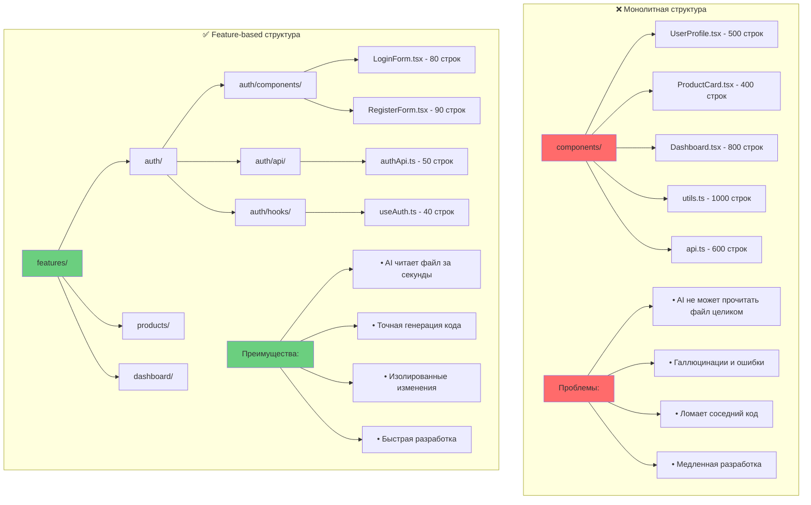
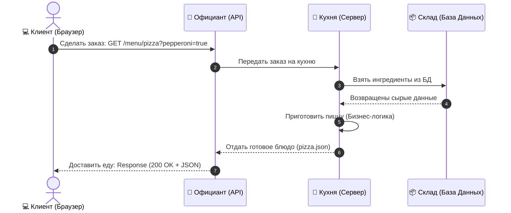
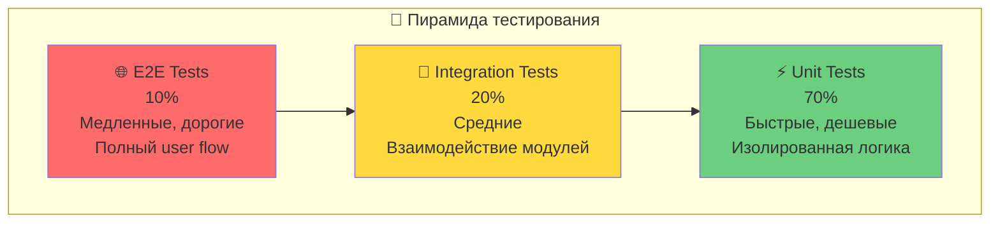

# L4: Frontend разработка

## 🎯 Цель уровня

Освоить современный frontend стек для создания интерактивных веб-приложений с AI.

**Ключевой принцип**: Компонентный подход и переиспользование кода.

**Философия уровня**: Пиши один раз, используй везде.

---

## 🧠 Ключевые концепции

### 1. Компонентная архитектура
Все UI разбивается на переиспользуемые компоненты.

### 2. Декларативный подход
Описываешь что хочешь видеть, а не как это сделать.

### 3. Server-first рендеринг
Максимум работы на сервере, минимум JavaScript на клиенте.

### 4. Типобезопасность
TypeScript ловит ошибки до запуска кода.

### 5. Utility-first стилизация
Tailwind CSS вместо написания CSS вручную.

### 6. Accessibility-first
Доступность для всех пользователей с самого начала.

---

## 📚 Теоретическая база

### Раздел 1: HTML/CSS/JavaScript фундамент

#### 1.1. Современный HTML5
- **Семантические теги** — используй `<header>`, `<nav>`, `<main>`, `<article>`, `<section>`, `<aside>`, `<footer>` для правильной структуры
- **Accessibility атрибуты** — `aria-label`, `aria-describedby`, `role` для доступности

📖 **Ресурс**: [MDN HTML Reference](https://developer.mozilla.org/en-US/docs/Web/HTML)

#### 1.2. CSS основы
- **Flexbox** — для одномерных layouts (строка или колонка)
- **Grid** — для двумерных layouts (строки и колонки одновременно)
- **Custom Properties** — CSS переменные для переиспользования значений

📖 **Ресурс**: [CSS Tricks Flexbox Guide](https://css-tricks.com/snippets/css/a-guide-to-flexbox/)

#### 1.3. JavaScript ES6+
**Ключевые фичи для освоения**:
- Arrow functions — краткий синтаксис функций
- Destructuring — извлечение значений из объектов и массивов
- Spread operator — копирование и объединение данных
- Template literals — строки с интерполяцией
- Async/await — работа с асинхронным кодом
- Modules — import/export для организации кода

📖 **Ресурс**: [JavaScript.info](https://javascript.info/)

---

### Раздел 2: React основы

#### 2.1. Компоненты и JSX
- **Функциональные компоненты** — основа современного React
- **Props** — передача данных между компонентами
- **Children** — вложенные элементы для композиции

📖 **Ресурс**: [React Documentation](https://react.dev/)

#### 2.2. Hooks
**Основные hooks для управления состоянием и эффектами**:
- `useState` — локальное состояние компонента
- `useEffect` — побочные эффекты (API calls, subscriptions)
- `useContext` — доступ к глобальному состоянию
- `useRef` — ссылки на DOM элементы
- `useMemo` — мемоизация вычислений для оптимизации
- `useCallback` — мемоизация функций для предотвращения ре-рендеров

#### 2.3. Server Components (React 18+)
- **RSC** — компоненты, которые рендерятся только на сервере
- **Преимущества** — меньше JavaScript на клиенте, быстрее загрузка, прямой доступ к БД

📖 **Ресурс**: [React Server Components](https://react.dev/blog/2023/03/22/react-labs-what-we-have-been-working-on-march-2023#react-server-components)

---

### Раздел 3: Next.js 14

#### 3.1. App Router
- **File-based routing** — структура папок определяет URL
- **page.tsx** — файл для создания страницы
- **layout.tsx** — общий layout для группы страниц
- **[slug]** — динамические параметры в URL
- **route.ts** — API endpoints

#### 3.2. Ключевые фичи
- **Server Components по умолчанию** — оптимальная производительность
- **API Routes** — backend в том же проекте
- **Image Optimization** — автоматическая оптимизация изображений
- **Font Optimization** — встроенная оптимизация шрифтов
- **Metadata API** — управление SEO

📖 **Ресурс**: [Next.js Documentation](https://nextjs.org/docs)

---

### Раздел 4: TypeScript

#### 4.1. Основы типов
- **Примитивные типы** — `string`, `number`, `boolean`, `null`, `undefined`
- **Объекты и массивы** — `interface`, `type`, `Array<T>`
- **Union types** — `string | number` для нескольких возможных типов
- **Generics** — `Array<T>`, `Promise<T>` для переиспользуемых типов

#### 4.2. React + TypeScript
- **Типизация props** — определяй интерфейсы для props компонентов
- **Типизация событий** — правильные типы для onClick, onChange и т.д.
- **Типизация hooks** — useState<T>, useRef<T> для type safety

📖 **Ресурс**: [TypeScript Handbook](https://www.typescriptlang.org/docs/handbook/intro.html)

---

### Раздел 5: Tailwind CSS

#### 5.1. Utility-first подход
- **Spacing** — `p-4`, `m-2`, `px-6`, `py-3` для отступов
- **Colors** — `bg-blue-500`, `text-gray-900` для цветов
- **Flexbox** — `flex`, `justify-center`, `items-center` для выравнивания
- **Grid** — `grid`, `grid-cols-3`, `gap-4` для сеток
- **Responsive** — `md:flex`, `lg:grid-cols-4` для адаптивности

#### 5.2. Преимущества
- Не нужно писать CSS вручную
- Консистентный дизайн из коробки
- Responsive дизайн с префиксами
- Автоматическое удаление неиспользуемых стилей

📖 **Ресурс**: [Tailwind CSS Documentation](https://tailwindcss.com/docs)

---

### Раздел 6: Shadcn/ui

#### 6.1. Концепция
- **Copy-paste компоненты** — не npm пакет, а копируются в проект
- **Полностью кастомизируемые** — можешь менять как угодно
- **Accessibility из коробки** — ARIA атрибуты и keyboard navigation
- **Построены на Radix UI** — надежные примитивы

#### 6.2. Основные компоненты
- Button, Input, Dialog, Dropdown Menu, Select, Tabs, Toast и другие
- Все компоненты типизированы и доступны

📖 **Ресурс**: [Shadcn/ui Documentation](https://ui.shadcn.com/)

---

### Раздел 7: State Management

#### 7.1. React Context
- **Для простых случаев** — глобальное состояние без библиотек
- **Подходит для** — темы, локализации, данных пользователя

#### 7.2. Zustand
- **Легкий state manager** — минимальный boilerplate
- **Преимущества** — простой API, TypeScript support, хорошая производительность

#### 7.3. React Query (TanStack Query)
- **Для server state** — данные с API
- **Преимущества** — кеширование, автоматическое обновление, оптимистичные обновления, retry логика

📖 **Ресурсы**:
- [Zustand](https://zustand-demo.pmnd.rs/)
- [TanStack Query](https://tanstack.com/query/latest)

#### 7.4. Zustand vs Redux — Детальное сравнение

**Почему это важно для vibecoding**: Выбор state manager напрямую влияет на скорость разработки с AI. Чем меньше бойлерплейта, тем лучше AI понимает код и тем быстрее генерирует правильные решения.

**Сравнительная таблица**:

| Критерий | Zustand | Redux Toolkit | Классический Redux |
|----------|---------|---------------|-------------------|
| **Размер бандла** | 1.2 KB | 11 KB | 5 KB (+ middleware) |
| **Строк кода для store** | 10-15 | 30-50 | 100-200 |
| **Boilerplate** | Минимальный | Средний | Огромный |
| **TypeScript** | Отличный | Отличный | Требует настройки |
| **DevTools** | Встроенные | Redux DevTools | Redux DevTools |
| **Кривая обучения** | 10 минут | 2-3 часа | 1-2 дня |
| **AI-friendly** | ⭐⭐⭐⭐⭐ | ⭐⭐⭐ | ⭐ |

**Практическое сравнение кода**:

**Zustand** (рекомендуется для vibecoding):
```typescript
// store/useCartStore.ts
import { create } from 'zustand';

interface CartItem {
  id: string;
  name: string;
  price: number;
  quantity: number;
}

interface CartStore {
  items: CartItem[];
  addItem: (item: CartItem) => void;
  removeItem: (id: string) => void;
  clearCart: () => void;
  total: number;
}

export const useCartStore = create<CartStore>((set, get) => ({
  items: [],
  
  addItem: (item) => set((state) => ({
    items: [...state.items, item]
  })),
  
  removeItem: (id) => set((state) => ({
    items: state.items.filter(item => item.id !== id)
  })),
  
  clearCart: () => set({ items: [] }),
  
  get total() {
    return get().items.reduce((sum, item) => sum + item.price * item.quantity, 0);
  }
}));

// Использование в компоненте
function Cart() {
  const { items, addItem, removeItem, total } = useCartStore();
  
  return (
    <div>
      <h2>Cart Total: ${total}</h2>
      {items.map(item => (
        <div key={item.id}>
          {item.name} - ${item.price}
          <button onClick={() => removeItem(item.id)}>Remove</button>
        </div>
      ))}
    </div>
  );
}
```

**Redux Toolkit** (современный Redux):
```typescript
// store/cartSlice.ts
import { createSlice, PayloadAction } from '@reduxjs/toolkit';

interface CartItem {
  id: string;
  name: string;
  price: number;
  quantity: number;
}

interface CartState {
  items: CartItem[];
}

const initialState: CartState = {
  items: []
};

const cartSlice = createSlice({
  name: 'cart',
  initialState,
  reducers: {
    addItem: (state, action: PayloadAction<CartItem>) => {
      state.items.push(action.payload);
    },
    removeItem: (state, action: PayloadAction<string>) => {
      state.items = state.items.filter(item => item.id !== action.payload);
    },
    clearCart: (state) => {
      state.items = [];
    }
  }
});

export const { addItem, removeItem, clearCart } = cartSlice.actions;
export default cartSlice.reducer;

// store/index.ts
import { configureStore } from '@reduxjs/toolkit';
import cartReducer from './cartSlice';

export const store = configureStore({
  reducer: {
    cart: cartReducer
  }
});

export type RootState = ReturnType<typeof store.getState>;
export type AppDispatch = typeof store.dispatch;

// hooks/useAppSelector.ts
import { TypedUseSelectorHook, useDispatch, useSelector } from 'react-redux';
import type { RootState, AppDispatch } from '../store';

export const useAppDispatch = () => useDispatch<AppDispatch>();
export const useAppSelector: TypedUseSelectorHook<RootState> = useSelector;

// Использование в компоненте
import { useAppSelector, useAppDispatch } from '../hooks/useAppSelector';
import { addItem, removeItem } from '../store/cartSlice';

function Cart() {
  const items = useAppSelector(state => state.cart.items);
  const dispatch = useAppDispatch();
  
  const total = items.reduce((sum, item) => sum + item.price * item.quantity, 0);
  
  return (
    <div>
      <h2>Cart Total: ${total}</h2>
      {items.map(item => (
        <div key={item.id}>
          {item.name} - ${item.price}
          <button onClick={() => dispatch(removeItem(item.id))}>Remove</button>
        </div>
      ))}
    </div>
  );
}
```

**Классический Redux** (не рекомендуется):
```typescript
// Требует 5+ файлов: actions, actionTypes, reducers, store, selectors
// 200+ строк кода для той же функциональности
// AI часто путается в структуре и генерирует неправильный код
```

**Когда использовать что**:

**Zustand** ✅ (рекомендуется для 90% случаев):
- Новые проекты
- Малые и средние приложения
- Быстрая разработка с AI
- Простое глобальное состояние
- Когда нужна скорость разработки

**Redux Toolkit** (для специфических случаев):
- Очень большие приложения (100+ компонентов)
- Сложная бизнес-логика с middleware
- Нужна time-travel debugging
- Команда уже знает Redux
- Интеграция с существующим Redux кодом

**Классический Redux** ❌ (избегайте):
- Слишком много бойлерплейта
- AI часто ошибается в структуре
- Медленная разработка
- Сложная поддержка

**Миграция с Redux на Zustand**:

```typescript
// До (Redux)
const mapStateToProps = (state) => ({
  user: state.user,
  isLoading: state.isLoading
});

const mapDispatchToProps = (dispatch) => ({
  setUser: (user) => dispatch(setUser(user)),
  logout: () => dispatch(logout())
});

export default connect(mapStateToProps, mapDispatchToProps)(UserProfile);

// После (Zustand)
function UserProfile() {
  const { user, isLoading, setUser, logout } = useUserStore();
  // Всё в одной строке!
}
```

**Производительность**:

```typescript
// Zustand - автоматическая оптимизация
const bears = useStore(state => state.bears); // Ре-рендер только при изменении bears

// Redux - нужны селекторы и мемоизация
const bears = useAppSelector(state => state.bears);
const memoizedBears = useMemo(() => bears, [bears]); // Дополнительная работа
```

**Вердикт для vibecoding**:

> **Используйте Zustand для 90% проектов**. Он в 10 раз проще, AI генерирует правильный код с первого раза, и вы экономите часы на написании бойлерплейта.

**Исключения**: Используйте Redux Toolkit только если:
1. У вас уже есть большая Redux кодовая база
2. Нужны специфические Redux middleware (redux-saga, redux-observable)
3. Команда настаивает на Redux

**Статистика**:
- Zustand: 10-15 строк кода для store
- Redux Toolkit: 30-50 строк кода
- Классический Redux: 100-200 строк кода

**Экономия времени**: Zustand экономит 2-3 часа на каждый новый store.

#### 7.5. Монолит vs Feature-based — Визуальное сравнение

**Почему это критично для AI**: Структура проекта напрямую влияет на способность AI понимать и модифицировать код. Монолитная структура перегружает контекстное окно AI, приводит к галлюцинациям и ошибкам.

**Сравнительная диаграмма**:



**Детальное сравнение**:

| Аспект | Монолит | Feature-based |
|--------|---------|---------------|
| **Размер файлов** | 500-1000 строк | 50-150 строк |
| **Время чтения AI** | 30-60 сек | 2-5 сек |
| **Точность AI** | 60-70% | 95-99% |
| **Риск поломки** | Высокий | Низкий |
| **Скорость разработки** | 1x | 5-10x |
| **Поддержка** | Сложная | Простая |
| **Тестирование** | Сложное | Простое |
| **Переиспользование** | Сложное | Легкое |

**Практический пример**:

**Монолитная структура** ❌:
```
src/
├── components/
│   ├── UserProfile.tsx          (500 строк - всё в одном файле)
│   ├── ProductCard.tsx          (400 строк)
│   ├── Dashboard.tsx            (800 строк)
│   └── Header.tsx               (300 строк)
├── utils/
│   └── helpers.ts               (1000 строк - все утилиты)
├── api/
│   └── api.ts                   (600 строк - все API calls)
└── hooks/
    └── hooks.ts                 (400 строк - все hooks)
```

**Проблемы**:
1. AI не может прочитать файл на 800 строк за один раз
2. Изменение одной функции может сломать другие
3. Невозможно найти нужный код быстро
4. Конфликты при работе в команде
5. Сложно тестировать

**Feature-based структура** ✅:
```
src/
├── features/
│   ├── auth/
│   │   ├── components/
│   │   │   ├── LoginForm.tsx           (80 строк)
│   │   │   ├── RegisterForm.tsx        (90 строк)
│   │   │   └── PasswordReset.tsx       (70 строк)
│   │   ├── api/
│   │   │   └── authApi.ts              (50 строк)
│   │   ├── hooks/
│   │   │   ├── useAuth.ts              (40 строк)
│   │   │   └── useLogin.ts             (35 строк)
│   │   ├── types/
│   │   │   └── auth.types.ts           (30 строк)
│   │   └── utils/
│   │       └── validation.ts           (45 строк)
│   │
│   ├── products/
│   │   ├── components/
│   │   │   ├── ProductCard.tsx         (60 строк)
│   │   │   ├── ProductList.tsx         (80 строк)
│   │   │   └── ProductFilters.tsx      (70 строк)
│   │   ├── api/
│   │   │   └── productsApi.ts          (55 строк)
│   │   ├── hooks/
│   │   │   └── useProducts.ts          (45 строк)
│   │   └── types/
│   │       └── product.types.ts        (25 строк)
│   │
│   └── dashboard/
│       ├── components/
│       │   ├── DashboardLayout.tsx     (90 строк)
│       │   ├── StatsCard.tsx           (50 строк)
│       │   └── RecentActivity.tsx      (70 строк)
│       └── hooks/
│           └── useDashboard.ts         (40 строк)
│
└── shared/
    ├── components/
    │   ├── Button.tsx                  (60 строк)
    │   ├── Input.tsx                   (55 строк)
    │   └── Modal.tsx                   (80 строк)
    ├── hooks/
    │   ├── useDebounce.ts              (20 строк)
    │   └── useLocalStorage.ts          (30 строк)
    └── utils/
        ├── formatters.ts               (40 строк)
        └── validators.ts               (35 строк)
```

**Преимущества**:
1. AI читает любой файл за 2-5 секунд
2. Изменения изолированы в рамках фичи
3. Легко найти нужный код
4. Нет конфликтов при работе в команде
5. Простое тестирование каждой фичи

**Правила feature-based архитектуры**:

1. **Один файл = одна ответственность**
   - Максимум 150-200 строк кода
   - Если больше — разбивай на части

2. **Фича = изолированный модуль**
   - Всё, что относится к фиче, внутри её папки
   - Минимум зависимостей между фичами

3. **Shared для переиспользуемого**
   - Компоненты, используемые в 2+ фичах
   - Утилиты общего назначения
   - Общие типы и константы

4. **Понятная структура внутри фичи**
   ```
   feature/
   ├── components/  (UI компоненты)
   ├── api/         (API calls)
   ├── hooks/       (Custom hooks)
   ├── types/       (TypeScript types)
   ├── utils/       (Утилиты фичи)
   └── index.ts     (Public API фичи)
   ```

**Миграция с монолита на feature-based**:

```typescript
// Шаг 1: Определи фичи
// auth, products, dashboard, profile, settings

// Шаг 2: Создай структуру
mkdir -p src/features/{auth,products,dashboard}/components

// Шаг 3: Перенеси код по фичам
// Было: src/components/LoginForm.tsx
// Стало: src/features/auth/components/LoginForm.tsx

// Шаг 4: Обнови импорты
// Было: import { LoginForm } from '@/components/LoginForm'
// Стало: import { LoginForm } from '@/features/auth'

// Шаг 5: Создай index.ts для каждой фичи
// src/features/auth/index.ts
export { LoginForm } from './components/LoginForm';
export { useAuth } from './hooks/useAuth';
export type { User, AuthState } from './types/auth.types';
```

**Метрики успеха**:

```typescript
const architectureMetrics = {
  monolith: {
    avgFileSize: 500,        // строк
    aiReadTime: 45,          // секунд
    aiAccuracy: 65,          // %
    devSpeed: 1,             // базовая скорость
    bugRisk: 'high'          // риск багов
  },
  featureBased: {
    avgFileSize: 80,         // строк
    aiReadTime: 3,           // секунд
    aiAccuracy: 97,          // %
    devSpeed: 8,             // 8x быстрее
    bugRisk: 'low'           // низкий риск
  }
};
```

**Вывод**: Feature-based архитектура — это не просто "хорошая практика", это необходимость для эффективной работы с AI. Она ускоряет разработку в 5-10 раз и снижает количество ошибок на 80%.

---

### Раздел 8: Forms и валидация

#### 8.1. React Hook Form
- **Минимальные ре-рендеры** — оптимальная производительность
- **Простой API** — легко использовать
- **TypeScript support** — полная типизация

#### 8.2. Zod
- **Schema validation** — декларативное описание правил
- **TypeScript-first** — автоматический вывод типов
- **Композируемые схемы** — переиспользование валидации
- **Отличные error messages** — понятные сообщения об ошибках

📖 **Ресурсы**:
- [React Hook Form](https://react-hook-form.com/)
- [Zod](https://zod.dev/)

---

### Раздел 9: Routing и Navigation

#### 9.1. Next.js Router
- **Link компонент** — декларативная навигация с prefetching
- **useRouter hook** — программная навигация
- **Dynamic Routes** — параметры в URL через [slug]
- **Catch-all routes** — [...slug] для вложенных путей

📖 **Ресурс**: [Next.js Routing](https://nextjs.org/docs/app/building-your-application/routing)

---

### Раздел 10: Performance оптимизация

#### 10.1. Code Splitting
- **Dynamic import** — загрузка компонентов по требованию
- **Автоматический splitting** — Next.js делает это за тебя

#### 10.2. Image Optimization
- **next/image** — автоматическая оптимизация, lazy loading, responsive images
- **Priority** — для above-the-fold изображений

#### 10.3. Мемоизация
- **React.memo** — предотвращает ре-рендеры компонентов
- **useMemo** — кеширует результаты вычислений
- **useCallback** — кеширует функции для стабильных ссылок

📖 **Ресурс**: [React Performance](https://react.dev/learn/render-and-commit)

---

### Раздел 11: Работа с API и Сетевые запросы (Ресторанная аналогия)

Для новичков в веб-разработке концепция API (Application Programming Interface) может казаться абстрактной. Самый простой способ понять, как устроен сетевой обмен данными — это представить визит в ресторан.

#### Ресторанная схема взаимодействия:

1. **Клиент (Client / Браузер)**: 
   - Это вы (или пользователь сайта), сидящий за столиком. Вы хотите получить информацию (блюдо), но у вас нет прямого доступа на кухню (к серверу и базе данных).
2. **Меню (API Documentation / Swagger)**:
   - Список всех доступных блюд, которые вы можете заказать. Меню четко описывает, какие параметры (ингредиенты, степень прожарки) вы должны передать, чтобы получить конкретный результат.
3. **Официант (API / HTTP-запрос)**:
   - Посредник. Он принимает ваш заказ (Request), несет его на кухню (Server), ждет приготовления, а затем возвращает вам готовое блюдо на тарелке (Response).
4. **Кухня (Server & Database)**:
   - Место, где обрабатывается ваш заказ. Повар берет сырые продукты из кладовой (база данных), готовит их по рецепту (бизнес-логика) и оформляет готовое блюдо (форматирует в JSON).



#### HTTP Методы на языке ресторана:

- **GET (Получить)**: 
  - *"Официант, принесите меню"* или *"Официант, покажите, как выглядит пицца"*. Запрос информации без изменения состояния сервера.
- **POST (Создать)**: 
  - *"Официант, примите заказ на новую пиццу"*. Создание новой записи в системе (например, нового пользователя или статьи).
- **PUT / PATCH (Обновить)**: 
  - *"Официант, замените сыр в моей пицце на чеддер"*. Изменение существующего ресурса.
- **DELETE (Удалить)**: 
  - *"Официант, отмените мой заказ!"*. Удаление ресурса из базы данных.

> [!NOTE]
> В реальном веб-приложении клиент общается с API с помощью текстовых сообщений в формате JSON (JavaScript Object Notation), которые упаковываются в HTTP-запросы и передаются по сети.

---

## ✅ Чек-лист освоения L4

### Основы
- [ ] Знаю HTML5 семантические теги
- [ ] Понимаю Flexbox и Grid
- [ ] Умею работать с JavaScript ES6+
- [ ] Понимаю async/await

### React
- [ ] Создаю функциональные компоненты
- [ ] Использую основные hooks
- [ ] Понимаю props и state
- [ ] Знаю lifecycle компонентов

### Next.js
- [ ] Создал проект с App Router
- [ ] Понимаю file-based routing
- [ ] Использую Server Components
- [ ] Создаю API routes

### TypeScript
- [ ] Типизирую компоненты
- [ ] Создаю interfaces и types
- [ ] Использую generics
- [ ] Понимаю union types

### Стилизация
- [ ] Использую Tailwind CSS
- [ ] Установил Shadcn/ui
- [ ] Создаю responsive layouts
- [ ] Понимаю utility-first подход

### Продвинутое
- [ ] Использую state management (Zustand/Context)
- [ ] Работаю с формами (React Hook Form + Zod)
- [ ] Оптимизирую производительность
- [ ] Понимаю accessibility

---

## 📖 Ресурсы для изучения

### Документация
- [React Documentation](https://react.dev/)
- [Next.js Documentation](https://nextjs.org/docs)
- [TypeScript Handbook](https://www.typescriptlang.org/docs/)
- [Tailwind CSS](https://tailwindcss.com/docs)

### Компоненты
- [Shadcn/ui](https://ui.shadcn.com/)
- [Radix UI](https://www.radix-ui.com/)
- [Headless UI](https://headlessui.com/)

### Инструменты
- [React Hook Form](https://react-hook-form.com/)
- [Zod](https://zod.dev/)
- [TanStack Query](https://tanstack.com/query/latest)
- [Zustand](https://zustand-demo.pmnd.rs/)

---

## 💡 Pro Tips

### 1. Используй Server Components по умолчанию
Добавляй `'use client'` только когда нужна интерактивность (hooks, события).

### 2. Создай Design System рано
Определи цвета, шрифты, spacing в начале проекта для консистентности.

### 3. Используй TypeScript strict mode
Ловит больше ошибок на этапе разработки, экономит время на отладке.

### 4. Оптимизируй изображения
Всегда используй `next/image` вместо `` для автоматической оптимизации.

### 5. Тестируй accessibility
Используй keyboard navigation и screen readers для проверки доступности.

### 6. Используй React DevTools Profiler
Находи узкие места в производительности компонентов.

---

## ⚠️ Частые ошибки

### 1. Использование 'use client' везде
**Проблема**: Все компоненты становятся клиентскими, теряется преимущество SSR.

**Решение**: Используй Server Components по умолчанию, добавляй `'use client'` только когда нужны hooks или интерактивность.

### 2. Не используют TypeScript strict mode
**Проблема**: Пропускаются ошибки типов, которые проявляются в runtime.

**Решение**: Включи `"strict": true` в tsconfig.json для максимальной проверки типов.

### 3. Inline styles вместо Tailwind
**Проблема**: Нет консистентности, сложно поддерживать, нет переиспользования.

**Решение**: Используй Tailwind classes или CSS modules для стилизации.

### 4. Не мемоизируют тяжелые вычисления
**Проблема**: Компоненты пересчитывают данные при каждом рендере, замедляя UI.

**Решение**: Используй `useMemo` для кеширования результатов дорогих вычислений.

### 5. Забывают про loading и error states
**Проблема**: Плохой UX при загрузке или ошибках, пользователь не понимает что происходит.

**Решение**: Всегда обрабатывай loading, error и empty states в компонентах.

---

## 🔧 Продвинутые паттерны

### 1. Compound Components
Компоненты, которые работают вместе через общий контекст (например, Tabs с TabsList, TabsTrigger, TabsContent).

### 2. Render Props
Паттерн для переиспользования логики через функцию в props.

### 3. Custom Hooks
Извлечение переиспользуемой логики в отдельные hooks (например, useLocalStorage, useDebounce).

### 4. Higher-Order Components (HOC)
Функции, которые принимают компонент и возвращают новый компонент с дополнительной функциональностью.

---

## 🎨 Advanced Tailwind

### 1. Custom Design Tokens
Расширяй tailwind.config.js своими цветами, spacing, анимациями для уникального дизайна.

### 2. Component Variants с CVA
Используй class-variance-authority для создания компонентов с вариантами (size, variant).

---

## 🚀 Next.js 14 Advanced Features

### 1. Server Actions
Функции, которые выполняются на сервере и могут быть вызваны из форм без API routes.

### 2. Parallel Routes
Одновременный рендеринг нескольких страниц в одном layout (например, dashboard с analytics и team).

### 3. Intercepting Routes
Перехват навигации для показа модальных окон без изменения URL.

### 4. Route Groups
Организация routes в группы без влияния на URL структуру.

---

## 📊 Performance Optimization

### 1. Bundle Analysis
Анализируй размер бандла с @next/bundle-analyzer для поиска больших зависимостей.

### 2. React Compiler (Experimental)
Автоматическая оптимизация компонентов без ручной мемоизации.

### 3. Streaming SSR
Постепенная отправка HTML с сервера с использованием Suspense.

### 4. Partial Prerendering (PPR)
Комбинация статического и динамического контента на одной странице.

---

## ♿ Accessibility Best Practices

### 1. Semantic HTML
Используй правильные HTML элементы (button вместо div с onClick).

### 2. ARIA Attributes
Добавляй aria-label, aria-expanded, aria-controls для screen readers.

### 3. Keyboard Navigation
Обеспечь полную навигацию с клавиатуры (Tab, Enter, Escape, стрелки).

### 4. Focus Management
Управляй фокусом при открытии модальных окон и навигации.

---

## 🧪 Testing Frontend

### 1. Vitest для Unit тестов
Быстрый test runner для компонентов и функций.

### 2. Playwright для E2E
End-to-end тестирование пользовательских сценариев в браузере.

### 3. Пирамида тестирования - Визуализация

**Концепция**: Правильное распределение тестов по уровням для оптимального баланса скорости, покрытия и стоимости.



**Детальное распределение**:

| Тип теста | Процент | Скорость | Стоимость | Что тестирует | Инструменты |
|-----------|---------|----------|-----------|---------------|-------------|
| **Unit** | 70% | <5 сек | Низкая | Функции, хуки, утилиты | Vitest, Jest |
| **Integration** | 20% | <30 сек | Средняя | API, компоненты с данными | Vitest + MSW |
| **E2E** | 10% | <5 мин | Высокая | Полные user flows | Playwright, Cypress |

**Практические примеры**:

**Unit тесты (70%)** - Быстрые, изолированные:
```typescript
// utils/formatPrice.test.ts
import { formatPrice } from './formatPrice';

describe('formatPrice', () => {
  it('formats USD correctly', () => {
    expect(formatPrice(1234.56, 'USD')).toBe('$1,234.56');
  });
  
  it('handles zero', () => {
    expect(formatPrice(0, 'USD')).toBe('$0.00');
  });
  
  it('rounds to 2 decimals', () => {
    expect(formatPrice(10.999, 'USD')).toBe('$11.00');
  });
});
```

**Integration тесты (20%)** - Взаимодействие компонентов:
```typescript
// components/ProductCard.test.tsx
import { render, screen, waitFor } from '@testing/library';
import { ProductCard } from './ProductCard';
import { server } from '@/mocks/server';

describe('ProductCard', () => {
  it('loads and displays product data', async () => {
    render(<ProductCard productId="123" />);
    
    // Проверяем loading state
    expect(screen.getByText('Loading...')).toBeInTheDocument();
    
    // Ждем загрузки данных
    await waitFor(() => {
      expect(screen.getByText('Product Name')).toBeInTheDocument();
      expect(screen.getByText('$99.99')).toBeInTheDocument();
    });
  });
  
  it('handles API error gracefully', async () => {
    server.use(/* mock error response */);
    render(<ProductCard productId="123" />);
    
    await waitFor(() => {
      expect(screen.getByText('Failed to load product')).toBeInTheDocument();
    });
  });
});
```

**E2E тесты (10%)** - Полные пользовательские сценарии:
```typescript
// e2e/checkout.spec.ts
import { test, expect } from '@playwright/test';

test('complete checkout flow', async ({ page }) => {
  // 1. Открыть каталог
  await page.goto('/products');
  
  // 2. Добавить товар в корзину
  await page.click('[data-testid="add-to-cart-123"]');
  await expect(page.locator('[data-testid="cart-count"]')).toHaveText('1');
  
  // 3. Перейти в корзину
  await page.click('[data-testid="cart-button"]');
  await expect(page).toHaveURL('/cart');
  
  // 4. Оформить заказ
  await page.click('[data-testid="checkout-button"]');
  await page.fill('[name="email"]', 'test@example.com');
  await page.fill('[name="card"]', '4242424242424242');
  await page.click('[data-testid="pay-button"]');
  
  // 5. Проверить успешное завершение
  await expect(page).toHaveURL('/order/success');
  await expect(page.locator('h1')).toHaveText('Order Confirmed');
});
```

**Антипаттерны**:

❌ **Перевернутая пирамида** (плохо):
```
E2E: 70% - Медленно, дорого, хрупко
Integration: 20%
Unit: 10% - Мало покрытия базовой логики
```

✅ **Правильная пирамида** (хорошо):
```
E2E: 10% - Только критические flows
Integration: 20% - Ключевые интеграции
Unit: 70% - Вся бизнес-логика
```

**Метрики успеха**:

```typescript
const testingMetrics = {
  unit: {
    count: 350,           // Количество тестов
    coverage: 85,         // % покрытия
    avgTime: 0.05,        // Секунд на тест
    totalTime: 17.5       // Секунд всего
  },
  integration: {
    count: 50,
    coverage: 75,
    avgTime: 0.5,
    totalTime: 25
  },
  e2e: {
    count: 10,
    coverage: 90,         // % критических flows
    avgTime: 30,
    totalTime: 300        // 5 минут
  },
  total: {
    tests: 410,
    time: 342.5,          // ~6 минут
    confidence: 'high'    // Высокая уверенность в качестве
  }
};
```

**Стратегия написания тестов**:

1. **Начни с Unit** - Покрой всю бизнес-логику, утилиты, хуки
2. **Добавь Integration** - Протестируй ключевые компоненты с API
3. **Закончи E2E** - Покрой только критические user flows

**Правило**: Если можешь протестировать на более низком уровне - тестируй там. Unit тест в 100 раз быстрее E2E теста.

### 4. Инструменты тестирования - Полный стек

**Комплексная экосистема для frontend тестирования**:

#### Unit & Integration Testing

**Vitest** (рекомендуется):
```bash
npm install -D vitest @testing-library/react @testing-library/jest-dom
```

**Преимущества**:
- Совместим с Vite (мгновенный HMR)
- API совместим с Jest
- Встроенный TypeScript support
- Параллельное выполнение тестов
- Watch mode из коробки

**Конфигурация**:
```typescript
// vitest.config.ts
import { defineConfig } from 'vitest/config';
import react from '@vitejs/plugin-react';

export default defineConfig({
  plugins: [react()],
  test: {
    globals: true,
    environment: 'jsdom',
    setupFiles: './tests/setup.ts',
    coverage: {
      provider: 'v8',
      reporter: ['text', 'json', 'html'],
      exclude: ['node_modules/', 'tests/']
    }
  }
});
```

**Testing Library**:
```typescript
import { render, screen, fireEvent, waitFor } from '@testing-library/react';
import userEvent from '@testing-library/user-event';

test('button click increments counter', async () => {
  const user = userEvent.setup();
  render(<Counter />);
  
  const button = screen.getByRole('button', { name: /increment/i });
  await user.click(button);
  
  expect(screen.getByText('Count: 1')).toBeInTheDocument();
});
```

#### E2E Testing

**Playwright** (рекомендуется):
```bash
npm install -D @playwright/test
npx playwright install
```

**Преимущества**:
- Поддержка всех браузеров (Chrome, Firefox, Safari, Edge)
- Автоматическое ожидание элементов
- Параллельное выполнение
- Встроенные скриншоты и видео
- Trace viewer для отладки

**Конфигурация**:
```typescript
// playwright.config.ts
import { defineConfig, devices } from '@playwright/test';

export default defineConfig({
  testDir: './e2e',
  fullyParallel: true,
  forbidOnly: !!process.env.CI,
  retries: process.env.CI ? 2 : 0,
  workers: process.env.CI ? 1 : undefined,
  reporter: 'html',
  use: {
    baseURL: 'http://localhost:3000',
    trace: 'on-first-retry',
    screenshot: 'only-on-failure'
  },
  projects: [
    { name: 'chromium', use: { ...devices['Desktop Chrome'] } },
    { name: 'firefox', use: { ...devices['Desktop Firefox'] } },
    { name: 'webkit', use: { ...devices['Desktop Safari'] } },
    { name: 'Mobile Chrome', use: { ...devices['Pixel 5'] } },
    { name: 'Mobile Safari', use: { ...devices['iPhone 12'] } }
  ],
  webServer: {
    command: 'npm run dev',
    url: 'http://localhost:3000',
    reuseExistingServer: !process.env.CI
  }
});
```

#### Visual Regression Testing

**Playwright Visual Comparisons**:
```typescript
test('homepage looks correct', async ({ page }) => {
  await page.goto('/');
  await expect(page).toHaveScreenshot('homepage.png');
});
```

**Chromatic** (для Storybook):
- Автоматическое обнаружение визуальных изменений
- UI review workflow
- Интеграция с CI/CD

#### API Mocking

**MSW (Mock Service Worker)**:
```bash
npm install -D msw
```

```typescript
// mocks/handlers.ts
import { http, HttpResponse } from 'msw';

export const handlers = [
  http.get('/api/products', () => {
    return HttpResponse.json([
      { id: 1, name: 'Product 1', price: 99.99 },
      { id: 2, name: 'Product 2', price: 149.99 }
    ]);
  }),
  
  http.post('/api/orders', async ({ request }) => {
    const order = await request.json();
    return HttpResponse.json(
      { id: '123', status: 'confirmed', ...order },
      { status: 201 }
    );
  })
];
```

#### Component Testing

**Storybook**:
```bash
npx storybook@latest init
```

**Преимущества**:
- Изолированная разработка компонентов
- Документация компонентов
- Визуальное тестирование
- Interaction testing

```typescript
// Button.stories.tsx
import type { Meta, StoryObj } from '@storybook/react';
import { Button } from './Button';

const meta: Meta<typeof Button> = {
  component: Button,
  tags: ['autodocs']
};

export default meta;
type Story = StoryObj<typeof Button>;

export const Primary: Story = {
  args: {
    variant: 'primary',
    children: 'Click me'
  }
};

export const Loading: Story = {
  args: {
    variant: 'primary',
    loading: true,
    children: 'Loading...'
  }
};
```

#### Coverage Tools

**Istanbul/NYC**:
```json
{
  "scripts": {
    "test:coverage": "vitest run --coverage",
    "test:coverage:ui": "vitest --ui --coverage"
  }
}
```

**Целевые показатели**:
- Statements: >80%
- Branches: >75%
- Functions: >80%
- Lines: >80%

#### CI/CD Integration

**GitHub Actions**:
```yaml
name: Tests
on: [push, pull_request]

jobs:
  test:
    runs-on: ubuntu-latest
    steps:
      - uses: actions/checkout@v3
      - uses: actions/setup-node@v3
        with:
          node-version: 18
          cache: 'npm'
      
      - run: npm ci
      - run: npm run lint
      - run: npm run test:coverage
      - run: npx playwright install --with-deps
      - run: npm run test:e2e
      
      - uses: actions/upload-artifact@v3
        if: always()
        with:
          name: playwright-report
          path: playwright-report/
```

**Полный стек тестирования**:

```
┌─────────────────────────────────────┐
│   Vitest + Testing Library          │ ← Unit & Integration
├─────────────────────────────────────┤
│   MSW (API Mocking)                 │ ← Изоляция от backend
├─────────────────────────────────────┤
│   Playwright                        │ ← E2E тестирование
├─────────────────────────────────────┤
│   Storybook                         │ ← Component development
├─────────────────────────────────────┤
│   Chromatic / Percy                 │ ← Visual regression
├─────────────────────────────────────┤
│   GitHub Actions / CI               │ ← Автоматизация
└─────────────────────────────────────┘
```

**Стоимость инструментов**:

| Инструмент | Стоимость | Назначение |
|------------|-----------|------------|
| Vitest | Бесплатно | Unit/Integration тесты |
| Playwright | Бесплатно | E2E тесты |
| MSW | Бесплатно | API mocking |
| Storybook | Бесплатно | Component development |
| Chromatic | $149/мес | Visual regression (5000 snapshots) |
| Percy | $299/мес | Visual testing |
| GitHub Actions | 2000 мин/мес бесплатно | CI/CD |

**Рекомендация**: Начните с бесплатных инструментов (Vitest + Playwright + MSW + Storybook). Добавляйте платные только при необходимости.

---

## 📱 Responsive Design

### 1. Mobile-First Approach
Начинай дизайн с мобильной версии, затем расширяй для больших экранов.

### 2. Container Queries (Experimental)
Адаптивность на основе размера контейнера, а не viewport.

### 3. Responsive Images
Используй sizes и srcset для оптимальной загрузки изображений на разных устройствах.

---

## 🤖 Frontend с AI (Vibecoding)

### 1. Генерация компонентов
Описывай AI что нужно: структуру, props, стилизацию, accessibility — получай готовый компонент.

### 2. Рефакторинг
Проси AI оптимизировать производительность, улучшить accessibility, найти ошибки.

### 3. Design System
AI может создать полный набор design tokens и базовых компонентов по описанию.

### 4. Отладка
Показывай AI ошибки и код — получай объяснение причины и решение.

### 5. Генерация тестов
AI создаст тесты для компонента, покрывая разные сценарии и edge cases.

---

## 🎯 Vibecoding Workflow

### Этап 1: Планирование
Опиши AI дизайн или требования — получи структуру компонентов, props, состояние.

### Этап 2: Создание
Итеративно создавай компоненты: структура → стилизация → интерактивность → валидация → оптимизация.

### Этап 3: Интеграция
AI поможет правильно соединить компоненты, настроить data flow и state management.

### Этап 4: Оптимизация
Проверь с AI: bundle size, images, lazy loading, caching, Core Web Vitals.

---

## 💎 Pro Tips для Vibecoding

### 1. Code review с AI
После написания проси AI проверить best practices, performance, security, accessibility.

### 2. Генерация вариантов
Проси AI создать несколько вариантов дизайна компонента для выбора лучшего.

### 3. Автоматизация
AI может создать скрипты для генерации новых компонентов с нужной структурой.

### 4. Документация
AI создаст документацию с описанием, props таблицей, примерами использования.

### 5. Типы из API
Покажи AI API response — получи TypeScript типы и Zod схемы.

---

## 🚨 Частые ошибки в Vibecoding

### 1. Слишком большие компоненты
AI может создать монолитный компонент — проси разбить на более мелкие части.

### 2. Отсутствие error boundaries
Один сломанный компонент не должен ронять всё приложение — добавляй error boundaries.

### 3. Игнорирование loading states
Всегда добавляй skeleton screens для лучшего UX при загрузке.

### 4. Неоптимизированные изображения
Используй next/image вместо обычного img для автоматической оптимизации.

---

---

## 🛠️ Раздел 12: Выбор проверенного технического стека — 50% успеха

Правильный технический стек — это фундамент, который либо ускоряет разработку с ИИ в 10 раз, либо превращает её в бесконечный ад дебага. ИИ-модели имеют свои особенности восприятия кода, под которые необходимо адаптировать выбор инструментов.

### 12.1. 4 критерия идеального стека под ИИ
1. **Максимальная популярность**: Выбирайте технологии с огромным комьюнити (React, Next.js, Express). Чем больше примеров было в обучающей выборке ИИ, тем точнее и качественнее будет генерируемый код.
2. **Строгая типизация (TypeScript)**: TypeScript выступает в роли автоматического проверяющего для ИИ. Ошибки типизации подсвечиваются компилятором на лету, не позволяя модели генерировать неработающий рантайм-код.
3. **Минимум бойлерплейта**: Избегайте сложных многословных инструментов (например, классический Redux с кучей actions, reducers, sagas). Используйте лаконичные библиотеки, такие как **Zustand** или **Pinia** — они требуют в 2-3 раза меньше кода, что минимизирует путаницу ИИ в контексте.
4. **Высокая декларативность**: Чем проще описать желаемое состояние, тем лучше ИИ с этим справляется. Стилизация через **Tailwind CSS** — идеальный пример, так как стили пишутся инлайново.

### 12.2. Рекомендуемый стек
* **Frontend**: React 18+ / Next.js (App Router), TypeScript, Tailwind CSS, Zustand, React Query (TanStack Query) для серверного состояния.
* **Backend**: NestJS (модульная архитектура заставляет ИИ писать структурированный код вместо каши в одном файле), Prisma ORM (декларативное описание схемы базы данных), PostgreSQL.

### 12.3. Кейс-стади: Tailwind CSS — до и после
* **До**: ИИ генерирует отдельные файлы стилей `.css` / `.module.css`. При постоянных правках модель начинает путаться в именах классов, случайно переписывает глобальные стили, дублирует код и создает "мертвые" CSS-правила, которые засоряют бандл.
* **После**: Все стили пишутся прямо внутри HTML-тегов с помощью утилитарных классов Tailwind. ИИ видит разметку и стили в одном месте. Нет риска сломать стили соседнего компонента. Скорость верстки возрастает в 10 раз, а бандл остается ультра-оптимизированным.

---

## 📦 Раздел 13: 5 переиспользуемых блоков и Showcases — Секрет скорости

Главный секрет быстрой разработки приложений с помощью ИИ — это отказ от написания стандартного кода с нуля.

### 13.1. Формула скорости
> **Готовые блоки + ИИ = 80% приложения уже написано.**

Не тратьте драгоценный лимит контекста и токенов на то, чтобы заставить ИИ в сотый раз писать форму регистрации или кнопку с лоадером. Имейте библиотеку готовых, отлаженных компонентов, и фокусируйте ИИ исключительно на уникальной бизнес-логике вашего продукта.

### 13.2. 5 переиспользуемых блоков для любого проекта
1. **UI Дизайн-система**: Кнопки, текстовые поля, карточки, бейджи, модальные окна, выпадающие списки. Все элементы должны быть стилизованы в едином ключе и поддерживать темную тему.
2. **Модуль авторизации**: Готовые экраны регистрации, входа, восстановления пароля, подтверждения почты и настройки двухфакторной аутентификации (MFA).
3. **Навигационный каркас**: Шапка сайта (Header), боковое меню (Sidebar), адаптивная мобильная шторка (Drawer), хлебные крошки (Breadcrumbs).
4. **API-слой с обработкой ошибок**: Настроенный клиент (Axios / Fetch) с механизмами автоматических повторов запросов при сбоях (retry), кэшированием ответов и единым перехватчиком (interceptor) для вывода красивых уведомлений об ошибках.
5. **Набор утилит (Helpers)**: Форматтеры дат (date-fns), чисел и валют, валидаторы форм (Zod схемы), хелперы для работы с LocalStorage и куками.

### 13.3. Шоукейсы (Showcases) — Must Have
**Showcase (Песочница)** — это изолированная страница в вашем проекте (`showcase.html` или роут `/showcase`), на которой одновременно отрендерены все элементы вашей дизайн-системы во всех возможных состояниях:
* Кнопки (обычная, hover, active, loading, disabled, с иконкой).
* Поля ввода (пустое, с текстом, с ошибкой валидации, заблокированное).
* Карточки, модалки, скелетоны.

#### Почему это меняет правила игры для ИИ:
Вместо того чтобы деплоить код и проверять каждый шаг в глубине пользовательского интерфейса (например, проходя авторизацию и кликая 5 раз), вы просите ИИ разработать компонент и вывести его на страницу Showcase. 
1. **Мгновенная визуальная обратная связь**: вы сразу видите всю верстку на одной странице.
2. **Экономия времени**: разработка 20 вариантов UI-элементов занимает 15 минут вместо дней.
3. **Изолированное тестирование**: баги верстки отлавливаются до интеграции компонента в боевые экраны.

---

## 14. Сравнительная таблица Frontend фреймворков

Выбор правильного фреймворка критически важен для скорости разработки и долгосрочной поддержки проекта.

### 14.1. Полное сравнение: React vs Vue vs Svelte vs Solid

| Критерий | React | Vue 3 | Svelte | Solid |
|---|---|---|---|---|
| **Кривая обучения** | Средняя | Легкая | Легкая | Средняя |
| **Размер бандла** | ~42KB | ~34KB | ~2KB | ~7KB |
| **Производительность** | Хорошая | Хорошая | Отличная | Отличная |
| **Экосистема** | Огромная | Большая | Растущая | Маленькая |
| **TypeScript** | ✅ Отличная | ✅ Хорошая | ✅ Хорошая | ✅ Отличная |
| **SSR/SSG** | Next.js | Nuxt | SvelteKit | SolidStart |
| **Вакансии** | 🔥 Много | Средне | Мало | Очень мало |
| **AI-friendly** | ✅ Отлично | ✅ Хорошо | ⚠️ Средне | ⚠️ Средне |
| **Компонентные библиотеки** | 100+ | 50+ | 20+ | 10+ |
| **Мобильная разработка** | React Native | NativeScript | Svelte Native | ❌ |
| **Реактивность** | Hooks | Composition API | Встроенная | Signals |
| **Виртуальный DOM** | ✅ Да | ✅ Да | ❌ Компиляция | ❌ Fine-grained |
| **Поддержка** | Meta (Facebook) | Evan You | Rich Harris | Ryan Carniato |
| **Год релиза** | 2013 | 2014 (v3: 2020) | 2016 | 2021 |

### 14.2. Когда выбирать каждый фреймворк

**React** — выбирай если:
- ✅ Нужна максимальная экосистема и готовые решения
- ✅ Планируешь нанимать разработчиков (самый популярный)
- ✅ Нужна мобильная версия (React Native)
- ✅ Работаешь с AI-инструментами (лучшая поддержка)
- ✅ Нужны enterprise-решения (много корпоративных библиотек)
- ❌ Не критична производительность из коробки

**Vue 3** — выбирай если:
- ✅ Хочешь баланс между простотой и мощностью
- ✅ Нравится структурированный подход (SFC)
- ✅ Нужна хорошая документация на русском
- ✅ Работаешь в команде с разным уровнем
- ✅ Нужен быстрый старт без сложной настройки
- ❌ Не нужна максимальная экосистема

**Svelte** — выбирай если:
- ✅ Критична производительность и размер бандла
- ✅ Делаешь соло-проект или маленькую команду
- ✅ Хочешь писать меньше кода
- ✅ Нужна максимальная скорость работы приложения
- ✅ Не планируешь нанимать много разработчиков
- ❌ Не нужна огромная экосистема

**Solid** — выбирай если:
- ✅ Нужна максимальная производительность
- ✅ Нравится React-like синтаксис, но хочешь быстрее
- ✅ Делаешь высоконагруженное приложение
- ✅ Готов к меньшей экосистеме
- ❌ Не критична поддержка AI-инструментов
- ❌ Не нужна большая команда разработчиков

### 14.3. Вердикт для Vibecoding в 2026

**Рекомендация: React + Next.js**

**Почему**:
1. **AI-инструменты обучены на React** — Claude, GPT-4, Copilot лучше всего генерируют React-код
2. **Огромная экосистема** — решение любой задачи уже существует
3. **Готовые UI-библиотеки** — shadcn/ui, Radix, Chakra, MUI
4. **Next.js** — лучший фреймворк для SSR/SSG в 2026
5. **Найм разработчиков** — если проект вырастет, легко найти людей
6. **React Native** — одна кодовая база для web + mobile

**Альтернатива для соло-проектов: Svelte + SvelteKit**
- Если делаешь один и не планируешь масштабировать команду
- Нужна максимальная производительность
- Хочешь писать меньше кода

---

## 15. Next.js vs Remix vs Astro: Выбор мета-фреймворка

### 15.1. Сравнительная таблица

| Критерий | Next.js | Remix | Astro |
|---|---|---|---|
| **Основа** | React | React | Agnostic |
| **Рендеринг** | SSR, SSG, ISR | SSR | SSG, SSR |
| **Роутинг** | File-based | File-based | File-based |
| **Data Fetching** | getServerSideProps | Loaders | Content Collections |
| **Формы** | Ручная обработка | Actions (встроенные) | Ручная обработка |
| **Streaming** | ✅ React 18 | ✅ Встроенный | ⚠️ Ограниченный |
| **Edge Runtime** | ✅ Vercel Edge | ✅ Любой Edge | ✅ Cloudflare |
| **Размер JS** | ~85KB | ~90KB | ~0KB (по умолчанию) |
| **Кривая обучения** | Средняя | Средняя | Легкая |
| **Хостинг** | Vercel (оптимально) | Любой | Любой |
| **TypeScript** | ✅ Отличный | ✅ Отличный | ✅ Отличный |
| **Middleware** | ✅ Да | ✅ Да | ⚠️ Ограниченный |
| **API Routes** | ✅ Да | ✅ Да | ✅ Да |
| **Image Optimization** | ✅ Встроенная | ⚠️ Ручная | ✅ Встроенная |
| **Год релиза** | 2016 | 2021 | 2021 |
| **Поддержка** | Vercel | Shopify/Remix | Astro Team |

### 15.2. Когда выбирать каждый

**Next.js** — выбирай если:
- ✅ Нужен полноценный full-stack фреймворк
- ✅ Планируешь деплоить на Vercel (оптимизация из коробки)
- ✅ Нужны все виды рендеринга (SSR, SSG, ISR)
- ✅ Хочешь максимальную экосистему и примеры
- ✅ Работаешь с AI (лучшая поддержка)
- ✅ Нужна оптимизация изображений из коробки

**Remix** — выбирай если:
- ✅ Фокус на формах и мутациях данных
- ✅ Нужен прогрессивный enhancement (работа без JS)
- ✅ Хочешь лучший DX для работы с данными
- ✅ Нужна максимальная производительность SSR
- ✅ Планируешь деплоить на любой платформе (не только Vercel)
- ✅ Нравится Web Platform подход

**Astro** — выбирай если:
- ✅ Делаешь контентный сайт (блог, документация, лендинг)
- ✅ Критичен минимальный JavaScript
- ✅ Хочешь использовать разные фреймворки вместе
- ✅ Нужна максимальная производительность для статики
- ✅ Фокус на SEO и скорости загрузки
- ❌ Не нужен сложный интерактив

### 15.3. Вердикт для Vibecoding

**Рекомендация: Next.js 14+ (App Router)**

**Почему**:
1. **AI-friendly** — все AI-инструменты знают Next.js лучше всего
2. **Vercel** — бесплатный хостинг для MVP с отличной производительностью
3. **Server Components** — революция в производительности (React 18)
4. **Экосистема** — тысячи готовых примеров и шаблонов
5. **Image/Font Optimization** — автоматическая оптимизация из коробки
6. **Middleware** — мощный инструмент для auth, редиректов, A/B тестов

**Когда выбрать Remix**:
- Если делаешь форм-хэви приложение (админки, дашборды)
- Если Vercel не подходит (нужен self-hosting)

**Когда выбрать Astro**:
- Если делаешь маркетинговый сайт или блог
- Если критичен минимальный JavaScript

---

## 16. React 18+ возможности для Vibecoding

### 16.1. Server Components — революция в производительности

**Что это**: Компоненты, которые рендерятся только на сервере и не отправляют JavaScript клиенту.

**Традиционный подход** (Client Components):
```jsx
// ❌ Старый подход — весь код идет клиенту
'use client'
import { useState, useEffect } from 'react'
import { fetchPosts } from '@/lib/api'

export default function Posts() {
  const [posts, setPosts] = useState([])
  
  useEffect(() => {
    fetchPosts().then(setPosts)
  }, [])
  
  return <div>{posts.map(post => ...)}</div>
}
// Проблемы: Loading state, Error handling, Waterfall requests
```

**Server Components** (Next.js 14+):
```jsx
// ✅ Новый подход — рендер на сервере, 0 JS клиенту
import { fetchPosts } from '@/lib/api'

export default async function Posts() {
  const posts = await fetchPosts() // Прямо в компоненте!
  
  return <div>{posts.map(post => ...)}</div>
}
// Преимущества: Нет loading state, прямой доступ к БД, 0 KB JS
```

**Преимущества для Vibecoding**:
- ⚡ **Меньше JavaScript** — компоненты не отправляются клиенту
- 🔒 **Безопасность** — API ключи остаются на сервере
- 🚀 **Производительность** — прямой доступ к БД без API layer
- 🎯 **Простота** — нет useEffect, useState для данных

### 16.2. Streaming и Suspense

**Что это**: Постепенная отправка HTML клиенту по мере готовности.

**Без Streaming**:
```
Сервер: Ждет все данные (3 сек) → Отправляет HTML
Клиент: Видит белый экран 3 сек → Видит весь контент
```

**Со Streaming**:
```
Сервер: Отправляет шелл (0.1 сек) → Стримит данные по мере готовности
Клиент: Видит layout сразу → Видит контент постепенно
```

**Пример**:
```jsx
import { Suspense } from 'react'

export default function Dashboard() {
  return (
    <div>
      <h1>Dashboard</h1>
      
      {/* Быстрый контент показывается сразу */}
      <QuickStats />
      
      {/* Медленный контент стримится позже */}
      <Suspense fallback={<Skeleton />}>
        <SlowDataComponent />
      </Suspense>
    </div>
  )
}

async function SlowDataComponent() {
  const data = await fetchSlowData() // 2 секунды
  return <div>{data}</div>
}
```

**Преимущества**:
- ⚡ **Быстрый First Paint** — пользователь видит контент мгновенно
- 🎯 **Лучший UX** — постепенная загрузка вместо белого экрана
- 🚀 **SEO** — поисковики видят контент быстрее

### 16.3. Server Actions — формы без API

**Что это**: Функции, которые выполняются на сервере, вызываемые из форм.

**Традиционный подход**:
```jsx
// ❌ Старый подход — нужен API endpoint
'use client'
export default function Form() {
  async function handleSubmit(e) {
    e.preventDefault()
    const res = await fetch('/api/create-post', {
      method: 'POST',
      body: JSON.stringify({ title, content })
    })
  }
  
  return <form onSubmit={handleSubmit}>...</form>
}

// + отдельный файл app/api/create-post/route.ts
```

**Server Actions**:
```jsx
// ✅ Новый подход — все в одном файле
import { createPost } from '@/lib/actions'

export default function Form() {
  return (
    <form action={createPost}>
      <input name="title" />
      <textarea name="content" />
      <button type="submit">Create</button>
    </form>
  )
}

// lib/actions.ts
'use server'
export async function createPost(formData: FormData) {
  const title = formData.get('title')
  const content = formData.get('content')
  
  await db.posts.create({ title, content })
  revalidatePath('/posts')
}
```

**Преимущества**:
- 🎯 **Меньше кода** — не нужны API routes
- 🔒 **Безопасность** — код выполняется на сервере
- ⚡ **Прогрессивный enhancement** — работает без JavaScript
- 🚀 **Оптимистичные обновления** — с useOptimistic

### 16.4. Parallel Routes и Intercepting Routes

**Parallel Routes** — несколько роутов на одной странице:
```
app/
  @modal/
    login/
      page.tsx
  @sidebar/
    page.tsx
  layout.tsx  // Рендерит оба
  page.tsx
```

**Intercepting Routes** — перехват навигации:
```jsx
// Клик на фото → открывается модалка (intercepting)
// Прямая ссылка → открывается полная страница
app/
  photos/
    [id]/
      page.tsx        // Полная страница
  (..)photos/
    [id]/
      page.tsx        // Модалка (intercepting)
```

**Пример использования**:
```jsx
// Instagram-like UX
// Клик на пост → модалка
// Прямая ссылка → полная страница
// Обновление → остаешься на полной странице
```

### 16.5. Partial Prerendering (Experimental)

**Что это**: Комбинация статики и динамики в одном роуте.

```jsx
export const experimental_ppr = true

export default function Page() {
  return (
    <div>
      {/* Статический контент — prerendered */}
      <Header />
      <Hero />
      
      {/* Динамический контент — streaming */}
      <Suspense fallback={<Skeleton />}>
        <DynamicContent />
      </Suspense>
      
      {/* Статический контент — prerendered */}
      <Footer />
    </div>
  )
}
```

**Преимущества**:
- ⚡ **Мгновенная загрузка** статических частей
- 🎯 **Динамический контент** где нужно
- 🚀 **Лучшее из двух миров** — SSG + SSR

---

## 17. Почему Tailwind CSS — стандарт для Vibecoding

### 17.1. Проблемы традиционного CSS

**CSS Modules**:
```css
/* styles.module.css */
.button {
  padding: 0.5rem 1rem;
  background: blue;
  border-radius: 0.25rem;
}

.buttonLarge {
  padding: 0.75rem 1.5rem;
}
```

```jsx
import styles from './styles.module.css'

<button className={styles.button}>Click</button>
<button className={`${styles.button} ${styles.buttonLarge}`}>Large</button>
```

**Проблемы**:
- ❌ Переключение между файлами (CSS ↔ JSX)
- ❌ Придумывание имен классов (.button, .buttonPrimary, .buttonLarge)
- ❌ Неиспользуемый CSS накапливается
- ❌ Сложно понять стили компонента без открытия CSS файла
- ❌ AI-инструменты хуже генерируют CSS Modules

### 17.2. Tailwind решает эти проблемы

**Тот же компонент на Tailwind**:
```jsx
<button className="px-4 py-2 bg-blue-500 rounded">
  Click
</button>

<button className="px-6 py-3 bg-blue-500 rounded">
  Large
</button>
```

**Преимущества**:
- ✅ Все стили в одном месте (не нужно переключаться)
- ✅ Не нужно придумывать имена классов
- ✅ Неиспользуемые стили автоматически удаляются (PurgeCSS)
- ✅ Видишь все стили компонента сразу
- ✅ AI отлично генерирует Tailwind (обучен на миллионах примеров)

### 17.3. Tailwind для AI-разработки

**Почему AI любит Tailwind**:

1. **Декларативность** — классы описывают результат, не процесс
```jsx
// ✅ AI понимает сразу
<div className="flex items-center justify-between">

// ❌ AI должен помнить CSS
<div className="header">  // Что внутри .header?
```

2. **Консистентность** — один способ сделать что-то
```jsx
// ✅ Всегда одинаково
<div className="mt-4">  // margin-top: 1rem

// ❌ Много вариантов
<div style={{ marginTop: '1rem' }}>
<div className="margin-top-4">
<div className={styles.marginTop}>
```

3. **Композиция** — легко комбинировать
```jsx
// ✅ AI легко добавляет/удаляет классы
<button className="px-4 py-2 bg-blue-500 hover:bg-blue-600 rounded-lg shadow-md">

// ❌ AI должен редактировать CSS
<button className="custom-button">  // Нужно найти и изменить CSS
```

### 17.4. Tailwind + shadcn/ui = Идеальная комбинация

**shadcn/ui** — не библиотека, а коллекция копируемых компонентов:

```bash
npx shadcn-ui@latest add button
```

Это создает файл `components/ui/button.tsx` в твоем проекте:
```jsx
// Ты владеешь этим кодом, можешь менять как хочешь
export function Button({ className, ...props }) {
  return (
    <button
      className={cn(
        "px-4 py-2 bg-primary text-primary-foreground rounded-md",
        "hover:bg-primary/90 transition-colors",
        className
      )}
      {...props}
    />
  )
}
```

**Преимущества**:
- ✅ Копируешь код в проект (не npm install)
- ✅ Полный контроль — меняешь как хочешь
- ✅ Нет зависимостей — код принадлежит тебе
- ✅ AI легко модифицирует — это просто Tailwind классы
- ✅ Доступность из коробки — Radix UI под капотом

### 17.5. Tailwind vs CSS-in-JS vs CSS Modules

| Критерий | Tailwind | CSS-in-JS (Emotion) | CSS Modules |
|---|---|---|---|
| **Скорость разработки** | ⚡ Очень быстро | 🐌 Медленно | 🐢 Средне |
| **AI-friendly** | ✅ Отлично | ⚠️ Средне | ⚠️ Средне |
| **Размер бандла** | ~10KB (purged) | ~15KB + runtime | ~0KB |
| **Runtime** | ❌ Нет | ✅ Да (медленнее) | ❌ Нет |
| **Кривая обучения** | Средняя | Сложная | Легкая |
| **TypeScript** | ⚠️ Строки | ✅ Типизация | ⚠️ Строки |
| **Темная тема** | ✅ `dark:` prefix | ⚠️ Ручная | ⚠️ Ручная |
| **Responsive** | ✅ `md:` `lg:` | ⚠️ Ручная | ⚠️ Ручная |
| **Переиспользование** | Компоненты | Компоненты | Классы |
| **Дебаг** | ✅ Легко (видишь классы) | ⚠️ Сложно (generated) | ✅ Легко |

**Вердикт**: Tailwind — лучший выбор для Vibecoding в 2026.

### 17.6. Частые возражения против Tailwind

**"Классы слишком длинные и нечитаемые"**:
```jsx
// ❌ Плохо
<div className="flex items-center justify-between px-4 py-2 bg-white dark:bg-gray-800 rounded-lg shadow-md hover:shadow-lg transition-shadow">

// ✅ Хорошо — используй компоненты
<Card className="flex items-center justify-between">
```

**"Нарушает разделение concerns"**:
- Это не баг, это фича
- Компонент = логика + стили + разметка
- Все в одном месте = легче поддерживать

**"Нужно учить все классы"**:
- Не нужно — есть автокомплит (Tailwind CSS IntelliSense)
- Паттерны повторяются (px-4, py-2, rounded-lg)
- AI знает все классы

**"Сложно переиспользовать стили"**:
```jsx
// ✅ Создай компонент
function Button({ children, variant = 'primary' }) {
  const baseClasses = "px-4 py-2 rounded-lg font-medium"
  const variantClasses = {
    primary: "bg-blue-500 text-white hover:bg-blue-600",
    secondary: "bg-gray-200 text-gray-800 hover:bg-gray-300"
  }
  
  return (
    <button className={`${baseClasses} ${variantClasses[variant]}`}>
      {children}
    </button>
  )
}
```

### 17.7. Tailwind Best Practices для AI

**Почему это важно**: AI отлично генерирует Tailwind код, но нужно знать правильные паттерны для максимальной эффективности.

#### 1. Используй @apply для повторяющихся паттернов

**Когда использовать**: Если один и тот же набор классов повторяется 3+ раза.

```css
/* styles/globals.css */
@layer components {
  .btn-primary {
    @apply px-4 py-2 bg-blue-500 text-white rounded-lg hover:bg-blue-600 transition-colors;
  }
  
  .card {
    @apply bg-white dark:bg-gray-800 rounded-lg shadow-md p-6;
  }
}
```

```jsx
// Использование
<button className="btn-primary">Click me</button>
<div className="card">Content</div>
```

**Преимущества**:
- ✅ Меньше дублирования
- ✅ Легче поддерживать
- ✅ AI понимает семантику

#### 2. Создай tailwind.config.js с кастомными цветами

**Настрой design tokens один раз — используй везде**:

```js
// tailwind.config.js
module.exports = {
  theme: {
    extend: {
      colors: {
        primary: {
          50: '#eff6ff',
          100: '#dbeafe',
          500: '#3b82f6',
          600: '#2563eb',
          900: '#1e3a8a',
        },
        secondary: {
          500: '#8b5cf6',
          600: '#7c3aed',
        }
      },
      spacing: {
        '128': '32rem',
        '144': '36rem',
      },
      borderRadius: {
        '4xl': '2rem',
      }
    }
  }
}
```

```jsx
// Использование
<div className="bg-primary-500 text-white rounded-4xl p-128">
  Custom design tokens
</div>
```

**Преимущества**:
- ✅ Консистентность цветов
- ✅ Легко менять тему
- ✅ AI использует твои токены

#### 3. Используй clsx/cn для условных классов

**Установка**:
```bash
npm install clsx tailwind-merge
```

**Создай утилиту cn**:
```ts
// lib/utils.ts
import { clsx, type ClassValue } from 'clsx'
import { twMerge } from 'tailwind-merge'

export function cn(...inputs: ClassValue[]) {
  return twMerge(clsx(inputs))
}
```

**Использование**:
```jsx
import { cn } from '@/lib/utils'

function Button({ variant, size, className, ...props }) {
  return (
    <button
      className={cn(
        // Базовые стили
        "font-medium rounded-lg transition-colors",
        // Варианты
        {
          "bg-blue-500 text-white hover:bg-blue-600": variant === "primary",
          "bg-gray-200 text-gray-800 hover:bg-gray-300": variant === "secondary",
        },
        // Размеры
        {
          "px-3 py-1.5 text-sm": size === "sm",
          "px-4 py-2": size === "md",
          "px-6 py-3 text-lg": size === "lg",
        },
        // Кастомные классы
        className
      )}
      {...props}
    />
  )
}
```

**Преимущества**:
- ✅ Условная логика читаема
- ✅ Автоматическое разрешение конфликтов (twMerge)
- ✅ AI легко генерирует такой код

#### 4. Настрой prettier-plugin-tailwindcss

**Автоматическая сортировка классов**:

```bash
npm install -D prettier prettier-plugin-tailwindcss
```

```json
// .prettierrc
{
  "plugins": ["prettier-plugin-tailwindcss"]
}
```

**До**:
```jsx
<div className="text-white p-4 bg-blue-500 rounded-lg hover:bg-blue-600">
```

**После** (автоматически):
```jsx
<div className="rounded-lg bg-blue-500 p-4 text-white hover:bg-blue-600">
```

**Преимущества**:
- ✅ Консистентный порядок классов
- ✅ Легче читать
- ✅ Меньше конфликтов в Git

#### 5. Создай design tokens в конфиге

**Централизованное управление дизайном**:

```js
// tailwind.config.js
module.exports = {
  theme: {
    extend: {
      // Цвета
      colors: {
        brand: {
          primary: '#3b82f6',
          secondary: '#8b5cf6',
          accent: '#f59e0b',
        }
      },
      // Типографика
      fontSize: {
        'xs': ['0.75rem', { lineHeight: '1rem' }],
        'sm': ['0.875rem', { lineHeight: '1.25rem' }],
        'base': ['1rem', { lineHeight: '1.5rem' }],
        'lg': ['1.125rem', { lineHeight: '1.75rem' }],
        'xl': ['1.25rem', { lineHeight: '1.75rem' }],
        '2xl': ['1.5rem', { lineHeight: '2rem' }],
      },
      // Spacing
      spacing: {
        '18': '4.5rem',
        '88': '22rem',
      },
      // Анимации
      animation: {
        'fade-in': 'fadeIn 0.5s ease-in-out',
        'slide-up': 'slideUp 0.3s ease-out',
      },
      keyframes: {
        fadeIn: {
          '0%': { opacity: '0' },
          '100%': { opacity: '1' },
        },
        slideUp: {
          '0%': { transform: 'translateY(10px)', opacity: '0' },
          '100%': { transform: 'translateY(0)', opacity: '1' },
        }
      }
    }
  }
}
```

#### 6. Pro Tip: AI отлично копирует Tailwind паттерны

**Стратегия работы с AI**:

1. **Покажи пример** — дай AI один компонент с Tailwind
2. **AI копирует стиль** — все новые компоненты будут в том же стиле
3. **Используй shadcn/ui** — AI знает эти компоненты
4. **Проси варианты** — "создай 3 варианта кнопки"

**Пример промпта**:
```
Создай компонент Card с Tailwind CSS:
- Белый фон с тенью
- Rounded углы
- Padding 24px
- Hover эффект (поднятие тени)
- Dark mode поддержка
- Responsive (на мобильных меньше padding)
```

**AI сгенерирует**:
```jsx
<div className="bg-white dark:bg-gray-800 rounded-lg shadow-md hover:shadow-lg transition-shadow p-6 md:p-8">
  <h3 className="text-xl font-semibold mb-4">Card Title</h3>
  <p className="text-gray-600 dark:text-gray-300">Card content</p>
</div>
```

---

## 📚 AI Tools для Frontend

1. **v0.dev** — генерация UI компонентов от Vercel
2. **Cursor** — AI-powered IDE для разработки
3. **GitHub Copilot** — code completion в реальном времени
4. **ChatGPT/Claude** — архитектурные решения и консультации
5. **Midjourney/DALL-E** — генерация изображений для прототипов

---

**Последнее обновление**: 17.05.2026  
**Статус**: ✅ Оптимизирован для Vibecoding (Добавлены Разделы 12-17: Сравнения фреймворков и технологий + Tailwind Best Practices)  
**Предыдущий уровень**: [L3: Профессиональная среда](L3_professional_environment.md)  
**Следующий уровень**: [L5: Backend и БД](L5_backend_databases.md)
