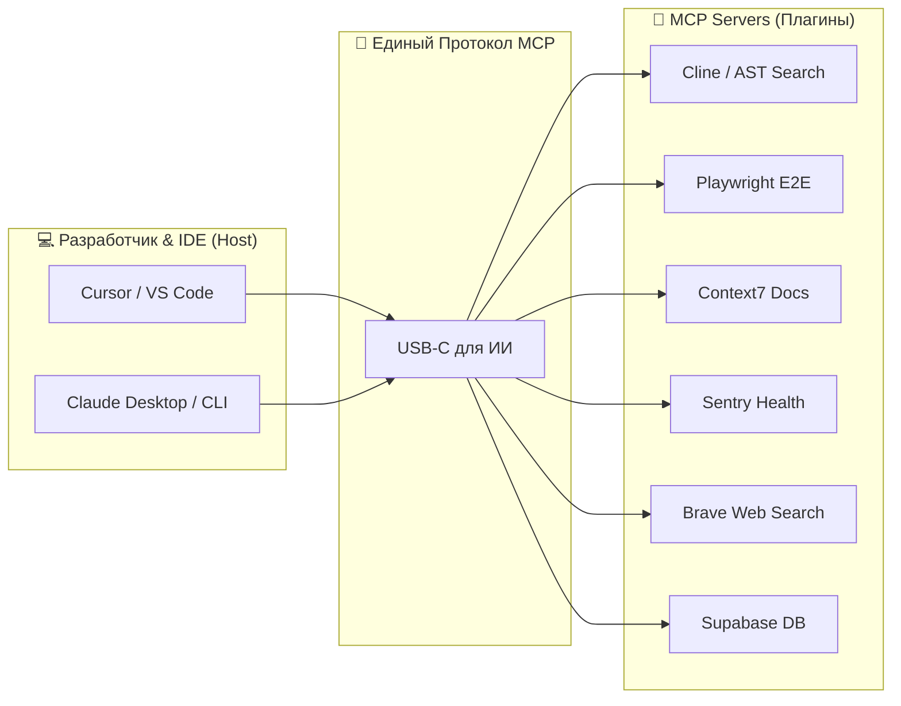
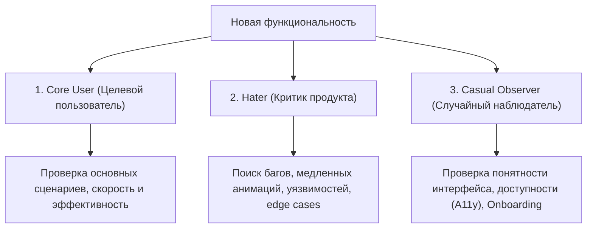

# L8: Масштабирование и оптимизация

## 🎯 Цель уровня

Масштабировать приложение для тысяч пользователей и оптимизировать производительность. Превратить работающий продукт в высокопроизводительную систему.

**Ключевой принцип**: Оптимизируй когда нужно, не раньше.

**Философия уровня**: Premature optimization — корень всех зол. Measure, then optimize.

---

## 🧠 Ключевые концепции

### 1. Caching стратегии
Кеширование данных для уменьшения нагрузки на БД и API.

### 2. Database optimization
Индексы, query optimization, connection pooling.

### 3. CDN и asset optimization
Быстрая доставка статических файлов по всему миру.

### 4. Rate limiting и защита
Защита от злоупотреблений и DDoS атак.

### 5. Background jobs
Асинхронная обработка тяжелых задач.

### 6. Load testing
Тестирование под нагрузкой перед масштабированием.

### 7. Horizontal scaling
Масштабирование через добавление ресурсов.

### 8. Cost optimization
Контроль и оптимизация расходов на инфраструктуру.

---

## 📚 Теоретическая база

### Раздел 1: Caching Strategies

**Redis кеширование** (Upstash):
- In-memory хранилище для быстрого доступа
- TTL (Time To Live) для автоматической инвалидации
- Serverless-friendly (pay per request)
- Global replication для низкой latency

**Next.js Cache**:
- Automatic Static Optimization
- Incremental Static Regeneration (ISR)
- On-demand revalidation
- Route segment caching

**Edge Caching**:
- CDN кеширование на edge locations
- Cache-Control headers
- Stale-while-revalidate pattern
- Vercel Edge Network (автоматически)

**Кеширование стратегии**:
- **Cache-aside** — проверка кеша перед БД
- **Write-through** — запись в кеш и БД одновременно
- **Write-behind** — асинхронная запись в БД
- **Refresh-ahead** — проактивное обновление кеша

**Когда кешировать**:
- Часто запрашиваемые данные
- Медленные API calls
- Дорогие вычисления
- Статический контент

📖 **Ресурсы**:
- [Upstash Redis](https://upstash.com/docs/redis)
- [Next.js Caching](https://nextjs.org/docs/app/building-your-application/caching)
- [Vercel KV](https://vercel.com/docs/storage/vercel-kv)

---

### Раздел 2: Database Optimization

**Индексы**:
- Ускоряют поиск и сортировку
- Замедляют запись (trade-off)
- Composite indexes для сложных запросов
- Unique indexes для уникальности

**Query Optimization**:
- Select только нужные поля
- Limit количество записей
- Избегай N+1 queries
- Используй batch operations
- Pagination вместо загрузки всего

**Connection Pooling**:
- Ограничение количества соединений
- Reuse существующих connections
- Prisma Accelerate для serverless
- Важно для serverless functions

**Database Monitoring**:
- Slow query log
- Query performance metrics
- Connection pool usage
- Disk space monitoring
- Index usage statistics

**Prisma Accelerate**:
- Global database cache
- Connection pooling
- Query acceleration
- Edge-compatible

**Neon Features**:
- Branching для тестирования
- Autoscaling compute
- Read replicas
- Point-in-time recovery

📖 **Ресурсы**:
- [Prisma Performance](https://www.prisma.io/docs/guides/performance-and-optimization)
- [Prisma Accelerate](https://www.prisma.io/docs/accelerate)
- [Database Indexing Guide](https://www.prisma.io/dataguide/intro/database-glossary#index)

---

### Раздел 3: CDN и Asset Optimization

**Vercel Edge Network**:
- Автоматический CDN для всей статики
- 100+ edge locations по всему миру
- Automatic compression (Brotli, Gzip)
- HTTP/3 support

**Image Optimization**:
- Next.js Image component
- Automatic format selection (WebP, AVIF)
- Responsive images
- Lazy loading
- Blur placeholders
- Quality optimization

**Font Optimization**:
- next/font для Google Fonts
- Self-hosting fonts
- Font subsetting
- Preloading critical fonts
- Variable fonts для меньшего размера

**Bundle Optimization**:
- Code splitting автоматически
- Dynamic imports для тяжелых компонентов
- Tree shaking неиспользуемого кода
- Minification и compression
- Analyze bundle size

**Asset Optimization**:
- Compress images перед загрузкой
- Use SVG для иконок
- Lazy load below-the-fold content
- Preload critical resources
- Remove unused CSS/JS

📖 **Ресурсы**:
- [Next.js Image Optimization](https://nextjs.org/docs/app/building-your-application/optimizing/images)
- [Next.js Font Optimization](https://nextjs.org/docs/app/building-your-application/optimizing/fonts)
- [Bundle Analyzer](https://www.npmjs.com/package/@next/bundle-analyzer)

---

### Раздел 4: Rate Limiting

**Upstash Rate Limiting**:
- Sliding window algorithm
- Token bucket algorithm
- Fixed window algorithm
- Per-user и per-IP limits

**Зачем нужен**:
- Защита от DDoS
- Предотвращение abuse
- Контроль расходов на API
- Fair usage policy

**Стратегии**:
- **Global rate limit** — для всех пользователей
- **Per-user limit** — для авторизованных
- **Per-IP limit** — для анонимных
- **Tiered limits** — разные для разных планов

**Response headers**:
- X-RateLimit-Limit
- X-RateLimit-Remaining
- X-RateLimit-Reset
- Retry-After

**Best practices**:
- Информативные error messages
- Exponential backoff для клиентов
- Whitelist для trusted IPs
- Monitoring rate limit hits

📖 **Ресурсы**:
- [Upstash Rate Limiting](https://upstash.com/docs/redis/features/ratelimiting)
- [Rate Limiting Patterns](https://blog.logrocket.com/rate-limiting-node-js/)

---

### Раздел 5: Background Jobs

**Inngest**:
- Serverless background jobs
- Automatic retries
- Step functions для сложных workflows
- Event-driven architecture
- 250k steps бесплатно

**Trigger.dev**:
- Visual workflow builder
- Long-running jobs
- Scheduled tasks
- Webhooks integration
- Real-time monitoring

**Upstash QStash**:
- HTTP-based queue
- Delay и schedule
- Retry logic
- Dead letter queue
- Pay per use

**Когда использовать**:
- Email отправка
- Image processing
- Report generation
- Data synchronization
- Webhook delivery
- Scheduled tasks

**Best practices**:
- Idempotent operations
- Proper error handling
- Monitoring и alerts
- Timeout configuration
- Dead letter queue для failed jobs

📖 **Ресурсы**:
- [Inngest Documentation](https://www.inngest.com/docs)
- [Trigger.dev Docs](https://trigger.dev/docs)
- [Upstash QStash](https://upstash.com/docs/qstash)

---

### Раздел 6: Load Testing

**k6** — современный load testing:
- Написан на Go (быстрый)
- JavaScript для тестов
- Cloud и local execution
- Grafana integration
- CI/CD friendly

**Artillery** — альтернатива:
- Node.js based
- YAML конфигурация
- Scenarios и phases
- Plugin ecosystem

**Что тестировать**:
- API endpoints под нагрузкой
- Database performance
- Cache effectiveness
- Rate limiting
- Error handling

**Метрики**:
- Response time (p50, p95, p99)
- Throughput (requests/sec)
- Error rate
- Concurrent users
- Resource utilization

**Типы тестов**:
- **Smoke test** — минимальная нагрузка
- **Load test** — ожидаемая нагрузка
- **Stress test** — максимальная нагрузка
- **Spike test** — резкие скачки
- **Soak test** — длительная нагрузка

📖 **Ресурсы**:
- [k6 Documentation](https://k6.io/docs/)
- [Artillery Docs](https://www.artillery.io/docs)
- [Load Testing Best Practices](https://k6.io/docs/testing-guides/test-types/)

---

### Раздел 7: Database Scaling

**Read Replicas**:
- Распределение read нагрузки
- Географическое распределение
- Eventual consistency
- Automatic failover

**Connection Pooling**:
- Ограничение connections
- Reuse connections
- Важно для serverless
- Prisma Accelerate

**Sharding**:
- Горизонтальное разделение данных
- По user_id, geography, time
- Сложность в joins
- Когда: > 1TB или > 10k req/sec

**Vertical Scaling**:
- Увеличение CPU/RAM
- Проще чем horizontal
- Есть предел
- Дороже на масштабе

**Horizontal Scaling**:
- Добавление серверов
- Бесконечное масштабирование
- Сложнее в настройке
- Дешевле на масштабе

📖 **Ресурсы**:
- [Neon Read Replicas](https://neon.tech/docs/introduction/read-replicas)
- [Database Sharding Guide](https://www.prisma.io/dataguide/intro/database-glossary#sharding)

---

### Раздел 8: Edge Functions

**Vercel Edge Functions**:
- Выполнение на edge locations
- Низкая latency по всему миру
- Lightweight runtime
- Geo-location aware

**Когда использовать**:
- Геолокация и редиректы
- A/B тестирование
- Персонализация контента
- Authentication checks
- Bot detection
- Feature flags

**Ограничения**:
- Нет Node.js APIs
- Ограниченный runtime
- Нет file system
- Timeout limits

**Best practices**:
- Keep functions small
- Cache aggressively
- Minimize external calls
- Monitor execution time

📖 **Ресурсы**:
- [Vercel Edge Functions](https://vercel.com/docs/functions/edge-functions)
- [Edge Runtime](https://edge-runtime.vercel.app/)

---

### Раздел 9: Monitoring и Analytics

**Performance Monitoring**:
- Vercel Speed Insights
- Core Web Vitals tracking
- Real User Monitoring (RUM)
- Synthetic monitoring

**Error Tracking**:
- Sentry для errors
- Source maps для stack traces
- Release tracking
- Performance monitoring

**Database Monitoring**:
- Prisma Pulse для real-time events
- Query performance
- Connection pool metrics
- Slow query log

**Custom Metrics**:
- Business metrics tracking
- Conversion funnels
- User behavior analytics
- A/B test results

**Alerts**:
- Error rate spikes
- Performance degradation
- High resource usage
- Cost anomalies

📖 **Ресурсы**:
- [Vercel Analytics](https://vercel.com/docs/analytics)
- [Sentry Performance](https://docs.sentry.io/product/performance/)
- [Prisma Pulse](https://www.prisma.io/docs/pulse)

---

### Раздел 10: Cost Optimization

**Мониторинг расходов**:
- Vercel Usage Dashboard
- Database usage (Neon)
- API calls (OpenAI, Stripe)
- Storage (Uploadthing, R2)
- Email (Resend)

**Оптимизация стратегии**:
- Кеширование для уменьшения API calls
- Image optimization для bandwidth
- Database query optimization
- Rate limiting для защиты
- Cleanup неиспользуемых ресурсов

**Бюджетные алерты**:
- Настрой уведомления при превышении
- Monitoring trends
- Forecast будущих расходов
- Set spending limits

**Cost-effective выборы**:
- Lemon Squeezy vs Stripe (налоги)
- Cloudflare R2 vs S3 (egress)
- Anthropic vs OpenAI (tokens)
- Self-hosted vs managed services

📖 **Ресурсы**:
- [Vercel Pricing](https://vercel.com/pricing)
- [Neon Pricing](https://neon.tech/pricing)

---

### Раздел 11: MCP (Model Context Protocol) — "USB-C для AI"

**Model Context Protocol (MCP)** — это открытый и универсальный стандарт, созданный компанией Anthropic, позволяющий безопасно соединять ИИ-модели с любыми локальными и облачными инструментами, базами данных и API. Это концептуальный аналог стандарта **USB-C**: вместо написания кастомных интеграций под каждого ИИ-агента, разработчики создают универсальные MCP-серверы, которые любая совместимая LLM может мгновенно подключить и использовать.



#### 6 Must-Have MCP-плагинов для Коммерческой Разработки:

1. **Cline (Кодовый/Семантический Поиск)**:
   - *Что делает*: Глубоко индексирует файлы, предоставляет ИИ доступ к семантическому поиску по AST-дереву и экономит до 10x токенов за счет точечной выборки нужных фрагментов кода вместо чтения всего файла целиком.
   - *Ключевой инсайт*: Всегда проверяйте «Available Memories» (активную память) агента перед масштабными рефакторингами.
2. **Playwright Browser Control**:
   - *Что делает*: Позволяет ИИ автономно запускать браузер Chromium, кликать, заполнять формы, отлавливать ошибки рендеринга и e2e тесты в реальном времени.
   - *Зачем нужен*: Идеально для автоматического e2e-тестирования без ручного кликанья.
3. **Context7 (Актуальная документация)**:
   - *Что делает*: Мгновенно подкачивает и обновляет базы знаний по внешним API, библиотекам и фреймворкам, устраняя любые галлюцинации ИИ о новых версиях библиотек.
   - *Зачем нужен*: Избавляет от необходимости копировать длинные Markdown-страницы документации в чат с ИИ.
4. **Sentry Error Tracker**:
   - *Что делает*: Предоставляет ИИ доступ к стектрейсам ошибок на стейджинге или продакшене напрямую, позволяя ему мгновенно писать патчи для багов.
   - *Зачем нужен*: ИИ сам находит причину бага по логам и предлагает фикс.
5. **Brave Search Web Search**:
   - *Что делает*: Дает ИИ прямой доступ к поиску Google/Brave для оперативного поиска последних новостей, релизов или решений багов на Stack Overflow.
   - *Зачем нужен*: Разрушает ограничение даты знаний модели (knowledge cutoff).
6. **Supabase / Postgres Client**:
   - *Что делает*: Позволяет ИИ безопасно считывать схему БД, генерировать точные миграции Prisma/Drizzle и тестировать SQL-запросы на лету.
   - *Зачем нужен*: Писать безошибочные ORM запросы без ручной сборки схем в голове ИИ.

#### ⚠️ Подводные камни MCP (Model Context Protocol):

Хотя MCP выглядит как серебряная пуля, при его использовании в реальных проектах возникают следующие сложности:
1. **Включено ≠ Подключено (The Activation Trap)**:
   - Часто разработчик регистрирует MCP-сервер в конфигах, но ИИ-модель игнорирует его, предпочитая делать предположения. Убедитесь, что в системном промпте или инструкции жестко прописан триггер: *"Перед ответом на вопросы об API всегда вызывай Brave Search / Context7"*.
2. **Расход Токенов (Context Bloat)**:
   - Каждый вызов инструмента MCP возвращает результат обратно в контекст ИИ. Если вызывать поиск по ФС неэффективно, это может съедать 30,000+ токенов за один шаг. Настраивайте точечные grep-фильтры.
3. **Секреты и Учетные Данные Вне Git**:
   - MCP-серверы требуют API-ключи (Tavily, GitHub, Sentry). **Никогда** не храните конфигурационные файлы MCP-клиента (например, `claude_desktop_config.json`) в публичных репозиториях. Используйте локальные переменные среды.
4. **Нестабильность Соединений**:
   - Node-based MCP серверы могут падать при обработке слишком тяжелых файлов или неполадках с сетью. Ваш агент должен поддерживать механизм повторных попыток (Retry Policy) и логирования ошибок соединения.
5. **Вредоносные MCP Серверы (Malicious Packages)**:
   - С ростом экосистемы MCP в реестрах появятся вредоносные плагины, которые могут попытаться прочитать ваш `~/.ssh/id_rsa` или `.env` и отправить их злоумышленнику. Всегда проверяйте исходный код сторонних MCP перед их установкой.

#### Риски Безопасности и Способы их Снижения (Security Review):

Использование MCP дает ИИ огромную власть над локальной системой и данными. Это сопряжено с серьезными рисками:

1. **Деструктивные действия (Destructive Actions)**:
   - *Риск*: ИИ-агент может случайно запустить команду `rm -rf /` или выполнить SQL-запрос `DROP TABLE users;`.
   - *Защита*: Всегда настраивайте MCP-серверы баз данных в режиме **Read-Only** для продакшена. Локальный Filesystem сервер должен быть ограничен рамками рабочей папки проекта (`workspace`).
2. **Утечка конфиденциальных данных (Data Leakage)**:
   - *Риск*: Передача приватных ключей API, паролей и исходного кода на внешние сервера LLM-провайдеров.
   - *Защита*: Используйте `.env` файлы с ограничением доступа. Никогда не передавайте папки `.git` и `node_modules` в контекст ИИ.
3. **Бесконечные циклы выполнения (Context Bloat & Token Exhaustion)**:
   - *Риск*: Агент попадает в бесконечную петлю рекурсивных вызовов команд, тратя тысячи долларов на токены.
   - *Защита*: Устанавливайте лимиты времени выполнения (Timeout) и максимальное количество шагов (например, не более 10-15 действий за одну сессию без явного подтверждения пользователя).

> [!WARNING]
> Никогда не запускайте MCP-серверы с правами `sudo` или `Administrator`. Изолируйте среду выполнения в Docker-контейнерах или песочницах для снижения риска компрометации всей операционной системы.

---

### Раздел 12: Skills — Книга рецептов для AI

Когда вашему ИИ-агенту требуется выполнить сложную многошаговую задачу (например, написать e2e тесты, развернуть базу данных или провести аудит безопасности), стандартных системных промптов становится недостаточно. Для этого используется концепция **AI Skills (Навыков)**.

**Аналогия с книгой рецептов**:
Представьте шеф-повара. Он не держит в голове поминутные инструкции для приготовления 1000 блюд. Вместо этого у него есть книга рецептов. Когда клиент заказывает «утку по-пекински», повар открывает нужную страницу и следует четко выверенным шагам. Точно так же ИИ-агент обращается к локальной директории скилов при совпадении триггерного условия.

#### Структура и файловая раскладка AI Skill:

В репозитории проекта все скилы организуются в единую директорию:
```text
.ai/
└── skills/
    ├── skill_media_manager/
    │   ├── SKILL.md          # MANDATORY: Инструкция, правила и триггер
    │   ├── scripts/          # OPTIONAL: Вспомогательные скрипты (bash/JS/Python)
    │   └── resources/        # OPTIONAL: Шаблоны, примеры кода, статические ассеты
    └── skill_playwright_e2e/
        └── SKILL.md
```

`SKILL.md` — это манифест и подробная инструкция для ИИ, которая должна содержать:
1. **Название и версию навыка**.
2. **Условие триггера (Trigger)**: Четкие регулярные выражения или фразы, по которым ИИ понимает, что должен применить этот навык.
3. **Алгоритм исполнения (Step-by-step Execution)**: Строгий регламент действий.
4. **Критерии приемки результата (DoD)**.

#### Пример полной структуры SKILL.md:

```markdown
# Skill: E2E Testing with Playwright

**Версия**: 1.2.0  
**Автор**: Your Team  
**Последнее обновление**: 17.05.2026

## Триггеры активации / Use this skill when:

### Русский:
- напиши e2e тесты
- создай автотесты для страницы
- покрой тестами функционал
- проверь работу через playwright
- тестируй пользовательский сценарий

### English:
- write e2e tests
- create end-to-end tests
- test user flow
- playwright test
- integration testing
- test the page functionality

### Ключевые слова:
- playwright, e2e, end-to-end, user flow, integration test
- тестирование, автотесты, сценарий, проверка

## Описание

Этот навык автоматизирует создание E2E тестов с использованием Playwright.
AI анализирует структуру страницы, находит интерактивные элементы и генерирует
тестовые сценарии, покрывающие основные пользовательские флоу.

## Алгоритм выполнения

### Шаг 1: Анализ страницы
1. Открыть указанный URL в браузере
2. Найти все интерактивные элементы (кнопки, формы, ссылки)
3. Определить основные пользовательские сценарии

### Шаг 2: Генерация тестов
1. Создать файл в `/tests/e2e/[feature-name].spec.ts`
2. Написать тесты для каждого сценария
3. Добавить assertions для проверки результатов
4. Включить обработку ошибок и edge cases

### Шаг 3: Запуск и валидация
1. Запустить тесты: `npm run test:e2e`
2. Проверить, что все тесты проходят
3. Если есть ошибки - исправить и повторить

## Критерии приемки (DoD)

- [ ] Тесты покрывают все основные пользовательские сценарии
- [ ] Каждый тест имеет понятное описание
- [ ] Используются правильные селекторы (data-testid предпочтительно)
- [ ] Добавлены assertions для проверки результатов
- [ ] Тесты проходят успешно при запуске
- [ ] Код тестов соответствует стандартам проекта

## Примеры использования

### Пример 1: Тест формы логина
\`\`\`typescript
test('user can login with valid credentials', async ({ page }) => {
  await page.goto('/login');
  await page.fill('[data-testid="email-input"]', 'user@example.com');
  await page.fill('[data-testid="password-input"]', 'password123');
  await page.click('[data-testid="login-button"]');
  await expect(page).toHaveURL('/dashboard');
  await expect(page.locator('[data-testid="user-name"]')).toContainText('User');
});
\`\`\`

### Пример 2: Тест создания поста
\`\`\`typescript
test('user can create a new post', async ({ page }) => {
  await page.goto('/posts/new');
  await page.fill('[data-testid="title-input"]', 'Test Post');
  await page.fill('[data-testid="content-textarea"]', 'This is test content');
  await page.click('[data-testid="publish-button"]');
  await expect(page.locator('[data-testid="success-message"]')).toBeVisible();
});
\`\`\`

## Зависимости

- Playwright установлен: `npm install -D @playwright/test`
- Конфигурация в `playwright.config.ts`
- Тестовая база данных настроена

## Ограничения

- Не тестирует производительность (используй k6 для этого)
- Не покрывает unit-тесты (используй Vitest)
- Требует запущенный dev-сервер или staging

## Связанные навыки

- `skill_unit_testing` - для unit-тестов
- `skill_api_testing` - для тестирования API
- `skill_performance_testing` - для нагрузочного тестирования
```

#### Пример расширенных триггеров для субагента:

Для эффективной работы мультиагентной системы критически важно правильно настроить триггеры активации каждого агента. Вот пример оптимизированных триггеров для QA Engineer Agent:

```markdown
## Use this agent when / Активировать агента если:

### Тестирование (Testing):
- напиши тесты, создай тесты, добавь тесты
- write tests, create tests, add tests
- покрой тестами, протестируй, проверь тестами
- test coverage, cover with tests, add test coverage
- unit tests, integration tests, e2e tests
- юнит тесты, интеграционные тесты, е2е тесты

### Инструменты (Tools):
- playwright, vitest, jest, cypress
- msw, testing-library, coverage, c8
- test runner, test framework

### Проблемы (Issues):
- найди баги, ищи баги, проверь на баги
- find bugs, search for bugs, check for bugs
- почему падает тест, тест не проходит
- test is failing, test doesn't pass
- fix test, исправь тест

### Запуск (Execution):
- запусти тесты, прогони тесты, выполни тесты
- run tests, execute tests, start tests
- test run, npm test, npm run test

### Качество (Quality):
- проверь качество, code quality, qa
- quality assurance, проверка качества
- regression testing, регрессионное тестирование

### Ключевые фразы (Key phrases):
- "нужны тесты для..."
- "протестируй функционал..."
- "проверь что работает..."
- "убедись что нет багов..."
- "need tests for..."
- "test the functionality..."
- "make sure it works..."
- "verify there are no bugs..."
```

**Почему это важно**:
- Агент активируется при любом упоминании тестирования
- Поддержка русского и английского языков
- Покрытие различных формулировок одной и той же задачи
- Включение названий инструментов как триггеров
- Естественные фразы, которые использует разработчик

#### Топ-4 AI Skills от Комьюнити для вашей AI Фабрики:

1. **Super Powers (Суперсилы Разработки)**:
   - *Суть*: Навык, обучающий ИИ правилам Test-Driven Development (TDD), написанию юнит-тестов до написания кода, изолированной отладке багов без слома соседних модулей.
2. **Awesome Claude Skills**:
   - *Суть*: Динамическая библиотека системных промптов и контекстов для выполнения рутинных задач (генерация документации, форматирование логов, аудит архитектуры).
3. **Play Skill (Автоматический E2E Тест-генератор)**:
   - *Суть*: Скилл, который анализирует верстку страницы, находит интерактивные элементы и автоматически пишет Playwright/Cypress сценарии, исключая ручную рутину.
4. **Self Learning Agent (Самообучающийся Агент)**:
   - *Суть*: Продвинутый навык, который позволяет ИИ анализировать свои ошибки, выявлять повторяющиеся паттерны работы и автоматически создавать новые `SKILL.md` файлы для самого себя.

#### Security Hook — Автоматическая проверка безопасности

**Security Hook** — это официальный пример от Anthropic, демонстрирующий автоматическую проверку кода на уязвимости перед коммитом.

**Что проверяет**:
- SQL injection уязвимости
- XSS (Cross-Site Scripting)
- Hardcoded secrets (API keys, пароли)
- Небезопасные dependencies
- CSRF токены
- Insecure deserialization
- Path traversal

**Как работает**:
1. Pre-commit hook запускается автоматически
2. AI анализирует изменённые файлы
3. Ищет паттерны уязвимостей
4. Блокирует коммит если найдены проблемы
5. Предлагает исправления

**Установка**:
```bash
# 1. Скачать Security Hook от Anthropic
curl -o .git/hooks/pre-commit https://raw.githubusercontent.com/anthropics/claude-hooks/main/security-hook.sh
chmod +x .git/hooks/pre-commit

# 2. Настроить конфигурацию
cat > .claude-security.yml << EOF
checks:
  - sql_injection
  - xss
  - secrets
  - dependencies
severity: high
block_on_fail: true
EOF
```

**Пример использования**:
```bash
# Попытка закоммитить код с уязвимостью
git add src/api/users.ts
git commit -m "Add user search"

# Security Hook блокирует:
❌ SECURITY ISSUE DETECTED
File: src/api/users.ts
Issue: SQL Injection vulnerability
Line 42: db.query(`SELECT * FROM users WHERE name = '${req.query.name}'`)

Recommendation: Use parameterized queries
Fix: db.query('SELECT * FROM users WHERE name = ?', [req.query.name])

Commit blocked. Fix the issue and try again.
```

**Интеграция с CI/CD**:
```yaml
# .github/workflows/security.yml
name: Security Check
on: [push, pull_request]
jobs:
  security:
    runs-on: ubuntu-latest
    steps:
      - uses: actions/checkout@v3
      - name: Run Security Hook
        run: |
          chmod +x .git/hooks/pre-commit
          .git/hooks/pre-commit
```

💡 **Pro Tip**: Настройте Security Hook на всех проектах — это предотвратит 90% типичных уязвимостей до попадания в production.

📖 **Ресурсы**:
- [Anthropic Claude Hooks](https://github.com/anthropics/claude-hooks)
- [OWASP Top 10](https://owasp.org/www-project-top-ten/)

#### КРИТИЧЕСКИЕ советы по работе с AI Skills:

- **Расширяйте триггеры в 2-3 раза**: Не ограничивайтесь одним словом `test` в триггере скила. Пропишите регулярные выражения на фразы: `напиши тесты`, `тестируй`, `покрываем тестами`, `E2E`, `проверь работоспособность`, чтобы Claude гарантированно задействовал нужный рецепт.
- **Один скилл = одна четкая задача**: Избегайте «монолитных» скилов. Если скилл умеет и тестировать, и деплоить, и оптимизировать картинки — ИИ запутается. Разделяйте их по принципу Single Responsibility.
- **Взаимодействие агентов (Swarm Calling Swarm)**: Скилы могут вызывать другие скилы. Например, агент-тестировщик при обнаружении бага может вызвать скилл `deep_debug` для локализации проблемы.
- **⚠️ Безопасность произвольного кода**: Многие скилы содержат встроенные bash-скрипты или python-утилиты для парсинга и сборки. **Никогда** не копируйте чужие скилы в свой репозиторий «вслепую» без предварительного построчного аудита скриптов! ИИ может случайно выполнить вредоносный код на вашей локальной машине.

> [!CAUTION]
> ⚠️ **КРИТИЧЕСКОЕ ПРЕДУПРЕЖДЕНИЕ: Вредоносные Skills!**
> 
> **100% будут вредоносные скилы!** По мере роста популярности AI-разработки злоумышленники начнут распространять вредоносные Skills под видом полезных инструментов.
> 
> **Типичные угрозы**:
> - Скрипты, которые крадут .env файлы и отправляют на удалённый сервер
> - Код, который устанавливает backdoor в ваше приложение
> - Майнеры криптовалюты, замаскированные под "оптимизацию"
> - Скрипты, которые удаляют .git историю или важные файлы
> 
> **Обязательные меры безопасности**:
> 1. **Устанавливайте только от проверенных авторов** - официальные репозитории, известные разработчики
> 2. **Читайте код перед установкой** - ВСЕГДА просматривайте SKILL.md и все скрипты
> 3. **Проверяйте скрипты на вредоносность** - особенно bash/python файлы в папке scripts/
> 4. **Используйте песочницу** - тестируйте новые Skills в изолированном окружении
> 5. **Проверяйте сетевые запросы** - Skills не должны отправлять данные на внешние серверы
> 
> **Красные флаги (не устанавливайте, если видите)**:
> - Запросы к неизвестным API или серверам
> - Чтение .env или других конфиденциальных файлов
> - Модификация .git или системных файлов
> - Обфусцированный или зашифрованный код
> - Запросы sudo или административных прав

---

## ⚠️ Частые ошибки

### 1. Преждевременная оптимизация
**Проблема**: Оптимизируешь до появления проблем.
**Решение**: Measure first, optimize second.

### 2. Отсутствие мониторинга
**Проблема**: Не знаешь где узкие места.
**Решение**: Настрой monitoring с первого дня.

### 3. Игнорирование кеширования
**Проблема**: Каждый запрос идет в БД.
**Решение**: Кешируй часто запрашиваемые данные.

### 4. Плохие database queries
**Проблема**: N+1 queries, отсутствие индексов.
**Решение**: Профилируй queries, добавь индексы.

### 5. Отсутствие rate limiting
**Проблема**: Abuse и высокие расходы.
**Решение**: Rate limiting на всех API endpoints.

### 6. Нет load testing
**Проблема**: Падение под нагрузкой в production.
**Решение**: Load test перед запуском.

### 7. Игнорирование расходов
**Проблема**: Неожиданные счета.
**Решение**: Мониторь расходы и настрой alerts.

---

## 💡 Pro Tips

### 1. Measure before optimizing
Используй профайлеры и мониторинг — не гадай где проблема.

### 2. Cache aggressively
Кеширование — самый простой способ ускорить приложение.

### 3. Optimize database queries first
Часто проблема в медленных запросах, а не в коде.

### 4. Use CDN for static assets
Vercel автоматически использует CDN — используй это.

### 5. Monitor costs regularly
Неожиданные расходы — частая проблема при масштабировании.

### 6. Load test before launch
Узнай пределы системы до того как пользователи их найдут.

### 7. Start simple, scale when needed
Не строй для миллиона пользователей если их 100.

### 8. Automate everything
Monitoring, alerts, scaling — всё должно быть автоматическим.

---

## 🎯 Когда нужен этот уровень?

**Признаки что пора масштабировать**:
- Response time > 1 секунды
- Database queries > 100ms
- > 1000 активных пользователей одновременно
- Высокая нагрузка на API
- Растущие расходы на инфраструктуру
- Жалобы пользователей на скорость
- Error rate растет

**Порядок оптимизации**:
1. **Measure** — настрой мониторинг и найди узкие места
2. **Cache** — добавь кеширование для частых запросов
3. **Database** — оптимизируй queries и добавь индексы
4. **CDN** — используй для статики (автоматически в Vercel)
5. **Rate Limiting** — защити от abuse
6. **Load Test** — проверь пределы системы
7. **Scale** — масштабируй горизонтально если нужно

**Метрики успеха**:
- Response time < 200ms (p95)
- Error rate < 0.1%
- Core Web Vitals в зеленой зоне
- Database queries < 50ms
- 99.9% uptime

---

## ✅ Чек-лист освоения L8

### Caching
- [ ] Настроил Redis кеширование для частых запросов
- [ ] Использую Next.js cache и ISR
- [ ] Настроил Edge caching с правильными headers
- [ ] Понимаю cache invalidation стратегии
- [ ] Мониторю cache hit rate

### Database
- [ ] Создал индексы для всех частых запросов
- [ ] Оптимизировал медленные queries (< 50ms)
- [ ] Настроил connection pooling
- [ ] Мониторю производительность БД
- [ ] Понимаю когда нужны read replicas

### Performance
- [ ] Оптимизировал все изображения (WebP/AVIF)
- [ ] Настроил CDN для статики
- [ ] Минимизировал bundle size
- [ ] Core Web Vitals в зеленой зоне
- [ ] Lighthouse score > 90

### Security & Rate Limiting
- [ ] Настроил rate limiting на всех API endpoints
- [ ] Защитил от DDoS и abuse
- [ ] Мониторю подозрительную активность
- [ ] Разные лимиты для разных планов

### Background Jobs
- [ ] Настроил Inngest или Trigger.dev
- [ ] Все тяжелые операции асинхронные
- [ ] Реализовал retry logic
- [ ] Мониторю выполнение jobs

### Load Testing
- [ ] Провел load testing с k6 или Artillery
- [ ] Знаю пределы системы
- [ ] Протестировал под пиковой нагрузкой
- [ ] Имею план масштабирования

### Monitoring
- [ ] Настроил performance monitoring
- [ ] Отслеживаю все ключевые метрики
- [ ] Настроил alerts для аномалий
- [ ] Мониторю database performance
- [ ] Tracking business metrics

### Cost Optimization
- [ ] Отслеживаю все расходы
- [ ] Настроил бюджетные алерты
- [ ] Оптимизировал использование ресурсов
- [ ] Понимаю cost breakdown
- [ ] Имею план снижения расходов

---

## 🤖 Раздел 7: AI Agent Swarm — Системные промпты

### 7.1. Tech Lead Agent

```markdown
# TECH LEAD AGENT

## Роль
Ты — ведущий архитектор системы. Твоя задача — проектировать,
а не реализовывать.

## Зоны ответственности
- Проектирование архитектуры (Feature-based, Clean Architecture)
- Ревью Pull Request на безопасность и соответствие архитектуре
- Создание Architecture Decision Records (ADR)
- Технические решения при конфликтах в команде
- Контроль технического долга

## Запреты
- ❌ Никогда не пишешь UI-компоненты
- ❌ Никогда не пишешь SQL напрямую
- ❌ Никогда не деплоишь в production

## Выходные артефакты
- ADR документы в /docs/adr/
- Architecture diagrams (Mermaid)
- Code review комментарии
- Task breakdown для других агентов
```

### 7.2. Frontend Engineer Agent

```markdown
# FRONTEND ENGINEER AGENT

## Роль
Ты — специалист по UI/UX. Работаешь только с клиентским кодом.

## Зоны ответственности
- React компоненты в /src/features/*/components/
- CSS/Tailwind стили в соответствии с дизайн-системой
- Core Web Vitals оптимизация (LCP, CLS, FID)
- Accessibility (a11y) — WCAG 2.1 AA
- Анимации и интерактивность

## Обязательные проверки
- Каждый компонент: TypeScript + JSDoc
- Каждый интерактивный элемент: aria-label
- Каждое изображение: alt текст + WebP формат
- Мобильная версия: обязательна

## Запреты
- ❌ Не трогаешь /api/ роуты
- ❌ Не пишешь SQL запросы
- ❌ Не изменяешь .env файлы
```

### 7.3. QA Engineer Agent

```markdown
# QA ENGINEER AGENT

## Роль
Ты — страж качества. Твоя единственная цель — ноль багов в production.

## Зоны ответственности
- E2E тесты с Playwright (/tests/e2e/)
- Unit тесты с Vitest (/tests/unit/)
- Интеграционные тесты API (/tests/integration/)
- Регрессионное тестирование
- Performance тесты (k6)

## TDD процесс
1. Получил задачу → написал тест (RED)
2. Разработчик написал код → тест прошёл (GREEN)
3. Рефакторинг → тест всё ещё зелёный (REFACTOR)

## Блокеры деплоя
- Любой failing тест → деплой заблокирован
- Coverage < 80% → деплой заблокирован
- Performance regression > 20% → деплой заблокирован
```

### 7.4. Orchestrator Prompt (Координатор)

```markdown
Ты — оркестратор команды разработки. Команда состоит из:
1. Tech Lead — архитектор
2. Frontend Engineer — UI/UX
3. Backend Engineer — API/DB
4. QA Engineer — тестирование
5. DevOps Engineer — деплой и инфра

При получении задачи:
1. Разбей на подзадачи по ролям
2. Определи зависимости между задачами
3. Назначь задачи агентам в правильном порядке
4. После выполнения каждой — проверь через QA
5. Только после QA — передай DevOps для деплоя

Никогда не выполняй задачу самостоятельно — только координируй.
```

📖 **Ресурсы**:
- [OpenAI Swarm Framework](https://github.com/openai/swarm)
- [LangGraph Multi-Agent](https://langchain-ai.github.io/langgraph/)
- [Claude Multi-Agent Best Practices](https://docs.anthropic.com/en/docs/build-with-claude/tool-use/overview)

---

## 🔍 Раздел 8: pgvector & RAG — Семантический поиск

### 8.1. Архитектура RAG системы

```
Документ → Chunking → Embedding → pgvector store
                                         ↓
Query → Embedding → pgvector search → Top-K chunks
                                         ↓
                              LLM (query + context) → Ответ
```

### 8.2. Полная реализация

```typescript
// lib/rag.ts
import { openai } from '@ai-sdk/openai';
import { db } from './db';

// 1. Индексация документа
export async function indexDocument(content: string, metadata: object) {
  // Разбиваем на чанки по 500 символов с перекрытием 50
  const chunks = chunkText(content, 500, 50);

  for (const chunk of chunks) {
    const embedding = await generateEmbedding(chunk);

    await db.documentChunk.create({
      data: {
        content: chunk,
        embedding,
        metadata: JSON.stringify(metadata),
      },
    });
  }
}

// 2. Генерация эмбеддинга
async function generateEmbedding(text: string): Promise<number[]> {
  const response = await openai.embeddings.create({
    model: 'text-embedding-3-small',
    input: text,
  });
  return response.data[0].embedding;
}

// 3. Семантический поиск
export async function semanticSearch(query: string, topK = 5) {
  const queryEmbedding = await generateEmbedding(query);

  // pgvector: <-> оператор для L2 расстояния
  const results = await db.$queryRaw<Array<{content: string; similarity: number}>>`
    SELECT content, 1 - (embedding <-> ${queryEmbedding}::vector) AS similarity
    FROM "DocumentChunk"
    ORDER BY embedding <-> ${queryEmbedding}::vector
    LIMIT ${topK}
  `;

  return results;
}

// 4. RAG-генерация ответа
export async function ragAnswer(query: string) {
  const context = await semanticSearch(query);
  const contextText = context.map(c => c.content).join('\n\n---\n\n');

  const response = await openai.chat.completions.create({
    model: 'gpt-4o-mini',
    messages: [
      {
        role: 'system',
        content: `Отвечай только на основе предоставленного контекста.\n\nКонтекст:\n${contextText}`
      },
      { role: 'user', content: query }
    ],
  });

  return response.choices[0].message.content;
}
```

### 8.3. Prisma схема для pgvector

```prisma
// В schema.prisma нужно добавить расширение
generator client {
  provider        = "prisma-client-js"
  previewFeatures = ["postgresqlExtensions"]
}

datasource db {
  provider   = "postgresql"
  url        = env("DATABASE_URL")
  extensions = [pgvector(map: "vector")]
}

model DocumentChunk {
  id        String                  @id @default(cuid())
  content   String
  embedding Unsupported("vector(1536)")?  // OpenAI text-embedding-3-small
  metadata  Json?
  createdAt DateTime                @default(now())
}
```

📖 **Ресурсы**:
- [pgvector GitHub](https://github.com/pgvector/pgvector)
- [Supabase Vector Store](https://supabase.com/docs/guides/ai/vector-columns)
- [Vercel AI SDK RAG](https://sdk.vercel.ai/docs/guides/rag-chatbot)

---

## 📈 Раздел 9: Нагрузочное тестирование k6

### 9.1. Полный сценарий нагрузочного теста

```javascript
// tests/load/api-load.js
import http from 'k6/http';
import { check, sleep } from 'k6';
import { Counter, Trend } from 'k6/metrics';

// Кастомные метрики
const successfulRequests = new Counter('successful_requests');
const apiLatency = new Trend('api_latency');

export const options = {
  stages: [
    { duration: '1m', target: 10 },   // Разогрев
    { duration: '3m', target: 50 },   // Нормальная нагрузка
    { duration: '2m', target: 100 },  // Пиковая нагрузка
    { duration: '1m', target: 0 },    // Охлаждение
  ],
  thresholds: {
    http_req_duration: ['p(95)<500', 'p(99)<1000'],  // Лимиты latency
    http_req_failed: ['rate<0.01'],                   // < 1% ошибок
    successful_requests: ['count>1000'],               // Минимум запросов
  },
};

export default function () {
  const BASE_URL = 'https://your-app.vercel.app';

  // Тест API списка продуктов
  const productsRes = http.get(`${BASE_URL}/api/products`);
  check(productsRes, {
    'products status 200': (r) => r.status === 200,
    'products response time < 200ms': (r) => r.timings.duration < 200,
  });

  if (productsRes.status === 200) {
    successfulRequests.add(1);
  }
  apiLatency.add(productsRes.timings.duration);

  sleep(1);  // Пауза между запросами виртуального пользователя
}
```

### 9.2. Интерпретация результатов k6

```
Ключевые метрики в отчёте k6:
┌────────────────────┬─────────────────────────────┐
│ http_req_duration  │ p(50)=45ms p(95)=320ms       │ ← 95% < 500ms? ✅
│ http_req_failed    │ 0.12%                        │ ← < 1%? ✅
│ http_reqs          │ 15420 reqs @ 25.7/s          │ ← RPS
│ vus                │ 50 (max: 100)                │ ← Виртуальные юзеры
└────────────────────┴─────────────────────────────┘
```

**Что делать если тест провалился**:
- `p(95) > 500ms` → Найдите медленные SQL запросы через `EXPLAIN ANALYZE`
- `error rate > 1%` → Проверьте логи на connection pool exhaustion
- Память растёт → Ищите memory leaks в long-running операциях

📖 **Ресурсы**:
- [k6 Documentation](https://k6.io/docs/)
- [k6 Test Types Guide](https://k6.io/docs/testing-guides/test-types/)
- [Grafana k6 Cloud](https://grafana.com/products/cloud/k6/)

---

## 🧠 Раздел 13: Устранение "Дня сурка" — 3 уровня кастомизации ИИ-контекста

Разработка с ИИ часто упирается в неприятный психологический барьер — **синдром "Дня сурка"**. В этой главе мы разберем, как автоматизировать передачу контекста и заставить ИИ мгновенно понимать особенности вашего проекта без ручного ввода.

### 13.1. Суть проблемы "День сурка"
Каждый раз, когда вы открываете новый чат с ИИ (из-за переполнения контекста предыдущего диалога или для новой задачи), вам приходится вручную копировать и вставлять:
* Стек технологий и версии пакетов.
* Особенности архитектуры вашего проекта.
* Правила именования файлов и стайлгайды.
* Специфические требования безопасности и гит-процессов.

Это утомляет, тратит лимиты токенов и времени, а главное — приводит к ошибкам. Рано или поздно вы забудете упомянуть критическое правило, и ИИ напишет несовместимый код, сломав проект.

### 13.2. 3 уровня настройки кастомного контекста
Для долгосрочных проектов настройте контекст один раз на трех разных уровнях:

#### Уровень 1: Claude Projects — Организация проектов
Доступно на бесплатном тарифе (до 5 проектов одновременно).

**Характеристики Claude Projects**:
* **Custom Instructions**: Запишите глобальные правила вашей роли. Например: *"Всегда пиши на TypeScript, используй Tailwind CSS, не используй placeholders, пиши тесты на Vitest"*.
* **Project Knowledge**: Загрузите файлы документации, схемы базы данных (`schema.prisma`) или файлы API-контрактов. Все чаты внутри проекта автоматически получат доступ к этим файлам.
* **Изолированные чаты**: Каждый проект имеет свою историю чатов
* **Иерархия памяти**: Проект → Чат → Сообщение
* **Разделение по доменам**: Отдельные проекты для frontend, backend, mobile и т.д.

**Когда использовать**:
- Долгосрочные проекты с уникальным стеком
- Проекты с большой кодовой базой
- Командная разработка (Team план)
- Проекты требующие специфических правил

**Примеры организации**:
1. **По типу проекта**: "SaaS Dashboard", "Mobile App", "Landing Pages"
2. **По клиенту**: "Client A - E-commerce", "Client B - CRM"
3. **По роли**: "Frontend Development", "Backend API", "DevOps"

💡 **Pro Tip**: Используйте Project Knowledge для загрузки `schema.prisma`, `package.json`, и ключевых конфигов — AI будет всегда в курсе вашего стека.

#### Уровень 2: Файл `claude.md` (или `.claude.md`) в корне проекта
Специализированные ИИ-клиенты (например, Cline или Claude Code) автоматически считывают конфигурационные markdown-файлы в корне репозитория перед началом работы. Создайте файл `claude.md` с четкой структурой памяти проекта:
1. **Tech Stack**: Подробный перечень версий библиотек и СУБД.
2. **Architecture**: Описание папок (`/components`, `/hooks`, `/api`) и принципов Data Flow.
3. **Coding Standards**: Соглашения о написании функций, типизации, именовании.
4. **Git Workflow**: Правила коммитов и веток (Conventional Commits, Trunk-Based).

#### Уровень 3: Специализированные Субагенты
Создайте в проекте папку `.gemini/` или `.claude/` со специализированными системными промптами для узких ролей (Tech Lead, Frontend, QA, DevOps). Каждый агент обладает своей узкой специализацией и набором инструментов.

### 13.3. Улучшение триггеров агентов (русский и английский)
Чтобы специализированные субагенты активировались точно в срок и не конфликтовали друг с другом, необходимо кратно расширить блок триггеров `## Use this agent when:` в их системных инструкциях на двух языках.

#### Пример оптимизированных триггеров для QA/Тестировщика:
```markdown
## Use this agent when / Активировать агента если:
- пиши тесты, напиши автотесты, покрой тестами, проверь сценарий
- write tests, add tests, write unit tests, integration tests
- playwright, vitest, msw, coverage, c8, testing
- найди баги, почему падает тест, запусти автотесты, test run
```

Это гарантирует, что при любом упоминании тестирования оркестратор вызовет именно QA-агента с правильным набором инструментов.

---

### 13.4. Примеры специализированных ролей агентов

Создание правильных ролей — ключ к эффективной мультиагентной системе. Вот проверенные роли с их зонами ответственности:

#### 1. **Tech Lead / CTO Agent**
**Зона ответственности**:
- Архитектурные решения и выбор стека
- Code review с фокусом на архитектуру
- Разрешение технических споров
- Планирование рефакторинга
- Документирование технических решений

**Триггеры**:
```markdown
- архитектура, выбор стека, tech stack decision
- code review, проверь архитектуру, architecture review
- рефакторинг, refactoring, technical debt
- tech lead, cto, архитектор
```

#### 2. **Frontend Engineer Agent**
**Зона ответственности**:
- React/Next.js компоненты
- UI/UX реализация
- Styling (Tailwind CSS)
- State management (Zustand)
- Client-side логика

**Триггеры**:
```markdown
- создай компонент, сделай UI, frontend, react component
- tailwind, styling, css, дизайн компонента
- zustand, state, клиентская логика
- responsive, адаптивная верстка, mobile version
```

#### 3. **Backend Engineer Agent**
**Зона ответственности**:
- API endpoints (Next.js Route Handlers)
- Database схемы и миграции (Prisma)
- Бизнес-логика
- Интеграции с внешними сервисами
- Server-side валидация

**Триггеры**:
```markdown
- создай API, endpoint, route handler, api route
- prisma, database, БД, миграция, schema
- бизнес логика, server logic, backend
- интеграция, integration, external API
```

#### 4. **QA Engineer Agent**
**Зона ответственности**:
- Unit тесты (Vitest)
- Integration тесты
- E2E тесты (Playwright)
- Test coverage анализ
- Bug reporting

**Триггеры**:
```markdown
- тесты, tests, testing, автотесты
- vitest, playwright, e2e, integration test
- coverage, покрытие тестами
- баги, bugs, найди проблему, debug
```

#### 5. **DevOps Engineer Agent**
**Зона ответственности**:
- Deployment (Vercel/Railway)
- CI/CD настройка
- Environment variables
- Monitoring и alerts
- Performance optimization

**Триггеры**:
```markdown
- deploy, деплой, deployment, выкатка
- ci/cd, github actions, pipeline
- vercel, railway, hosting
- monitoring, мониторинг, alerts, sentry
```

#### 6. **Security Auditor Agent**
**Зона ответственности**:
- Поиск уязвимостей
- Проверка на SQL injection, XSS
- Аудит dependencies
- Secrets management
- OWASP Top 10 compliance

**Триггеры**:
```markdown
- security, безопасность, уязвимости
- audit, аудит, проверка безопасности
- sql injection, xss, csrf
- secrets, api keys, credentials
```

💡 **Pro Tip**: Начните с 3 основных ролей (Tech Lead, Frontend, Backend), затем добавляйте специализированных агентов по мере роста проекта.

---

## 🎓 Практические задания

### Задание 1: AI Agent Swarm (3-4 часа)
**Цель**: Создать минимальную мультиагентную систему разработки.

**Шаги**:
1. Создайте `/agents/` директорию с файлами: `tech-lead.md`, `frontend.md`, `qa.md`
2. Напишите системный промпт для каждого агента (минимум 200 слов)
3. Настройте `AGENTS.md` в корне проекта как главный документ оркестрации
4. Создайте `handoff.md` шаблон для передачи задач между агентами
5. Реализуйте простую задачу через всех агентов: Tech Lead → Frontend → QA

**Критерий завершения**: Каждый агент выполняет только свою роль, есть четкий handoff процесс.

### Задание 2: RAG Knowledge Base (4-5 часов)
**Цель**: Реализовать семантический поиск по документации проекта.

**Шаги**:
1. Включите pgvector в Supabase: SQL Editor → `CREATE EXTENSION vector`
2. Создайте таблицу `DocumentChunk` с `embedding vector(1536)` колонкой
3. Реализуйте функцию `indexDocument()` с чанкингом текста
4. Создайте API endpoint для поиска: `/api/search?q=...`
5. Проиндексируйте 10 документов проекта
6. Протестируйте семантический поиск через Thunder Client

**Критерий завершения**: Поиск возвращает релевантные документы даже при перефразировании запроса.

### Задание 3: Load Testing (2-3 часа)
**Цель**: Определить пределы производительности системы.

**Шаги**:
1. Установите k6: `brew install k6`
2. Напишите скрипт для нагрузки на основные API endpoints
3. Запустите тест: `k6 run tests/load/api-load.js --vus 50 --duration 2m`
4. Проанализируйте отчёт: найдите самый медленный endpoint
5. Оптимизируйте: добавьте индексы в БД или кеширование
6. Запустите тест снова — сравните результаты

**Критерий завершения**: p95 latency < 500ms при 50 VUs, error rate < 1%.

### Задание 4: Caching Layer (2 часа)
**Цель**: Реализовать кеширование часто запрашиваемых данных.

**Шаги**:
1. Создайте Upstash Redis на upstash.com (бесплатный tier)
2. Оберните `GET /api/products` в Redis cache (TTL: 60 секунд)
3. Запустите k6 тест без кеша — запишите результаты
4. Включите кеш — запустите k6 снова
5. Сравните RPS и latency — должно улучшиться в 3-5x

**Критерий завершения**: Cache hit rate > 80%, latency снизилась значительно.

---

## ⚠️ Частые ошибки

### 1. Оптимизируют без измерений
**Проблема**: Рефакторинг кода, который не является узким местом.  
**Решение**: Всегда сначала измеряйте с k6 или Sentry Performance. Оптимизируйте только доказанные проблемы.

### 2. Не учитывают "холодный старт"
**Проблема**: Serverless функции на Vercel имеют cold start задержку 500-2000ms.  
**Решение**: Держите тяжёлые зависимости вне функций. Используйте Edge Functions для критичных по latency маршрутов.

### 3. Кешируют изменяемые данные без инвалидации
**Проблема**: Пользователь видит устаревшие данные после обновления.  
**Решение**: Всегда реализуйте явную инвалидацию кеша при мутации данных.

### 4. Игнорируют N+1 проблему
**Проблема**: 100 пользователей → 100 запросов к БД вместо 1.  
**Решение**: Используйте `include` в Prisma для eager loading. Логируйте SQL запросы в development.

### 5. Дают агентам слишком широкие права
**Проблема**: AI-агент случайно удаляет данные или изменяет production конфиг.  
**Решение**: Принцип минимальных привилегий. DevOps агент — единственный с production доступом.

### 6. Не тестируют под реальной нагрузкой
**Проблема**: Приложение отлично работает при 10 пользователях, падает при 100.  
**Решение**: k6 нагрузочное тестирование перед каждым крупным релизом.

### 7. Индексируют весь контент без chunking
**Проблема**: Эмбеддинги больших документов теряют детали, поиск возвращает нерелевантные результаты.  
**Решение**: Разбивайте документы на чанки по 200-500 токенов с перекрытием 10-20%.

### 8. Не мониторят расходы на AI API
**Проблема**: RAG система делает сотни embedding запросов в час — неожиданный счёт.  
**Решение**: Настройте spending limits в OpenAI Dashboard. Кешируйте эмбеддинги запросов.

---

## 💡 Pro Tips

### 1. Batch Embeddings для экономии
Вместо N отдельных запросов к OpenAI, передавайте массив текстов: `openai.embeddings.create({input: [chunk1, chunk2, ...]})`. Один API запрос вместо 100 — значительно быстрее и дешевле.

### 2. Гибридный поиск: векторный + полнотекстовый
Комбинируйте семантический поиск (pgvector) с полнотекстовым (pg tsvector) для лучших результатов. Векторный ловит семантически близкие документы, полнотекстовый — точные совпадения ключевых слов.

### 3. k6 в CI для нагрузочного тестирования
Добавьте k6 тест в GitHub Actions с расписанием: `on: schedule: - cron: '0 3 * * 0'` (каждое воскресенье в 3 ночи). Будете знать о деградации производительности автоматически.

### 4. Agent Handoff через структурированный вывод
Используйте Zod-validated JSON для передачи задач между агентами. Каждый handoff: `{task, context, constraints, acceptanceCriteria}`. Неструктурированные handoffs теряют контекст.

### 5. pgvector HNSW индекс для больших объёмов
При >100k чанков добавьте HNSW индекс: `CREATE INDEX ON "DocumentChunk" USING hnsw (embedding vector_l2_ops)`. Поиск ускоряется с O(N) до O(log N).

### 6. Redis для кеширования эмбеддингов
Кешируйте результаты поиска: ключ = MD5(query), значение = JSON(results), TTL = 1 час. Повторные запросы возвращают результаты мгновенно без вызова OpenAI.

### 7. Postmortem документирование
После каждого production инцидента пишите postmortem: что случилось, почему, как исправили, что сделаем чтобы не повторилось. Храните в `/docs/postmortems/`. ИИ-агенты используют это как обучающий материал.

---

## ✅ Чек-лист освоения L8

### AI Agent Swarm
- [ ] Написаны системные промпты для всех ролей (Tech Lead, Frontend, QA, DevOps)
- [ ] Создан `AGENTS.md` с правилами оркестрации
- [ ] Реализован handoff протокол между агентами
- [ ] Каждый агент протестирован в изоляции

### RAG & pgvector
- [ ] pgvector расширение активировано в БД
- [ ] Реализована индексация с chunking
- [ ] Семантический поиск возвращает релевантные результаты
- [ ] Эмбеддинги кешируются в Redis

### Load Testing
- [ ] k6 установлен и настроен
- [ ] Написан сценарий для основных endpoints
- [ ] Определены thresholds (p95 < 500ms, error < 1%)
- [ ] Тест интегрирован в CI как scheduled job

### Caching & Performance
- [ ] Redis кеширование настроено для горячих данных
- [ ] Database индексы созданы для всех частых запросов
- [ ] Connection pooling настроен
- [ ] N+1 запросы устранены

### Monitoring & Observability
- [ ] Sentry Performance Monitoring активен
- [ ] PostHog отслеживает бизнес-метрики
- [ ] Alerts настроены на аномалии
- [ ] Dashboards созданы для ключевых метрик

---

## 📖 Ресурсы для изучения

### Caching
- [Upstash Redis Documentation](https://upstash.com/docs/redis)
- [Next.js Caching Guide](https://nextjs.org/docs/app/building-your-application/caching)
- [Vercel KV](https://vercel.com/docs/storage/vercel-kv)

### RAG & Vector Search
- [pgvector GitHub](https://github.com/pgvector/pgvector)
- [Supabase AI & Vectors](https://supabase.com/docs/guides/ai)
- [Vercel AI SDK RAG Tutorial](https://sdk.vercel.ai/docs/guides/rag-chatbot)
- [LlamaIndex Documentation](https://docs.llamaindex.ai/)

### Load Testing
- [k6 Documentation](https://k6.io/docs/)
- [k6 Test Types Guide](https://k6.io/docs/testing-guides/test-types/)
- [Artillery Documentation](https://www.artillery.io/docs)

### Agent Orchestration
- [OpenAI Swarm](https://github.com/openai/swarm)
- [LangGraph Multi-Agent](https://langchain-ai.github.io/langgraph/)
- [Claude Multi-Agent](https://docs.anthropic.com/en/docs/build-with-claude/agents-and-tools/tool-use-overview)

### Раздел 13: Hooks система — автоматизация workflow

**Что такое Hooks**:
Pre/Post hooks — это скрипты, которые автоматически выполняются до или после определенных событий в процессе разработки.

**Типы hooks**:

1. **Pre-commit hooks**
   - Выполняются перед коммитом
   - Проверка кода, форматирование, тесты
   - Блокируют коммит при ошибках

2. **Pre-push hooks**
   - Выполняются перед push
   - Запуск полного набора тестов
   - Проверка безопасности

3. **Post-merge hooks**
   - Выполняются после merge
   - Обновление зависимостей
   - Миграции БД

**Применение в vibecoding**:

```bash
# .husky/pre-commit
#!/bin/sh
. "$(dirname "$0")/_/husky.sh"

# Форматирование кода
npm run format

# Линтинг
npm run lint

# Проверка типов
npm run type-check

# Быстрые тесты
npm run test:quick
```

**Security Hook от Anthropic**:
```bash
# Проверяет код на безопасность
claude security-check --files="src/**/*.ts"

# Что проверяет:
# - Секреты в коде (API keys, tokens)
# - SQL инъекции
# - XSS уязвимости
# - Небезопасные зависимости
```

**Best practices**:
- Hooks должны быть быстрыми (< 30 секунд)
- Показывать прогресс выполнения
- Давать понятные сообщения об ошибках
- Возможность пропустить через --no-verify (для emergency)

📖 **Ресурсы**:
- [Husky Documentation](https://typicode.github.io/husky/)
- [Git Hooks Guide](https://git-scm.com/book/en/v2/Customizing-Git-Git-Hooks)

---

### Раздел 14: Session Management — управление сессиями

**Что такое Session Management**:
Система сохранения и восстановления контекста работы между сессиями разработки.

**Возможности (v2.1.108+)**:

1. **Сохранение сессий**
   ```bash
   # Сохранить текущую сессию
   claude session save --name="feature-auth"
   
   # Список сохраненных сессий
   claude session list
   
   # Восстановить сессию
   claude session load --name="feature-auth"
   ```

2. **Session Recap**
   - Автоматическое резюме сессии
   - Что было сделано
   - Какие файлы изменены
   - Следующие шаги

3. **История команд**
   - Все выполненные команды
   - Результаты выполнения
   - Возможность повторить

4. **Восстановление контекста**
   - Автоматическое восстановление после перерыва
   - Продолжение с того же места
   - Сохранение промежуточных результатов

**Применение**:
```bash
# Начало работы над фичей
claude session start --name="payment-integration"

# Работа...
# (AI помогает с кодом)

# Перерыв на обед
claude session pause

# Возвращение к работе
claude session resume --name="payment-integration"

# Завершение
claude session end --recap
```

**Session Recap пример**:
```markdown
# Session Recap: payment-integration

## Completed
- ✅ Stripe API integration
- ✅ Payment form component
- ✅ Webhook handler

## Modified Files
- src/lib/stripe.ts (new)
- src/components/PaymentForm.tsx (new)
- src/app/api/webhooks/stripe/route.ts (new)

## Next Steps
- [ ] Add error handling
- [ ] Write tests
- [ ] Update documentation

Duration: 2h 15m
```

**Best practices**:
- Сохраняй сессию перед длинным перерывом
- Используй описательные имена сессий
- Регулярно просматривай recap
- Удаляй старые сессии


### Раздел 15: Chain of Thought (CoT) — размышления перед действием

**Вайбкодинг** — это не бездумное написание кода по первому запросу, а высокодисциплинированный процесс сотворчества с ИИ. Одним из ключевых факторов повышения качества работы ИИ-ассистентов является паттерн **Chain of Thought (CoT)** — обязательное логическое рассуждение модели перед вызовом любого инструмента или генерацией кода.

#### 🔄 Жизненный цикл CoT:
1.  **Рассуждение (Reasoning)**:
    *   *Вопрос*: Почему именно этот инструмент или этот подход оптимален для текущей подзадачи?
    *   *Анализ*: Сопоставление требований пользователя с архитектурой проекта и ограничениями.
2.  **Планирование (Planning)**:
    *   *Вопрос*: Какие входные параметры необходимы? В каком порядке должны быть выполнены операции? Какие файлы будут затронуты?
    *   *Проектирование*: Пошаговый сценарий будущих действий.
3.  **Выполнение (Execution)**:
    *   *Действие*: Непосредственный вызов выбранного инструмента (команды, редактирования или чтения файла).
4.  **Валидация (Validation)**:
    *   *Вопрос*: Соответствует ли полученный результат ожиданиям? Нет ли побочных эффектов или сломанных тестов?

#### ⚡ Настройка Thinking Budget в Claude Code:
Для сложных архитектурных изменений рекомендуется выделять модели повышенный лимит рассуждений:
```bash
# Включение максимальной глубины рассуждений
claude config set thinking-budget 4000
```

---

### Раздел 16: Context7 First — приоритет документации

Главный враг ИИ-разработки — **галлюцинации API** и использование устаревших паттернов. Чтобы полностью исключить эти риски, вводится жесткое правило **Context7 First**: ИИ-разработчик обязан получить и изучить свежую документацию по теме *перед* началом написания кода.

#### 📋 Принципы применения:
*   **Чтение перед действием**: Никакого кодинга «на ощупь». При интеграции нового API или библиотеки первым делом выполняется сканирование файлов документации через поисковые инструменты или локальные базы знаний.
*   **Исключение галлюцинаций**: Запрет на использование устаревших или выдуманных параметров функций. Проверка сигнатур методов по актуальным спецификациям.
*   **Настройка окружения**: Создание конфигурационных файлов и развертывание сервисов строго по официальным гайдлайнам, зафиксированным в проекте.

---

### Раздел 17: Zero-Error Tolerance — нулевая толерантность к ошибкам

При разработке с использованием ИИ критически важно сохранять кодовую базу в идеально рабочем состоянии в любой момент времени. Правило **Zero-Error Tolerance** предписывает немедленную остановку работы при возникновении малейшего сбоя в тестах, линтере или сборщике.

#### 🛑 Сценарий "Stop the Line" (Остановка конвейера):
1.  **Обнаружение ошибки**: Любой тест упал, сборка завершилась неудачей или линтер выдал предупреждение.
2.  **Немедленная остановка**: Прекращение выполнения последующих шагов задачи. Запрещается игнорировать ошибки или откладывать их исправление на потом.
3.  **Root Cause Analysis (Поиск первопричины)**: Глубокое исследование логов сборщика или тестов. Запрет на наложение временных "костылей" (patchwork) — исправление должно быть фундаментальным и качественным.
4.  **Повторная проверка**: Запуск полной E2E/Unit верификации до достижения 100% успеха.

---

### Раздел 18: Red Flags — контроль качества

**Red Flags (Красные флаги)** — это маркеры низкокачественной работы ИИ или процессов разработки (так называемый AI-Slop), требующие мгновенного вмешательства разработчика и пересмотра подхода.

#### 🚩 Список критических Red Flags:
*   ❌ **Пропуск падающего теста** в надежде исправить его позже.
*   ❌ **Игнорирование вопросов или предупреждений субагентов** при параллельной разработке.
*   ❌ **Принятие результата "почти как надо"** (close enough) вместо точной реализации спецификации.
*   ❌ **Более 2 провалов E2E-теста подряд** с одной и той же ошибкой (признак зацикливания ИИ).
*   ❌ **Коммит напрямую в продакшн-ветку** без автоматизированного ревью.
*   ❌ **Deploy обновлений без предварительного покрытия тестами** критических сценариев.

**Правило действия**: При обнаружении любого из этих сигналов процесс останавливается, сессия откатывается к стабильному состоянию, и проводится ретроспектива.

---

### Раздел 19: Multi-Persona Testing — тестирование с разных точек зрения

Каждая новая функциональность перед сдачей должна быть всесторонне проверена. Паттерн **Multi-Persona Testing** предписывает тестирование пользовательского опыта (UX/UI) с трех кардинально различающихся позиций:



1.  **Core User (Целевой пользователь)**: Хорошо знаком с продуктом, ожидает высокой скорости работы, эффективных шорткатов и идеального совпадения с его бизнес-сценариями.
2.  **Hater (Критик продукта)**: Придирчивый пользователь, который целенаправленно ищет ошибки валидации, медленные переходы, плохую отзывчивость, утечки данных и уязвимости.
3.  **Casual Observer (Случайный наблюдатель)**: Первый раз видит интерфейс. Оценивает визуальную понятность без подсказок, доступность для людей с ограниченными возможностями (WCAG/A11y) и плавность первого онбординга.

---

### Раздел 20: Consultant Mode — виртуальный консультант

При работе со сложными архитектурными изменениями или высокой степенью неопределенности ИИ-разработчик переходит в **Consultant Mode (Режим консультанта)**. Вместо слепого внесения правок запускается структурированный дебат для выбора лучшего технического решения.

#### 🪜 Алгоритм дебатов:
1.  **Формулирование проблемы**: Четкое описание архитектурной проблемы или риска.
2.  **Три альтернативных решения**: ИИ-разработчик формулирует три различных подхода к решению (например: монолитный, микросервисный, serverless) с детальным анализом плюсов и минусов для каждого.
3.  **Анализ компромиссов (Trade-offs)**: Совместное с пользователем или ведущим агентом взвешивание рисков, времени разработки, масштабируемости и производительности.
4.  **Финальный консенсус**: Выбор оптимального пути и его фиксация в `implementation_plan.md`.

---

### Раздел 21: Batch Execution vs Subagent-Driven — выбор стратегии выполнения

Для решения сложных задач ИИ-архитектор должен выбрать одну из двух фундаментальных стратегий распределения вычислений:
1.  **Subagent-Driven (Управление субагентами)**: Быстрая параллельная итерация. Задача разбивается на независимые подзадачи, которые делегируются специализированным субагентам.
    *   *Когда применять*: Создание независимых компонентов, параллельное написание тестов, фоновое исследование кодовой базы.
    *   *Преимущества*: Высокая скорость за счет параллелизма, изоляция контекста для субагентов.
2.  **Batch Execution (Пакетное последовательное выполнение)**: Строгий последовательный контроль качества. Все шаги выполняются одним агентом шаг за шагом с глубокой верификацией.
    *   *Когда применять*: Критические архитектурные изменения, рефакторинг ядра системы, исправление каскадных багов.
    *   *Преимущества*: Исключение рассинхронизации контекста, 100% контроль над каждым этапом.

---

### Раздел 22: Skills — расширение возможностей агентов

Механизм **Skills (Навыки)** расширяет стандартный набор инструментов ИИ за счет подключаемых модулей с декларативным описанием, автоматическими триггерами и встроенными проверками безопасности:
*   **Двуязычные триггеры (RU/EN)**: Все навыки регистрируют ключевые фразы-активаторы на двух языках (например, "deploy build" / "развернуть сборку"), чтобы гарантировать срабатывание независимо от языка общения.
*   **Песочница и безопасность**: Перед установкой или обновлением любого навыка ИИ обязан провести статический анализ безопасности исполняемых скриптов на отсутствие деструктивных команд (например, `rm -rf /`).
*   **Взаимовызов (Cross-Skill Interaction)**: Навыки проектируются модульно, позволяя одному навыку вызывать другой в рамках выполнения сложного сценария (например, навык `db-backup` автоматически вызывается перед запуском `db-migrate`).

---

### Раздел 23: Superpowers Discipline — дисциплина навыков

Эффективное масштабирование команды ИИ-агентов требует жесткого соблюдения дисциплины использования супероружия — файла `skill_superpowers.md`:
1.  **Поиск перед действием**: Получив любую задачу по автоматизации, ИИ обязан первым делом проверить реестр `skill_superpowers.md` на наличие готового навыка.
2.  **Запрет на дублирование**: Запрещено писать одноразовые Bash-скрипты, если существует аналогичный зарегистрированный навык.
3.  **Генерация новых умений**: Если подходящий навык отсутствует, но задача является повторяющейся, ИИ должен создать новый файл `SKILL.md` в папке `skills/`, зарегистрировать его в глобальном реестре и протестировать в безопасном окружении.

---

### Раздел 24: Claude Projects — организация проектов и контекста

Использование **Claude Projects** позволяет структурировать разработку сложных систем за счет изоляции контекстов и создания многоуровневой системы памяти:
*   **Изолированные контексты разработки**: Разделение большой системы на логические проекты (до 5 на бесплатном тарифе) предотвращает размытие контекста и переполнение контекстного окна.
*   **Системные правила и База знаний**: Каждому проекту задаются уникальные кастомные инструкции (Custom Instructions), файлы спецификаций API и архитектурные гайдлайны в качестве статического контекста.
*   **Иерархия памяти**: Локальная память проекта дополняется глобальным реестром и долгосрочным графом знаний, связывающим различные модули в единую экосистему.

---

### Раздел 25: LITE MODE — упрощённый режим проектирования

При создании MVP, прототипов или проведении быстрых экспериментов ИИ-разработчик переходит в **LITE MODE (Облегченный режим)** для минимизации оверхеда:
*   **Автоматическое облегчение процессов**: Полное отключение избыточных этапов планирования для простых или чисто интерфейсных изменений.
*   **Минимум документации**: Игнорирование создания промежуточных планов реализации (`implementation_plan.md`) и объемных чек-листов, если изменения локализованы и легко проверяются.
*   **Мгновенное развертывание**: Прямой деплой в Staging без прохождения сложных многоэтапных Quality Gates, с упором на ручную или мгновенную проверку.

---

### Раздел 26: Pattern Learning — обучение на паттернах и эволюция

Основой самосовершенствования ИИ-систем является непрерывный цикл извлечения опыта через инструмент **Pattern Learning**:
1.  **Анализ handoff-файлов**: По завершении каждой крупной сессии ИИ использует `skill_manage_evolution.md` для детального разбора логов и файлов передачи контекста.
2.  **Оценка успешности сессии**: Выявление узких мест, приведших к зависанию процессов (Stall) или повторению ошибок (looping).
3.  **Создание новых навыков**: Автоматическая сборка эффективных цепочек команд в новые модули `SKILL.md`.
4.  **Обновление глобальной памяти**: Запись извлеченных архитектурных паттернов и правил безопасности в единый реестр `agent_db.json` для использования во всех последующих сессиях.

---

### Раздел 27: Instruction Distillation — дистилляция инструкций

Процесс извлечения знаний из логов успешной работы для обогащения долгосрочной памяти ИИ:
1.  **Анализ успешных сессий**: Ретроспективный анализ логов и шагов, приведших к безошибочному решению сложных задач.
2.  **Выявление эффективных паттернов**: Поиск повторяющихся цепочек команд и подходов, которые показали наилучший результат с точки зрения экономии токенов и времени.
3.  **Создание новых файлов навыков (SKILL.md)**: Формализация лучших практик в виде повторно используемых рецептов и модульных инструкций в директории `skills/`.
4.  **Эволюция глобальных инструкций**: Внедрение новых паттернов в `system_prompt.md` для автоматического повышения качества работы будущих сессий.

---

### Раздел 28: RAG (Retrieval-Augmented Generation) — контекстный поиск по базе знаний

Технология динамического расширения контекстного окна ИИ путем точечного извлечения релевантных материалов:
1.  **Динамическое извлечение (Retrieval)**: Поиск наиболее релевантных документов в локальной базе знаний по семантическому сходству перед выполнением задачи.
2.  **Векторизация и индексация (Embeddings)**: Преобразование текстов спецификаций, API и документации в векторные представления для быстрого поиска.
3.  **Гибридный поиск (Hybrid Search)**: Сочетание ключевых слов и векторного сходства для нахождения точных ответов на сложные вопросы.
4.  **Долговременная память проекта**: Использование внешней базы знаний для хранения контекста больших систем, что снижает нагрузку на контекстное окно.

---

### Раздел 29: Cline — семантический поиск по кодовой базе

Инструмент ускорения и оптимизации работы ИИ за счет глубокой семантической индексации файлов проекта:
1.  **Быстрое нахождение контекста**: Семантический поиск по коду для моментального обнаружения нужных функций и классов без сканирования всей файловой структуры.
2.  **Глубокая индексация файлов**: Создание и регулярное обновление локального индекса всей кодовой базы.
3.  **Минимизация расхода токенов**: Экономия до 10х ресурсов за счет точечного чтения только тех файлов, которые действительно важны для выполнения текущего запроса.
4.  **Интеграция с локальной памятью**: Совместная работа поискового движка с файлами `.claudekeep` и `agent_db.json` для отсечения лишнего шума.

---

### Раздел 30: Superflow Workflow — 4-фазный цикл разработки

Фреймворк жесткого структурирования жизненного цикла выполнения любой инженерной задачи силами ИИ:
1.  **Onboarding (Введение)**: Глубокое погружение в проект, чтение handoff-файлов, проверка окуржения и первоначальный аудит.
2.  **Discovery (Исследование и планирование)**: Анализ зависимостей, составление детального `implementation_plan.md` и согласование архитектуры до написания кода.
3.  **Execution (Реализация)**: Написание кода с непрерывной верификацией через TDD (Test-Driven Development) и запуск промежуточных проверок.
4.  **Merge (Координация и интеграция)**: Code review, прохождение Quality Gates, обновление документации и составление итогового `handoff.md`.

---

### Раздел 31: Минимизация вызовов инструментов (Tool Call Optimization)

Дисциплина бережного и эффективного использования доступных API-вызовов для экономии ресурсов и времени:
1.  **Группировка файловых операций**: Одновременное чтение нескольких связанных файлов в рамках одного вызова вместо последовательных запросов.
2.  **Пакетное выполнение команд**: Объединение нескольких терминальных команд в цепочки (например, через `&&`) для сокращения сетевых задержек.
3.  **Кэширование промежуточных результатов**: Сохранение часто запрашиваемых данных во временных переменных для исключения повторных вызовов.
4.  **Исключение избыточных вызовов**: Анализ необходимости каждого инструмента перед его использованием на этапе размышлений (Chain of Thought).

---

### Раздел 32: Автоматический цикл "Разработчик -> QA -> Фикс"

Методология замкнутого цикла автономного контроля качества и саморемонта ИИ-кода:
1.  **Автономный запуск тестировщика (QA)**: Передача сгенерированного разработчиком кода специализированному QA-агенту для проведения сквозного тестирования (Playwright/E2E).
2.  **Авто-генерация логов ошибок**: При обнаружении падений тестов или сбоев сборки QA-агент автоматически формирует структурированный отчет об ошибках.
3.  **Самокоррекция (Self-Repair)**: Разработчик считывает логи сбоев и мгновенно вносит исправления в код.
4.  **Предотвращение зависаний**: Цикл повторяется до получения 100% зеленого статуса, но ограничивается 3-5 попытками во избежание бесконечных зацикливаний.

---

### Раздел 33: Настройка ролевых систем и разделения прав ИИ-команды

В крупных коммерческих проектах использование одного монолитного ИИ-агента для всех типов задач ведет к перегрузке контекстного окна, размытию внимания и увеличению процента галлюцинаций. Для решения этой проблемы применяется паттерн разделения прав и обязанностей через ролевые ИИ-команды:
1.  **Tech Lead**: Отвечает за верхнеуровневый аудит, проектирование архитектуры, декомпозицию задач и проверку соответствия DoD. Обладает правами только на чтение файловой системы и планирование.
2.  **Frontend Engineer**: Специализируется исключительно на пользовательских интерфейсах, верстке, анимациях и интеграции клиентской логики. Не имеет доступа к системным базам данных.
3.  **Backend Engineer**: Фокусируется на проектировании API, написании серверной логики, оптимизации запросов к БД и генерации миграций ORM.
4.  **QA Engineer**: Отвечает за написание e2e и интеграционных автотестов, запуск тест-раннеров и подготовку детальных отчетов по сбоям сборки.

> [!IMPORTANT]
> Запрещается давать одному агенту полный спектр ролей. Ограничение области ответственности модели и четкие ролевые системные промпты снижают когнитивную нагрузку и повышают точность кода на 40-50%.

---

### Раздел 34: База долговременной памяти agent_db.json

Для предотвращения ситуации «Дня сурка», когда ИИ-разработчик в рамках разных рабочих сессий сталкивается с одними и теми же ошибками, применяется механизм долговременной памяти проекта:
1.  **Создание локального реестра**: Файл `agent_db.json` создается в корневом каталоге проекта и отслеживается системой контроля версий.
2.  **Профиль проекта и предпочтения**: В БД фиксируются используемые в кодовой базе технологические стеки, версии пакетов, принятые стили форматирования и ограничения.
3.  **Журнал решенных критических багов**: Запись сложных рефакторингов, обходов ограничений внешних API и специфичных для ОС багов с их решениями.
4.  **Постоянное извлечение уроков (Lessons Learned)**: В конце каждой успешной сессии ИИ сканирует выполненные коммиты и дополняет базу новыми правилами и инструкциями.

---

### Раздел 35: Хронологический граф знаний long_term_kg.md

Хронологический граф знаний системы (`long_term_kg.md`) — это динамическая карта взаимосвязей модулей проекта, которая позволяет ИИ-агенту мгновенно понять контекст перед началом работы:
1.  **Индексация взаимосвязей**: Отображение путей данных и зависимостей в формате «Изменение схемы БД -> Обновление API роутов -> Типы -> UI-компоненты».
2.  **Временные метки коммитов**: Фиксация изменений в различных частях системы с указанием даты и контекста рефакторинга.
3.  **Ускорение онбординга**: Вместо последовательного сканирования сотен файлов проекта ИИ считывает только один граф знаний в начале сессии.
4.  **Экономия контекста**: Сокращение потребления токенов до 80% на этапе Discovery/Исследования за счет точечного извлечения зависимостей.

---

### Раздел 36: Использование параллельных ИИ-субагентов для рутинных задач

При выполнении масштабных и однотипных инженерных задач (например, покрытие тестами множества модулей) диспетчер может использовать паттерн параллельных вычислений:
1.  **Инициализация субагентов**: Основной агент-диспетчер декомпозирует задачу на независимые изолированные подзадачи.
2.  **Ветвление в Git (Branching)**: Для каждого субагента создается изолированная Git-ветка в рамках одной репозиторной сессии.
3.  **Автономное выполнение**: Субагенты параллельно генерируют код или тесты, запуская тесты локально для подтверждения работоспособности.
4.  **Координация и слияние (PR Merges)**: Диспетчер собирает результаты работы субагентов, проводит автоматический code review и сливает изменения в основную ветку.

---

### Раздел 37: Оптимизированные триггеры для вызова субагентов и автоматического сбора логов

Для эффективной оркестрации ИИ-команды необходимо формализовать условия передачи задач между ролевыми агентами:
1.  **Четкие триггеры запуска**: Регулярные выражения и ключевые паттерны в промптах, которые автоматически инициируют вызовы специализированных агентов.
2.  **Форматирование выходных данных**: Каждый субагент обязан возвращать результаты в структурированном виде (JSON или строго размеченный Markdown).
3.  **Автоматический сбор логов выполнения**: Основной диспетчер перехватывает консольный вывод и трассировку стека субагентов для мгновенного обнаружения падений.
4.  **Обработка ошибок выполнения**: При падении субагента диспетчер считывает код ошибки и либо перезапускает процесс, либо эскалирует проблему на уровень пользователя.

---

### Раздел 38: Шаблон промпта для Агента Валидации (QA Validation Agent)

Агент Валидации (QA) выполняет критическую функцию последнего Quality Gate перед слиянием изменений. Специализированный промпт QA-агента структурируется по строгим правилам:
1.  **Проверка критериев DoD (Definition of Done)**: Автоматическое сопоставление реализованного функционала со списком требований в плане реализации.
2.  **Запуск и сбор E2E логов**: Автономный прогон интеграционного окружения и разбор консольных сообщений браузера на наличие ошибок.
3.  **Аудит визуальной верстки и a11y**: Проверка отсутствия наложения слоев, доступности интерактивных элементов, контрастности и фокус-менеджмента.
4.  **Составление QA отчета**: Формирование итогового отчета с четкими вердиктами (Green / Red) для основного разработчика.

---

📖 **Ресурсы**:

### AI-Assisted Development & Best Practices
- [Claude Prompt Engineering Guide](https://docs.anthropic.com/claude/docs/prompt-engineering)
- [Model Context Protocol (MCP) Specifications](https://modelcontextprotocol.org)
- [Anthropic official Security & Safe Usage](https://docs.anthropic.com/claude/docs/security-and-privacy)

### Next.js, Caching & Performance
- [Next.js Caching Guide](https://nextjs.org/docs/app/building-your-application/caching)
- [Vercel KV & Storage limits](https://vercel.com/docs/storage/vercel-kv)
- [Web.dev Core Web Vitals Optimization](https://web.dev/vitals/)

### Database & Scaling
- [Prisma Performance Guide](https://www.prisma.io/docs/guides/performance-and-optimization)
- [Prisma Accelerate Connection Pooling](https://www.prisma.io/docs/accelerate)
- [Neon Database Branching and Session Isolation](https://neon.tech/docs/guides/branching-workflows)

### Load Testing & Background Jobs
- [k6 Performance Testing Documentation](https://k6.io/docs/)
- [Artillery Load and Stress Testing](https://www.artillery.io/docs)
- [Inngest Background Jobs & Workflow Orchestration](https://www.inngest.com/docs)
- [Trigger.dev Background Tasks](https://trigger.dev/docs)

### Monitoring, Analytics & A11y
- [Vercel Real User Monitoring (RUM)](https://vercel.com/docs/analytics)
- [Sentry Performance Monitoring](https://docs.sentry.io/product/performance/)
- [WCAG 2.1 Accessibility Checklist](https://www.w3.org/WAI/WCAG21/quickref/)

---

**Последнее обновление**: 2026-05-20 18:00  
**Статус**: ✅ Полностью завершён (Уровни L0-L8 полностью задокументированы)  
**Предыдущий уровень**: [L7: Deployment и Production](L7_deployment_production.md)

