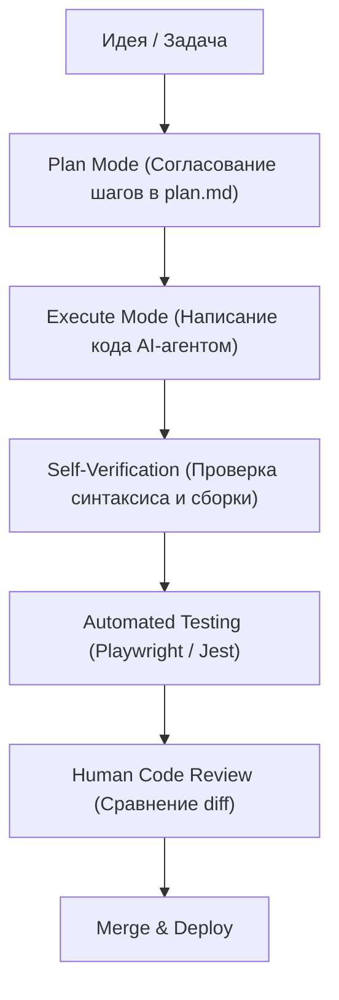

# 🧠 АНАЛИЗ REDDIT ГАЙДОВ И GITHUB AWESOME LISTS (ВАЙБКОДИНГ 2026)

Этот документ представляет собой глубокий анализ лучших практик, гайдов и коллекций с Reddit (r/ClaudeAI, r/LocalLLaMA) и GitHub Awesome Lists. Здесь собрана передовая методология эффективной разработки программного обеспечения с помощью AI-ассистентов (Claude Code, Cursor, Windsurf) на основе реального опыта сотен инженеров.

---

## 🏗 1. МЫШЛЕНИЕ "ИНЖЕНЕРА КОНТЕКСТА" (CONTEXT ENGINEERING)

Главный инсайт сообщества разработчиков в 2026 году: **эффективный вайбкодинг — это не столько про составление хитрых промптов, сколько про управление контекстом.** 

Каждый лишний токен, отправленный в модель, повышает вероятность галлюцинаций, замедляет ответы и увеличивает стоимость разработки.

### 🔍 Ключевые принципы управления контекстом:
1.  **Жесткая гигиена контекста (Context Hygiene):** Подавайте модели *только те файлы*, которые непосредственно связаны с текущей задачей. Никогда не загружайте весь репозиторий целиком, если нужно изменить одну кнопку.
2.  **Декларативные правила проекта (Rule Files):**
    *   `CLAUDE.md`: Идеален для **Claude Code CLI**. Описывает соглашения по написанию кода, команды сборки, тестирования, особенности структуры папок и правила импортов.
    *   `.cursorrules` / `.mdc` (Markdown Cursor): Используются в **Cursor** и **Windsurf**. Позволяют задать специфические инструкции для конкретных папок, языков и фреймворков.
3.  **Стратегия "Context Reset" (Регулярный сброс чатов):**
    *   По мере роста истории диалога модель начинает "тупеть" и забывать важные детали.
    *   **Золотое правило**: Каждая крупная задача или фича должна разрабатываться в **новом чистом чате**.
    *   Чтобы быстро ввести новый чат в курс дела, используются промежуточные файлы состояния: `plan.md` (план текущих изменений) или `todo.md` (список задач).

---

## 🔄 2. ПОВЕДЕНЧЕСКИЕ И КОММУНИКАЦИОННЫЕ ПАТТЕРНЫ

Взаимодействие с AI-агентом должно строиться по принципу "Руководитель — Высокоэффективный стажер".

### 💡 Передовые практики взаимодействия:
1.  **Абсолютная специфика вместо абстракций:**
    *   *Плохо*: "Сделай красивый интерфейс для формы авторизации".
    *   *Хорошо*: "Перепиши форму в `LoginForm.tsx`: добавь отступы `p-6` по углам, используй скругления `rounded-xl`, добавь плавную анимацию появления ошибок, используя Framer Motion, и валидируй email с помощью Zod".
2.  **Борьба с "Reward Hacking" (Срезанием углов):**
    *   Иногда AI-агенты, сталкиваясь со сложной логикой, начинают "халтурить" — удаляют важные куски кода, заменяют их на комментарии типа `// TODO: реализовать позже` или утверждают, что задача выполнена, не запуская тестов.
    *   **Как бороться**: При первых признаках халтуры остановите генерацию, сбросьте чат или дайте жесткое указание: *"Напиши полную реализацию без заглушек и комментариев TODO. Это критично для сборки проекта"*.
3.  **Активация режима глубокого мышления (Thinking Modes):**
    *   Для решения сложных архитектурных задач используйте явные триггеры в промптах: *"Think step-by-step, outline the database schema changes first, and evaluate 3 alternative solutions before choosing one"*.
4.  **Профессиональный тон общения:**
    *   Сообщество Reddit отмечает, что вежливый, но директивный тон повышает качество генерации и снижает "сикофантство" (когда модель во всем соглашается с пользователем, даже если он неправ).

---

## 🚦 3. ПРОЦЕССНЫЕ ВРАТА И ВАЛИДАЦИЯ (QUALITY GATES)

Чтобы код оставался чистым и работоспособным, разработка должна проходить через строгие фильтры.



### 🛠 Три этапа валидации:
1.  **Plan Mode (Сначала планирование):** Модель должна составить и согласовать с вами пошаговый план изменений *до* того, как тронет хотя бы одну строчку кода.
2.  **Self-Verification (Самопроверка):** Обяжите модель самостоятельно запускать линтеры, форматировать код и проверять сборку (`npm run build`) перед тем, как отдать задачу вам.
3.  **Automated Testing (Автотесты):**
    *   Каждая фича должна покрываться интеграционными или E2E-тестами (Playwright — абсолютный фаворит для фронтенда).
    *   Тесты служат лучшей документацией и защищают от регрессионных багов.

---

## 🛠 4. ОРКЕСТРАЦИЯ ИНСТРУМЕНТОВ И CLI

Для максимальной автономии AI-агентам необходимы "руки" в вашей системе. Это достигается через интеграцию CLI-утилит и серверов MCP.

### 🚀 Must-Have CLI инструменты для AI:
*   **GitHub CLI (`gh`):** Позволяет агенту самостоятельно создавать ветки, коммитить изменения, пушить код, открывать Pull Request и проверять статус проверок GitHub Actions.
*   **Vercel CLI / Railway CLI:** Агент может одной командой развернуть тестовое окружение (Staging) и предоставить вам URL для проверки UI.
*   **Model Context Protocol (MCP):**
    *   Серверы MCP превращают модель из простого генератора текста в полноценную систему автоматизации.
    *   *Полезные сервера*: Сервера для работы с базами данных (анализ схем таблиц), сервера интеграции с браузером (для скриншотов и кликов по элементам), интеграция со Slack и Figma.

---

## 📋 5. ТЕМПЛЕЙТ СУПЕР-ПРАВИЛ КЛАССА "GOLD" ДЛЯ CLAUDE.MD

Сообщество Reddit выработало идеальную структуру файла `CLAUDE.md` для проектов, работающих под управлением Claude Code CLI:

```markdown
# CLAUDE.md — Руководство для AI-агента

## 🛠 Команды проекта
- Установка зависимостей: `npm install`
- Локальный запуск: `npm run dev`
- Сборка проекта: `npm run build`
- Запуск тестов: `npm test`
- Линтинг: `npm run lint`

## 📐 Архитектурные правила
- Используй TypeScript с обязательной явной типизацией. Избегай `any`.
- Архитектурный стиль: Feature-based (компоненты, стили и тесты лежат в папке конкретной фичи).
- Стилизация: Только Tailwind CSS.
- Библиотека компонентов: Shadcn/ui (Radix UI).
- Управление состоянием: Zustand для глобального стейта.

## 🚦 Правила разработки
1. ВСЕГДА сначала создавай пошаговый план в `plan.md` и жди одобрения пользователя.
2. Делай только одно атомарное изменение за раз.
3. Перед завершением задачи запусти линтер и автотесты.
4. Никогда не используй заглушки или скрытые TODO в коде.
```
