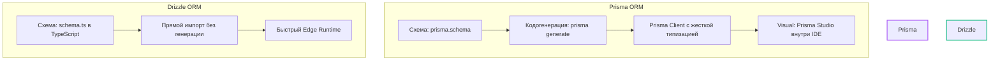

# 📊 ГЛУБОКИЙ АНАЛИЗ ТЕХНИЧЕСКИХ СТЕКОВ И ИНСТРУМЕНТОВ В КОНТЕКСТЕ ИИ-РАЗРАБОТКИ (VIBECODING)

---

## 🎯 ВВЕДЕНИЕ И ЦЕЛИ ИССЛЕДОВАНИЯ
Целью **Этапа 6** является глубокий анализ современных веб-технологий и инфраструктурных решений под углом их «совместимости с ИИ» (AI-friendliness). В мире вайбкодинга правильный выбор стека определяет, сможет ли автономный агент (Claude Code, Cursor, Aider) генерировать код без ошибок с первой попытки, или же упрется в ограничения контекста, бесконечные циклы компиляции TypeScript и разрушение базы данных.

Мы проанализировали ключевые категории инструментов по следующим осям:
1.  **Плотность контекста (Context Footprint)** — сколько токенов требуется ИИ для решения типовой задачи.
2.  **Глубина обучающих данных (Training Data Depth)** — насколько корректно LLM пишет код под эту технологию.
3.  **Безопасность ИИ (AI Safety)** — наличие защитных механизмов от деструктивных действий агента.
4.  **Скорость обратной связи (Feedback Loop Speed)** — насколько быстро агент может проверить работоспособность изменений.

---

## ⚡ 1. FRONTEND ФРЕЙМВОРКИ: NEXT.JS VS VITE VS ASTRO

### 🟢 Next.js (App Router, Server Actions) — Золотой стандарт для ИИ
Next.js предлагает революционную синергию клиентского и серверного кода в рамках единого репозитория, что делает его безусловным лидером для AI-разработки.

*   **Преимущество совместного размещения (Co-location)**: Использование Server Actions позволяет описывать логику мутаций базы данных и обработки форм прямо в файле компонента или в непосредственной близости от него (`actions.ts`). ИИ больше не нужно метаться между файлами API-эндпоинтов, DTO-валидаторами и клиентскими fetch-запросами. Он пишет всю бизнес-фичу целиком за один промпт.
*   **Исключение boilerplate-кода**: Отсутствие необходимости конфигурировать роутеры, express-эндпоинты и CORS-настройки резко снижает объем генерируемого кода, экономя токены и уменьшая шанс возникновения багов.
*   **Глубина обучения**: Огромный объем кода на Next.js в обучающей выборке моделей (2020-2026 гг.) гарантирует, что ИИ безупречно генерирует структуру страниц, роуты и серверные компоненты.

### 🟡 Vite + Client-only React (SPA) — Лучшее для прототипов без бэкенда
*   **Плюс**: Абсолютно простая среда без серверного рендеринга (SSR). Нет проблем с гидратацией («hydration mismatch»), которые часто возникают, когда ИИ генерирует динамический контент (например, даты или случайные числа) в Next.js.
*   **Минус**: При необходимости бэкенда ИИ придется создавать отдельную API-папку (Node.js/Express/Fastify), что увеличивает context-footprint проекта в 2 раза из-за переключения между фронтендом и бэкендом.

### 🟢 Astro — Идеально для контент-ориентированных и SEO-продуктов
*   **Плюс**: Декларативная островная архитектура (Astro Islands) и чистый HTML/Markdown на выходе. Семантически чистая разметка Astro пишется ИИ практически со 100% точностью.

---

## 💾 2. СУБД И ORM: PRISMA VS DRIZZLE VS NEON

ORM — один из самых критичных узлов. Ошибки в схеме данных ведут к каскадному разрушению всего приложения.

### 🔴 Prisma ORM — Максимальная точность генерации и безопасность
*   **Глубина обучающей выборки**: Prisma имеет колоссальное преимущество в обучающих данных ИИ. Вся кодовая база Next.js-шаблонов за последние 5 лет написана на ней. Модели генерируют схемы Prisma без синтаксических ошибок.
*   **Декларативный PSL (Prisma Schema Language)**: ИИ намного легче читать и модифицировать единый декларативный файл `schema.prisma`, чем динамически импортируемые TypeScript-схемы Drizzle.
*   **AI Safety Guardrails (Безопасность ИИ)**: Важнейшая инновация 2026 года. Prisma CLI содержит встроенные ограничители, которые автоматически распознают запуск под агентами (Claude Code, Cursor, Aider, Qwen CLI) и блокируют или требуют интерактивного подтверждения на потенциально деструктивные команды вроде `db push` или `migrate reset`, защищая базы данных разработчиков.
*   **Prisma Studio**: Встроенный визуализатор данных прямо в окне Cursor/Windsurf упрощает ИИ отладку и валидацию данных без сторонних PG-клиентов.

### 🟢 Drizzle ORM — Выбор для Edge-вычислений и быстрых TS-итераций
*   **TypeScript-Native (Без кодогенерации)**: Схемы Drizzle пишутся на чистом TS. Это означает, что при изменении схемы ИИ сразу же видит новые типы через TS Server. Исключается лаг синхронизации, когда ИИ забывает запустить `npx prisma generate` и начинает генерировать невалидный код, опираясь на старые типы.
*   **Row-Level Security (RLS)**: Встроенная поддержка хелперов Postgres RLS (`crudPolicy()`) позволяет ИИ безопасно настраивать права доступа прямо в схеме бд, что критично для мультиарендных (multi-tenant) SaaS.
*   **Edge-Ready**: Минимальный размер бандла, нулевой оверхед, идеальная работа на Vercel Edge и Cloudflare Workers.

### 💎 Neon Serverless Postgres (Database Branching) — Game Changer
*   **Ветвление БД**: Neon позволяет ИИ-агентам выполнять мгновенные клоны (бранчи) основной базы данных перед началом сессии. Агент может тестировать миграции и наполнять БД фейковыми данными в полной изоляции, не боясь повредить стейджинг или продакшн.

---

## 🎨 3. UI И СТИЛИЗАЦИЯ: TAILWIND CSS & SHADCN/UI

Стилизация традиционно является «слабым местом» ИИ при работе со старыми CSS-технологиями.

### 🟢 Tailwind CSS — Идеальный язык стилизации для ИИ
*   **Utility-first концепция**: Модели машинного обучения обучены на миллионах Tailwind-классов. ИИ генерирует дизайн через утилитарные классы с невероятной точностью.
*   **Исключение конфликтов селекторов**: ИИ часто путается в каскаде CSS, переопределяя стили в глобальных таблицах или ошибаясь в CSS Modules. Tailwind локализует стили прямо внутри тега, полностью исключая сайд-эффекты и конфликты стилей.
*   **Микро-анимации**: Классы переходов (`transition-all duration-300 ease-in-out`) пишутся моделью мгновенно, делая интерфейс «живым» без написания сложных CSS-keyframe правил.

### 🟢 Shadcn/ui — Копирование разметки вместо абстрактных API
*   **Свободный доступ к исходному коду**: В отличие от классических UI-библиотек (MUI, Ant Design, Mantine), Shadcn/ui не является NPM-пакетом. Компоненты устанавливаются прямо в директорию проекта (`components/ui`).
*   **Упрощение модификации**: ИИ может напрямую войти в файл `components/ui/button.tsx` и изменить логику отображения или Tailwind-классы. Ему не нужно изучать сложные API тем и пропсов внешней библиотеки — он работает с чистым React-кодом и Tailwind.

---

## 🔌 4. ИНФРАСТРУКТУРА, СТЕЙТ И АВТОРИЗАЦИЯ

### 🟢 Zustand — Минималистичный State Management
*   **Минимум boilerplate-кода**: ИИ тратит в 3-4 раза меньше токенов на создание глобального хранилища в Zustand по сравнению с Redux Toolkit.
*   **Меньше файлов**: Весь стейт можно разместить в одном лаконичном файле `store.ts`, что минимизирует переключение контекста для ИИ.

### 🟢 Clerk — API-first Авторизация
*   **Готовые UI-компоненты**: ИИ не нужно писать сложные обработчики форм регистрации, входа, сброса паролей и хранения токенов сессий. Достаточно внедрить компоненты `<SignIn />` и `<UserButton />`. Это предотвращает серьезные уязвимости безопасности, которые ИИ может случайно сгенерировать при ручном кодировании auth-систем.

### 🟢 Railway — Лучший Canvas UI деплой
*   **Декларативное управление инфраструктурой**: Жесткая привязка к Git-репозиторию, визуальный интерфейс управления переменными и сервисами.
*   **Claude MCP Интеграция**: Специфические MCP-серверы позволяют Claude напрямую управлять инфраструктурой на Railway, делая деплой и развертывание баз данных полностью автономными.

---

## 📊 РЕЗЮМЕ: ТАБЛИЦА СОВМЕСТИМОСТИ ТЕХНОЛОГИЙ С ИИ

| Технология | Context Footprint (Плотность) | AI Code Quality (Качество) | AI Safety (Безопасность) | Feedback Loop Speed (Скорость) | Вердикт ИИ-Агента |
| :--- | :--- | :--- | :--- | :--- | :--- |
| **Next.js (App Router)** | 🟢 Низкий (Co-location) | 🟢 Отличное | 🟡 Средняя | 🟢 Высокая (Fast Refresh) | **Золотой стандарт** |
| **Prisma ORM** | 🟡 Средний (PSL-файл) | 🟢 Превосходное | 🟢 Максимальная (AI CLI Guard) | 🟡 Средняя (нужен generate) | **Рекомендуется для CRUD** |
| **Drizzle ORM** | 🟢 Низкий (Pure TS) | 🟡 Хорошее | 🟡 Средняя | 🟢 Ультра-быстрая (без gen) | **Лучшее для Edge и RLS** |
| **Tailwind CSS** | 🟢 Низкий | 🟢 Безупречное | 🟢 Высокая (без side-effects) | 🟢 Мгновенная | **Обязателен** |
| **Shadcn/ui** | 🟢 Низкий (Чистый код) | 🟢 Отличное | 🟢 Высокая | 🟢 Мгновенная | **Обязателен** |
| **Zustand** | 🟢 Минимальный | 🟢 Отличное | 🟢 Высокая | 🟢 Мгновенная | **Рекомендуется** |
| **Clerk** | 🟢 Минимальный | 🟢 Отличное | 🟢 Максимальная | 🟢 Высокая | **Рекомендуется** |
| **Railway / Vercel** | 🟢 Минимальный | 🟢 Отличное | 🟢 Высокая | 🟢 Автоматическая | **Золотой стандарт** |
